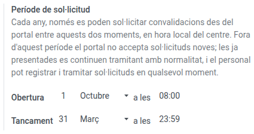
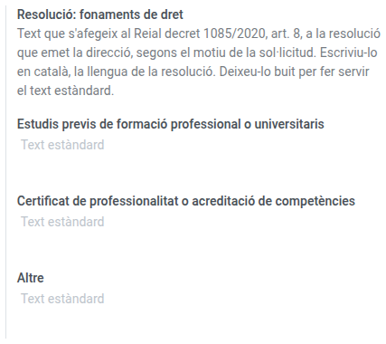

[Català](convalidation-settings.md) | [Castellano](../../es/admin/convalidation-settings.md) | [English](../../en/admin/convalidation-settings.md)

---

# Configuració de convalidacions

Configura quan es poden presentar sol·licituds de convalidació des del portal, els textos de la resolució oficial que emet la direcció i els motius que s'ofereixen quan es demana documentació.

**Rol necessari:** Administrador (Configuració)

---

## Accés

Navega a: **Configuració → EMS Management → Configuració de convalidacions**

---

## Període de sol·licitud

El **període de sol·licitud** fixa quan es poden presentar sol·licituds de convalidació noves des del portal. Es repeteix cada any, sense cap any per actualitzar: només cal canviar-lo si el centre canvia les dates.

1. A **Obertura**, tria el dia, el mes i l'hora en què comença el període.
2. A **Tancament**, tria el dia, el mes i l'hora en què acaba. El minut de tancament encara forma part del període.
3. Desa.

Per defecte el període va de l'**1 d'octubre a les 08:00** al **31 de març a les 23:59**. Les hores són en hora local del centre.

El període pot travessar el canvi d'any, com fa el de per defecte: si l'obertura és més tard en el calendari que el tancament, va des de l'obertura fins a final d'any, i des de l'1 de gener fins al tancament.

La configuració no accepta un dia que no existeixi en el seu mes (tampoc el 29 de febrer, perquè el període sigui igual cada any), ni un període que s'obri i es tanqui en el mateix moment.

### Què limita el període i què no

| Qui | Durant el període | Fora del període |
|-----|-------------------|------------------|
| Alumnat i famílies, al portal | Presentar sol·licituds noves, consultar les seves, respondre al centre, anul·lar les pendents | Tot excepte presentar sol·licituds noves. El portal indica quan s'obrirà el període |
| Cap d'Estudis, Direcció, secretaria | Tot | Tot: poden registrar sol·licituds rebudes en paper i tramitar qualsevol sol·licitud en qualsevol moment |

---

## Textos de la resolució

La resolució que emet la direcció es genera sempre en català. Tres paràmetres en permeten ajustar el contingut:

| Paràmetre | Què fa |
|-----------|--------|
| **Resolució: fonaments de dret** | Un text per a cada motiu de sol·licitud (estudis previs, certificat de professionalitat, altre), que s'afegeix al Reial decret 1085/2020, article 8. |
| **Resolució: recurs** | El peu que indica com i davant de qui es pot recórrer la resolució. |
| **Resolució: signatura per delegació** | Si està marcat, la resolució indica **Per delegació** i mostra el nom de qui l'ha resolt en lloc del de la persona que ocupa el càrrec de director/a. |

Si deixes un text buit, s'utilitza el text estàndard. El text estàndard del recurs esmenta l'òrgan competent de forma general: escriu-hi l'òrgan concret quan el centre el tingui confirmat. Escriu els textos en català, la llengua de la resolució.

1. Escriu els textos que vulguis personalitzar i marca, si cal, **Resolució: signatura per delegació**.
2. Desa.

Els canvis s'apliquen a les resolucions que s'emetin a partir d'aquell moment.

---

## Motius de petició de documentació

Quan Cap d'Estudis demana més documentació a un sol·licitant, tria un motiu d'una llista. Tu mantens aquesta llista.

**Rol necessari:** Administrador de l'EMS

Navega a: **Gestió acadèmica → Configuració → Convalidacions → Motius de petició de documentació**

- **Nom:** el text que el sol·licitant llegeix al correu i al portal. Escriu-lo en cada idioma amb el botó d'idioma al costat del camp.
- **Ordre:** arrossega les files per ordenar-les. La primera surt seleccionada quan es demana documentació, així que posa-hi primer el motiu més habitual (per defecte, **Falta el certificat de notes oficial del centre de procedència**).
- Per deixar d'oferir un motiu sense perdre les sol·licituds que l'han fet servir, arxiva'l.

---

## Motius de denegació per mòdul

Quan Cap d'Estudis denega la convalidació d'un mòdul, tria el motiu d'una llista. Tu mantens aquesta llista.

**Rol necessari:** Administrador de l'EMS

Navega a: **Gestió acadèmica → Configuració → Convalidacions → Motius de denegació per mòdul**

- **Nom:** el text que la resolució i el portal mostren per al mòdul denegat. Escriu-lo en cada idioma amb el botó d'idioma al costat del camp.
- **Ordre:** arrossega les files per ordenar-les. La primera surt seleccionada quan es denega un mòdul, així que posa-hi primer el motiu més habitual (per defecte, **Els continguts no són equivalents**).
- Per deixar d'oferir un motiu sense perdre les sol·licituds que l'han fet servir, arxiva'l.

---

Vegeu [Convalidacions](../head_of_studies/convalidations.md) per saber com es tramiten les sol·licituds, i el [manual de les famílies](../families/manual-convalidacions.md) per veure què veu l'alumnat.

---

[← Tornar a l'índex](index.md)
