[Català](manual-confirmacio-matricula.md) | [Castellano](../../es/families/manual-confirmacio-matricula.md) | [English](../../en/families/manual-confirmacio-matricula.md)

---

# Guia per confirmar la proposta de matrícula

Aquesta guia explica, pas a pas, com han de confirmar les famílies (o l'alumnat) la **proposta de matrícula** que el centre els envia per correu electrònic, fent servir el portal educatiu de l'institut.

---

## Índex

1. [Abans de començar: el correu de proposta](#abans-de-començar-el-correu-de-proposta)
2. [Pas 1 — Accés al portal i a l'apartat Matrícula](#pas-1--accés-al-portal-i-a-lapartat-matrícula)
3. [Pas 2 — Respondre les autoritzacions](#pas-2--respondre-les-autoritzacions)
4. [Pas 3 — Revisar els detalls de la matrícula](#pas-3--revisar-els-detalls-de-la-matrícula)
5. [Pas 4 — (Opcional) Enviar un comentari a Secretaria](#pas-4--opcional-enviar-un-comentari-a-secretaria)
6. [Pas 5 — Triar el pla i el mètode de pagament](#pas-5--triar-el-pla-i-el-mètode-de-pagament)
7. [Pas 6 — Registrar el compte bancari (IBAN)](#pas-6--registrar-el-compte-bancari-iban)
8. [Pas 7 — Confirmar la matrícula](#pas-7--confirmar-la-matrícula)

---

## Abans de començar: el correu de proposta

Quan la proposta de matrícula per al curs vinent està disponible, rebreu un **correu electrònic** del centre (INS Puig Castellar) a l'adreça que vau facilitar. El missatge us informa que la matrícula ja es pot tramitar i us indica els passos a seguir.

Per iniciar el tràmit, feu clic sobre l'enllaç **la meva matrícula** del correu, o bé accediu directament al portal del centre tal com s'explica al Pas 1.

> **Nota:** per poder entrar al portal cal tenir el compte activat. Si encara no l'heu activat, consulteu primer la guia [Accés i activació del portal de l'alumnat](manual-portal-alumne.md).

---

## Pas 1 — Accés al portal i a l'apartat Matrícula

Un cop heu iniciat sessió, arribareu a la pàgina d'inici del portal (*El meu compte*). Des del menú superior o des de les targetes centrals, feu clic a **Matrícula**.

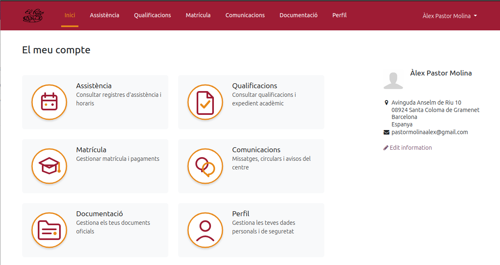

A l'apartat **Matrícula** se us mostrarà la proposta que el centre us ha preparat, amb totes les seccions per revisar i confirmar.

> **Si no veieu cap proposta:** si en entrar a Matrícula apareix el missatge *«No s'ha trobat cap procés de matrícula actiu»*, vol dir que de moment no teniu cap proposta pendent (perquè encara no se us ha enviat). En cas de dubte, poseu-vos en contacte amb la Secretaria del centre.

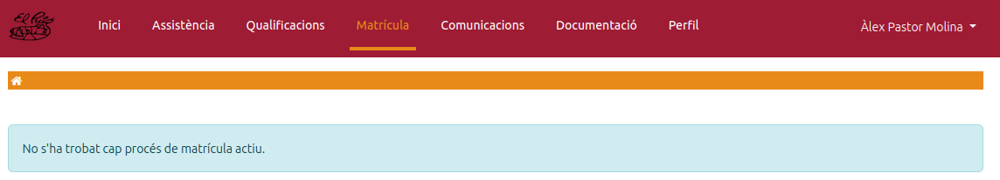

---

## Pas 2 — Respondre les autoritzacions

La primera secció, **1. Autoritzacions**, conté els documents i consentiments que cal respondre abans de poder confirmar la matrícula (autorització d'ús d'imatge i so, carta de compromís educatiu, protecció de dades, etc.).

Cada autorització apareix amb l'estat **Pendent**. Per respondre-la, feu clic al botó **Resposta** de la fila corresponent **(1)**.

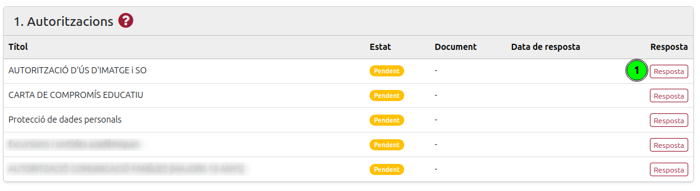

S'obrirà una finestra amb el text complet de l'autorització. Llegiu-lo amb atenció i, si escau, ompliu els camps que se us demanin (alguns són obligatoris i van marcats amb un asterisc `*`). Tot seguit:

* Premeu **Accepta l'autorització** per donar el vostre consentiment.
* Premeu **Rebutja** si l'autorització ho permet i no hi voleu donar consentiment.

> **Important:** heu de respondre **totes les autoritzacions obligatòries** (han de quedar en estat *Acceptada*). Mentre quedi alguna autorització obligatòria pendent, el botó de confirmació de la matrícula romandrà desactivat.

---

## Pas 3 — Revisar els detalls de la matrícula

A la secció **2. Detalls de la matrícula** trobareu el desglossament de tots els conceptes (matrícula, quota de l'AMPA, taxes, mòduls o matèries...) amb el seu **preu** i el **total** a pagar.

Reviseu que tota la informació sigui correcta.

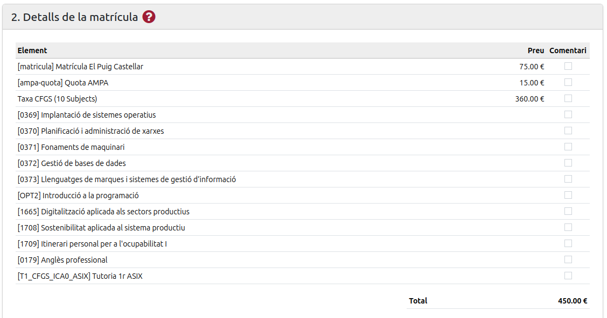

* Si esteu **d'acord** amb tot, podeu continuar amb el pagament (Pas 5).
* Si teniu **algun dubte o voleu comunicar una incidència** sobre algun concepte, seguiu el Pas 4.

---

## Pas 4 — (Opcional) Enviar un comentari a Secretaria

Si voleu consultar o comentar algun dels conceptes **abans de confirmar**, podeu enviar un missatge a Secretaria des del mateix portal:

1. Marqueu la casella **(1)** de la columna *Comentari* a la dreta de la línia o línies que voleu consultar.
2. En marcar una casella, s'obrirà el quadre **Comentaris** **(2)**, on heu d'escriure el vostre dubte o observació.

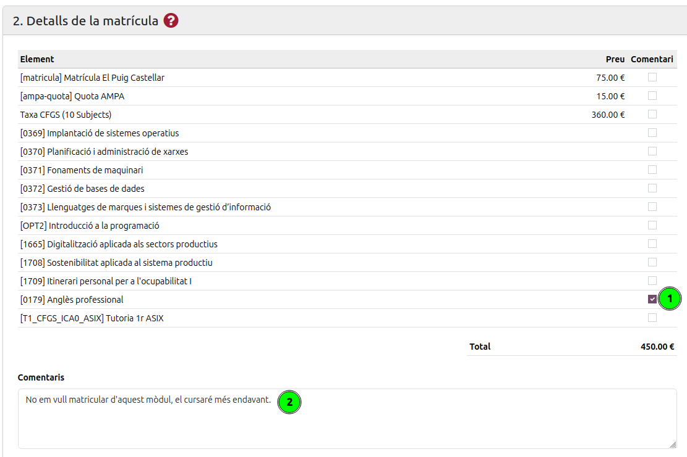

3. Quan hi ha alguna línia marcada, el botó de confirmar es substitueix pel botó **Comentaris per a la secretaria** **(3)**. Premeu-lo per enviar la consulta.

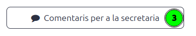

> **Tingueu en compte que:**
> * Enviar un comentari **no confirma** la matrícula: només fa arribar la vostra consulta a Secretaria.
> * La Secretaria revisarà el vostre missatge i us respondrà. Trobareu tot l'historial de missatges a la secció **3. Comunicacions**, dins de la mateixa pàgina de matrícula.
> * Quan la qüestió estigui resolta, podreu tornar a entrar i confirmar la matrícula amb normalitat.

---

## Pas 5 — Triar el pla i el mètode de pagament

A la part inferior de la secció de detalls heu d'indicar com voleu pagar la matrícula.

**Pla de pagament.** Trieu una de les opcions disponibles:

* **Pagament únic (juliol).**
* **Pagament en dos terminis (juliol i setembre).** Si trieu aquesta opció, es mostrarà el desglossament dels dos pagaments.

> L'opció de *Pagament en dos terminis* **només està disponible** si la matrícula inclou **Taxes** (CFGS). *Les Taxes són l'únic concepte fraccionable en dos pagaments de la matrícula.*

**Mètode de pagament.** El centre fa servir la **domiciliació bancària**. Per poder seleccionar aquesta opció cal tenir un **compte bancari (IBAN) registrat**. Si encara no n'heu donat cap d'alta, veureu un avís com el de la imatge, que us convida a enviar el vostre IBAN abans de continuar (vegeu el Pas 6).

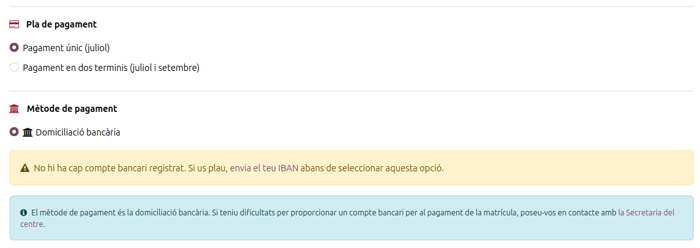

> Si teniu dificultats per facilitar un compte bancari, poseu-vos en contacte amb la Secretaria del centre.

---

## Pas 6 — Registrar el compte bancari (IBAN)

Per donar d'alta el compte bancari, aneu a l'apartat **Documentació** del menú superior. A la secció **Compte bancari (IBAN)** ompliu el formulari **Actualitzar compte bancari**:

* **IBAN** del compte.
* **Titular del compte** (nom complet).
* **Data de caducitat** (opcional).

Tot seguit, premeu **Enviar**.

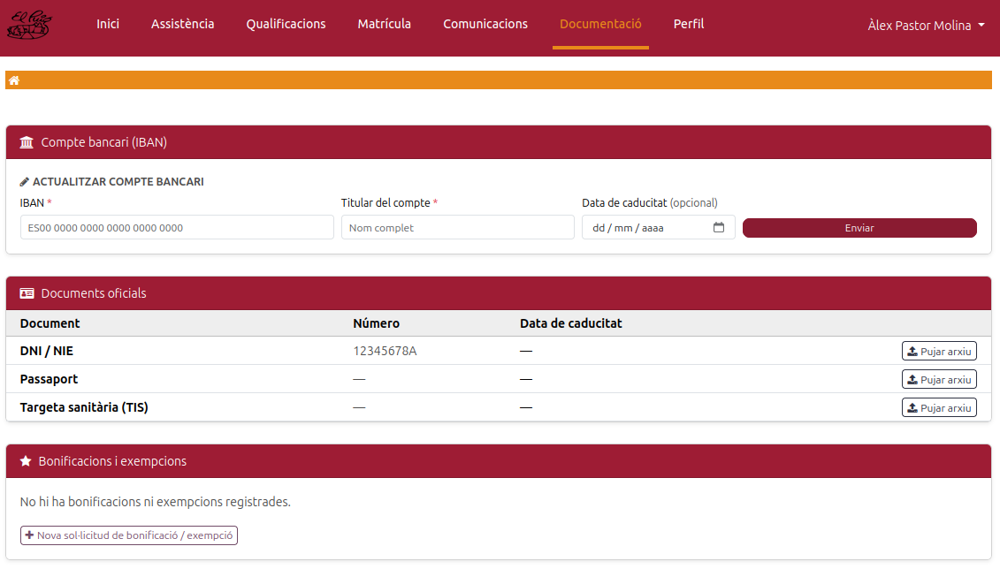

Si ja teníeu un compte registrat d'un altre curs, en aquesta mateixa secció podreu:

1. **Renovar compte actual** **(1)** — si voleu mantenir el mateix compte i actualitzar-ne la validesa.
2. **Actualitzar compte bancari** **(2)** — si voleu introduir un compte nou (empleneu les dades i premeu *Enviar*).

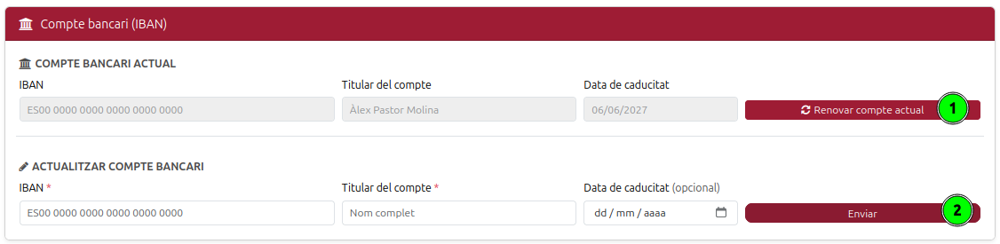

Un cop registrat l'IBAN, torneu a l'apartat **Matrícula** per finalitzar el tràmit.

---

## Pas 7 — Confirmar la matrícula

De tornada a **Matrícula**, comproveu que tot estigui correcte:

1. El **pla de pagament** triat **(1)**.
2. El **compte bancari registrat**, que ara apareix confirmat amb l'IBAN, el titular i la validesa **(2)**.

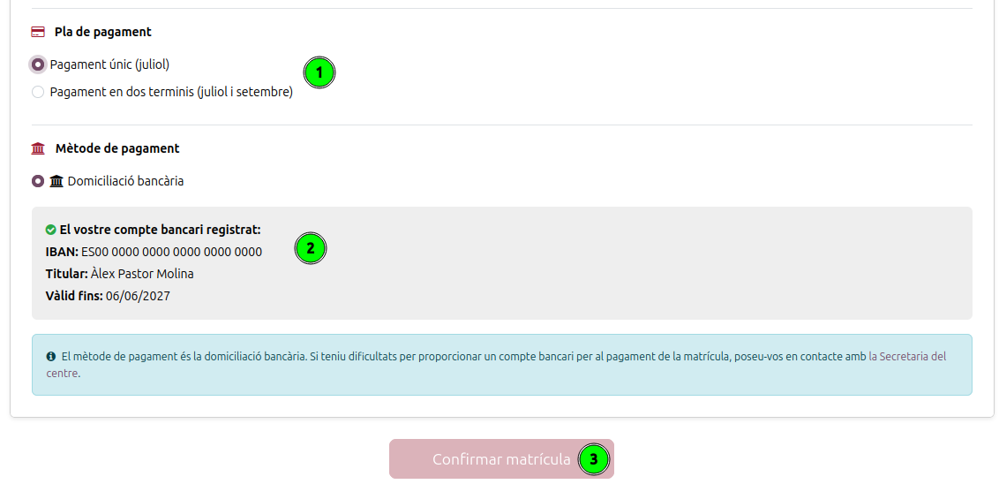

El botó **Confirmar matrícula** **(3)** es manté desactivat (en color clar) fins que es compleixen **totes** aquestes condicions:

* Totes les autoritzacions obligatòries estan **acceptades**.
* Heu seleccionat un **pla de pagament**.
* Teniu un **compte bancari (IBAN) vàlid** registrat.

Quan es compleixen totes, el botó **Confirmar matrícula** s'activa (color granat). Premeu-lo per finalitzar el tràmit.

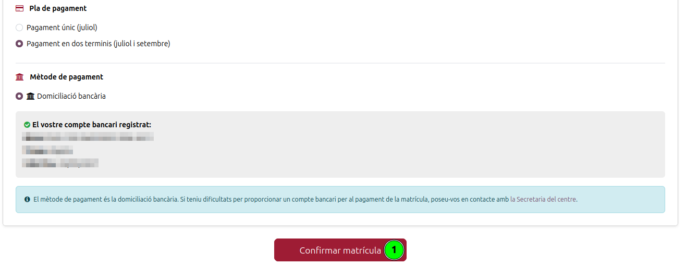

> Un cop confirmada, la matrícula queda registrada i la pàgina passa a mode de només lectura, amb la informació de la matrícula. Si més endavant necessiteu fer cap canvi, haureu de contactar amb la [Secretaria del centre](https://elpuig.xeill.net/el-centre/secretaria).

---

[← Tornar a l'índex de famílies](index.md)
