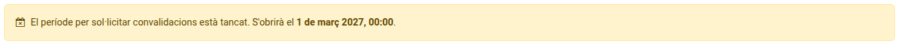

[Català](manual-convalidacions.md) | [Castellano](../../es/families/manual-convalidacions.md) | [English](../../en/families/manual-convalidacions.md)

---

# Sol·licitar convalidacions des del portal

Demana la convalidació dels mòduls de formació professional que ja has superat en altres estudis, i consulta'n la resolució, des del portal de l'alumnat.

Només es poden sol·licitar convalidacions als cicles formatius (CFGM i CFGS).

**Qui les pot sol·licitar:** l'alumne, des del seu propi compte, si és major d'edat; la família, des del seu compte, si l'alumne és menor d'edat. Un alumne menor d'edat que entri amb el seu propi compte, o la família d'un alumne que ha fet 18 anys, no veu aquest apartat. Excepció: un aspirant menor d'edat sense cap família registrada al centre (preinscripció) les sol·licita des del seu propi compte.

---

## Accés

A la pàgina d'inici del portal, fes clic a la targeta **Convalidacions**, o a **Convalidacions** a la barra superior.

Si sou una família amb més d'un fill al centre, primer tria el fill a la barra superior del portal: la sol·licitud sempre es fa per al fill seleccionat.

---

## Període de sol·licitud

Només es poden presentar sol·licituds noves durant el període de sol·licitud que el centre fixa cada any (normalment de l'1 d'octubre a les 08:00 al 31 de març a les 23:59). Mentre està obert, el formulari indica fins quan es poden presentar.

Fora d'aquest període el formulari es substitueix per un avís que diu quan s'obrirà de nou:

Les sol·licituds ja presentades no es veuen afectades: les pots continuar consultant, respondre al centre i cancel·lar-les en qualsevol moment.

---

## Fer una sol·licitud

1. Fes clic a **Nova sol·licitud de convalidació** per obrir el formulari, i marca els mòduls que vols convalidar.
2. Tria el **Motiu**.
3. A **Documentació justificativa**, adjunta els documents que calguin. Pots seleccionar diversos fitxers alhora.
4. Si vols, escriu-hi observacions.
5. Fes clic a **Envia la sol·licitud**.

### Quina documentació cal adjuntar

| Cas | Documentació |
|-----|--------------|
| Estudis superats en aquest centre | Cap: el centre consulta el teu expedient. |
| Estudis superats en un altre centre | El certificat acadèmic o l'expedient dels estudis superats. |
| Certificat de professionalitat o acreditació de competències | El certificat mateix. |
| Estudis universitaris o resolució del Ministeri | La resolució, si ja la tens. |

Si falta alguna cosa, el centre t'ho demanarà i ho podràs adjuntar des d'aquesta mateixa pàgina.

Un missatge confirma que la sol·licitud s'ha enviat. Els mòduls ja sol·licitats deixen d'aparèixer al formulari, llevat que s'hagin rebutjat.

---

## Seguir la sol·licitud

Cada sol·licitud apareix sota el formulari, amb el seu número de registre (per exemple CONV-2026-27-0001), la data, l'estudi i l'estat:

| Estat | Significat |
|-------|------------|
| **Pendent** | El centre encara no l'ha resolt. |
| **En procés** | El Cap d'Estudis l'ha aprovada i secretaria l'està registrant. |
| **Completada** | Ja està registrada. Hi veus la nota de cada mòdul convalidat, i ja no has d'assistir a aquests mòduls. |
| **Rebutjada** | No s'ha concedit la convalidació. |
| **Anul·lada** | La sol·licitud s'ha anul·lat. |

La taula mostra la resolució de cada mòdul (**Pendent**, **Convalidat** o **Rebutjat**) i les observacions del centre. Quan la sol·licitud està **Completada**, hi apareix també la columna **Nota**.

Quan la sol·licitud es completa o es rebutja, rebràs un correu amb la resolució. La sol·licitud, la seva anul·lació i la resolució també queden registrades a la pàgina **Comunicacions**.

---

## Respondre o afegir documentació

Mentre la sol·licitud està **Pendent** o **En procés**, al seu requadre hi ha **Respon o afegeix documentació**: escriu-hi la resposta, adjunta els fitxers que et demanin i fes clic a **Envia**. Els documents s'afegeixen a la sol·licitud.

---

## Anul·lar una sol·licitud

Mentre una sol·licitud està **Pendent**, fes clic a **Anul·la la sol·licitud** al seu requadre.

---

[← Tornar a l'índex](index.md)
