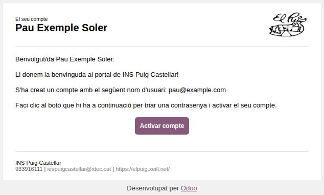
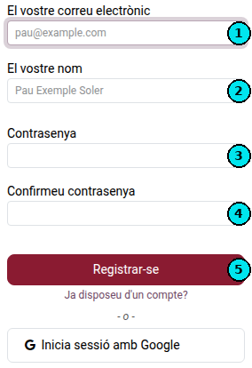
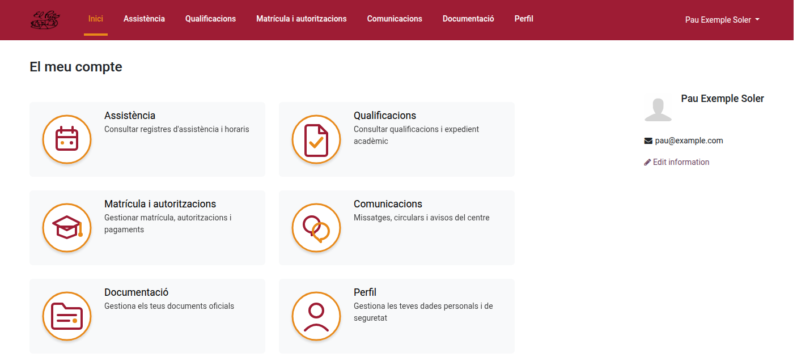
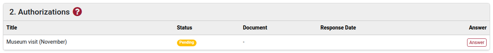
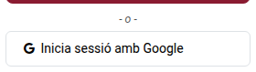

[Català](manual-portal-alumne.md) | [Castellano](../../es/families/manual-portal-alumne.md) | [English](../../en/families/manual-portal-alumne.md)

---

# Guia d'accés i activació del portal de l'alumnat

Aquesta guia explica de forma detallada els passos que han de seguir els alumnes (o les seves famílies) per activar el seu compte i accedir per primera vegada al portal educatiu de l'institut.

---

## Índex

1. [Introducció](#introducció)
2. [Pas 1 — Instruccions d'alta de l'email](#pas-1--instruccions-dalta-de-lemail)
3. [Pas 2 — Formulari de contrasenya](#pas-2--formulari-de-contrasenya)
4. [Pas 3 — Email de confirmació](#pas-3--email-de-confirmació)
5. [Pas 4 — Accés al portal](#pas-4--accés-al-portal)
6. [Pas 5 — Respondre una autorització](#pas-5--respondre-una-autorització)
7. [Entrar més endavant: correu personal o compte del centre](#entrar-més-endavant-correu-personal-o-compte-del-centre)
8. [Alumnes menors d'edat](#alumnes-menors-dedat)

---

## Introducció

El portal de l'alumnat és l'espai virtual centralitzat des d'on l'estudiant i la seva família poden gestionar la seva vida acadèmica i administrativa amb el centre de manera senzilla, àgil i 100% en línia.

Actualment, el portal permet realitzar les següents gestions:
* **Assistència:** Consultar l'horari setmanal de classes de l'alumne i descarregar-lo en PDF.
* **Matrícula i autoritzacions:** Gestionar el procés de matrícula, revisar els pagaments o quotes i respondre i signar les autoritzacions de centre de forma digital — tant les que arriben amb la matrícula com les que el centre envia durant el curs.
* **Convalidacions:** Sol·licitar la convalidació de mòduls de formació professional i seguir-ne la resolució. Vegeu [Sol·licitar convalidacions](manual-convalidacions.md).
* **Documentació:** Pujar, desar i consultar tots els documents oficials sol·licitats pel centre.
* **Comunicacions:** Rebre de forma immediata els missatges, circulars i avisos enviats per l'equip directiu, tutors o secretaria.
* **Perfil:** Mantenir actualitzades les dades personals, de contacte i de seguretat del compte d'accés.

**Funcionalitats disponibles pròximament.** Estem treballant en el desenvolupament de nous mòduls per millorar l'eina. Molt aviat s'activarà l'entorn següent:
* **Qualificacions:** Accedir de forma directa a les notes de les diferents avaluacions.

---

## Pas 1 — Instruccions d'alta de l'email

Quan l'institut us doni d'alta en el sistema de gestió EMS, rebreu un correu electrònic automàtic d'invitació a l'adreça de correu electrònic que vau facilitar durant el procés d'inscripció.

Per començar el procés d'activació, heu de seguir aquests passos:
1. Obriu el vostre gestor de correu i busqueu el missatge de benvinguda enviat per l'**INS Puig Castellar**.
2. Verifiqueu que el nom d'usuari indicat correspon amb la vostra adreça electrònica correcta.
3. Feu clic directament sobre el botó central **Activar compte**. Aquest enllaç us redirigirà de forma segura a l'assistent de configuració del portal.

---

## Pas 2 — Formulari de contrasenya

Un cop obert l'enllaç del correu electrònic, s'obrirà automàticament la finestra de registre oficial de l'institut per definir les credencials de seguretat. 

Dins d'aquest formulari, heu de completar les accions següents seguint els indicadors numèrics de la imatge:

1. **El vostre correu electrònic (1):** Reviseu que l'adreça electrònica sigui correcta. Aquest camp actua com el vostre identificador d'usuari únic de forma predefinida.
2. **El vostre nom (2):** Comproveu que apareix el vostre nom i cognoms.
3. **Contrasenya (3):** Escriviu una contrasenya nova i segura per al vostre compte d'accés.
4. **Confirmeu contrasenya (4):** Torneu a introduir exactament la mateixa contrasenya per comprovar que no s'ha comès cap error de tecleig.
5. **Registrar-se (5):** Finalment, feu clic sobre el botó de color granat **Registrar-se** per validar i desar les vostres dades d'accés.

---

## Pas 3 — Email de confirmació

Després d'enviar el formulari de registre correctament, rebreu un segon correu electrònic automàtic en la vostra bústia d'entrada de part del sistema. 

Aquest missatge us confirmarà de manera oficial que el procés de registre s'ha completat de manera satisfactòria, que el vostre perfil d'usuari ja es troba actiu i que ja teniu tots els permisos concedits per accedir a la plataforma de forma independent.

---

## Pas 4 — Accés al portal

Un cop registrats, entrareu directament al tauler principal o pàgina d'inici (*Dashboard*) del portal de l'alumne. 

La interfície web està optimitzada i dissenyada per facilitar una navegació neta i intuïtiva:
* **Menú superior:** Teniu un accés permanent a totes les àrees de gestió del centre.
* **Targetes centralitzades:** Disposeu de botons visuals per accedir a cadascun dels serveis clau (**Assistència**, **Qualificacions**, **Matrícula i autoritzacions**, **Convalidacions**, **Documentació**, **Comunicacions** i **Perfil**).
* **Perfil de l'usuari:** A la part dreta tindreu sempre visible la informació bàsica del perfil actiu de l'alumne juntament amb la seva fotografia identificativa de l'expedient.

---

## Pas 5 — Respondre una autorització

Durant el curs poden arribar autoritzacions noves: una visita a un museu, una sortida acordada en una reunió de tutoria, un formulari publicat pel Departament d'Educació. Rebreu un correu amb la llista i un enllaç al portal.

Obriu **Matrícula i autoritzacions** des del menú superior. Les autoritzacions apareixen en un bloc propi, tant si la matrícula d'aquell curs ja està confirmada com si no.

Per a cadascuna:

1. Mireu la columna **Estat**: *Pendent* vol dir que espera la vostra resposta.
2. Feu clic a **Respondre**. S'obre una finestra amb el text complet de l'autorització.
3. Ompliu les dades que demani el centre. Els camps marcats amb un asterisc són obligatoris per acceptar.
4. Feu clic a **Acceptar autorització** o, si l'autorització ho permet, a **Rebutjar**.

Un cop respostes, la columna **Document** conté un certificat PDF de la vostra resposta. Hi podeu fer clic en qualsevol moment per descarregar-lo o imprimir-lo.

---

## Entrar més endavant: correu personal o compte del centre

L'alumnat pot entrar al portal de dues maneres, la que li vagi millor:

* **Correu personal i contrasenya:** l'adreça on va arribar la invitació i la contrasenya que es va definir al Pas 2.
* **Compte del centre (`@elpuig.xeill.net`):** a la pantalla d'accés, feu clic a **Inicia sessió amb Google** i trieu el compte del centre. No cal cap contrasenya del portal.

Totes dues maneres obren el mateix portal. Si heu perdut la contrasenya del portal, el compte del centre sol ser la manera més ràpida d'entrar. Si tampoc recordeu la contrasenya del compte del centre, seguiu la [guia per recuperar la contrasenya del correu del centre](manual-recuperacio-contrasenya-correu.md).

> El compte del centre només funciona quan l'alumne ja en té (es crea en matricular-se) i ja se li ha donat accés al portal. Les famílies entren sempre amb el seu correu i la seva contrasenya.

---

## Alumnes menors d'edat

Mentre l'alumne és menor d'edat, és la **família** qui ho gestiona tot des del seu propi compte. L'alumne també pot tenir un compte propi al portal per consultar:

* **Assistència** (el seu horari),
* les **Comunicacions** que li adrecen,
* el **Perfil**.

**Matrícula i autoritzacions**, **Convalidacions** i **Documentació** no apareixen al compte de l'alumne: se n'encarrega la família. Quan l'alumne compleix 18 anys, té accés a tots els apartats.

---

[← Tornar a l'índex de famílies](index.md)
