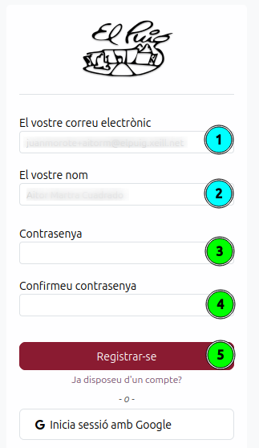

[Català](manual-portal-alumne.md) | [Castellano](../../es/families/manual-portal-alumne.md) | [English](../../en/families/manual-portal-alumne.md)

---

# Guia d'accés i activació del portal de l'alumnat

Aquesta guia explica de forma detallada els passos que han de seguir els alumnes (o les seves famílies) per activar el seu compte i accedir per primera vegada al portal educatiu de l'institut.

---

## Índex

1. [Introducció](#introducció)
2. [Pas 1 — Instruccions d'alta de l'email](#pas-1--instruccions-dalta-de-lemail)
3. [Pas 2 — Formulari de contrasenya](#pas-2--formulari-de-contrasenya)
4. [Pas 3 — Email de confirmació](#pas-3--email-de-confirmació)
5. [Pas 4 — Accés al portal](#pas-4--accés-al-portal)

---

## Introducció

El portal de l'alumnat és l'espai virtual centralitzat des d'on l'estudiant i la seva família poden gestionar la seva vida acadèmica i administrativa amb el centre de manera senzilla, àgil i 100% en línia.

Actualment, el portal permet realitzar les següents gestions:
* **Matrícula:** Gestionar el procés de matrícula, respondre i signar les autoritzacions de centre de forma digital i revisar els pagaments o quotes.
* **Documentació:** Pujar, desar i consultar tots els documents oficials sol·licitats pel centre.
* **Comunicacions:** Rebre de forma immediata els missatges, circulars i avisos enviats per l'equip directiu, tutors o secretaria.
* **Perfil:** Mantenir actualitzades les dades personals, de contacte i de seguretat del compte d'accés.

**Funcionalitats disponibles pròximament.** Estem treballant en el desenvolupament de nous mòduls per millorar l'eina. Molt aviat s'activaran els següents entorns:
* **Assistència:** Consultar els registres d'assistència.
* **Qualificacions:** Accedir de forma directa a les notes de les diferents avaluacions.

---

## Pas 1 — Instruccions d'alta de l'email

Quan l'institut us doni d'alta en el sistema de gestió EMS, rebreu un correu electrònic automàtic d'invitació a l'adreça de correu electrònic que vau facilitar durant el procés d'inscripció.

Per començar el procés d'activació, heu de seguir aquests passos:
1. Obriu el vostre gestor de correu i busqueu el missatge de benvinguda enviat per l'**INS Puig Castellar**.
2. Verifiqueu que el nom d'usuari indicat correspon amb la vostra adreça electrònica correcta.
3. Feu clic directament sobre el botó central **Activar compte**. Aquest enllaç us redirigirà de forma segura a l'assistent de configuració del portal.

---

## Pas 2 — Formulari de contrasenya

Un cop obert l'enllaç del correu electrònic, s'obrirà automàticament la finestra de registre oficial de l'institut per definir les credencials de seguretat. 

Dins d'aquest formulari, heu de completar les accions següents seguint els indicadors numèrics de la imatge:

1. **El vostre correu electrònic (1):** Reviseu que l'adreça electrònica sigui correcta. Aquest camp actua com el vostre identificador d'usuari únic de forma predefinida.
2. **El vostre nom (2):** Comproveu que apareix el vostre nom i cognoms.
3. **Contrasenya (3):** Escriviu una contrasenya nova i segura per al vostre compte d'accés.
4. **Confirmeu contrasenya (4):** Torneu a introduir exactament la mateixa contrasenya per comprovar que no s'ha comès cap error de tecleig.
5. **Registrar-se (5):** Finalment, feu clic sobre el botó de color granat **Registrar-se** per validar i desar les vostres dades d'accés.

---

## Pas 3 — Email de confirmació

Després d'enviar el formulari de registre correctament, rebreu un segon correu electrònic automàtic en la vostra bústia d'entrada de part del sistema. 

Aquest missatge us confirmarà de manera oficial que el procés de registre s'ha completat de manera satisfactòria, que el vostre perfil d'usuari ja es troba actiu i que ja teniu tots els permisos concedits per accedir a la plataforma de forma independent.

---

## Pas 4 — Accés al portal

Un cop registrats, entrareu directament al tauler principal o pàgina d'inici (*Dashboard*) del portal de l'alumne. 

La interfície web està optimitzada i dissenyada per facilitar una navegació neta i intuïtiva:
* **Menú superior:** Teniu un accés permanent a totes les àrees de gestió del centre.
* **Targetes centralitzades:** Disposeu de botons visuals per accedir a cadascun dels serveis clau (**Assistència**, **Qualificacions**, **Matrícula**, **Comunicacions**, **Documentació** i **Perfil**).
* **Perfil de l'usuari:** A la part dreta tindreu sempre visible la informació bàsica del perfil actiu de l'alumne juntament amb la seva fotografia identificativa de l'expedient.

---

[← Tornar a l'índex de famílies](index.md)
