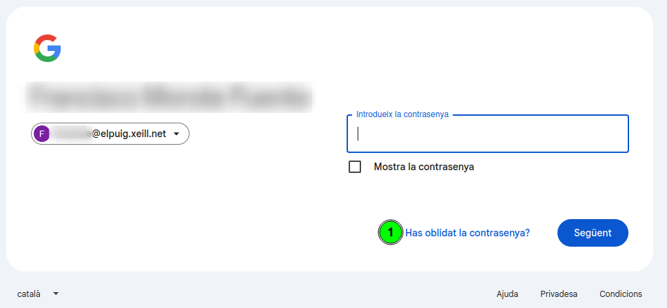
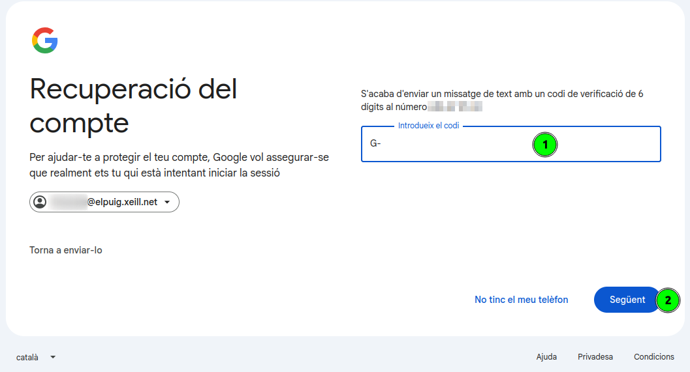
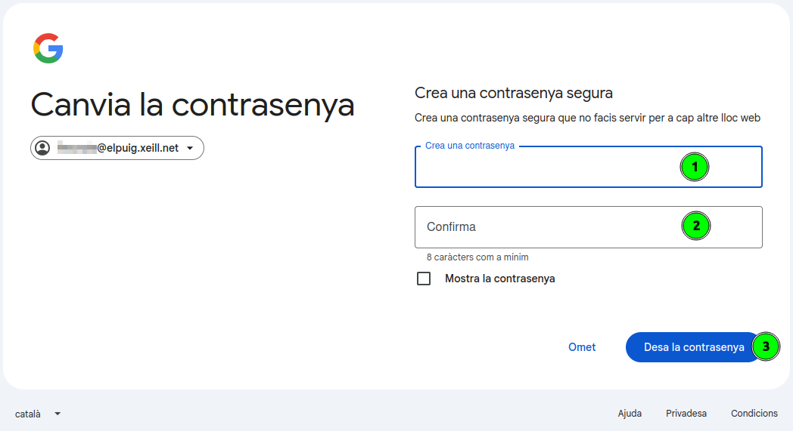

[Català](manual-recuperacio-contrasenya-correu.md) | [Castellano](../../es/families/manual-recuperacio-contrasenya-correu.md) | [English](../../en/families/manual-recuperacio-contrasenya-correu.md)

---

# Guia de recuperació de la contrasenya del correu de l'institut (@elpuig.xeill.net)

Aquesta guia explica pas a pas com recuperar la contrasenya del compte de correu de l'institut (`@elpuig.xeill.net`) quan l'heu oblidat o ha deixat de funcionar.

El compte de correu de l'institut és un compte de **Google (Gmail)**, de manera que la recuperació es fa a través de l'assistent oficial de Google.

> **Important:** per poder recuperar la contrasenya cal tenir un **número de telèfon de recuperació** associat al compte. És el telèfon que vau facilitar quan es va crear el compte. Si no teniu accés a aquest telèfon, contacteu amb la secretaria de l'institut.

---

## Índex

1. [Pas 1 — Inicieu sessió amb el vostre correu](#pas-1--inicieu-sessió-amb-el-vostre-correu)
2. [Pas 2 — Feu clic a «Has oblidat la contrasenya?»](#pas-2--feu-clic-a-has-oblidat-la-contrasenya)
3. [Pas 3 — Pantalla de recuperació del compte](#pas-3--pantalla-de-recuperació-del-compte)
4. [Pas 4 — Confirmeu el número de telèfon](#pas-4--confirmeu-el-número-de-telèfon)
5. [Pas 5 — Introduïu el codi de verificació](#pas-5--introduïu-el-codi-de-verificació)
6. [Pas 6 — Actualitzeu la contrasenya](#pas-6--actualitzeu-la-contrasenya)
7. [Pas 7 — Creeu la nova contrasenya](#pas-7--creeu-la-nova-contrasenya)

---

## Pas 1 — Inicieu sessió amb el vostre correu

Obriu el navegador i accediu a [Gmail](https://mail.google.com) (o a qualsevol servei de Google). A la pantalla d'inici de sessió:

1. Escriviu l'adreça de correu completa de l'institut (`usuari@elpuig.xeill.net`).
2. Feu clic al botó **Següent (1)**.

---

## Pas 2 — Feu clic a «Has oblidat la contrasenya?»

A la pantalla on us demana la contrasenya, no cal que escriviu res. Per iniciar el procés de recuperació:

1. Feu clic a l'enllaç **Has oblidat la contrasenya? (1)**.

---

## Pas 3 — Pantalla de recuperació del compte

Google obrirà l'assistent de **Recuperació del compte**. Us demanarà l'última contrasenya que recordeu:

1. Si en recordeu alguna, escriviu-la al camp **Introdueix l'última contrasenya que recordes (1)** i feu clic a **Següent (2)**.
2. Si no en recordeu cap, feu clic a **Prova una altra manera (3)** per continuar amb una altra opció de verificació.

> En tots dos casos, l'objectiu és arribar a la verificació mitjançant el número de telèfon del pas següent.

---

## Pas 4 — Confirmeu el número de telèfon

Per assegurar-se que sou vosaltres, Google us demanarà que confirmeu el **número de telèfon** associat al compte (en veureu els últims dígits com a pista):

1. Comproveu que el **prefix del país (1)** sigui el correcte (Espanya).
2. Escriviu el **número de telèfon complet (2)** associat al compte.
3. Feu clic a **Envia (3)** per rebre el codi de verificació per SMS.

> Si no teniu accés a aquest telèfon, no podreu continuar pel vostre compte: contacteu amb la **secretaria de l'institut** perquè us ajudin a restablir l'accés.

---

## Pas 5 — Introduïu el codi de verificació

Rebreu un missatge de text (SMS) amb un **codi de verificació de 6 dígits** al número indicat:

1. Escriviu el codi rebut al camp **Introdueix el codi (1)** (el prefix `G-` ja apareix escrit).
2. Feu clic a **Següent (2)**.

> Si no rebeu el missatge en uns minuts, podeu fer clic a **Torna a enviar-lo** per sol·licitar un codi nou.

---

## Pas 6 — Actualitzeu la contrasenya

Un cop verificada la identitat, Google us donarà la benvinguda de nou i us oferirà actualitzar la contrasenya:

1. Feu clic a l'enllaç **Actualitza la contrasenya (1)** per definir-ne una de nova.

---

## Pas 7 — Creeu la nova contrasenya

Finalment, definiu la nova contrasenya del compte:

1. Escriviu la nova contrasenya al camp **Crea una contrasenya (1)**. Ha de tenir **un mínim de 8 caràcters** i és recomanable que no la feu servir en cap altre lloc web.
2. Torneu a escriure-la al camp **Confirma (2)** per evitar errors de tecleig.
3. Feu clic a **Desa la contrasenya (3)**.

Un cop desada, ja podeu accedir al correu de l'institut amb la nova contrasenya.

---

[← Tornar a l'índex de famílies](index.md)
