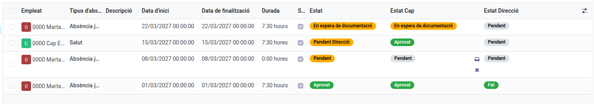
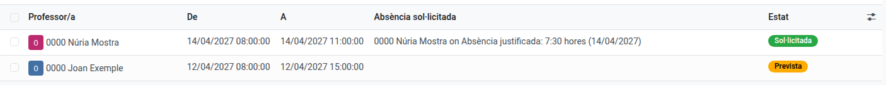

[Català](absences.md) | [Castellano](../../es/head_of_studies/absences.md) | [English](../../en/head_of_studies/absences.md)

---

# Gestionar les absències del personal

**Rol necessari:** Cap d'Estudis, Cap d'Estudis Adjunt/a o Direcció

---

## Índex

1. [Qui aprova cada àrea](#qui-aprova-cada-àrea)
2. [Aprovar o rebutjar](#aprovar-o-rebutjar)
3. [Ajustar el còmput d'una absència](#ajustar-el-còmput-duna-absència)
4. [Aprovació de Direcció](#aprovació-de-direcció)
5. [Informe per empleat](#informe-per-empleat)
6. [Informe mensual](#informe-mensual)
7. [Absències previstes](#absències-previstes)

---

## Qui aprova cada àrea

| Àrea | Aprova |
|---|---|
| VET | Cap d'Estudis Adjunt/a de FP |
| ESO / BTX | Cap d'Estudis |
| ASP | Secretari/ària |

L'aprovador de cada persona és el responsable del seu departament de nivell superior. Es defineix al formulari del departament, camp **Responsable d'àrea**, i s'actualitza sol si canvia el càrrec.

Ningú aprova la seva pròpia absència: la d'un responsable d'àrea la resol Direcció.

---

## Aprovar o rebutjar

**Assistència del personal > Absències > Administració > Absències sol·licitades**.

Hi tens les sol·licituds de la teva àrea, i s'obre amb **Pendent de mi**: les que esperen que les donis per rebudes i les que tenen un justificant que has de validar. Cada absència passa primer per tu i després per Direcció, i el llistat té una columna per a cadascú:

| Columna | Mostra |
|---|---|
| **Estat** | En quin punt és la sol·licitud |
| **Estat Cap** | La teva part: Pendent, En espera de documentació, Pendent de validació, Aprovat o Rebutjat |
| **Estat Direcció** | La de Direcció: Pendent, Fet o Rebutjat |

**La teva part té dos passos quan el tipus d'absència exigeix justificant** (tots menys `Salut` i `ATRI`), perquè sovint el justificant només existeix després de l'absència:

1. **Rebuda: pendent de documentació** (icona de safata al llistat, o el botó de dalt del formulari). Dones per rebuda la sol·licitud sense haver vist encara el justificant. Passa a **En espera de documentació** i es demana el justificant a la persona. Si ja l'havia adjuntat amb la sol·licitud, passa directament a **Pendent de validació**.
2. Quan la persona adjunta el justificant, la sol·licitud et torna sola com a **Pendent de validació**. Obre-la, revisa el justificant i fes servir **Validar documentació** (també una icona de validació al llistat). Llavors passa a Direcció.

Si el justificant no és vàlid, **Documentació insuficient** et demana el motiu (obligatori) i torna la sol·licitud a la persona (En espera de documentació) amb un missatge que l'inclou. La persona també el veu a dalt de la sol·licitud fins que adjunta un justificant nou.

Per a `Salut` i `ATRI` hi ha un sol pas: **Validar** (el polze al llistat), que l'envia directament a Direcció.

La creu rebutja, en qualsevol d'aquests passos. Quan decideixes des del formulari, tornes al llistat.

L'absència té efecte (calendari d'absències, saldo d'hores, quadrant de guàrdies) tan bon punt la dones per rebuda, encara que falti el justificant o Direcció no l'hagi revisada.

Si uns dies després de l'absència (tres, si el centre no ho ha canviat) la persona encara no ha adjuntat el justificant, reps un missatge i una activitat per fer-ne el seguiment; a la persona se li recorda cada dia.

Tu hi veus el **motiu escrit** i el **justificant**; la resta del personal, no.

**Rebutjar és definitiu.** Un cop rebutges una sol·licitud, ni tu ni la persona la podeu tornar a *Pendent*: per concedir-la finalment, la persona ha de fer-ne una de nova. Com que el botó Rebutja és al costat dels altres, i al llistat és només una creu, sempre demana confirmació abans - llegeix el missatge abans d'acceptar-lo.

Pots adjuntar un **justificant** a qualsevol sol·licitud, de qualsevol tipus i en qualsevol moment: un certificat lliurat després de l'absència s'adjunta a la mateixa sol·licitud.

---

## Ajustar el còmput d'una absència

Un camp del formulari, que pots canviar en qualsevol moment:

| Camp | Què fa | Ve marcat a |
|---|---|---|
| **Suma les hores a l'informe mensual** | Fa que les hores entrin al recompte mensual | Tots els tipus excepte `Baixa laboral` |

També pots canviar el **tipus d'absència** després d'haver-la aprovat. Fes-ho quan la persona n'hagi triat un que no correspon.

Si l'absència és de dia sencer o d'unes hores concretes ho controla la casella **Dia sencer?**, que també pots corregir: marcada compta 7,5 hores per dia laborable, sense marcar compta les hores indicades.

---

## Aprovació de Direcció

**Només Direcció.** Direcció revisa cada absència en últim lloc: li arriba un cop el cap l'ha validada, amb el justificant quan el tipus n'exigeix. En les absències d'**ATRI**, comprova que la sol·licitud s'ha tramitat de debò al portal de la Generalitat.

**Assistència del personal > Absències > Administració > Absències sol·licitades** s'obre amb **Pendent de mi**: totes les absències **Pendent Direcció**, i les absències dels mateixos caps d'àrea, que gestiones tu com a cap seu (amb els botons del cap descrits més amunt). Cadascuna et deixa també una activitat ("Revisió de direcció de l'absència").

Revisa-les des del llistat amb les icones del costat d'**Estat Direcció**, o obre'n una i fes servir els botons de dalt, que et tornen al llistat en acabar:

| Icona | Botó | Resultat |
|---|---|---|
| Casella marcada | **Direcció: fet** | Aprovat |
| Full | **Documentació insuficient** | Torna a la persona, En espera de documentació. Abans demana el motiu, que la persona rep |
| Fletxa enrere | **Direcció: pendent** | Desfà un *Fet* |
| Creu | **Rebutja** | Rebutjat. Rebutja tota la sol·licitud, demana confirmació abans i és definitiu |

Quan un cap dona per rebuda una absència, en reps el resum com a seguidor.

**Estat**:

| Estat | Significa |
|---|---|
| Pendent | El cap encara no l'ha donada per rebuda |
| En espera de documentació | Rebuda pel cap, espera el justificant de la persona |
| Pendent de validació | El justificant és adjuntat, el cap l'ha de validar |
| Pendent Direcció | Validada pel cap, espera Direcció |
| Aprovat | Tots dos |
| Rebutjat | El cap o Direcció l'han rebutjada |
| Cancel·lat | La persona l'ha retirada |

El panell de cerca de l'esquerra filtra per **Estat**.

---

## Informe per empleat

**Absències > Informes > per empleat**.

Surt agrupat per persona i filtrat pel curs actual, de l'1 de setembre al 31 d'agost.

La columna **Hores per salut** suma les hores del tipus `Salut` de cada persona. El límit és de **15 hores per curs**. Superar-lo no bloqueja res: la persona rep un avís i la sol·licitud es tramita igual, però et queda visible aquí.

---

## Informe mensual

**Absències > Informes > Totals per mes**.

Agrupat per mes, amb la suma d'hores i el nombre d'absències de cada mes. Hi entren només les absències amb **Suma les hores a l'informe mensual** marcat, i queden fora les rebutjades i les cancel·lades.

Per canviar el període, treu el filtre **Curs actual** i tria el que necessitis.

---

## Absències previstes

**Assistència del personal > Absències > Administració > Absències previstes**.

Quan ja saps que un docent faltarà però encara no ha sol·licitat l'absència (ha trucat aquest matí, o s'ha acordat en una reunió), entra-la aquí perquè les guàrdies es puguin planificar tot seguit.

1. Fes clic a **Nou**.
2. Tria el **Professor/a**. Només surten els docents de la teva àrea: el Cap d'Estudis o el Cap d'Estudis Adjunt veu els seus docents, i Direcció els veu tots.
3. Indica **De** i **A**, amb data i hora. Per defecte, avui de 08:00 a 15:00. Una absència pot ocupar diversos dies.
4. Si vols, afegeix-hi **Notes** per a tu. El docent no veu mai aquesta entrada.
5. Desa.

A partir d'aquest moment, el docent surt a l'horari de guàrdies com a absent amb una sol·licitud pendent d'aprovar (vermell més clar i en cursiva), durant les hores que has indicat.

Quan el docent sol·licita l'absència, l'absència prevista s'hi vincula automàticament i el seu estat passa de **Prevista** a **Sol·licitada**. Des d'aleshores només compta la sol·licitud del docent, amb les seves dates i hores: si després es rebutja o es cancel·la, l'entrada no torna a l'horari de guàrdies. Una entrada sol·licitada ja no es pot modificar; queda a la llista, amb el filtre **Sol·licitada**, com a registre.

Si finalment el docent no falta, esborra l'entrada.
