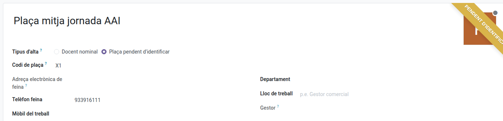
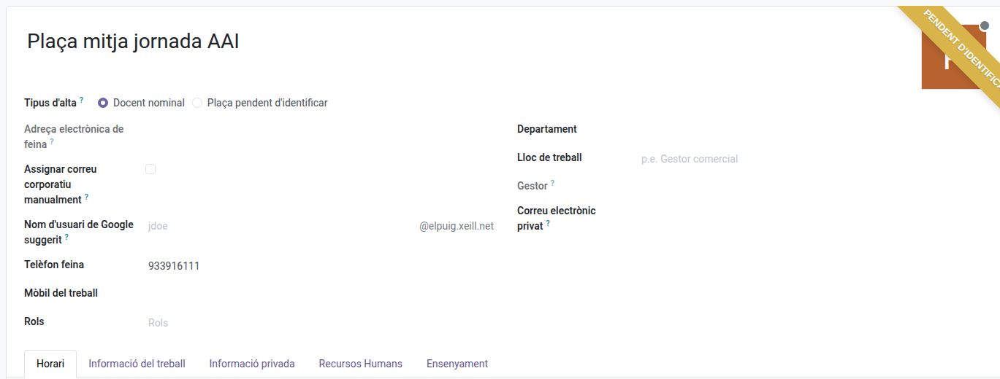
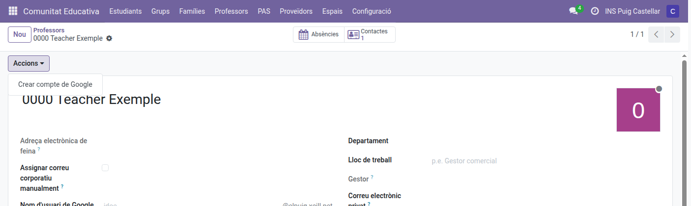

[Català](staff-management.md) | [Castellano](../../es/head_of_studies/staff-management.md) | [English](../../en/head_of_studies/staff-management.md)

---

# Crear i editar professorat

La prefectura d'estudis, la prefectura d'estudis adjunta i la coordinació TAC poden crear fitxes noves de professorat i editar les existents, sense haver de passar per una persona administradora. Gestionen la fitxa del professorat sencera, incloses les pestanyes **Informació privada** i **Recursos Humans**.

**Càrrec necessari:** Cap d'estudis, Cap d'estudis adjunt, Director/a o Coordinador/a TAC

---

## Accés

Aneu a: **Comunitat Educativa → Professorat**

---

## Crear una fitxa de professorat

1. Aneu a **Comunitat Educativa → Professorat**.
2. Feu clic a **Nou**.
3. Deixeu **Tipus d'alta** a **Docent nominal**, i ompliu el nom i, a la columna de la dreta sota **Gestor**, el **Correu electrònic privat**. Aquest és obligatori, i l'apartat següent explica per què.
4. Feu clic a **Desa**. La resta de dades (lloc de treball, departament, horari) es poden completar ara o més endavant.

En desar també es crea l'horari setmanal propi del professor o professora, precarregat a partir del marc horari del centre. No cal crear-lo a mà: obriu la pestanya **Horari** de la fitxa per ajustar-lo.

### Per què el correu personal és obligatori

És l'adreça on s'envien les credencials del compte de Google nou. Sense ella el compte corporatiu simplement no es crea: la fitxa es desa, però no passa res més i queda una nota a l'historial de missatges explicant què falta. Demaneu una adreça personal abans de crear la fitxa: no és cap formalitat, és l'única manera que la persona rebi la seva contrasenya. El camp surt dues vegades a la fitxa: a la pantalla principal, perquè res obligatori quedi amagat darrere d'una pestanya mentre la creeu, i al seu lloc habitual dins la pestanya **Informació privada**. És el mateix camp: si n'ompliu un, s'omple l'altre. Tampoc pot ser una adreça del domini del centre: EMS no la deixa desar, perquè també és l'adreça de recuperació del compte corporatiu.

---

## Crear una plaça pendent d'identificar

Quan una plaça ja té departament, horari, etc., però encara no hi ha ningú que la cobreixi, doneu-la d'alta com a plaça: no se li crea compte de Google ni usuari d'EMS.

1. Aneu a **Comunitat Educativa → Professorat** i feu clic a **Nou**.
2. Sota el nom, a **Tipus d'alta**, marqueu **Plaça pendent d'identificar**.
3. Ompliu el **Codi de plaça** (p. ex. `X1`). Dues places actives no poden tenir el mateix codi. Si més endavant un fitxer d'horaris porta aquest mateix codi, l'horari s'importa a aquesta fitxa.
4. Si voleu, feu servir el **Nom** per descriure la plaça (p. ex. "Plaça mitja jornada AAI"); si el deixeu en blanc, la fitxa pren el codi de plaça com a nom. No es demana correu personal.
5. Feu clic a **Desa**. La fitxa mostra la cinta **Pendent d'identificar**.

### Quan es cobreix la plaça

1. Obriu la fitxa de la plaça.
2. A **Tipus d'alta**, marqueu **Docent nominal**.

3. Substituïu el **Nom** pel nom real de la persona i ompliu el seu **Correu electrònic privat**.
4. Feu clic a **Desa**. En pocs moments es creen automàticament el compte de Google i l'usuari d'EMS, la cinta desapareix i l'historial de missatges de la fitxa recull el codi de plaça que tenia. L'horari, les assignatures i les llistes d'assistència es mantenen.

Un cop desada com a docent nominal, la fitxa ja no mostra **Tipus d'alta**: no es pot tornar a convertir en plaça.

Si la persona ja té un compte corporatiu (per exemple, en una altra fitxa), marqueu **Docent nominal**, activeu **Assignar correu corporatiu manualment** i escriviu el seu correu corporatiu: no es crea cap compte nou. Després, feu servir **Crear usuari EMS** al menú **Accions**.

---

## Editar una fitxa de professorat

1. Aneu a **Comunitat Educativa → Professorat** i obriu la fitxa.
2. Canvieu el que calgui i feu clic a **Desa** (o marxeu de la pantalla, l'Odoo desa automàticament).

---

## Document d'identitat i número de la Seguretat Social

La pestanya **Informació privada** de la fitxa d'un docent comença amb un grup **Identificació** amb el **Document d'identitat** (DNI/NIE) i el **Núm. de la Seguretat Social**. Vosaltres, l'adjunt/a, el Director i el coordinador TAC els podeu editar a les fitxes del professorat; la Secretaria els manté al dia per a tot el personal, PAS inclòs.

El Cap de departament i el Cap de seminari d'un docent també poden veure aquests dos camps, només de lectura, a les fitxes del personal del seu propi departament (només la seva pròpia cadena de comandament, no la d'altres departaments). Per a ells la pestanya només mostra el grup **Identificació**: la resta de la informació privada queda amagada.

---

## Crear el compte corporatiu de Google

Quan deseu la fitxa d'un professor nou amb el nom i el correu personal, el compte corporatiu es crea automàticament en pocs moments: no cal prémer res.

Les accions que gestionen el compte corporatiu són al menú **Accions** de la barra superior de la fitxa. Quin apareix depèn de l'estat del compte: només se n'ofereix un cada vegada.

| Botó | Quan apareix | Què fa |
|------|--------------|--------|
| **Crea el compte de Google** | El professorat no té compte corporatiu i no se n'està creant cap | Crea el compte de Google Workspace i l'usuari d'EMS en un sol pas. Només cal si no s'ha pogut crear automàticament |
| **Crea l'usuari d'EMS** | El correu corporatiu ja existeix, però no hi ha cap usuari d'EMS vinculat | Només vincula o crea l'usuari d'EMS, no toca res de Google |
| **Suspèn el compte de Google** | El compte és actiu | El suspèn (per exemple, quan la persona deixa el centre) |
| **Reactiva el compte de Google** | El compte està suspès | El torna a activar |

Quan el compte es crea, les credencials viatgen per dues vies: s'adjunta un PDF a la fitxa i s'envia un correu de benvinguda amb la contrasenya a l'adreça personal. Si el compte no es pot crear perquè falten dades obligatòries, es publica una nota a l'historial de missatges de la fitxa que indica exactament quins camps falten.

---

## Què no podeu fer

Hi ha dos límits deliberats, i l'Odoo rebutjarà l'operació si ho proveu:

- **No podeu esborrar una fitxa de personal.** Esborrar està reservat a l'administració. Si una persona deixa el centre, no esborreu la seva fitxa: suspeneu-li el compte de Google i arxiveu la fitxa, així se'n conserva l'historial.
- **No podeu editar fitxes del Personal d'Administració i Serveis (PAS).** Les podeu consultar — i, com que ara teniu els permisos de recursos humans, també la seva informació privada — però l'edició i la creació queden restringides al personal docent. Les fitxes del PAS les gestiona la secretaria.

---

## Qui més ho pot fer

Crear i editar professorat també està disponible per a la direcció (que hereta els permisos de la prefectura d'estudis) i per a l'administració, que a més pot esborrar fitxes i gestionar el PAS. Vegeu [Càrrecs del professorat i nivells de permisos](../admin/teacher-roles.md) per veure l'escala completa de permisos i com s'assigna el càrrec de coordinació TAC.

---

[← Torna a l'índex de Prefectura d'Estudis](index.md)
