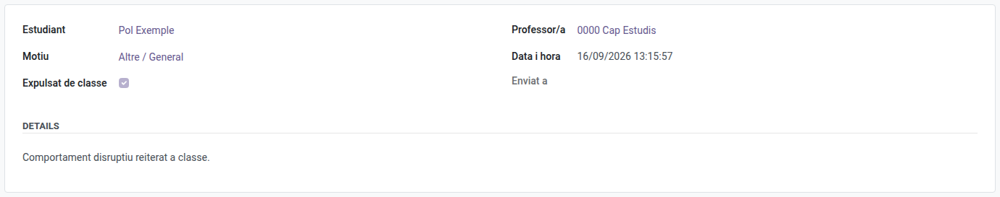

[Català](strike.md) | [Castellano](../../es/head_of_studies/strike.md) | [English](../../en/head_of_studies/strike.md)

---

# Strikes: menú Convivència i correus d'escalat

Aquesta pàgina cobreix tant l'historial complet de strikes (Cap d'Estudis / Cap d'Estudis Adjunt/a / Direcció) com els correus d'escalat que reben els coordinadors de convivència.

**Rol necessari:** Cap d'Estudis / Cap d'Estudis Adjunt/a / Direcció / Coordinador/a de convivència

---

## Consultar tots els strikes

**Convivència → Strikes** mostra tots els strikes posats a tot el centre, independentment de quin professor els hagi posat, a quina branca pertanyi l'alumne, o del teu propi rol de Cap d'Estudis / Cap d'Estudis Adjunt/a / Direcció — aquesta vista centralitzada no està limitada per departament. Si a més tens el rol de Convivència, veus exactament la mateixa llista completa.

A la fitxa del propi alumne, apareix un botó de **Strikes** a la capçalera que mostra el recompte acumulat. En obrir qualsevol strike concret es mostra una casella **Expulsat de classe**, per saber d'un cop d'ull si aquella incidència va acabar amb l'alumne fora de l'aula.

---

## Eliminar un strike

Cap d'Estudis, Cap d'Estudis Adjunt/a, Direcció i els coordinadors/es de Convivència poden eliminar qualsevol strike de tot el centre — obre el registre del strike (o selecciona'l a la llista) i fes servir l'acció d'eliminar habitual. Això és útil per corregir un strike posat per error o duplicat. Eliminar un strike el treu de forma permanent, també del recompte acumulat de l'alumne; no es pot desfer.

---

## Correus d'escalat (coordinadors de convivència)

Cada vegada que el recompte acumulat de strikes d'un alumne és un múltiple del llindar configurat (3, 6, 9... per defecte), s'envia automàticament un correu al coordinador/a de convivència que comparteix el mateix Cap d'Estudis / Cap d'Estudis Adjunt/a ascendent que el professor que ha posat aquell strike — així la notificació sempre arriba al coordinador responsable de la branca de l'alumne.

El correu inclou l'alumne, el recompte total de strikes, l'últim motiu i el professor que l'ha posat, perquè tinguis tot el que cal per decidir si cal intervenir.

---

## Configurar el llindar d'escalat

El llindar (quants strikes disparen un correu d'escalat) el configura un/a Administrador/a des de **Configuració → Gestió EMS → "Strikes Settings" (Configuració dels strikes)**. Consulta el [manual d'Administrador](../admin/strike.md).

---

[← Tornar als manuals de Cap d'Estudis](index.md)
