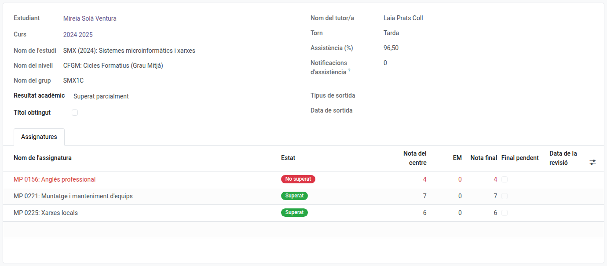
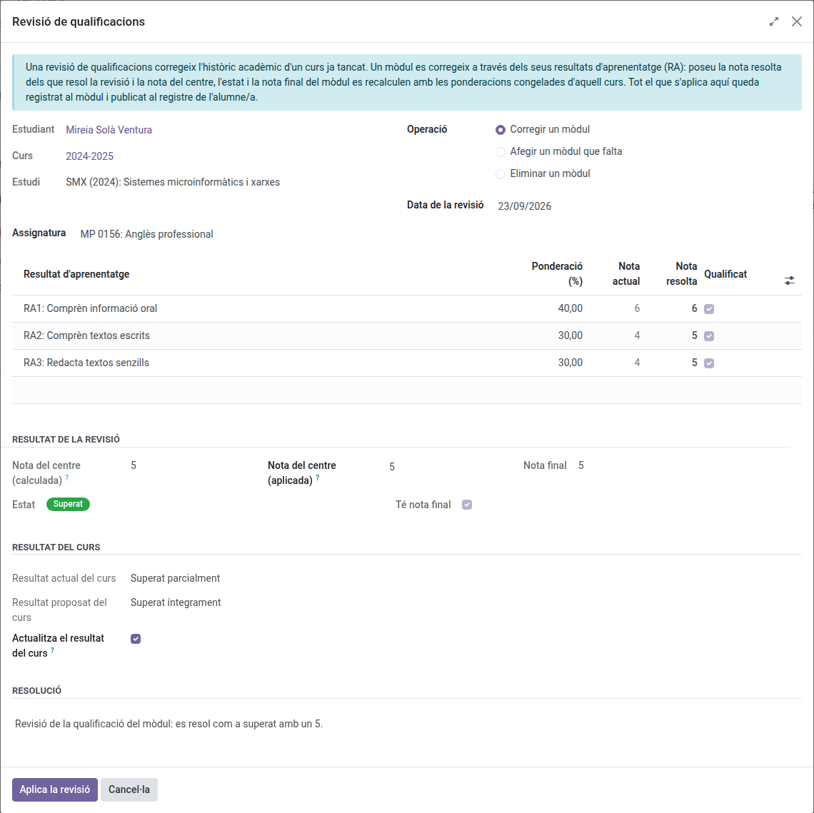

[Català](academic-history.md) | [Castellano](../../es/secretary/academic-history.md) | [English](../../en/secretary/academic-history.md)

---

# Històric acadèmic: registres per curs de l'alumnat

Aquesta guia explica l'**històric acadèmic**: un resum permanent per curs de cada alumne/a (estudi, grup, mòduls amb les notes per resultat d'aprenentatge, assistència i resultat acadèmic). És una **còpia congelada** presa del subsistema de notes al final de cada curs (o en el moment d'una baixa), de manera que es conserva després que la transició de curs netegi les dades operatives de l'any sortint.

---

## Contingut

1. [Què conté l'històric](#què-conté-lhistòric)
2. [Quan es creen els registres](#quan-es-creen-els-registres)
3. [Consultar l'històric](#consultar-lhistòric)
4. [Ajustar el resultat acadèmic](#ajustar-el-resultat-acadèmic)
5. [Aplicar una revisió de qualificacions](#aplicar-una-revisió-de-qualificacions)
6. [Finals pendents de l'estada](#finals-pendents-de-lestada)

---

## Què conté l'històric

Un registre per **alumne/a i curs**, amb tres nivells:

- **Resum del curs:** estudi, nivell, grup, tutor/a i torn d'aquell curs, percentatge global d'assistència, nombre de notificacions d'assistència enviades a la família, resultat acadèmic i si va obtenir el títol aquell any.
- **Mòduls:** una línia per mòdul cursat, amb la nota interna, la nota de l'estada (EM), la nota final, l'estat (**Superat / No superat**) i les ponderacions congelades vigents aquell curs.
- **Resultats d'aprenentatge (RA):** dins de cada mòdul, la nota de cada RA convocatòria a convocatòria, amb el seu pes.

> L'històric és una **còpia, mai no es recalcula**: els valors són els que el subsistema de notes va calcular durant el curs, congelats amb les ponderacions de la programació d'aquell any. Les notes conserven el seu significat encara que la programació canviï en anys posteriors.

L'estat d'un mòdul depèn **només dels RA**: un alumne amb tots els RA aprovats té el **mòdul aprovat**, encara que l'estada estigui pendent — en aquest cas només la **nota final** queda buida fins que s'avaluï l'estada. Una estada suspesa es repeteix; mai no suspèn el mòdul.

## Quan es creen els registres

- **En una baixa:** l'[assistent de baixa](graduation-withdrawal.md) congela l'històric de l'alumne/a **en aquell moment**, abans de desvincular-lo del seu grup. Qui deixa el centre a mig curs conserva el registre de tot el que va fer fins aquell dia (mòduls, notes, assistència), amb el resultat **Baixa**. Un cop congelat l'històric, la baixa **treu l'alumne/a de tot allò operatiu**: les seves inscripcions a mòduls, les línies de notes de les sessions vives, les línies i plantilles d'assistència, i el delegat del grup si ho era. A partir d'aquell moment ja no surt al grup, ni a la matriu d'avaluació, ni a les sessions d'assistència, ni a la qualificació de l'estada — només al seu històric acadèmic.
- **En la transició de curs:** l'assistent de transició (executat per l'administrador al final del curs) genera els registres de tot l'alumnat actiu abans de netejar les dades operatives.
- **En completar una convalidació:** si el curs de la convalidació encara no té registre, se n'obre un marcat com a **Curs actual**, amb només les assignatures convalidades (nota, marca **CV** i número de registre CONV). Així el professorat veu la nota des del primer dia. En tancar el curs (transició, baixa o graduació) el registre es completa amb la resta d'assignatures i el resultat, i perd la marca. Sobre un registre del curs actual no es pot aplicar una revisió de qualificacions: les notes del curs en marxa es corregeixen a les sessions d'avaluació.

Tornar a executar la generació mai no duplica un registre: el que ja existeix s'actualitza.

## Consultar l'històric

Dos punts d'entrada:

- **Per alumne/a:** obriu la fitxa de l'alumne/a — la pestanya **Històric acadèmic** llista els seus registres, ordenats per estudi i curs. La pestanya es manté visible per a l'**antic alumnat** (graduats/des i baixes): és el seu registre permanent.
- **Consultes de cohort:** **Planificació i avaluació → Notes → Històric acadèmic** llista tots els registres. Filtreu o agrupeu per curs, estudi, grup o resultat acadèmic — p. ex. "tot l'alumnat de l'estudi X al curs Y", o tots els registres amb la marca **Títol obtingut**.

## Ajustar el resultat acadèmic

El **resultat acadèmic** (*Superat íntegrament*, *Superat parcialment*, *Repeteix curs*, *Baixa*) es proposa automàticament a partir de les notes i de la matrícula de destinació, però és un camp normal: secretaria i administradors poden **ajustar-lo a mà** al registre quan la proposta automàtica no coincideix amb la realitat (p. ex. un estudi sense flux de matrícula resolt al setembre).

## Aplicar una revisió de qualificacions

Una revisió de qualificacions corregeix l'històric acadèmic d'un curs ja tancat. La poden aplicar secretaria, administració, cap d'estudis i direcció.

1. Obriu **Planificació i avaluació → Notes → Històric acadèmic** i obriu el registre de l'alumne/a del curs que s'ha de corregir.
2. Feu clic a **Revisió de qualificacions**.
3. Trieu què fa la revisió:
   - **Corregir un mòdul:** trieu el mòdul i poseu la **Nota resolta** de cada resultat d'aprenentatge que resol la revisió.
   - **Afegir un mòdul que falta:** trieu el mòdul. Les ponderacions i els resultats d'aprenentatge es proposen a partir de la programació de l'estudi; poseu-hi les notes.
   - **Eliminar un mòdul:** trieu el mòdul que s'ha de treure del registre.
4. Llegiu **Resultat de la revisió**: la nota interna, l'estat i la nota final que dona la correcció.
5. Llegiu **Resultat del curs**: el resultat proposat s'escriu al registre mentre **Actualitza el resultat del curs** estigui marcat. Desmarqueu-lo per conservar l'actual.
6. Escriviu la **Resolució** i feu clic a **Aplica la revisió**.

Un mòdul queda superat quan tots els resultats d'aprenentatge es resolen amb 5 o més. Un mòdul amb l'estada (EM) encara sense qualificar queda superat amb la nota final pendent; qualifiqueu l'estada des de la pantalla d'estada. *Repeteix curs* i *Baixa* no els proposa una revisió de qualificacions: ajusteu-los a mà al registre.

El mòdul conserva la data, l'autor/a i el text de l'última revisió que s'hi ha aplicat, i el filtre **Corregit per una revisió de qualificacions** de la llista de l'històric mostra els registres que en tenen alguna. El detall de cada canvi queda registrat al registre de l'alumne/a.

## Finals pendents de l'estada

Els mòduls aprovats amb la nota final a l'espera de l'estada (EM) mostren la marca **Final pendent**. El filtre **Finals pendents d'estada** de la llista de l'històric dona la llista de treball de les estades pendents d'avaluar: quan s'avalua l'estada, la nota final d'aquests mòduls arxivats es completa amb les ponderacions congelades.

---

[← Torna a l'índex principal](index.md)
