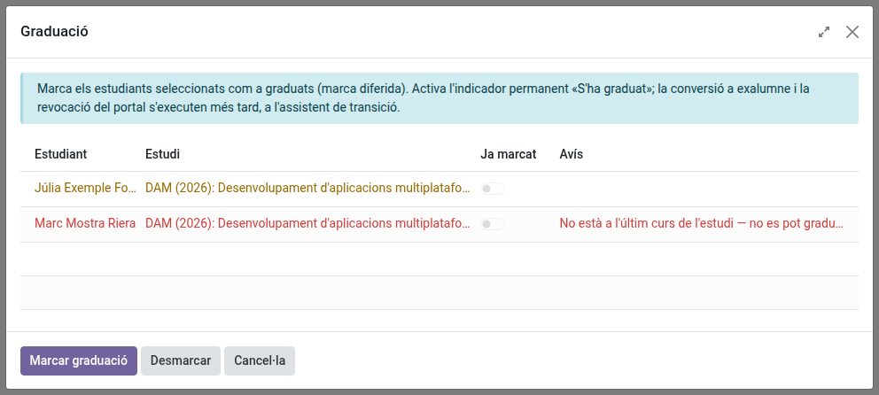
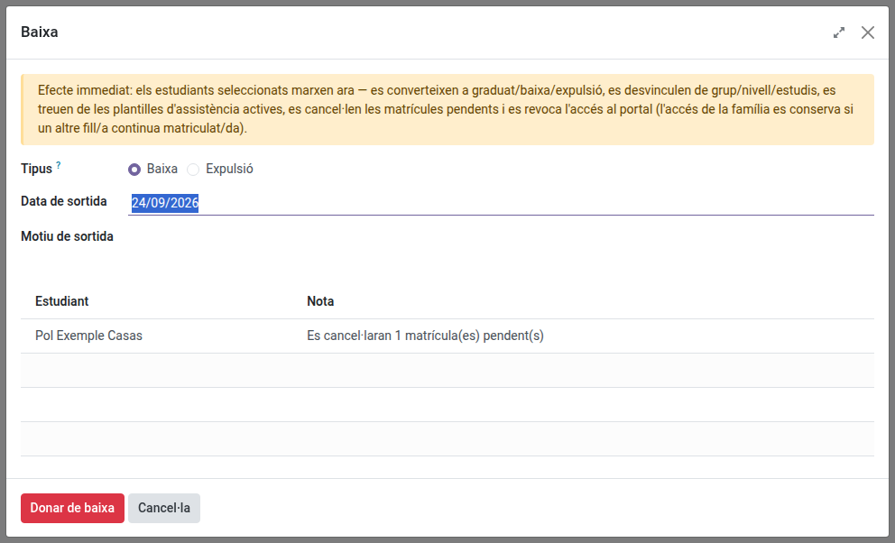

[Català](graduation-withdrawal.md) | [Castellano](../../es/secretary/graduation-withdrawal.md) | [English](../../en/secretary/graduation-withdrawal.md)

---

# Marcar una graduació i tramitar una baixa

Aquesta guia explica les dues maneres en què un alumne deixa el centre — la **graduació** (es marca per endavant, s'aplica més tard) i la **baixa** (immediata) — i què fa cadascuna exactament.

---

## Contingut

1. [Dues accions diferents, dos moments diferents](#dues-accions-diferents-dos-moments-diferents)
2. [Marcar una graduació](#marcar-una-graduació)
3. [Tramitar una baixa](#tramitar-una-baixa)
4. [Què fa una baixa, pas a pas](#què-fa-una-baixa-pas-a-pas)
5. [Desfer una baixa tramitada per error](#desfer-una-baixa-tramitada-per-error)

---

## Dues accions diferents, dos moments diferents

- La **graduació** és una **marca diferida**: indiqueu ara que un alumne es graduarà, però res més canvia immediatament — continua assistint a classe, conserva el seu grup, conserva l'accés al portal. La conversió real a extitulat passa més endavant, a la transició de curs.
- La **baixa** és **immediata**: l'alumne deixa el centre avui mateix. El seu grup, les seves assignatures i l'accés al portal s'eliminen tots com a part de la mateixa acció.

Seleccioneu un o més alumnes (des de la llista o des de la fitxa d'un sol alumne) i utilitzeu **Accions → Graduació** o **Accions → Baixa** — totes dues també apareixen com a botó a la fitxa de l'alumne.

## Marcar una graduació

Només es pot marcar l'alumnat que està al **darrer curs del seu estudi** (per exemple, 2n de CFGM/CFGS/Batxillerat, 4t d'ESO) — l'assistent mostra per què un alumne encara no es pot marcar si no és el cas (no és al darrer curs, o ja té matrícula per al curs vinent, cosa que es considera incompatible amb graduar-se). Els tutors poden marcar els seus propis tutoritzats; secretaria i admin poden marcar qualsevol.

Heu marcat un alumne per error? **Desmarcar** ho reverteix — excepte el registre intern "s'ha graduat almenys una vegada", que és permanent i és el que decideix si serà extitulat o baixa si aquell alumne deixa el centre més endavant. Desmarcar mai no desfà això.

## Tramitar una baixa (o una expulsió)

Ho poden tramitar secretaria, cap d'estudis, cap d'estudis adjunt, direcció i admin. Se us demanarà triar entre **Baixa** i
**Expulsió**, la **data de sortida** i, opcionalment, un **motiu** — després confirmeu. Una baixa
tramitada per error es pot desfer: vegeu [Desfer una baixa tramitada per error](#desfer-una-baixa-tramitada-per-error).

- La **Baixa** cobreix que l'alumne marxi pel seu compte, tant si és decisió pròpia com decisió
  administrativa del centre ("d'ofici") — no hi ha una opció separada per a aquesta distinció,
  simplement anoteu les circumstàncies concretes al camp de motiu.
- L'**Expulsió** és per a un alumne expulsat permanentment del centre. Passa exactament pels
  mateixos passos de sota que una baixa (mateixes cancel·lacions, mateixa congelació de
  l'històric, mateixa revocació del portal), l'única diferència és el resultat final:
  **Expulsat/da** en lloc de **Baixa** — es mostra com un rètol vermell a la fitxa de l'alumne,
  d'un cop d'ull, al costat de Graduat/da (verd) i Baixa (taronja) per a la resta d'exalumnes.
- El text del botó de confirmació canvia segons la vostra elecció ("Donar de baixa" o "Expulsar").

Arxivar un alumne des de l'acció genèrica d'Arxivar (llista o fitxa) obre automàticament aquest mateix assistent — no hi ha cap camí de "només arxivar" per a un alumne actiu; aquest assistent és el que significa arxivar per a un alumne.

## Què fa una baixa (o una expulsió), pas a pas

1. Qualsevol **matrícula pendent** (esborrany o enviada, encara no confirmada) d'aquest alumne es cancel·la.
2. El seu [històric acadèmic](academic-history.md) es congela **en aquell moment exacte** — tot el que s'ha fet fins aquell dia (mòduls, notes, assistència) es conserva permanentment, amb el resultat **Baixa**.
3. S'elimina de tot allò operatiu: matrícules d'assignatures, sessions d'avaluació en curs, fulls i plantilles d'assistència, i el rol de delegat/da del grup si el tenia.
4. Si heu triat **Expulsió**, passa a ser **Expulsat/da** — sempre, independentment de qualsevol marca de graduació anterior. Si no, passa a ser **extitulat** si en algun moment va ser marcat com a graduat (encara que fos fa temps), o **baixa** en cas contrari.
5. Se li revoca l'accés al portal — i també al de la seva família, **tret que** algun membre de la família encara tingui un altre fill/a matriculat/da activament al centre (un germà/na manté l'accés de la família funcionant).
6. La fitxa de l'alumne s'arxiva.
7. Es programa la suspensió del seu compte corporatiu de Google: EMS li envia un correu (a l'adreça personal i a la corporativa) avisant-lo que el compte se suspendrà d'aquí a 30 dies i s'eliminarà 30 dies més tard, i mostra les dues dates a la fitxa a mesura que es fixen.

---

## Desfer una baixa tramitada per error

Si s'ha donat de baixa un alumne per error (per exemple, confós amb un germà de nom gairebé igual), secretaria, cap d'estudis, cap d'estudis adjunt, direcció i admin la poden desfer:

1. Obriu la fitxa de l'alumne (a **Comunitat educativa → Alumnes**, amb el filtre **Antic alumnat**).
2. Feu clic a **Accions → Desfés la baixa** i confirmeu.

L'opció només apareix si es compleixen les tres condicions:

- és una **baixa**, no una expulsió;
- la baixa és del **curs actual**;
- l'alumne té la **matrícula del curs actual confirmada** i amb grup.

En desfer-la:

- L'alumne torna a ser alumne actiu, al grup i a les assignatures de la seva matrícula: torna a sortir als passos de llista i a les sessions d'avaluació.
- S'esborra el resultat **Baixa** del seu [històric acadèmic](academic-history.md) per al curs actual. Les convalidacions del curs es conserven.
- Es torna a donar accés al portal, igual que en una matrícula nova: a l'alumne i, si és menor d'edat, a la seva família.
- Es manté el compte corporatiu de Google: s'anul·la la suspensió programada o es reactiva el compte si ja estava suspès.
- Queda una nota a l'historial de la fitxa. Si l'alumne ja tenia notes posades abans de la baixa, la nota les llista assignatura per assignatura perquè el professorat les torni a introduir.

No es recupera:

- l'assistència anterior a la baixa;
- els passos de llista fets mentre l'alumne estava de baixa;
- les matrícules pendents que la baixa va cancel·lar.

Una baixa d'un curs anterior no es desfà: l'alumne es torna a matricular pel circuit habitual de matrícula.

---

## El compte corporatiu de Google després d'una baixa

El compte no es toca el dia que l'alumne marxa: continua funcionant 30 dies, després se suspèn i, 30 dies més tard, s'elimina definitivament (bústia i fitxers de Drive inclosos).

A la part superior de la fitxa de l'alumne:

- **Cancel·la la desactivació programada** — conserva el compte encara que l'alumne hagi marxat.
- **Suspèn el compte de Google** — el suspèn immediatament, sense esperar els 30 dies. Això també inicia el compte enrere de 30 dies fins a l'eliminació.
- **Elimina el compte de Google** — l'elimina definitivament, sense esperar. Demana confirmació abans; no es pot desfer.
- **Reactiva el compte de Google** — recupera un compte suspès i anul·la la seva eliminació.

Si l'alumne torna (desarxivar la fitxa), això es fa automàticament: s'anul·la el pas que estigués programat, o es reactiva el compte si ja estava suspès. Si el compte ja s'havia eliminat, se'n crea un de nou amb credencials noves.

Per veure tot l'alumnat amb alguna cosa pendent, aneu a **Comunitat educativa → Alumnes** i feu servir els filtres **Suspensió de Google pendent** o **Eliminació de Google pendent**. Les dues dates estan disponibles com a columnes opcionals a la vista de llista (el selector a l'extrem dret de la capçalera), de manera que hi podeu ordenar; **Agrupa per → Data de suspensió de Google** les agrupa per mes.

Si l'accés al portal no es pot revocar per algun motiu, l'alumne **no** s'arxiva — ho veureu indicat al missatge de confirmació, i podeu tornar-ho a intentar un cop resolt el problema.

---

[← Tornar a l'índex de Secretaria](index.md)
