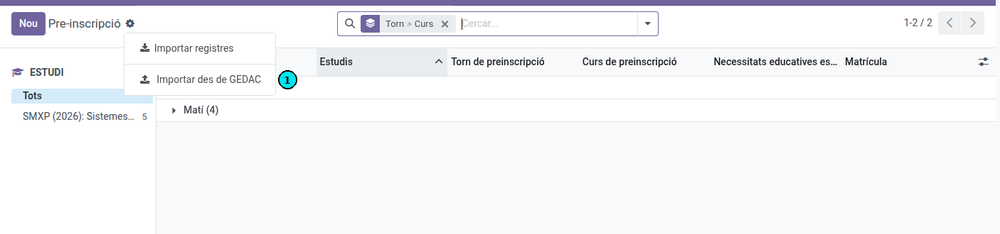
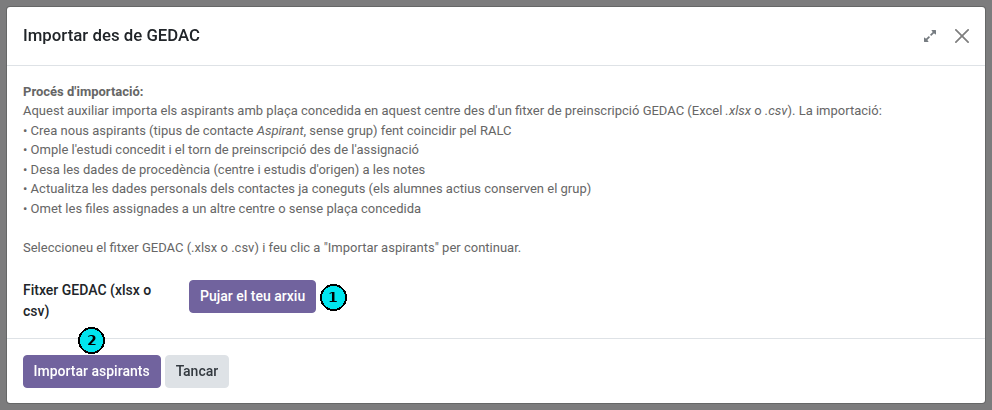
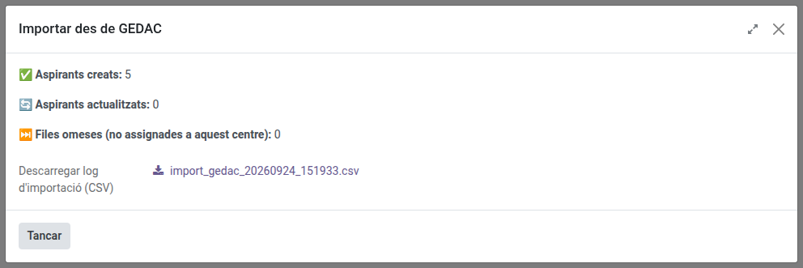
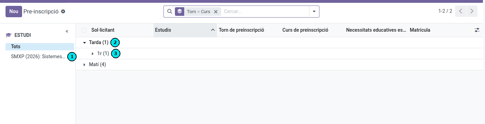
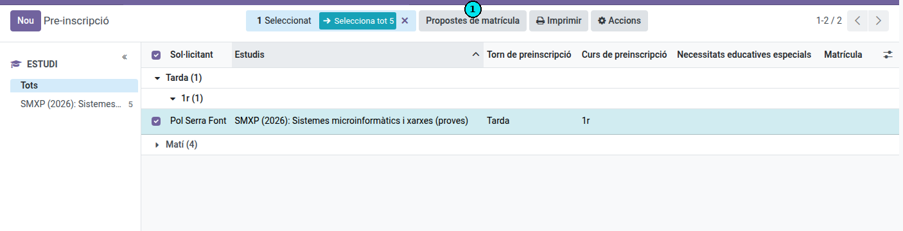
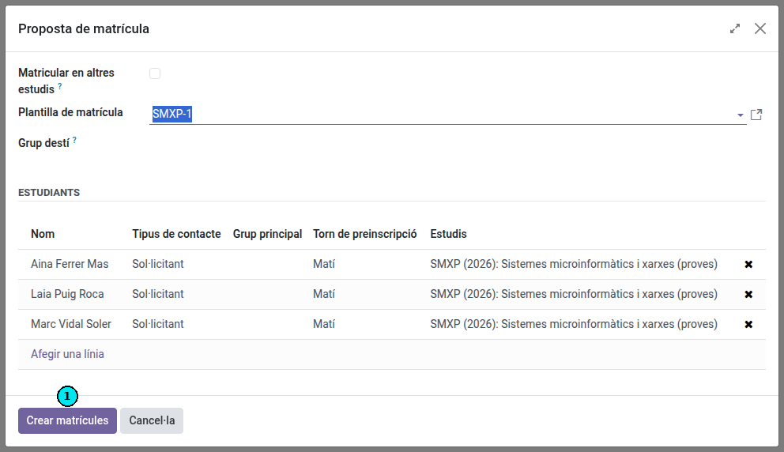
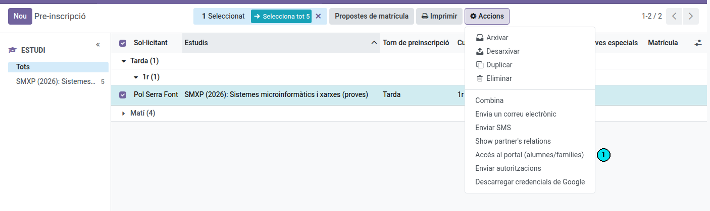
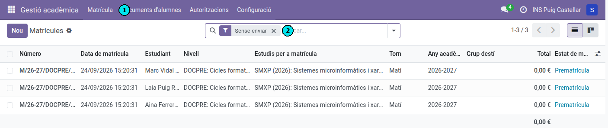
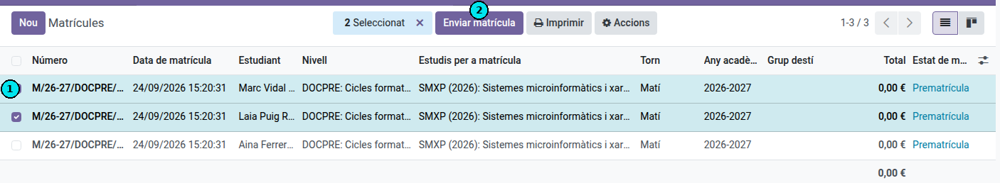

[Català](manual-matriculacio-preinscripcio.md) | [Castellano](../../es/secretary/manual-matriculacio-preinscripcio.md) | [English](../../en/secretary/manual-matriculacio-preinscripcio.md)

---

# Matriculació per l'alumnat de preinscripció

Aquesta guia explica, pas a pas, com el personal de **secretaria** processa l'alumnat de **preinscripció** (aspirants amb plaça concedida) fins a generar-los la **proposta de matrícula** i enviar-la a les famílies, tot des del mòdul de **Gestió acadèmica**.

El circuit té sis passos: importar els aspirants des de GEDAC, revisar-los, crear-los les propostes de matrícula, donar-los accés al portal, revisar les matrícules generades i, finalment, enviar-los la proposta perquè la confirmin.

---

## Índex

1. [Pas 1 — Importar els aspirants des de GEDAC](#pas-1--importar-els-aspirants-des-de-gedac)
2. [Pas 2 — Revisar l'alumnat de preinscripció](#pas-2--revisar-lalumnat-de-preinscripció)
3. [Pas 3 — Crear les propostes de matrícula](#pas-3--crear-les-propostes-de-matrícula)
4. [Pas 4 — Donar accés al portal a l'alumnat i les famílies](#pas-4--donar-accés-al-portal-a-lalumnat-i-les-famílies)
5. [Pas 5 — Revisar les matrícules generades](#pas-5--revisar-les-matrícules-generades)
6. [Pas 6 — Enviar les propostes de matrícula](#pas-6--enviar-les-propostes-de-matrícula)

---

## Pas 1 — Importar els aspirants des de GEDAC

A la vista **Pre-inscripció** (menú **Matrícula → Pre-inscripció**), obriu el menú d'accions (la icona de l'engranatge ⚙️ al costat del títol) i trieu **Importar des de GEDAC (1)**.

S'obrirà l'auxiliar **Importar des de GEDAC**. Aquest procés importa els aspirants amb **plaça concedida** en aquest centre a partir del fitxer de preinscripció de GEDAC (Excel `.xlsx` o `.csv`). En concret:

* Crea els aspirants nous (tipus de contacte *Aspirant*, sense grup) fent coincidir per RALC.
* Omple l'estudi concedit i el torn de preinscripció a partir de l'assignació.
* Desa les dades de procedència (centre i estudis d'origen) a les notes.
* Actualitza les dades personals dels contactes ja coneguts (els alumnes actius conserven el grup).
* Omet les files assignades a un altre centre o sense plaça concedida.

Per fer la importació:

1. Feu clic a **Pujar el teu arxiu (1)** i seleccioneu el fitxer GEDAC (`.xlsx` o `.csv`).
2. Premeu **Importar aspirants (2)**.

En acabar, l'auxiliar mostra un **resum de la importació**: quants aspirants s'han creat, quants s'han actualitzat i quantes files s'han omès (per no estar assignades a aquest centre). També podeu **descarregar el registre (CSV)** amb el detall de la importació.

> Si el fitxer conté alumnes que **ja són actius al centre** i canvien d'estudis, l'auxiliar els deixa intactes i els llista a part, al CSV `gedac_alumnes_actius_<data>.csv`. Per matricular-los dels estudis nous, seguiu [Matricular un alumne actual en uns altres estudis](matricula-altres-estudis.md).

---

## Pas 2 — Revisar l'alumnat de preinscripció

Un cop importats, els aspirants apareixen a la vista **Pre-inscripció**. Per revisar-los còmodament:

* Feu servir el **panell d'estudis** de l'esquerra **(1)** per filtrar l'alumnat per estudi (SMX, ASIX, GA...). Al costat de cada estudi hi ha el nombre d'aspirants.
* La llista ve **agrupada automàticament per torn** (*Afternoon* / *Morning*) **(2)** i, dins de cada torn, **per curs** (1r, 2n) **(3)**. Feu clic a cada grup per desplegar-lo. Aquesta agrupació es fa per poder aplicar la **plantilla de matrícula** de manera més senzilla: cada combinació d'**estudi, torn i curs** té assignada una plantilla i un grup destí per defecte, de manera que podeu processar cada bloc d'aspirants amb la plantilla i el grup que li corresponen.

> **Consell:** treballeu **estudi per estudi**. En seleccionar un estudi al panell de l'esquerra, la creació de propostes del pas següent és més senzilla, perquè tots els aspirants comparteixen el mateix estudi.

---

## Pas 3 — Crear les propostes de matrícula

Amb un **estudi seleccionat** al panell de l'esquerra, marqueu els aspirants als quals voleu generar la proposta (podeu marcar la casella de la capçalera per seleccionar els de la pàgina, o fer clic a **Selecciona tot** per abastar tot l'estudi). A dalt apareixerà el botó **Propostes de matrícula (1)**; premeu-lo.

S'obrirà l'auxiliar **Propostes de matrícula**, que ja ve emplenat a partir de les dades de preinscripció:

* **Plantilla de matrícula** — es proposa la plantilla que correspon al curs concedit (p. ex. *SMX-1*).
* **Grup destí** — es proposa el primer grup del curs i torn de preinscripció (p. ex. *SMX1C*). Podeu deixar-lo o canviar-lo; si el deixeu buit, cada alumne rebrà el seu grup suggerit.
* **Estudiants** — la llista d'aspirants seleccionats, amb el seu torn de preinscripció. Podeu treure'n algun amb la creu de la dreta.

Reviseu que tot sigui correcte i premeu **Crear matrícules (1)**.

> Aquesta acció **crea una matrícula (en esborrany)** per a cada aspirant seleccionat, amb l'estudi, el curs i el grup destí indicats. Encara **no s'envia res** a les famílies: això es fa al Pas 6.

---

## Pas 4 — Donar accés al portal a l'alumnat i les famílies

Perquè les famílies puguin confirmar la matrícula més endavant, cal que tinguin **accés al portal**. Des de la mateixa vista **Pre-inscripció**, amb els aspirants seleccionats, obriu el menú **Accions** i trieu **Accés al portal (alumnes/famílies) (1)**.

> Aquesta opció genera o activa l'accés al portal educatiu per a l'alumnat i les seves famílies, de manera que, quan rebin el correu de proposta, hi puguin entrar a respondre les autoritzacions i confirmar la matrícula.

---

## Pas 5 — Revisar les matrícules generades

Les matrícules creades al Pas 3 es troben a la vista **Matrícula → Matrícules (1)**. Per veure només les que encara no s'han enviat, apliqueu el filtre **Sense enviar (2)** (mostra les matrícules en estat *esborrany*).

A la llista podeu comprovar, per a cada matrícula, l'**estudiant**, el **nivell** i els **estudis**, el **torn**, l'**any acadèmic**, el **grup destí**, l'**import total** i l'**estat**.

> Els filtres disponibles són **Sense enviar** (esborranys), **No confirmades** (esborranys i enviades), **Confirmades** i **Cancel·lades**, per si voleu revisar la resta d'estats.

---

## Pas 6 — Enviar les propostes de matrícula

Quan les matrícules estiguin revisades, seleccioneu-ne les que vulgueu enviar marcant-ne les caselles **(1)**. A dalt apareixerà el botó **Enviar matrícula (2)**; premeu-lo.

En prémer **Enviar matrícula**, per a cada matrícula seleccionada:

* S'**envia el correu** de proposta de matrícula a l'alumne/família (amb la plantilla del centre).
* La matrícula passa a estat **enviada**.

D'aquesta manera es fan els dos passos alhora: enviar el correu i marcar la matrícula com a enviada.

> A partir d'aquí, les famílies reben el correu i poden **confirmar la matrícula** des del portal seguint la guia [Guia per confirmar la proposta de matrícula](../families/manual-confirmacio-matricula.md).

---

[← Tornar a l'índex de secretaria](index.md)
