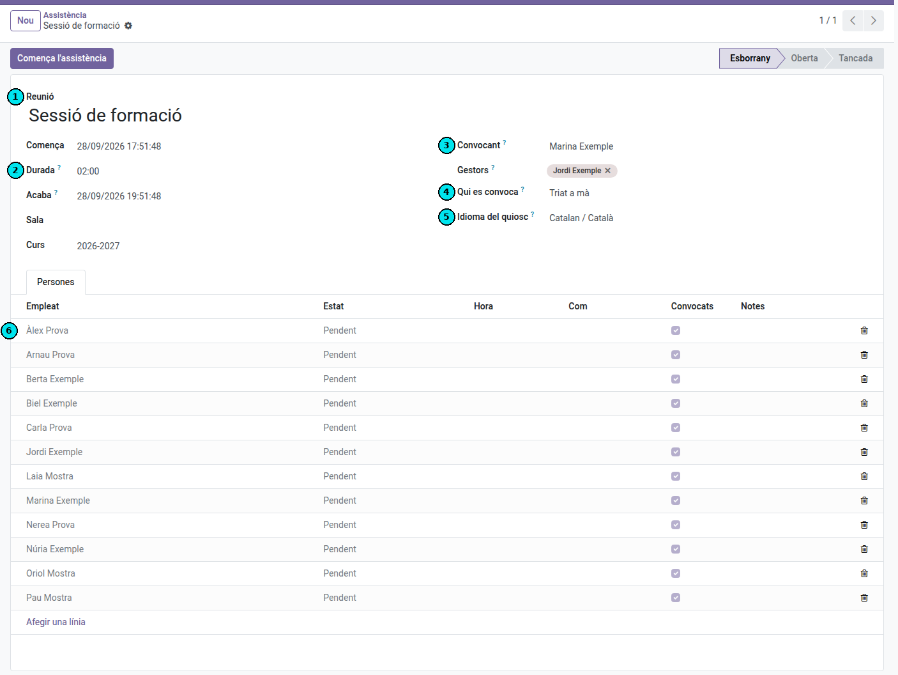
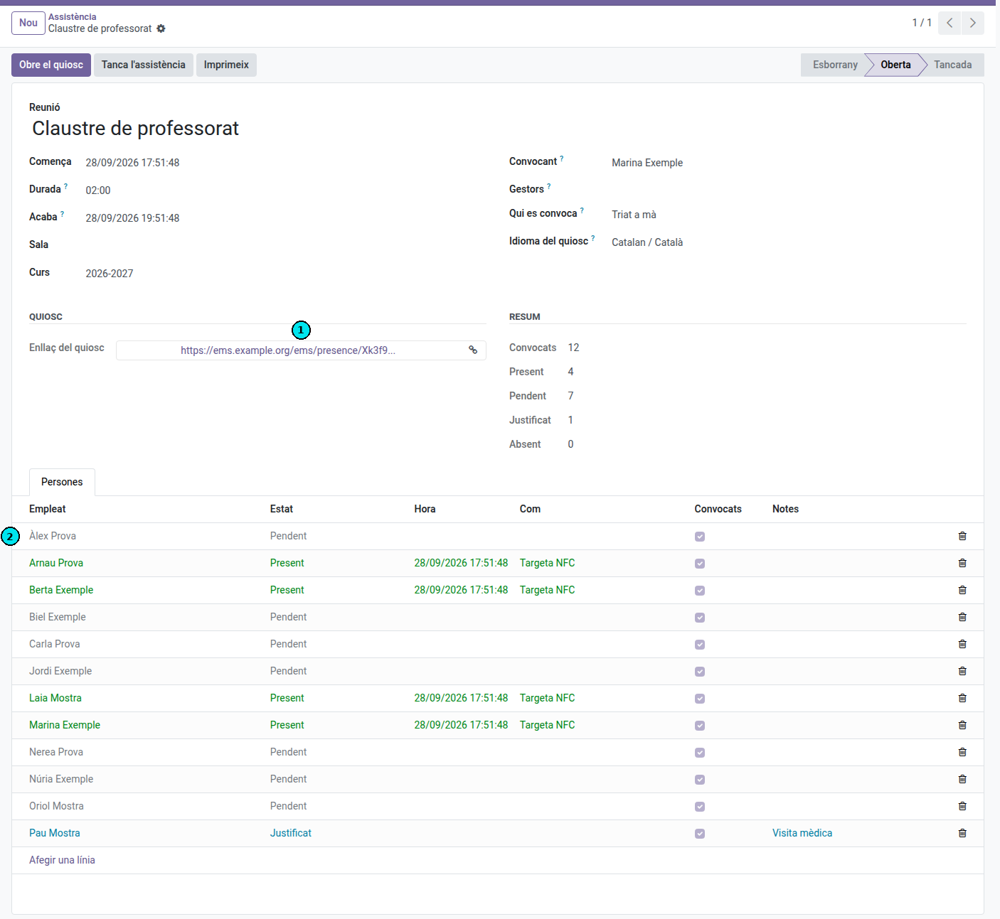
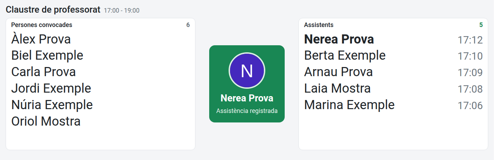
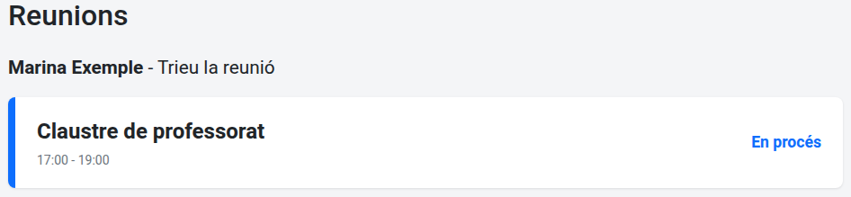
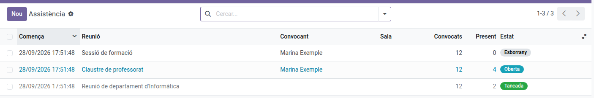

[Català](meeting-attendance.md) | [Castellano](../../es/secretary/meeting-attendance.md) | [English](../../en/secretary/meeting-attendance.md)

---

# Assistència a reunions amb la targeta NFC

Confirma qui assisteix a una reunió (claustre, reunió de departament, formació) amb un lector NFC a l'entrada: cada persona passa la mateixa targeta que fa servir per fitxar.

**Rol necessari:** Secretaria, Cap d'Estudis, Direcció o administració acadèmica.

---

## Preparar la reunió

Navega a **Reunions → Assistència** i fes clic a **Nou**.

1. Escriu el nom de la reunió (1).
2. A **Comença** i **Durada** (2) indica quan comença la reunió i quant dura (per defecte, 2 hores). El camp **Acaba** es calcula sol; també el pots escriure tu i la durada s'ajusta.
3. A **Convocant** (3) apareixes tu. Si crees la reunió en nom d'una altra persona, tria-la. A **Gestors** afegeix, si cal, altres persones que també hagin de poder obrir el quiosc (vegeu «Pàgina de reunions»).
4. A **Qui es convoca** (4) tria **Tot el professorat**, **Tot el personal**, **Un departament**, **Un grup de treball** o **Triat a mà**. Si tries un departament o un grup de treball, selecciona'l.
5. A **Idioma del quiosc** (5) tria l'idioma de la pantalla de l'entrada.
6. Si cal, omple la sala i el curs.
7. Desa. La pestanya **Persones** (6) es carrega amb les persones convocades.

Per afegir algú a la llista, fes clic a **Afegir una línia** i tria'l. Per treure'n, fes clic a la paperera de la seva fila. Si canvies **Qui es convoca** després de desar, fes clic a **Carrega les persones convocades**: només s'hi afegeixen les que falten.

---

## El dia de la reunió

1. Connecta el lector NFC (USB) a l'ordinador de l'entrada.
2. Obre la reunió i fes clic a **Comença l'assistència**.
3. Fes clic a **Obre el quiosc**. S'obre una pestanya nova amb la pantalla de l'entrada.
4. Prem **F11** per posar-la a pantalla completa i deixa-la oberta.
5. Cada persona passa la targeta pel lector.

Per obrir el quiosc en un altre ordinador, copia l'**Enllaç del quiosc** (1) i enganxa'l al navegador: no cal iniciar sessió.

El quiosc només accepta targetes entre les hores **Comença** i **Acaba** de la reunió. Abans mostra «L'assistència encara no ha començat» i després «L'assistència està tancada», sense que calgui recarregar la pantalla: s'activa i es tanca sola. Per allargar la reunió, augmenta la **Durada** o l'hora d'**Acaba**.

Cada lectura mostra el nom de la persona amb un color:

| Color | Missatge | Vol dir |
|-------|----------|---------|
| Verd | Assistència registrada | Convocada i registrada. |
| Blau | Ja registrat | Ja havia passat la targeta. |
| Taronja | Registrat, però no és a la llista de convocats | Registrada, però no estava convocada. |
| Vermell | Targeta desconeguda | La targeta no correspon a cap empleat. |
| Gris | L'assistència encara no ha començat / L'assistència està tancada | Fora de l'horari, no s'accepten targetes. |

La pantalla té tres zones:

- **Esquerra, Persones convocades**: les que encara no s'han registrat.
- **Centre**: el resultat de l'última lectura.
- **Dreta, Assistents**: les que ja s'han registrat, amb l'hora; la darrera persona, al capdamunt.

Els noms s'ajusten sols a l'espai: amb poca gent es veuen grans i amb molta es veuen més petits i en diverses columnes, de manera que no cal desplaçar-se mai. A les llistes els noms surten sense l'últim cognom (per exemple, «Ada Alsina» per a «Ada Alsina Pla»); la targeta del centre en mostra el nom complet. Quan algú passa la targeta, passa de l'esquerra a la dreta. Qui hagi passat la targeta sense estar convocat surt als Assistents amb l'avís «(no convocat)». Les persones marcades com a **Justificat** no surten a cap llista.

Qui tingui l'enllaç del quiosc veu aquests noms: no el comparteixis fora de la reunió.

Si una targeta no es llegeix o algú no la porta, marca'l a mà (vegeu «Marcar una persona a mà»).

Mentre la reunió és oberta, el **Resum** del formulari i la llista **Persones** mostren qui ha passat la targeta (recarrega la pàgina per actualitzar-los).

---

## Pàgina de reunions

Els ordinadors amb lector NFC que serveixen per a diverses reunions poden tenir sempre oberta la pàgina de reunions, que no demana iniciar sessió: `https://ems.elpuig.xeill.net/ems/meetings` (a la vostra instal·lació, l'adreça d'EMS seguida de `/ems/meetings`). Deixa-la com a pàgina d'inici del navegador, a pantalla completa (**F11**).

1. Passa la targeta pel lector. Apareixen les reunions que pots obrir avui.
2. Fes clic a la reunió: s'obre el seu quiosc.
3. Quan acabi, fes clic a **Reunions**, a dalt a la dreta del quiosc, per tornar a la pàgina de reunions.

Surten les reunions en què s'ha fet clic a **Comença l'assistència** i que encara no han acabat, amb l'horari, la sala i si estan **En procés** o **Encara no ha començat**. Si ningú no tria cap reunió, la llista s'esborra al cap de 30 segons.

Cada persona veu les reunions:

- que ha convocat (camp **Convocant**) o de les quals és **Gestor**;
- que han convocat les persones que té per sota: un cap de departament o de seminari, les de la seva gent; el cap d'estudis o l'adjunt, les de tota la seva àrea;
- la directora, totes.

---

## Marcar una persona a mà

A la pestanya **Persones**, canvia la columna **Estat** de la fila:

- **Present**: per a qui assisteix però no porta la targeta.
- **Justificat**: per a qui ha avisat que no assistirà. Escriu el motiu a **Notes**.
- **Pendent**: per desfer una marca errònia.

---

## Tancar la reunió

1. Fes clic a **Tanca l'assistència** i confirma. Qui no ha passat la targeta queda com a **Absent**; les persones **Justificades** es mantenen.
2. Fes clic a **Imprimeix** per obtenir el PDF amb les persones presents (amb l'hora), les justificades i les absents.

Per corregir alguna cosa un cop tancada, fes clic a **Reobrir**.

---

## Llista de reunions

**Reunions → Assistència** mostra les reunions del curs actual, amb el nombre de persones convocades i presents.

---

[← Tornar a l'índex de Secretaria](index.md)
