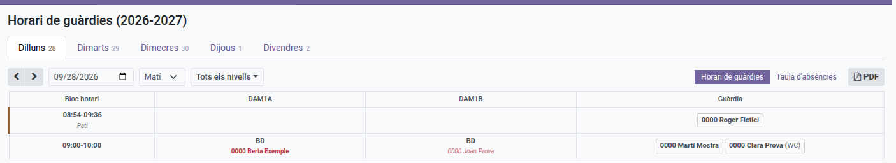
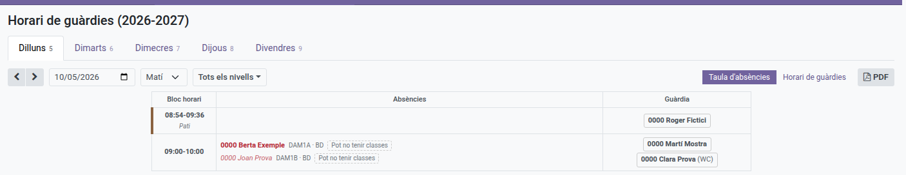

[Català](guard-duty-schedule.md) | [Castellano](../../es/teachers/guard-duty-schedule.md) | [English](../../en/teachers/guard-duty-schedule.md)

---

# Horari de guàrdies

Consulta on és cada docent, i qui està de guàrdia, a cada franja horària de la setmana — no només el teu propi horari.

**Rol necessari:** Docent (només lectura; els horaris els configura un Cap de departament o superior des de l'horari setmanal propi del docent corresponent). Organitzar una absència des de la Taula d'absències correspon al Cap de departament o de seminari del docent absent i als qui són per sobre seu (consulta [Organitzar una absència](#organitzar-una-absencia)).

---

## Accés

Vés a: **Assistència d'empleats → Horari de guàrdies**

El quadre s'obre directament amb el dia i el torn d'ara mateix (matí abans de les 15h, tarda a partir de les 15h) — no sempre dilluns matí — així arribes de seguida a la informació rellevant.

---

## Triar el dia i la setmana

Fes clic a **Dilluns** a **Divendres** a la part superior per canviar de dia. Cada pestanya mostra també el dia del mes que li correspon dins la setmana que tens a la pantalla.

Fes servir les fletxes **‹** i **›** per anar a la setmana anterior o següent, o la casella de data del costat per saltar a qualsevol data — les pestanyes es mouen a la setmana d'aquella data i el quadre s'obre pel seu dia.

El matí i la tarda són torns diferents — fes servir el desplegable per canviar-hi; només se'n mostra un a la vegada.

---

## Les dues vistes

Els dos botons de la dreta de la barra d'eines canvien entre les dues maneres de llegir el mateix dia i torn. L'horari s'obre a la **Taula d'absències**:

- **Taula d'absències** — una fila per franja horària: qui falta i què s'ha de cobrir, davant de qui està de guàrdia per cobrir-ho.
- **Horari de guàrdies** — l'horari, amb tothom qui falta marcat a sobre.

---

## Llegir l'horari

Les columnes de la taula són els grups que tenen classe en aquell torn; cada fila és una franja horària. Una cel·la mostra l'assignatura (amb el seu codi curt, p. ex. "MP 0440"), el o els docents — més d'un si la classe és compartida — i l'aula de la classe d'aquell grup a aquella hora. Una cel·la buida simplement vol dir que no hi ha res programat per a aquell grup en aquell moment.

La columna **Guàrdia**, a la dreta, llista tots els docents de guàrdia en aquella franja horària, cadascun en un requadre de vora fina. Un docent de guàrdia no té cap grup propi en aquell moment (és precisament el sentit de la guàrdia), per això només apareix aquí, mai a la columna d'un grup. Un docent en guàrdia de **WC** en concret mostra l'etiqueta **"(WC)"** just després del seu nom — es destaca perquè, a diferència d'una guàrdia de pati (vegeu més avall), una guàrdia de WC pot caure en qualsevol moment del dia, així que no hi ha cap altra manera de distingir-la d'una guàrdia normal a simple vista.

Una fila la franja horària de la qual coincideix amb el pati d'algun nivell — sense cap classe programada en ella per a ningú — mostra una petita etiqueta **"Pati"** al costat de l'hora, a més d'una vora marró al costat esquerre d'aquella mateixa cel·la, perquè una franja que sembla buida no es llegeixi com un forat a l'horari.

---

## Filtrar per nivell

Al costat del desplegable de torn hi ha un botó de **filtre de nivell** (mostra "All levels" fins que hi marques alguna cosa). Fes-hi clic per obrir una llista amb totes les caselles de cada nivell — ESO, Batxillerat, cada cicle formatiu, etc. — i marca els que necessitis. Per exemple, marca **ESO** i **Batxillerat** alhora per veure només aquesta meitat del centre mentre un company treballa amb els cicles formatius marcats. Deixa-ho tot desmarcat per veure tots els nivells alhora, exactament com abans.

Un cop marques un o més nivells:
- Només les columnes dels grups d'aquell(s) nivell(s) es mostren — la resta de grups desapareixen de la taula.
- La columna **Guàrdia** continua mostrant tots els docents de guàrdia en qualsevol franja visible, sense importar què fan per la resta — el que compta és que estan de guàrdia, no a quin nivell facin classe aquell dia.
- Una guàrdia que coincideix amb el pati del nivell marcat, sense cap classe d'aquell nivell en aquella franja, obté la seva pròpia fila de "Pati" perquè continuï essent visible encara que cap grup d'aquell nivell tingui classe llavors (la mateixa marca de "Pati" descrita més amunt ja cobreix aquest cas també a "All levels").

---

## Llegir la taula d'absències

Cada fila és una franja horària del torn que tens a la pantalla:

- **Absències** — una línia per cada classe que es queda sense docent: qui falta, i el grup, l'assignatura i l'aula que s'han de cobrir.
- **Guàrdia** — els docents de guàrdia en aquella franja, els mateixos que mostra l'horari.

Una franja on no falta ningú té la columna d'absències buida.

En una classe amb codocència (dos docents a la mateixa aula) on només en falta un, la seva línia surt **ratllada**: hi continua perquè sàpigues qui falta, però no cal guàrdia perquè l'altre docent es fa càrrec de la classe. Passa el ratolí per sobre de la línia o fes-hi clic per veure'n el motiu; la icona **ⓘ** de la seva esquerra indica que hi ha una explicació.

Tota línia ratllada té aquesta icona, sigui quin sigui el motiu: un altre docent és a la classe, ja s'hi ha enviat un docent de guàrdia (el seu nom apareix al costat), o s'ha comunicat a les famílies que l'alumnat no ha de venir a aquella classe (consulta [Organitzar una absència](#organitzar-una-absencia)). Si falten tots dos, o cada docent té mig grup en una aula diferent, la línia no surt ratllada i sí que cal cobrir la classe.

---

## Absències

Un docent que falta apareix en vermell allà on surti el seu nom — a la seva pròpia cel·la de l'horari, i a la columna de guàrdia si era qui estava de guàrdia:

- **Vermell i negreta** — l'absència està aprovada.
- **Vermell més suau i cursiva** — l'absència s'ha sol·licitat i encara està pendent d'aprovació.

Les sol·licituds denegades i cancel·lades no es mostren.

Una absència que Prefectura d'Estudis ja coneix però que el docent encara no ha sol·licitat també es mostra com a pendent d'aprovar.

Un docent de guàrdia que falta queda marcat a la columna de guàrdia i no genera cap línia a la columna d'absències: no té cap classe pròpia que ningú hagi de cobrir.

Aquí només es mostra que la persona falta. El tipus d'absència, el motiu i el justificant, no.

---

## Organitzar una absència

Qui ho pot fer: el **Cap de seminari** o el **Cap de departament** del docent absent, i els qui són per sobre seu a la jerarquia (Cap d'estudis o Cap d'estudis adjunt, i Direcció), a més de l'administrador. La resta de docents en veuen el resultat però no el poden canviar, i el docent absent no pot organitzar la seva pròpia absència. És igual si l'absència l'ha sol·licitada el docent o l'ha introduïda Cap d'estudis com a absència prevista: totes dues es gestionen igual. Quan més endavant el docent sol·licita una absència que estava prevista, el que ja s'havia organitzat es manté tal com estava, i només els dies o les hores de més de la sol·licitud apareixen com a línies noves per decidir.

Tot es fa des de la **Taula d'absències**, i res no passa sol: cada pas espera que en premis el botó. Un dia que ja ha passat no es pot canviar.

### Enviar un docent de guàrdia a una classe

1. Fes clic a la línia de la classe que cal cobrir (les línies que pots organitzar mostren el cursor de mà).
2. Tria el **Docent de guàrdia**. Només s'ofereixen els docents de guàrdia en aquella franja, excepte els de guàrdia de WC i els que també estan absents.
3. Opcionalment, escriu un **missatge**: què ha de treballar l'alumnat, on són els materials...
4. Fes clic a **Assignar i avisar**.

El docent de guàrdia rep un missatge d'Odoo (a la safata d'entrada o per correu, segons la seva preferència de notificacions) amb la data, l'hora, el grup, l'assignatura, l'aula, el docent absent i el teu missatge.

Aleshores la classe queda ratllada, hi apareix el nom del docent de guàrdia, i la línia i la casella del docent a la columna Guàrdia comparteixen el mateix color. Quan diversos docents de guàrdia cobreixen classes a la mateixa franja, cadascun té el seu color, de manera que es veu d'un cop d'ull qui cobreix què. Un docent de guàrdia pot cobrir més d'una classe: totes prenen el seu color.

Per canviar el docent de guàrdia, fes clic a la línia i després a **Canviar o treure el docent de guàrdia** (només ho veu qui organitza l'absència), i tria'n un altre: a l'anterior se li comunica que ja no cal. Per enviar un missatge nou al mateix docent, torna'l a triar i fes clic a **Assignar i avisar**. **Treure l'assignació** treu el docent de la classe i l'avisa.

### Entrada tard, sortida abans d'hora o sense classes

Quan les classes sense docent són les primeres del dia del grup (una, dues o més seguides), l'alumnat podria entrar més tard; quan són les últimes, podria sortir abans; quan totes les classes del dia queden sense docent, el grup podria no tenir classes. Una classe on hi ha algú amb l'alumnat (un altre docent que no és absent, l'altra meitat d'un grup desdoblat, una optativa o un docent de guàrdia ja enviat) talla la seqüència.

Aquestes línies mostren una etiqueta discontínua com ara **Pot entrar a les 10:00**, i el quadre **Propostes d'entrada/sortida**, damunt la taula (només el veu qui pot organitzar l'absència), ofereix el canvi d'aquell grup. Enviar el comunicat ratlla aquestes classes de la taula, perquè cap docent de guàrdia les hagi de cobrir.

El selector de cada proposta et permet comunicar a les famílies menys del que permeten les absències: amb dues classes sense docent, pots triar **Entra a les 09:00** en lloc d'**Entra a les 10:00**. Aleshores només es ratlla la primera classe; la segona encara necessita un docent de guàrdia, que envies com sempre. Triar el canvi més curt és decisió teva: res no et demanarà que el rectifiquis.

**Proposar comunicat** obre un comunicat en esborrany adreçat a l'alumnat i les famílies d'aquell grup, amb un text proposat que pots canviar. Envia'l des d'aquell formulari com qualsevol altre comunicat (els grups d'un comunicat de canvi d'horari no es poden canviar). Si el deixes en esborrany, la propera vegada el botó diu **Obrir esborrany**.

Un cop enviat (o programat) el comunicat, aquestes línies queden ratllades amb una etiqueta com ara **Entra a les 10:00**: no cal enviar-hi ningú.

### Quan l'absència canvia després

Si una absència es rebutja, s'anul·la o s'escurça, o resulta que un altre docent sí que hi és, el que s'havia organitzat pot deixar de caldre. Res no es desfà automàticament: els quadres de damunt la taula t'ho indiquen, i tu decideixes.

- **Un docent de guàrdia que ja no cal** (quadre **Guàrdies que ja no calen**): fes clic a **Alliberar la guàrdia**. Se li comunica que ja no cal que cobreixi la classe.
- **Un comunicat que ja no coincideix** (es va comunicar més del que ara permeten les absències): un comunicat ja enviat no es pot desfer, així que el quadre de propostes ofereix **Proposar rectificació**, un nou comunicat en esborrany per al mateix grup amb la situació corregida (una altra hora, o tornar a l'horari habitual).

---

## Exportar a PDF

Fes clic a **PDF** a la barra d'eines per descarregar el dia i el torn que s'estan mostrant (no tota la setmana) com a document imprimible — el filtre de nivell que tinguis marcat s'aplica també al PDF. El PDF imprimeix la vista que tinguis activa a la pantalla: l'horari si està activa **Horari de guàrdies**, o la taula d'absències si està activa **Taula d'absències**.

---

[← Tornar a l'índex principal](index.md)
