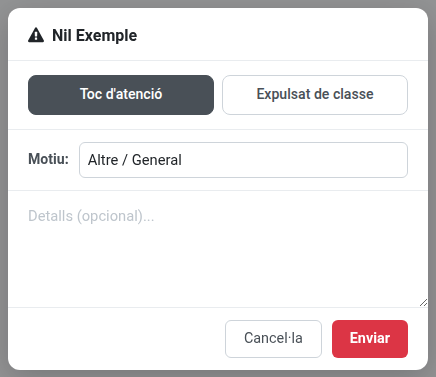
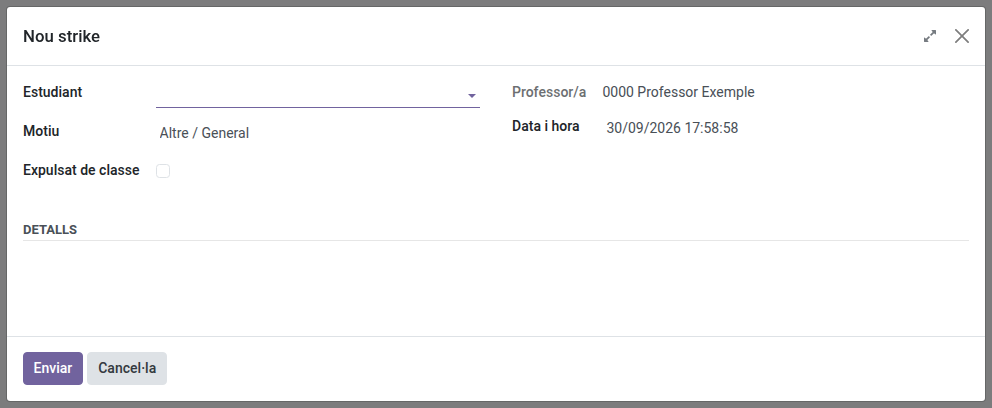

[Català](strike.md) | [Castellano](../../es/teachers/strike.md) | [English](../../en/teachers/strike.md)

---

# Strikes: notificar una incidència disciplinària

De vegades cal deixar constància del comportament d'un alumne durant una sessió, perquè la família, el tutor de grup i, si es repeteix, el coordinador de convivència en tinguin coneixement. Aquesta pàgina explica com posar un strike des de la vista de passar llista, o des de la secció de Convivència quan la incidència passa fora de classe.

**Rol necessari:** Professor

---

## Posar un strike

1. Obre la vista de passar llista (**Assistència → Actual**) i selecciona la sessió amb l'alumne.
2. Al costat de la fila de l'alumne, clica el botó de strike (⚠) — es troba just a l'esquerra del llapis de notes.
3. S'obre un diàleg amb:
   - Un desplegable de **Motiu**, ja establert a una opció genèrica per defecte, perquè puguis enviar-lo sense escriure res.
   - Un camp opcional de **Detalls**, per si vols afegir context.
   - Una casella **Expulsat de classe**, desmarcada per defecte — marca-la si la incidència ha acabat amb l'alumne fora de l'aula.
4. Clica **Enviar**.

Ja està: no cal res més enllà del motiu, ni cap altra confirmació, tret que el strike sembli un duplicat (vegeu més avall).

---

## Posar un strike fora de classe

Si et trobes una incidència fora d'una sessió (al passadís, al pati...), no cal passar llista abans:

1. Ves a **Convivència → Strikes** i clica **Nou strike**.
2. Al diàleg que s'obre, tria l'**Estudiant** (escriu part del nom) i, si cal, canvia el **Motiu**, marca **Expulsat de classe**, ajusta la **Data i hora** (comença amb el moment actual; es pot endarrerir, però mai posar en el futur) i afegeix-hi **Detalls**. El camp **Professor/a** mostra el teu nom i no es pot canviar: el strike el poses sempre tu.
3. Clica **Enviar**. El strike apareix a la llista i s'envien les mateixes notificacions que es descriuen més avall.

També pots començar des de la fitxa del propi alumne: clica el seu botó **Strikes** de la capçalera i després **Nou strike**. Aleshores el diàleg s'obre amb aquell alumne ja escollit, i no es pot canviar.

Si tanques el diàleg o cliques **Cancel·la**, no es desa res i no es notifica ningú.

---

## Avís de possible duplicat

Si fa un moment ja has posat un strike al mateix alumne (dins d'1 minut, per defecte), l'EMS t'avisa abans d'enviar-ne un de nou, i et mostra quan es va posar l'anterior i per quin motiu, perquè no s'enviï el mateix strike dues vegades per error:

- Des del passi de llista, en clicar **Enviar** et demana confirmació. Clica **Enviar** en aquest missatge si és una altra incidència, o **Cancel·lar** per tornar al diàleg del strike, amb tot el que hi havies escrit.
- Al diàleg **Nou strike**, l'avís apareix a dalt de tot tan bon punt tries l'alumne, i **Enviar** també et demana confirmació.

Mentre s'envia un strike, el seu botó **Enviar** queda desactivat, de manera que si el cliques dues vegades només s'envia un cop.

---

## Què passa després

- L'alumne rep una notificació per correu electrònic.
- La família pot ser notificada també, segons la mateixa regla que s'utilitza per als avisos d'assistència (menor d'edat, o major d'edat que ha autoritzat compartir informació amb la família) — si això passa a cada strike o només quan l'alumne ha estat expulsat de classe depèn d'una opció configurada per l'administració.
- El tutor de grup de l'alumne sempre és notificat.
- Tots aquests correus indiquen si l'alumne ha estat expulsat de classe o no, segons la casella que hagis marcat.
- Si l'alumne arriba a un cert nombre de strikes acumulats (configurat per l'administració), el coordinador de convivència de la teva branca també és notificat automàticament.

---

## Consultar els strikes

- **Convivència → Strikes** mostra tots els strikes que has posat.
- A la fitxa del propi alumne, apareix un botó de **Strikes** a la capçalera que mostra el recompte acumulat (0 si encara no en té cap) — clica'l per veure l'historial complet d'aquell alumne i, des d'allà, posar-li'n un de nou amb **Nou strike**.
- Des de **Assistència → Historial**, en obrir una de les teves sessions anteriors ara també es mostra, per cada fila d'alumne, quants strikes es van posar durant aquella sessió concreta, amb un botó per veure'n el detall complet.

> Si també ets tutor/a, Cap d'Estudis, Cap d'Estudis Adjunt/a, Direcció o coordinador/a de convivència, consulta el manual corresponent per saber com pots consultar un conjunt més ampli de strikes.

---

[← Tornar als manuals de Professors](index.md)
