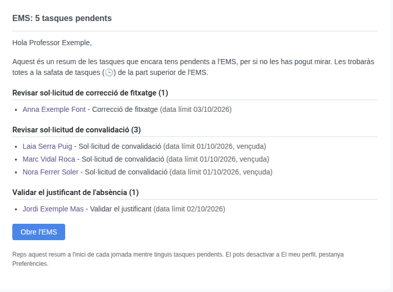
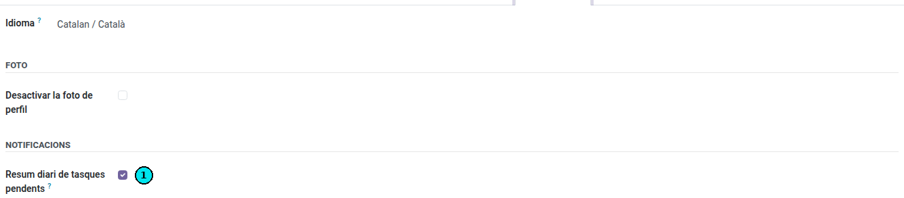

[Català](task-digest.md) | [Castellano](../../es/teachers/task-digest.md) | [English](../../en/teachers/task-digest.md)

---

# Resum diari de tasques pendents

Aquesta guia explica el correu amb el resum de les teves tasques pendents que l'EMS t'envia cada matí i com desactivar-lo.

**Rol necessari:** qualsevol persona del personal amb usuari de l'EMS

---

## Índex

1. [Què és](#què-és)
2. [Quan arriba](#quan-arriba)
3. [Què conté](#què-conté)
4. [Desactivar-lo](#desactivar-lo)

---

## Què és

Moltes gestions de l'EMS t'arriben com una **tasca** a la safata d'activitats (🕒) de la part superior de la pantalla: una sol·licitud de convalidació per revisar, un justificant d'absència per validar, una correcció de fitxatge, etc. Moltes d'aquestes tasques, com les de convalidacions, no envien cap correu en crear-se, per no omplir-te la bústia amb un missatge per cadascuna.

Perquè no se t'escapi res si un dia no has pogut entrar a l'EMS, cada dia laborable reps **un únic correu** amb totes les tasques que tens pendents. No és un avís d'urgència: només et recorda el que hi ha a la teva safata.

---

## Quan arriba

- **A l'inici de la teva jornada**, segons el teu horari. Si no tens horari a l'EMS, s'utilitza el marc horari del centre.
- **Només els dies que treballes:** no arriba el cap de setmana, els dies festius ni els dies que tens una absència aprovada que cobreix tota la jornada.
- **Només si tens alguna tasca pendent.** Si la safata és buida, aquell dia no reps res.
- Com a màxim, un al dia.

---

## Què conté

- Quantes tasques tens pendents, també a l'assumpte.
- Les tasques agrupades per tipus (per exemple, *Revisar sol·licitud de convalidació*), amb el nombre de tasques de cada grup.
- Per a cada tasca: un enllaç que obre directament el registre a l'EMS, la seva descripció i la data límit. Si ja ha vençut, s'indica entre parèntesis.
- Si un tipus té més de 20 tasques, es mostren les 20 més properes a vèncer i quantes en queden.

Per resoldre una tasca, obre-la des de l'enllaç o des de la safata 🕒 de l'EMS. Les tasques que ja has tancat no tornen a sortir l'endemà.

---

## Desactivar-lo

1. Fes clic al teu avatar, a la cantonada superior dreta de l'EMS, i tria **El meu perfil**.
2. Obre la pestanya **Preferències**.
3. A **Notificacions**, desmarca **Resum diari de tasques pendents**.
4. Desa els canvis.

Per tornar-lo a rebre, torna a marcar la mateixa opció.

---

[← Tornar a l'índex](index.md)
