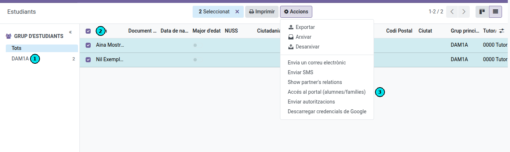
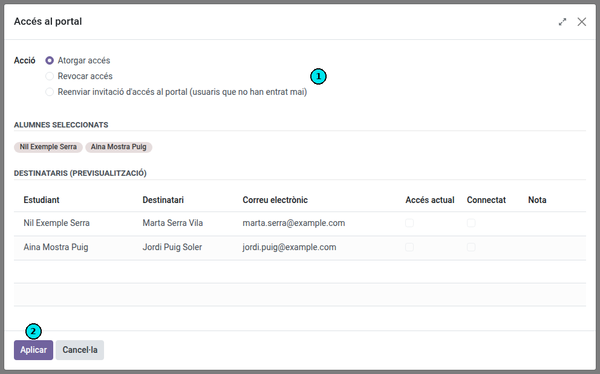

[Català](acces-portal.md) | [Castellano](../../es/tutors/acces-portal.md) | [English](../../en/tutors/acces-portal.md)

---

# Com gestionar l'accés al portal dels alumnes i famílies

Aquesta guia explica com el tutor pot **donar d'alta**, **donar de baixa** o **reenviar** les invitacions d'accés al portal per als seus alumnes i, en el cas dels menors, per a les seves famílies.

El portal és l'espai on alumnes i famílies consulten i confirmen la informació de l'alumne (matrícules, autoritzacions, etc.). Per accedir-hi, cada destinatari rep un correu d'invitació amb un enllaç per establir la contrasenya. Aquest enllaç **caduca al cap d'uns dies**, de manera que si algú no l'utilitza a temps caldrà tornar-li a enviar la invitació.

---

## Índex

1. [Accés](#accés)
2. [Pas 1 — Seleccionar els alumnes](#pas-1--seleccionar-els-alumnes)
3. [Pas 2 — Triar l'acció](#pas-2--triar-lacció)
4. [Les accions disponibles](#les-accions-disponibles)
5. [La previsualització de destinataris](#la-previsualització-de-destinataris)
6. [Qui rep l'accés: alumnes i famílies](#qui-rep-laccés-alumnes-i-famílies)

---

## Accés

**Comunitat Educativa → Estudiants**

---

## Pas 1 — Seleccionar els alumnes

Al panell esquerre **(1)**, selecciona el grup d'estudiants amb el qual vols treballar (per exemple, ESO1E).

A la llista, marca amb la casella de verificació **(2)** els alumnes als quals vols gestionar l'accés al portal. Pots marcar la casella de la capçalera per seleccionar-los tots de cop.

Un cop feta la selecció, obre el menú **Accions** a la barra superior i fes clic a **Accés al portal (alumnes/famílies)** **(3)**.

> **Nota:** també pots obrir aquest quadre de diàleg per a un sol alumne des de la seva pròpia fitxa, amb el mateix menú **Accions** ⚙.

> **Nota:** com a tutor, només veuràs i podràs gestionar els teus alumnes. Encara que seleccionis alumnes d'altres grups, el quadre de diàleg només mostrarà els que et corresponen.

> **Nota:** el quadre de diàleg només gestiona alumnat actual i sol·licitants. Per a un alumne que va ser baixa en un curs anterior, envia-li primer la seva nova matrícula: en enviar-la passa a ser sol·licitant i ja pot rebre l'accés al portal com qualsevol altre.

---

## Pas 2 — Triar l'acció

S'obrirà el quadre de diàleg **Accés al portal**.

1. A l'apartat **Acció** **(1)**, tria què vols fer: **Atorgar accés**, **Revocar accés** o **Reenviar invitació**.
2. Revisa la llista de **Destinataris (previsualització)** per comprovar a qui afectarà l'acció.
3. Fes clic a **Aplicar** **(2)** per executar l'acció.

En acabar, es mostrarà un missatge resum amb el nombre d'accessos atorgats, revocats o invitacions reenviades, i els possibles avisos (per exemple, destinataris sense correu electrònic).

---

## Les accions disponibles

- **Atorgar accés** — Crea l'usuari del portal (si encara no existeix) i envia el correu d'invitació per establir la contrasenya. Els qui ja tenen accés s'ometen.
- **Revocar accés** — Retira l'accés al portal als destinataris que el tenien.
- **Reenviar invitació d'accés al portal (usuaris que no han entrat mai)** — Torna a enviar el correu d'invitació, amb un enllaç nou, **només** als destinataris que tenen l'accés concedit però que **mai s'han connectat** (perquè no van utilitzar la invitació a temps i els ha caducat). En seleccionar aquesta acció, la llista de destinataris es filtra automàticament i només hi queden aquests casos.

---

## La previsualització de destinataris

La taula de **Destinataris (previsualització)** mostra, per a cada alumne, qui rebrà l'acció:

| Columna | Significat |
|---------|------------|
| **Estudiant** | L'alumne seleccionat. |
| **Destinatari** | La persona que rebrà o perdrà l'accés (l'alumne mateix o un familiar). |
| **Correu electrònic** | L'adreça a la qual s'enviarà la invitació. |
| **Accés actual** | Indica si el destinatari **ja té** accés al portal. |
| **Connectat** | Indica si el destinatari **ja s'ha connectat** alguna vegada al portal. |
| **Nota** | Avisos, per exemple si falta el correu electrònic o no s'ha trobat cap familiar. |

> **Consell:** les columnes **Accés actual** i **Connectat** et permeten saber d'un cop d'ull qui té l'accés però encara no l'ha activat (accés ✔, connectat ✘): són justament els candidats a una reinvitació.

---

## Qui rep l'accés: alumnes i famílies

El sistema decideix automàticament els destinataris segons l'edat de l'alumne:

- **Alumne major d'edat** → l'accés s'envia al **mateix alumne** (al seu correu principal). Quan un alumne fa 18 anys, la seva família deixa de veure'l al portal (llevat que l'alumne autoritzi compartir amb la família, i aleshores només per consultar) i l'alumne ho gestiona tot. Si l'alumne encara no tenia compte propi al portal, doneu-li accés amb aquesta mateixa acció.
- **Alumne menor d'edat** → l'accés s'envia als **familiars** associats a l'alumne **i al mateix alumne**. La família gestiona la matrícula, les autoritzacions, les convalidacions i la documentació. El compte de l'alumne només mostra el seu horari, les comunicacions que li adrecen i el seu perfil.
- **Aspirant menor d'edat sense cap familiar registrat** (acabat d'arribar de la preinscripció de GEDAC) → l'accés s'envia a l'aspirant, que gestiona la seva pròpia matrícula perquè encara no hi ha ningú més.

Si a un destinatari li falta el correu electrònic, l'avís apareix a la columna **Nota** i no se li envia res; la resta de destinataris es processen igualment. Si un alumne menor no té cap familiar associat, l'alumne rep igualment el seu accés i la columna **Nota** avisa que no s'ha trobat cap familiar.

L'alumnat pot entrar amb el seu correu principal i la seva contrasenya, o amb el compte del centre (`@elpuig.xeill.net`) mitjançant **Inicia sessió amb Google**. És útil quan un alumne ha perdut la contrasenya del portal: el compte del centre obre el mateix portal.

---

[← Tornar a l'índex de tutors](index.md)
