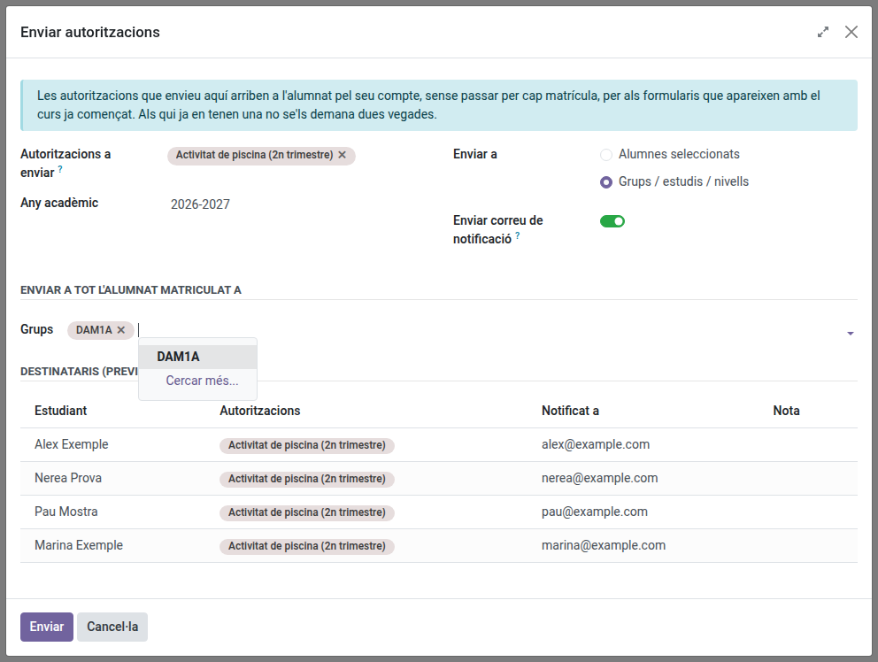

[Català](authorizations.md) | [Castellano](../../es/tutors/authorizations.md) | [English](../../en/tutors/authorizations.md)

---

# Autoritzacions: enviar-les al vostre alumnat i fer-ne el seguiment

Aquesta guia explica com enviar autoritzacions del catàleg del centre al vostre alumnat i com fer el seguiment de les respostes.

---

## Contingut

1. [Enviar autoritzacions](#enviar-autoritzacions)
2. [Què rep la família](#què-rep-la-família)
3. [Seguiment de les respostes](#seguiment-de-les-respostes)
4. [Respondre en nom d'una família](#respondre-en-nom-duna-família)

---

## Enviar autoritzacions

Aneu a **Gestió acadèmica > Autoritzacions > Enviar autoritzacions**.

Ompliu:

- **Autoritzacions a enviar**: un o més formularis del catàleg. Tots van al mateix correu. Els formularis els creen secretaria i la direcció d'estudis; demaneu-los-ho si no hi trobeu el que necessiteu.
- **Any acadèmic**: el curs al qual pertanyen les autoritzacions.
- **Enviar a**:
  - **Alumnes seleccionats**: els alumnes que afegiu a la llista de sota.
  - **Grups / estudis / nivells**: tot l'alumnat matriculat aquest curs als grups que trieu. Només s'ofereixen els vostres grups.
- **Enviar correu de notificació**: deixeu-lo activat per avisar per correu. Desactiveu-lo perquè les autoritzacions apareguin al portal sense enviar cap correu.

**Destinataris (previsualització)** mostra qui rebrà les autoritzacions i a quina adreça. Reviseu la columna **Nota** abans d'enviar:

- *Ja sol·licitada*: l'alumne ja té aquell formulari aquest curs. Se salta.
- *Fora de l'àmbit d'aquestes autoritzacions*: el formulari no s'aplica als estudis d'aquest alumne. Se salta.
- *No és un dels vostres alumnes*: l'alumne no és d'un grup que tutoritzeu. Se salta.
- *No s'ha trobat contacte familiar* o *Destinatari sense correu electrònic*: l'autorització es crea, però no es pot enviar cap correu.

Feu clic a **Enviar**. Un resum indica quantes autoritzacions s'han enviat, quants correus s'han encuat i quants alumnes s'han saltat.

## Què rep la família

Un correu per alumne, amb la llista de totes les autoritzacions enviades en aquell enviament i un enllaç al portal. L'alumnat major d'edat el rep directament; si l'alumne és menor de 18 anys, el reben els contactes familiars.

L'alumne i la família responen des de **Matrícula i autoritzacions** al portal.

## Seguiment de les respostes

Aneu a **Gestió acadèmica > Autoritzacions > Seguiment**. La llista mostra les autoritzacions del vostre alumnat, tant les enviades durant el curs com les de la matrícula.

- Filtreu per **Pendent**, **Acceptat** o **Rebutjat**, i per **Enviada durant el curs** o **D'una matrícula**.
- Agrupeu per autorització, alumne o estat.
- La columna **Document** conté el certificat de resposta. Feu-hi clic per descarregar el PDF.

## Respondre en nom d'una família

Quan una família lliura el formulari signat en paper, obriu l'autorització des de **Seguiment**, indiqueu l'**Estat** i adjunteu el document escanejat al camp **Document**. L'estat no es pot canviar sense adjuntar-lo.

---

[← Tornar a l'índex de tutors](index.md)
