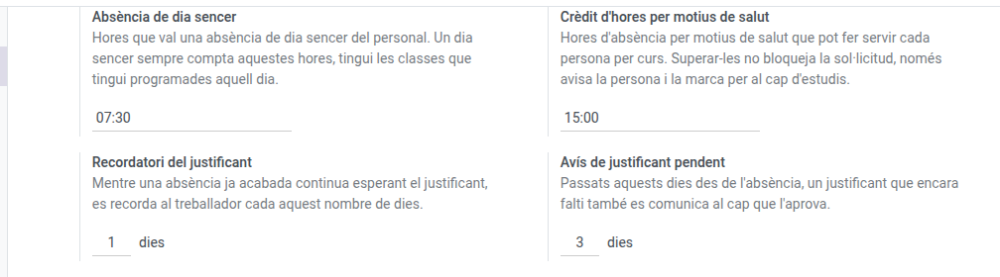

[Català](../../ca/admin/absences.md) | [Castellano](../../es/admin/absences.md) | [English](absences.md)

---

# Configuring staff absences

**Role required:** Administrator

---

## The settings

**Settings > EMS > Staff Absence Settings**:

| Setting | Default | What it does |
|---|---|---|
| Whole-day absence | 7:30 | Hours a whole-day absence is worth. It always counts that much, however many lessons the person had scheduled that day |
| Health absence allowance | 15:00 | Hours of self-declared health absence each person may use per course |
| Supporting document reminder | 1 day | Once an absence is over and still awaiting its supporting document, the employee is reminded every this many days |
| Missing supporting document report | 3 days | This many days after the absence, a document still missing is also reported to the Head who approves it |

The allowance **warns, it does not block**: someone going over it is warned and the request is flagged for the Head of Studies, but it goes through.

---

## The absence type catalogue

**Absences > Configuration > Time Off Types**. There are nine, and each one's name is the full wording of the leave it grants.

Each type carries four flags that decide how new requests come proposed:

| Flag | Ticked on |
|---|---|
| Adds the hours to the monthly report | All but `Sick leave` |
| Consumes the health allowance | `Health` only |
| Whole day by default | `Health` and `Invasive medical test` |
| Filed through ATRI | `ATRI` only |

These are **proposals**: the absence manager can change them request by request. **Filed through ATRI** is the exception: it only decides whether the request form shows the employee the links to the ATRI portal, and it always follows the type.

The native **Supporting Document** flag of each type decides whether its requests wait for a document after the Head receives them. It is ticked on every type except `Health` and `ATRI`. It comes from the module's own data, so a change made here is undone by the next update: ask the EMS team to change it.

---

## Public holidays and closing days

**Absences > Configuration > Public Holidays**. EMS doesn't ship any holiday calendar: every one of them is entered by hand, once per school year:

- The **national** ones (1 November, 6 and 8 December, Christmas, New Year's Day, Epiphany, Good Friday, 1 May...).
- The **Catalan** ones (Easter Monday, Saint John's Day, 11 September, Saint Stephen's Day...).
- The **two local holidays of the centre's town**: those of the town the school is in, not Barcelona's.
- The **days the centre is closed** even though they aren't official holidays: free-disposal days, Christmas and Easter breaks, August... A period of several days can be entered as a single line.

Each holiday applies **to all staff**, whatever their working schedule. Enter its name and its start and end dates (for a whole day, 00:00 to 23:59).

Enter them **before** they come. Every night, EMS records an unjustified absence (a red attendance that counts as negative hours) for anyone who didn't check in the day before, unless nothing was expected of them that day. If a holiday is entered late, saving it deletes the red attendances of those days and their negative hours on its own. The same happens when a whole-day absence is approved late.

---

## Who approves

Not configured here. It comes from the org chart: everyone's approver is **the manager of their top-level department**, set on the department's own form (the *Area Manager* field).

If an area's absences end up with no approver, check that person **has an EMS user account**: the approver has to be a user, not just an employee record.
