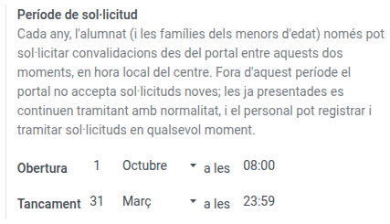

[Català](../../ca/admin/convalidation-settings.md) | [Castellano](../../es/admin/convalidation-settings.md) | [English](convalidation-settings.md)

---

# Convalidations settings

The **request period** sets when students and families can submit new convalidation requests from the portal. It repeats every year, with no year to update: you only change it if the centre changes its dates.

**Required role:** Administrator (Settings)

---

## Access

Navigate to: **Settings → EMS Management → Convalidations Settings**

---

## Setting the request period

1. Under **Opens**, pick the day, the month and the time the period starts.
2. Under **Closes**, pick the day, the month and the time it ends. The closing minute is still inside the period.
3. Save.

By default the period runs from **1 October at 08:00** to **31 March at 23:59**. Times are the centre's local time.

The period can span the new year, as the default one does: if the opening comes later in the calendar than the closing, it runs from the opening until the end of the year, and from 1 January until the closing.

The settings refuse a day that does not exist in its month (29 February is not allowed either, so the period is the same every year), and a period that opens and closes at the same moment.

---

## What the period limits, and what it does not

| Who | During the period | Outside the period |
|-----|-------------------|--------------------|
| Adult students and the families of minors, on the portal | Submit new requests, check theirs, answer the centre, cancel pending ones | Everything except submitting new requests. The portal says when the period will open |
| Head of Studies, secretariat | Everything | Everything: they can register requests received on paper and handle any request at any time |

See [Convalidations](../head_of_studies/convalidations.md) for how requests are handled, and the [families' manual](../families/manual-convalidacions.md) for what students see.

---

[← Back to the index](index.md)
