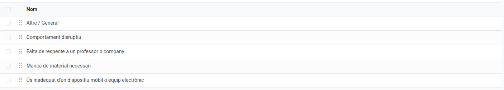

[Català](../../ca/admin/strike.md) | [Castellano](../../es/admin/strike.md) | [English](strike.md)

---

# Strikes: Managing Reasons and Escalation Threshold

**Required role:** Administrator

---

## Managing Strike Reasons

The reasons teachers pick from when issuing a strike are configurable under **Convivencia → Configuration → Strikes → Reasons**.

- Each reason has a **Name** (translatable) and a **Sequence** (drag to reorder — the first active one in the list is the reason preselected in both strike dialogs: roll-call and **New strike**).
- Use the standard **Archive** action (⚙ menu on the form, or select rows in the list and use the same menu) to retire a reason without deleting it — existing strikes keep referencing it correctly. Archived reasons are hidden by default; use **Filters → Archived** in the list to see them again, or to Unarchive one.
- The seeded "Other / General" reason (`ems.strike_reason_other`) is first in the list, so it's the one preselected by default — keep it active and at the top unless you want a different default.

---

## Configuring the Escalation Threshold

Under **Settings → EMS Management → "Strikes Settings"**, set how many accumulated strikes trigger an escalation email to the coexistence coordinator — the coordinator is notified again every time the count reaches a further multiple of this number (e.g. with the default of 3: at 3, 6, 9 strikes...).

---

## Configuring Family Notification

The same "Strikes Settings" block also has a **Family notification** option: **All strikes** notifies the family on every strike (subject to the usual minor/authorization rule), **Kicked out only** notifies them only when the strike also has "Kicked out of class" checked. The student and the group tutor are always notified either way. New installations start on **Kicked out only**; an installation upgrading from an earlier version keeps **All strikes**.

---

## Configuring the Possible Duplicate Warning

The same "Strikes Settings" block also has a **Possible duplicate warning** option: if a teacher already issued a strike to the same student within this many minutes (1 by default), from the same roll-call session or from the **New strike** dialog,, they are warned and asked to confirm before a new one is sent. Set it to 0 to turn the warning off.

---

## Assigning the Coexistence Role

Coexistence coordinators are assigned like any other role, under **Community → Configuration → Teachers → Roles**, by adding an employee to the "Coexistence coordinator" role. Unlike most coordination roles, this one is not limited to a single person — assign one per Head of Studies / Deputy Head of Studies branch as needed, since escalation emails are routed to whichever coordinator shares the issuing teacher's branch. See the [Teacher Roles and Permission Levels](teacher-roles.md) manual for the general role-assignment workflow.

---

[← Back to Admin manuals](index.md)
