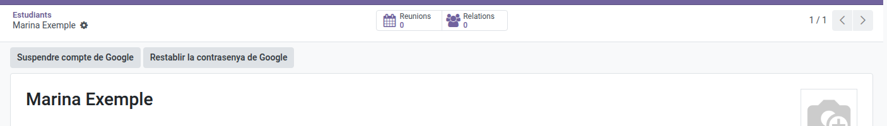

[Català](../../ca/admin/student-google-account.md) | [Castellano](../../es/admin/student-google-account.md) | [English](student-google-account.md)

---

# Managing a Student's Google Account

From the student's form you can create their Google Workspace account, suspend it or give it a new password.

**Required role:** Administrator or TAC coordinator. The secretary's office can also create and suspend accounts.

All the buttons are in the header of the student's form (**Educational Community → Students**). Each button only shows when its action is possible.

---

## Creating the account

1. Check that the form has the first name, last names, IDALU and personal email.
2. Click **Create Google account**.

The account is created in the organizational unit for minors or adults, depending on the student's age. A **Google Workspace credentials** PDF appears in the **Documentation** tab, and if the student has a personal email, they also receive the credentials by email.

Accounts can be created by administration, TAC coordination, the secretary's office and the student's own tutor (plus the chiefs above that tutor: Seminar Chief, Department Chief, Head of Studies and Director).

---

## Suspending the account

1. Click **Suspend Google account**.

The student can no longer sign in, and the account moves to the organizational unit for leavers. Unless it is reactivated, it is deleted for good after 30 days.

---

## Resetting the password

1. Click **Reset Google password**.
2. Confirm the message.

The previous password stops working straight away, and the student must change the new one the first time they sign in. A new **Google Workspace credentials** PDF appears in the **Documentation** tab and the previous one becomes **Cancelled**. If the student has a personal email, they also receive the credentials by email.

Passwords can be reset by administration, TAC coordination and the student's own tutor (plus the chiefs above that tutor: Seminar Chief, Department Chief, Head of Studies and Director).

---

## Downloading the credentials

Click the file name in the **Documentation** tab. To download the credentials of several students at once, tick them in the **Students** list and use **Actions → Download Google credentials**.

The form's chatter records who performed each action.

---

[← Back to Administrator index](index.md)
