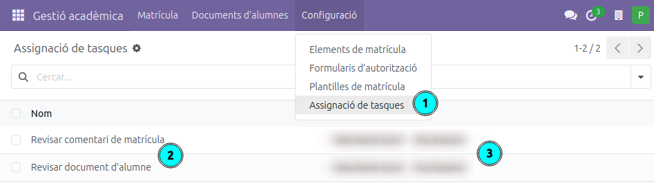

[Català](../../ca/admin/task-assignment.md) | [Castellano](../../es/admin/task-assignment.md) | [English](task-assignment.md)

---

# Task Assignment: Who Handles the Tasks EMS Creates

**Required role:** Administrator, or Secretary's Office Administrator

---

## What This Screen Is For

When a student or a family does something from the portal that needs staff attention, EMS creates a **task** for the people in charge, which appears in their clock icon (🕒) at the top right of the screen:

- **Review student document** — a student uploads their ID, medical card, IBAN or a benefit certificate and someone has to validate it.
- **Review enrollment comment** — a family writes a comment on their enrollment.

**Academic Management → Configuration → Task Assignment** is where you decide **who receives each of those tasks**.

The screen is open to the **Secretary's Office Administrator** as well as to the Administrator: the office runs these tasks, so it also decides who handles them, without having to ask an administrator. Within it, they can only change EMS's own task types — no other part of the system.

---

## The Key Idea: Tasks Are Not Permissions

This list is completely separate from roles and permissions:

- Being on the list **grants no access rights**. It only means "this task lands in your inbox".
- Having the Administrator role **does not put you on the list**. You get tasks only if someone adds you here.

This is deliberate. Before, tasks were sent to everyone in the Secretary's Office group — and because an administrator inherits that group, **every administrator received a task for every document any student uploaded**, whether they had anything to do with it or not. Separating the two lists fixes it: permissions say *what you may do*, this screen says *what you are asked to do*.

---

## Changing Who Handles a Task

1. **The menu** — Go to **Academic Management → Configuration → Task Assignment**.
2. **The task list** — One line per task type EMS creates on its own: *Review enrollment comment* and *Review student document*. Lines cannot be added or deleted: these are the tasks the system generates, not a free-form list.
3. **The assigned users** — The people who receive that task. Click the cell to add or remove users, then save. Only internal staff can be added (portal users — students and families — cannot).

The change applies to **new tasks only**. Tasks already sitting in someone's inbox stay there until they are dealt with or closed by hand.

> **Removing yourself as an administrator:** if you appear on these lists and you don't want to keep receiving these tasks, simply remove yourself here. You lose nothing else — your permissions are unaffected.

---

## Careful: An Empty List Means Nobody Is Told

If a task type has **no one assigned**, EMS creates no task at all: the line is shown **in red** and the form displays a warning.

Nothing is lost — pending documents can still be found in **Academic Management → Student Documents** — but nobody gets the proactive notice, and a document can sit there unnoticed. **Always leave at least one person on each task type.**

---

## About Emails

Whoever handles a task receives it **as a task, not as an email**. The clock icon is the notice: this is on purpose, so that the office isn't flooded with a mail every time a colleague approves a document.

The **student** does receive an email when their document is approved or rejected — they are the one who needs to hear back.

---

[← Back to Admin manuals](index.md)
