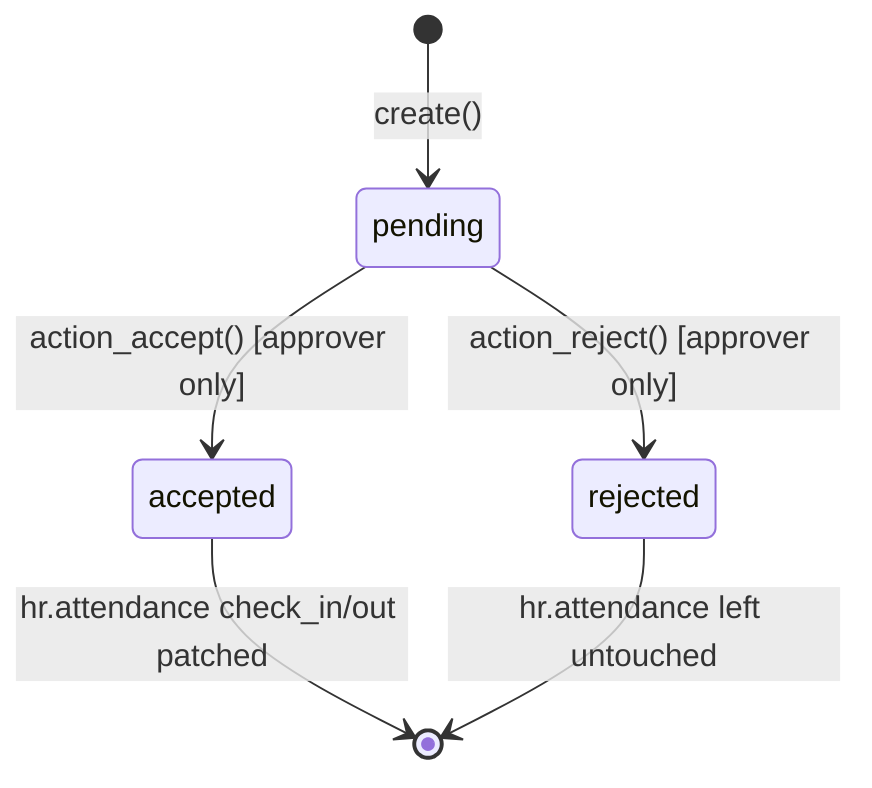
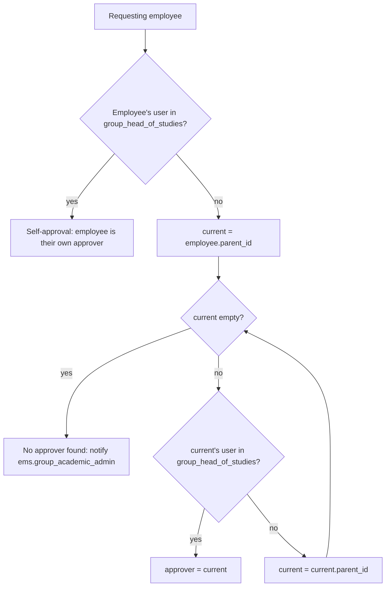

# Technical Reference: `ems.attendance_correction`

## Overview

`ems.attendance_correction` lets an employee request a correction of the check-in and/or check-out time on one of their own `hr.attendance` records (the native Odoo employee attendance model). The request is routed automatically to the nearest ancestor in the employee's manager chain who holds the Head of Studies (or Deputy Head of Studies) security group, and stays `pending` until that approver accepts (patching the attendance) or rejects it (leaving the attendance untouched). The requester is notified either way.

**Module file:** `models/attendance/attendance_correction.py`

---

## Data Model

### Fields

| Field | Type | Required | Stored | Description |
|-------|------|----------|--------|-------------|
| `attendance_id` | `Many2one → hr.attendance` | Yes | Yes | The attendance record being corrected |
| `employee_id` | `Many2one → hr.employee` (related) | — | Yes | From `attendance_id.employee_id` |
| `original_check_in` | `Datetime` (related) | — | No | From `attendance_id.check_in` |
| `original_check_out` | `Datetime` (related) | — | No | From `attendance_id.check_out` |
| `requested_check_in` | `Datetime` | No | Yes | Desired new check-in (optional) |
| `requested_check_out` | `Datetime` | No | Yes | Desired new check-out (optional) |
| `reason` | `Text` | Yes | Yes | Why the correction is needed |
| `state` | `Selection` | Yes | Yes | `pending` / `accepted` / `rejected` |
| `approver_id` | `Many2one → res.users` | No | Yes | Stamped on decision |
| `decision_date` | `Datetime` | No | Yes | Stamped on decision |
| `decision_note` | `Text` | No | Yes | Optional note left by the approver |

At least one of `requested_check_in` / `requested_check_out` is enforced both at the Python level (`@api.constrains`) and at the DB level (`_sql_constraints`).

### State Machine

### Approver Resolution

There is no per-teacher "reports to a specific Head of Studies" field in EMS: `role_hos` and `role_dhos` are both mapped to the same global `ems.group_head_of_studies` security group (see `data/main/ems.role_group_relationship.xml`). The approver is instead resolved by walking the native `hr.employee.parent_id` (manager) chain, implemented as `hr.employee.find_head_of_studies()`:

Since `group_head_of_studies` implies `group_tutor` which implies `group_teacher`, any Head of Studies/Deputy/Director/Academic Admin can also see and decide on **any** pending request (the group is global, not scoped per branch) — this is a known limitation of the v1 prototype, consistent with how `hr_attendance.group_hr_attendance_manager` already grants full attendance access today.

---

## CRUD Operations

### Create

A teacher opens one of their own `hr.attendance` records and clicks **Request Correction** in the header, which opens `ems.attendance_correction` in a dialog with `attendance_id` pre-filled. On `create()`, the resolved approver(s) get a `mail.activity` to-do (activity type `ems.mail_activity_attendance_correction`) and the record's chatter logs the request.

### Read

Teachers see their own requests (`views/attendance/attendance_correction/list.xml`); Head of Studies/Director/Academic Admin see all pending and historic requests, under the native "Attendances" menu.

### Update / Decide

Only the resolved approver (or an Academic Admin) may call `action_accept()` / `action_reject()`:
- `action_accept()`: writes `requested_check_in`/`requested_check_out` (whichever were set) onto `attendance_id`, marks the activity done, stamps `approver_id`/`decision_date`, notifies the requester.
- `action_reject()`: leaves `attendance_id` untouched, same stamping/notification.

### Delete

Only Academic Admin can delete correction requests (audit trail is otherwise kept).

---

## Access Control

| Role | Create | Read | Write | Delete | Group XML ID |
|------|:------:|:----:|:-----:|:------:|--------------|
| Administrator | ✓ | ✓ | ✓ | ✓ | `ems.group_academic_admin` |
| Head of Studies / Deputy / Director | — | ✓ | ✓ | — | `ems.group_head_of_studies` |
| Teacher | ✓ | ✓ | — | — | `ems.group_teacher` |

Record rules (`security/rules/attendance.xml`): Admin unrestricted; Head of Studies unrestricted (global group, see limitation above); Teacher restricted to `employee_id.user_id = user.id`.

---

## Integration Map

| Model | Field | Relation | Description |
|-------|-------|----------|--------------|
| `hr.attendance` | `attendance_id` | Many2one (required) | The attendance record being corrected; header button added via inherited view |
| `hr.employee` | `find_head_of_studies()` | method | Resolves the approver by walking `parent_id` |
| `mail.activity.type` | `ems.mail_activity_attendance_correction` | data record | Dedicated activity type for the approval to-do |

---

## Views

| View | File | Notes |
|------|------|-------|
| List | `views/attendance/attendance_correction/list.xml` | Employee, attendance, requested times, state |
| Form | `views/attendance/attendance_correction/form.xml` | Statusbar + Accept/Reject buttons (visible to the resolved approver only) |
| Menu | `views/attendance/attendance_correction/menu.xml` | Under the native "Attendances" root menu, sibling to Overview/Management |
| `hr.attendance` header button | `views/attendance/attendance_correction/hr_attendance_form.xml` | Inherits `hr_attendance.hr_attendance_view_form`, adds "Request Correction" to `//header` |

---

## Data Files

| File | Purpose |
|------|---------|
| `data/main/ems.mail_activity_type.xml` | Adds the `mail_activity_attendance_correction` activity type |

---

## Follow-ups (out of scope for v1)

- Browser tour test (`static/tests/tours/attendance_correction_tour.js`) — deferred.
- Per-department scoping of Head of Studies visibility, if the flat/global model becomes a real problem in practice.
- Email notification of the decision (currently in-app only: chatter + activity).
