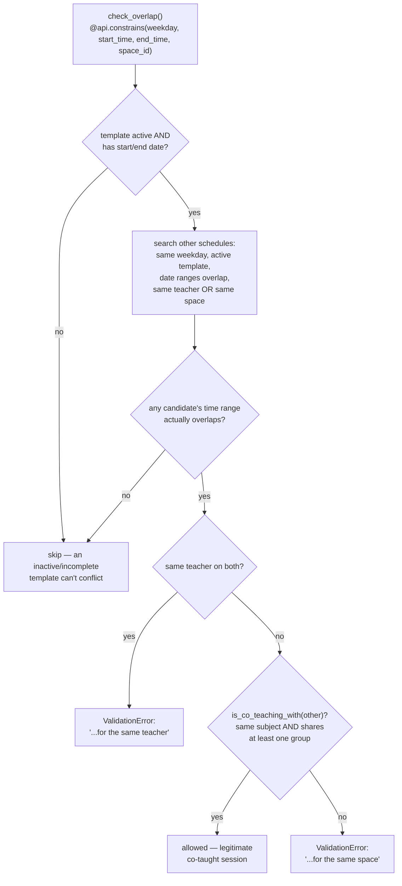

# Technical Reference: `ems.attendance_schedule`

## Overview

`ems.attendance_schedule` is a single weekly slot (weekday + start/end time + room) owned by
an [`ems.attendance_template`](attendance_template.md). A template groups everything about
"who teaches what, to whom, where" into one record; its `attendance_schedule_ids` are the
actual concrete weekday/time entries that make up that weekly timetable — e.g. a template
for "Maths, group A" might have two schedule rows: Monday 9:00–10:00 and Wednesday
9:00–10:00, both in the same room.

**This doc covers the model's own fields/logic.** The pipeline that creates, archives and
rewrites these rows from a teacher's live-edited or imported timetable
(`sync_from_schedule`/`sync_from_schedule_batch`) is documented in
[`attendance_template.md`](attendance_template.md) — not repeated here.

**Module file:** `models/attendance/attendance_schedule.py` (`EmsAttendanceSchedule`)

---

## Fields

| Field | Type | Notes |
|-------|------|-------|
| `weekday` | `Selection` ("0"=Monday…"6"=Sunday) | **Do not renumber** — matches Python's `date.weekday()` values exactly, several computes rely on this. |
| `name` | computed + stored | `"{template} \| {weekday} \| {time_range}"`, purely for the session form's dropdown sort order (SQL sort on a non-stored field wouldn't work). |
| `start_time`/`end_time` | `Float` | Hours as a decimal (e.g. `9.5` = 9:30). |
| `start_date`/`end_date` | `Datetime`, computed + stored | The template's own `start_date`/`end_date` (a plain date) combined with this schedule's `start_time`/`end_time`, converted local→UTC via `ems.datetime_utils` — stored as full datetimes because timezone-correct comparisons need a real date, not a bare time-of-day float. |
| `time_range` | `Char`, computed + stored | `"HH:MM - HH:MM"`, derived from `start_date`/`end_date` converted back to local time. |
| `teacher_ids` | `Many2many`, `related='attendance_template_id.teacher_ids'` | Read-only mirror, used **only** for `ir.rule` permission filtering (`security/rules/attendance.xml`) — not for any business logic in this file. |
| `has_sessions` | `Boolean`, computed | `True` once this line has a real `attendance_session_ids` entry — locks `weekday`/`space_id`/`start_time`/`end_time` (readonly in the form) and gates the per-row "Edit" button (labeled "New version" until 2026-08-05 — same underlying `action_new_version()`, relabeled for clarity). `attendance_session_ids` is `copy=False`. |

---

## Locking and `action_new_version()`

Once a line has real attendance history (`has_sessions`), its own logistics fields —
`weekday`, `space_id`, `start_time`, `end_time` — become readonly: changing where/when a
class actually happened after real roll-calls were taken against it would misrepresent that
history (`ems.attendance_session_header`'s own `space_id`/`weekday`/etc. are `related`+`store=True`
mirrors of these, see [`attendance_session.md`](attendance_session.md)).

`action_new_version()` archives this **one line** and clones it under the same template — the
template itself and every other line are left untouched, unlike the template-level
`action_new_version()` (see [`attendance_template.md`](attendance_template.md)), which
archives/clones the whole template. Same archive-before-copy ordering rule applies here for
the same reason: copying while the original line is still active would momentarily have two
identical, active lines sharing the same room/day/time/teacher, which `check_overlap` (below)
correctly rejects as a double-booking.

Both models' `action_new_version()` are thin wrappers over `ems.attendance_mixin`'s shared
`_write_or_new_version(vals)` (`models/shared/attendance_mixin.py`) - called here with `vals={}`,
since this button only exists to unlock the line for a subsequent manual edit. The schedule-sync
pipeline (`ems.attendance_template._archive_stale_schedule_sync`/`_write_schedule_sync`, see that
model's "CRUD flow") shares the exact same `has_sessions` predicate for its own per-line
decisions when resyncing a persisting template - a matched line whose room changed is updated in
place if it has no sessions, or archived-and-replaced if it does, exactly like this button would.

---

## Archiving never cascades to sessions, in either direction (settled 2026-08-06)

A same-day attempt added an `action_archive()` override here that cascaded to
`attendance_session_ids` - reverted the same day on developer feedback: a schedule line can be
archived for reasons that have nothing to do with a session's own relevance. Concretely, once a
line `has_sessions`, its logistics fields (`weekday`/`space_id`/`start_time`/`end_time`) are
readonly - so a routine correction (fixing a room, say) doesn't edit the line at all, it
**silently** archives the old one and creates a new version via `action_new_version()`/
`_write_or_new_version()` above, entirely as a side effect of what the admin experiences as a
normal in-place edit. If that archive cascaded to sessions, every such routine correction would
make the line's whole attendance history disappear from a teacher's default view - exactly the
opposite of the intent (the sessions are still perfectly valid, current-course history; only the
room/time bookkeeping changed). `ems.attendance_session_header` ([`attendance_session.md`](attendance_session.md))
carries its own `active` (via the `ems.base` mixin, not something this model needs to populate)
but nothing in this codebase ever flips it automatically as a side effect of the schedule/template
that originally scheduled it being archived - `test_action_archive_does_not_cascade_to_sessions`/
`test_action_archive_on_template_does_not_cascade_to_sessions`
(`tests/test_attendance_template.py`) pin this down going forward. Sessions are never `unlink()`'d
either (see `unlink()` below) - they're an independent historical record, managed on their own
terms, not a dependent of either model. See
[`plans/course_transition_teacher_schedule_archival.md`](../../../../plans/course_transition_teacher_schedule_archival.md)
for the still-open question of how a teacher's session views should end up showing only the
current course's sessions, if that's still wanted - not via this cascade.

---

## `check_overlap`: double-booking guard with a co-teaching exception

The co-teaching exception exists because a single class session can genuinely have more
than one teacher assigned (support/co-teaching), each represented by their own
`ems.attendance_template` (since a template's `teacher_ids` is itself a set, but two
*separate* templates — one per teacher pairing — is how co-teaching is modeled here) — both
templates' schedules legitimately share the same room/time/subject/group without being a
real double-booking. `is_co_teaching_with()` is the shared predicate for this — also reused
by `ems.attendance_template.find_external_conflicts()` (see
[`attendance_template.md`](attendance_template.md)) against a not-yet-created entry dict,
since one side isn't a real record yet there.

## `find_schedule_lines_for_teaching`: reverse lookup from a calendar block to a schedule line

`ems.attendance_mixin.find_schedule_lines_for_teaching(teacher, subject, groups, weekday,
start_time, end_time)` (`models/shared/attendance_mixin.py`) — given a teacher + subject + a set
of groups + weekday + start/end time, returns every currently active line for that exact teaching
slot: subject match, ANY group overlap (not exact set equality — mirrors the same "same teaching
assignment" convention `ems.working_schedules_import_wizard._classify_conflict_kind` already
uses), and weekday/time overlap. **Deliberately NOT scoped by room** (renamed from
`find_schedule_lines_for_slot` and reworked 2026-08-10, after a real bug: the original version
also matched on room, and a real teacher's calendar block had drifted to a different room than
the schedule line's own — "el aula no es normal que cambie, [pero] no deberíamos usarla para las
búsquedas", since a teacher can freely change the room while taking attendance for an unplanned
reason (e.g. an unscheduled workshop) — matching on it silently broke this exact lookup the moment
that drift happened, leaving 4 real session headers stranded active in this dev DB despite their
own template/schedule already being correctly archived). If more than one line matches (e.g. a
stale leftover left behind by an earlier edit, alongside a newer one), every match is returned —
the caller decides what to do with each, not this lookup.

Called on the model itself, not a specific record — there is no natural `self` for a lookup like
this: `self.env['ems.attendance_schedule'].find_schedule_lines_for_teaching(...)`.

**Why it exists:** `resource.calendar.attendance` (a teacher's weekly calendar block) and
`ems.attendance_schedule` (the recurring class-session line) have no direct FK between them — the
link has always been purely inferred by matching (subject, group, weekday, time). The
course-transition archival cascade (`course_transition_wizard._apply_calendar_archival()`, see
[`course_transition_wizard.md`](../settings/course_transition_wizard.md)) needs exactly this
reverse lookup: given a calendar block being archived at transition, find which schedule line(s)
it backs, so the wizard can decide whether to archive that line (and its sessions) outright or
just drop this one teacher from a shared co-taught line.

**A genuinely bigger structural fix for this same inferred-link problem — replacing it with a real
FK from `resource.calendar.attendance` straight to `ems.attendance_schedule` — was proposed by the
developer the same day and written up in `plans/calendar_driven_attendance_templates.md` rather
than attempted immediately: it also reshuffles where `student_ids` lives and who's allowed to
create/archive a template directly, a bigger redesign than this fix's own scope.**

## `unlink()`: history guard

A schedule that already has `attendance_session_ids` (a real roll-call was taken against it)
cannot be deleted — the error message directs the user to archive the whole template
instead. This mirrors `ems.attendance_template`'s own archive-not-delete discipline (see
that doc's "History preservation" note) at the schedule-row level.

## Views

`views/attendance/attendance_schedule/form.xml` — embedded as a one2many tab on the
template's own form; no standalone list/menu of its own (schedules are always created and
edited in the context of their template).

## Fixed in this pass (2026-07-28)

Class renamed `ems_attendance_schedule` → `EmsAttendanceSchedule` (has its own `_name`, not
an `_inherit`-only extension). Whole file was tab-indented — normalized to spaces. Loop
variable `rec` → `schedule` throughout. `attendance_session.py` imported this class directly
by its old name (to reuse `weekdays_selection` on `ems.attendance_session_header.weekday`) —
updated to the new name. New `TestAttendanceScheduleLogic` test class (10 tests: computed
fields, `check_overlap`'s same-teacher/same-space/co-teaching/different-weekday branches,
the `unlink()` guard) — the existing `TestAttendanceScheduleAccess` class only covered the
`ir.rule` fix from an earlier session, not this model's own logic. No bugs found; no O work
needed (`_order`/constraints already correct).

## Changed in this pass (2026-08-05)

`action_new_version()` refactored to call the new shared `ems.attendance_mixin._write_or_
new_version()` instead of inlining its own archive+copy - see "Locking and `action_new_version()`"
above.
