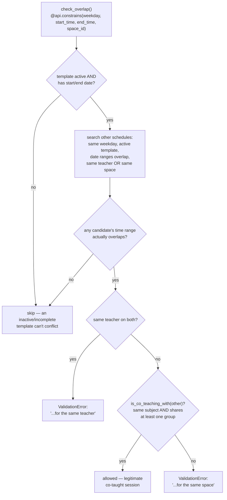

# Technical Reference: `ems.attendance_schedule`

## Overview

`ems.attendance_schedule` is a single weekly slot (weekday + start/end time + room) owned by
an [`ems.attendance_template`](attendance_template.md). A template groups everything about
"who teaches what, to whom, where" into one record; its `attendance_schedule_ids` are the
actual concrete weekday/time entries that make up that weekly timetable — e.g. a template
for "Maths, group A" might have two schedule rows: Monday 9:00–10:00 and Wednesday
9:00–10:00, both in the same room.

**This doc covers the model's own fields/logic.** The pipeline that creates, archives and
rewrites these rows from a teacher's live-edited or imported timetable
(`sync_from_schedule`/`sync_from_schedule_batch`) is documented in
[`attendance_template.md`](attendance_template.md) — not repeated here.

**Module file:** `models/attendance/attendance_schedule.py` (`EmsAttendanceSchedule`)

---

## Fields

| Field | Type | Notes |
|-------|------|-------|
| `weekday` | `Selection` ("0"=Monday…"6"=Sunday) | **Do not renumber** — matches Python's `date.weekday()` values exactly, several computes rely on this. |
| `name` | computed + stored | `"{template} \| {weekday} \| {time_range}"`, purely for the session form's dropdown sort order (SQL sort on a non-stored field wouldn't work). |
| `start_time`/`end_time` | `Float` | Hours as a decimal (e.g. `9.5` = 9:30). |
| `start_date`/`end_date` | `Datetime`, computed + stored | The template's own `start_date`/`end_date` (a plain date) combined with this schedule's `start_time`/`end_time`, converted local→UTC via `ems.datetime_utils` — stored as full datetimes because timezone-correct comparisons need a real date, not a bare time-of-day float. |
| `time_range` | `Char`, computed + stored | `"HH:MM - HH:MM"`, derived from `start_date`/`end_date` converted back to local time. |
| `teacher_ids` | `Many2many`, `related='attendance_template_id.teacher_ids'` | Read-only mirror, used **only** for `ir.rule` permission filtering (`security/rules/attendance.xml`) — not for any business logic in this file. |

---

## `check_overlap`: double-booking guard with a co-teaching exception

The co-teaching exception exists because a single class session can genuinely have more
than one teacher assigned (support/co-teaching), each represented by their own
`ems.attendance_template` (since a template's `teacher_ids` is itself a set, but two
*separate* templates — one per teacher pairing — is how co-teaching is modeled here) — both
templates' schedules legitimately share the same room/time/subject/group without being a
real double-booking. `is_co_teaching_with()` is the shared predicate for this — also reused
by `ems.attendance_template.find_external_conflicts()` (see
[`attendance_template.md`](attendance_template.md)) against a not-yet-created entry dict,
since one side isn't a real record yet there.

## `unlink()`: history guard

A schedule that already has `attendance_session_ids` (a real roll-call was taken against it)
cannot be deleted — the error message directs the user to archive the whole template
instead. This mirrors `ems.attendance_template`'s own archive-not-delete discipline (see
that doc's "History preservation" note) at the schedule-row level.

## Views

`views/attendance/attendance_schedule/form.xml` — embedded as a one2many tab on the
template's own form; no standalone list/menu of its own (schedules are always created and
edited in the context of their template).

## Fixed in this pass (2026-07-28)

Class renamed `ems_attendance_schedule` → `EmsAttendanceSchedule` (has its own `_name`, not
an `_inherit`-only extension). Whole file was tab-indented — normalized to spaces. Loop
variable `rec` → `schedule` throughout. `attendance_session.py` imported this class directly
by its old name (to reuse `weekdays_selection` on `ems.attendance_session_header.weekday`) —
updated to the new name. New `TestAttendanceScheduleLogic` test class (10 tests: computed
fields, `check_overlap`'s same-teacher/same-space/co-teaching/different-weekday branches,
the `unlink()` guard) — the existing `TestAttendanceScheduleAccess` class only covered the
`ir.rule` fix from an earlier session, not this model's own logic. No bugs found; no O work
needed (`_order`/constraints already correct).
