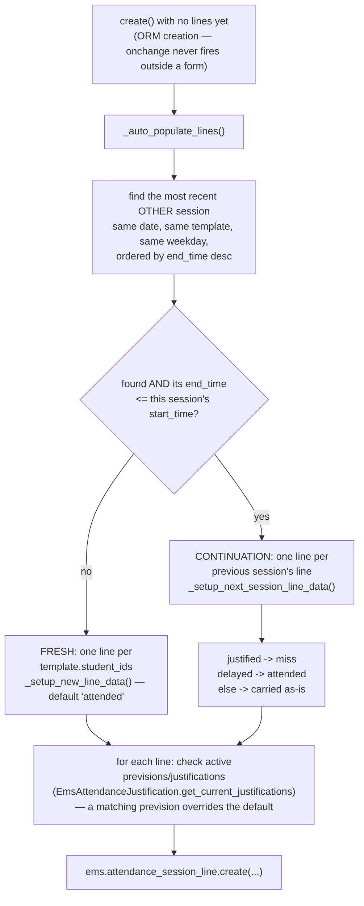
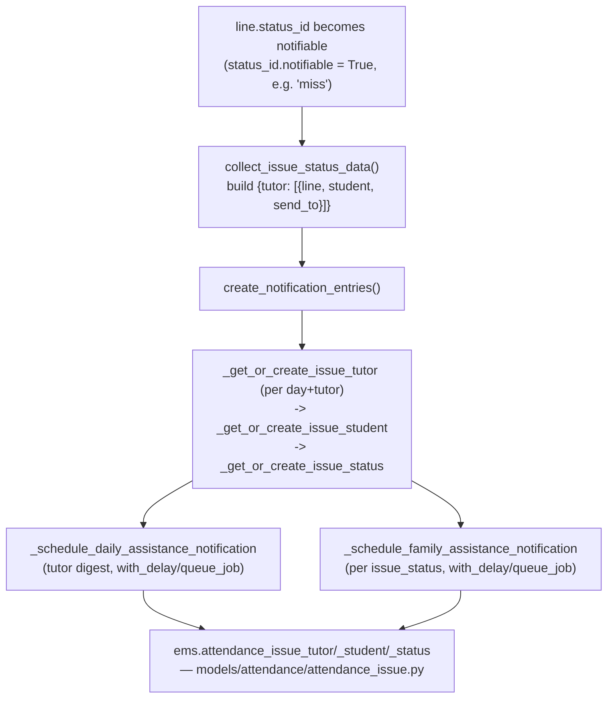
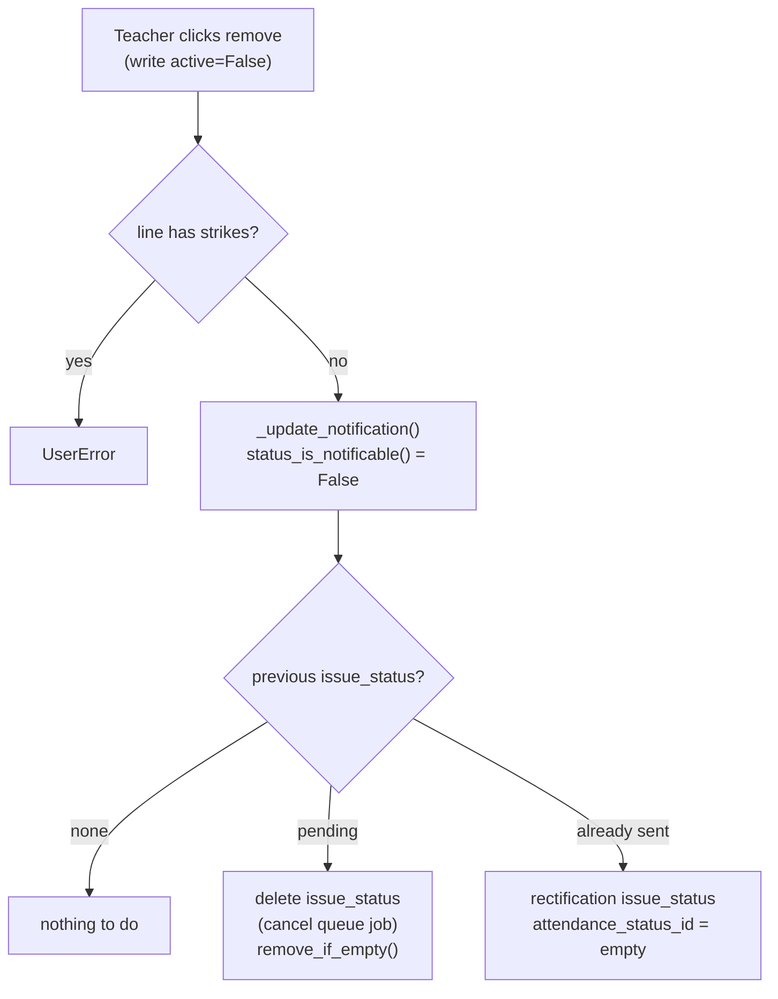

# Technical Reference: `ems.attendance_session_header` / `ems.attendance_session_line`

## Overview

The two models behind the daily roll-call: **`ems.attendance_session_header`** is one
concrete occurrence of an [`ems.attendance_schedule`](attendance_schedule.md) slot on a
given date (e.g. "Maths, group A, Monday 9:00–10:00, on 2026-03-02"); **`ems.attendance_session_line`**
is one row per student within that session, holding their `status_id`
([`ems.attendance_status`](attendance_status.md)) for that day.

**Module file:** `models/attendance/attendance_session.py` (`EmsAttendanceSessionHeader`, `EmsAttendanceSessionLine`)

---

## Session header: fields

Almost every field is derived from `attendance_schedule_id` → its `attendance_template_id`:

| Field | Source |
|-------|--------|
| `weekday`/`start_time`/`end_time`/`time_range` | `attendance_schedule_id`'s own fields |
| `start_date`/`end_date` | `date` (this session's actual day) combined with the schedule's `start_time`/`end_time`, timezone-converted |
| `group_ids`/`subject_id`/`space_id`/`study_ids`/`template_teacher_ids` | plain `related=` fields (e.g. `related="attendance_schedule_id.attendance_template_id.study_ids"`), `store=True` — genuine ORM `related` fields, not hand-written compute methods, so they need no `sudo()` of their own (Odoo's `related` resolution already runs with the necessary access) |
| `level_id` | **Not related to the template** — computed straight from `group_ids[:1].level_id` (`@api.depends("group_ids.level_id")`), since `ems.attendance_template` no longer has its own `level_id` (removed 2026-08-05, see [`attendance_template.md`](attendance_template.md)) |
| `session_teacher_id` | **Not derived** — who actually ran *this* session, defaults to the acting user's own `hr.employee`, but stays independent of the template's teacher set (covers substitution/guard-duty sessions) |
| `mode` | `scheduled` (normal roll-call) / `guard` (a substitute covering someone else's slot) / `manual` (ad-hoc, no schedule tie) |

`study_ids` (like `group_ids`/`template_teacher_ids` below) is a `Many2many`, so its `related`
field needs an explicit `relation`/`column1`/`column2` — Odoo doesn't auto-derive one for a
`related` M2M the way it would for a compute-based one (see the session-line note below).
`ems.attendance_session_line.study_ids` in turn is `related="attendance_session_id.study_ids"`,
one hop further down.

`_sql_constraints`: `UNIQUE(date, attendance_schedule_id)` — the actual concurrency guard
against two teachers creating the same day's session twice; `create()` catches the resulting
`IntegrityError` and re-raises as a friendly `ValidationError`.

---

## `_auto_populate_lines`: continuation vs. fresh roll-call

The continuation logic exists because a subject often spans two consecutive periods on the
same day (e.g. two back-to-back 55-minute slots) — a student marked `delayed` in the first
period is presumed to have arrived by the second (`attended`), while a `justified` absence
in the first carries forward as an unconfirmed `miss` in the second (not automatically
re-justified — the justification's own date range decides that, via the prevision check
below).

**`EmsAttendanceJustification.get_current_justifications(self, start_date, end_date)`** is
called unbound — `self` here is the *session*, not a justification recordset. This works
because the method's body only uses `self.env` (universal to any recordset), not any
justification-specific field — a deliberate, if unusual, code-reuse idiom in this codebase.
See [`attendance_justification.md`](attendance_justification.md).

---

## Notification pipeline (`create()` / `ems.attendance_session_line.write()`)

Every session `create()`, and every line `write()` (via `_update_notification()`), re-evaluates
whether the tutor/family need notifying:

The `ems.attendance_issue*` data models this pipeline writes to are documented separately —
see [`attendance_issue.md`](attendance_issue.md) for `send_notification()`'s actual email
templates and the rectification flow.

`ems.attendance_session_line.write()` unconditionally calls `_update_notification()` after
every write, regardless of which fields changed — it re-derives the previous/new
notification state from `get_issue_tutor`/`get_issue_student`/`get_issue_status` each time,
so a write to an unrelated field (e.g. `notes`) is a cheap no-op there rather than a bug.

### Real bug found and fixed in this pass

`collect_issue_status_data()` built `send_to = [student_id.student_email]`
**unconditionally** — if a student has no `student_email` set (a real, unremarkable state:
e.g. a newly admitted student without a corporate email yet), that list contains `False`,
and the later `separator.join(send_to)` raised `TypeError: sequence item 0: expected str
instance, bool found`. This didn't just skip the notification — it crashed the *entire*
enclosing `write()`/`create()` call, meaning marking **any** such student's line as `miss`
(or creating a session that auto-populates one via the continuation logic) would fail
outright. Confirmed by a direct test before the fix (`test_continuation_session_justified_becomes_miss`,
which needs a `miss`-status line, failed with exactly this `TypeError`). Fixed by only
including `student_email` when it's actually set: `send_to = [student_id.student_email] if
student_id.student_email else []`.

---

## Automatic check-in of the session's teacher (`_auto_checkin_teacher()`)

`create()` also checks the session's teacher in (`hr.attendance` with `in_mode='auto_check_in'`)
as a side effect of taking attendance, driven by `res.company.auto_checkin_mode`:

| Mode | Check-in time |
|------|---------------|
| `disabled` (default) | No automatic check-in |
| `first` | The teacher's first working hour that weekday |
| `start` | The session's own start time |
| `current` | Now |

It only happens when all of these hold:

- the session's teacher is the user taking the roll-call (an admin starting a colleague's slot on
  their behalf never checks that colleague in);
- the session is for today, and the teacher has no attendance yet today;
- "now" falls inside one of the teacher's expected working intervals for today
  (`hr.attendance._is_within_working_hours()`, `models/employees/employee_autocheckout.py`, built on
  the same `_get_expected_intervals()` the auto-checkout uses, so approved absences are already
  subtracted). A teacher with no working schedule has none, so is never checked in automatically.
  Guard duty is inside the teacher's own schedule, and a substitute works on a copy of the absent
  teacher's schedule, so neither needs special-casing.

The check-in is capped at `fields.Datetime.now()` (naive UTC, no microseconds), never later.
Native `hr.employee.last_attendance_id` is a **stored** compute searching `check_in <= now` and
depending only on `attendance_ids`: a check-in even a fraction of a second in the future is left
out of it and never picked up afterwards, so the kiosk sees the teacher as checked out and tries a
second check-in instead of the check-out, which `hr.attendance._check_validity()` rejects
("hasn't checked out since..."). This is what `current` mode's microsecond-precision timestamps
used to cause, and what `start` mode could cause for a roll-call opened before the session starts.

Any failure creating the attendance is isolated in a savepoint and reported to academic admins
through an activity (`_notify_auto_checkin_failure()`): the roll-call itself is never blocked.

---

## `copy()` / `unlink()`

`copy()` is blocked outright (`UserError`) — a session is a historical record of a specific
day's roll-call, duplicating it makes no sense. `unlink()` cascades (native `ondelete` on the
lines/issue tables) and additionally calls `remove_if_empty()` on any `ems.attendance_issue_tutor`
for that date, cleaning up now-orphaned notification-tracking rows.

## Enlarged student photo on hover (`useAvatarZoom`, issue #538)

The roll-call row's 44px thumbnail (`image_128`) opens an enlarged, 132px copy (`image_512`, sharp
on HiDPI screens) with the student's name as a caption, after a 150ms hover delay (so sweeping the
mouse down the list doesn't flash one per row), and closes on mouse leave. A click/tap toggles it,
for touch screens with no hover. It is a reusable hook, `useAvatarZoom()`
(`static/src/js/backend/avatar_zoom.js`), not roll-call specific: it takes the partner as the
`[id, display_name]` many2one pair the widget already has.

It is rendered through Odoo's popover service (`usePopover`), not a CSS `transform: scale()` on the
thumbnail: the roll-call table lives inside `.ems-av-body { overflow-y: auto }` under a sticky
header (`z-index: 9`), which would clip the scaled image and hide it under the header on the first
rows. The popover is mounted in the webclient's overlay container, outside both. Odoo's own
popover animation is disabled; `avatar_zoom.css` animates the photo growing out of the thumbnail
(disabled under `prefers-reduced-motion`). Covered by the `ems_attendance_session_avatar_zoom`
tour (hover, leave, tap, tap again; teacher login).

## Removing a student from the roll-call (`active`, issue #537)

A line can be removed from a session's roll-call when the student isn't required to attend it
(e.g. an exam only part of the group sits): it counts neither as attended nor as absent. This is
the line's own `active` field, not a status and not an `unlink()`, so it can be undone from the
same screen.

| Where | What removing a line (`active=False`) does |
|-------|--------------------------------------------|
| Reports | `search`/`read_group` skip archived records, so the line is out of every count and of `absence_rate`'s average with no extra code. |
| Notifications | `status_is_notificable()` returns `False` for an archived line, so `_update_notification()` handles removal like a switch to a non-notifiable status: a pending `ems.attendance_issue_status` is deleted (and its queue job cancelled), an already-sent one gets a rectification. Restoring the line with a notifiable status notifies again. |
| Rectification | `_get_or_create_issue_status()` reads the line with `browse()` (a `search()` would skip it) and leaves `attendance_status_id` empty for an archived line; `mail_attendance_issue_rectification` and the tutor digest (`mail_attendance_issue_tutor`) render an empty status as "Not required to attend (removed from the roll-call)". |
| Continuation | `_auto_populate_lines()` reads the previous period's lines with `active_test=False` and copies each line's `active`, so a student removed from the first period of a double period stays removed (and restorable) in the second. |
| Strikes | `write()` refuses to archive a line with `strike_ids` (`UserError`): a student with a strike was in class. |
| Roll-call widget | `_loadLines()` reads with `active_test: false`; archived rows sort last, greyed out (`ems-av-line--removed`) with their status/notes/strike buttons disabled, and a remove/restore button per row. The write goes through `_writeSessionLine()`, i.e. `write_guard_session_line()` in Guard mode, like any other line edit. |
| History form | Uses `all_attendance_session_line_ids`, a second One2many over the same lines declared with `context={'active_test': False}`, so archived lines are listed (muted). A view-level `context` isn't enough: the header's own read of `attendance_session_line_ids` already filters archived lines out before the sub-read. `attendance_session_line_ids` keeps Odoo's default filtering for every other caller. |

---

## Guard mode (`get_guard_sessions`/`get_guard_planned`/`get_normal_sessions_and_planned`/`create_scheduled_session`/`write_guard_session_line`)

`@api.model` RPC endpoints backing the pass-list OWL component
(`static/src/js/backend/attendance_session_view.js`), all gated by `ems.group_teacher`/
`ems.group_academic_admin` membership and running under `sudo()` internally (a guard teacher
needs to see/edit sessions they don't personally own). `get_guard_sessions` returns today's
sessions **excluding** the caller's own (already shown in normal mode); `get_guard_planned`
returns not-yet-created schedules for **other** teachers today. `create_scheduled_session`
is the click-to-start-a-session entry point (when the caller has no teaching employee, e.g. an
admin, who sees every slot, the session's teacher is the slot's own first template teacher instead
of the caller - `teacher_ids` is required on the template, so there always is one), returning whether the new session is a
same-day continuation (mirroring `_auto_populate_lines`' own check, so the client can decide
whether to show a "continuing from period 1" hint before the roll-call even loads).

---

## Session line: fields worth noting

| Field | Notes |
|-------|-------|
| `active` | `False` = removed from this roll-call (not required to attend) — see "Removing a student from the roll-call" above. |
| `is_auto_generated` | Distinguishes a line the system created (from `_auto_populate_lines`) from one a teacher manually added — a manually-added line can be re-targeted to a different student (`_onchange_student_id`), an auto-generated one can't (would silently break the "no duplicate student per session" expectation the view enforces). |
| `absence_rate` | `0`/`100`, not a boolean — lets the "Attendance reports" pivot/graph's default `avg` measure resolve directly to a percentage. |
| `group_ids`/`study_ids` | `related` (from the header's own `group_ids`/`study_ids`), each with an explicit custom `relation`/`column1`/`column2` — a `related` M2M field doesn't auto-derive a relation table the way a compute-based one does; the explicit names here also keep them under PostgreSQL's 63-character identifier limit. |
| `strike_count` | Stored so it works as a pivot/graph measure; a strike is created separately (`ems.strike`, see [`strike.md`](../coexistence/strike.md)) and merely links back via `attendance_session_line_id`. |

## Fixed in this pass (2026-07-28)

Classes renamed `ems_attendance_session_header`/`ems_attendance_session_line` →
`EmsAttendanceSessionHeader`/`EmsAttendanceSessionLine`. Whole file was tab-indented —
normalized to spaces. Loop variable `rec` → `session`/`line` throughout.
`super(ems_attendance_session_line, self).write(vals)` simplified to `super().write(vals)`.
**Dead code removed:** `_compute_attendance_session_display_name` (on
`EmsAttendanceSessionLine`) was never wired to any field — no `attendance_session_display_name`
field was ever declared on this model, so the method could never actually run (nothing in
Odoo's compute-dispatch graph referenced it). Leftover from an abandoned field addition;
removing it changes no behavior. The `collect_issue_status_data` crash above (real bug,
fixed). New `tests/test_attendance_session.py` (18 tests across both classes) — zero
coverage existed before this pass on either model.

## Changed in this pass (2026-08-05)

`level_id` no longer mirrors the template (which no longer has one) — recomputed from
`group_ids[:1].level_id` instead. `study_id` (`Many2one`) → `study_ids` (`Many2many`) on both
`ems.attendance_session_header` and `ems.attendance_session_line`, following the same rename
on `ems.attendance_template`. `group_ids`/`subject_id`/`space_id`/`template_teacher_ids`
converted from `sudo()`-laden compute methods to genuine `related=` fields (see
[`attendance_template.md`](attendance_template.md) for the full identity-field-locking
context this is part of).

## Fixed in this pass (2026-09-04): Guard mode blank screen after starting a covered session

Clicking "Start session" on a colleague's not-yet-started slot in Guard mode created the session
and loaded its student lines correctly, but the OWL component (`attendance_session_view.js`)
rendered "No sessions or scheduled timetables for this day" instead of the roll-call table.
Cause: the instant a guard-covered session is created, its `session_teacher_id` becomes the
covering teacher's own employee (see "Guard mode" above) — exactly the condition
`get_guard_sessions()` uses to exclude it, since it now belongs under Normal/Manual mode's own
view instead (avoiding showing it twice). `onStartSession()` calls `_loadAll()` — which wipes
`state.sessions`/`state.planned` via that same exclusion — *before* re-selecting the new session
and loading its lines directly by id, and the template's own "nothing at all" empty-state check
only looked at those (now guard-mode-empty) lists, never at whether `state.lines` had actually
loaded. Fixed in `attendance_session_view.xml`: the empty-state condition now also checks
`!state.lines.length`. First browser tour coverage for Guard mode
(`static/tests/tours/attendance_session_tour.js` → `ems_attendance_session_guard`,
`tests/test_attendance_session_tour.py`) is what caught this — `get_guard_planned` also had zero
backend test coverage before this pass. The same tour file's other entry
(`ems_attendance_session_continuation`) covers the same-day continuation banner/auto-copy
described above, likewise previously untested in a real browser.

## Search view: "Archived" filter added, `session_teacher_id` made searchable (2026-08-06, phase 8 of `plans/course_transition_teacher_schedule_archival.md`)

`views/attendance/attendance_session/search.xml` had no `<filter name="inactive">` at all — an
archived session (e.g. one belonging to a schedule line archived by the course transition
wizard, see `course_transition_wizard.md`) was simply unreachable from the "History" list's own
search bar, since Odoo does **not** auto-add this filter for models with an `active` field (it
has to be declared explicitly — confirmed empirically, see the sibling note in
`attendance_template.md`). Also added a plain `<field name="session_teacher_id" string="Teacher">`
so free-text search can find a session by teacher name at all, not just via the (already
existing) "Show only mine" filter.
