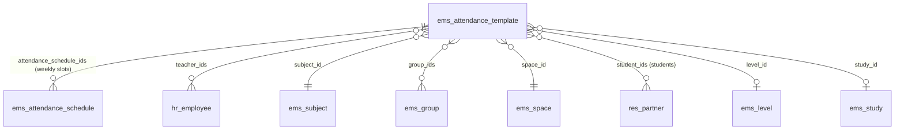
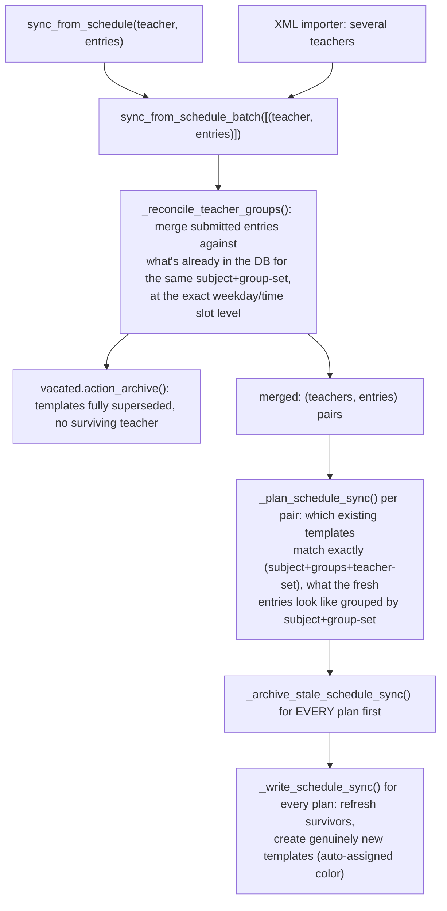

# Technical Reference: `ems.attendance_template`

## Overview

An `ems.attendance_template` answers "who teaches what, where and for whom": one record groups a teacher-set + subject + set of groups into a weekly schedule (its `attendance_schedule_ids`, the actual weekday/start_time/end_time slots) plus the enrolled students expected to attend. Templates are the backbone that turns a raw weekly schedule (imported from an XML planner file, or edited live from a teacher's own "Schedule" tab) into what the attendance roll-call screens actually check students against.

Templates are **not created directly by an admin filling in a form** in the normal case — they are derived by `sync_from_schedule_batch()` from schedule entries, reconciling co-teaching and splitting/merging templates as needed (see "CRUD flow" below). The form/list views exist for inspecting and manually correcting the result, not as the primary entry point.

**Module files:** `models/attendance/attendance_template.py`, `views/attendance/attendance_template/`, `models/shared/hex_color_mixin.py` (color), `models/attendance/attendance_schedule.py` (the weekly slots, own fields/logic documented in [`attendance_schedule.md`](attendance_schedule.md)).

## Relations

`level_id`/`study_id` are **not required** — a template built from a *reinforcement* `ems.group` (`group_type == 'reinforcement'`) has no level/study of its own and leaves both `False` (see `_write_schedule_sync`).

## Data model

| Field | Type | Notes |
|-------|------|-------|
| `start_date` / `end_date` | `Date`, required | The template's active date range |
| `color` | `Char` (hex) | Free-pick display color, auto-assigned on creation — see [Free-pick color widget](../shared/color_widget.md) |
| `teacher_ids` | `Many2many → hr.employee` | Required. Domain restricted to `employee_type = 'teacher'`. More than one teacher means co-teaching |
| `subject_id` | `Many2one → ems.subject` | Required |
| `group_ids` | `Many2many → ems.group` | Required (`_check_group_ids`) |
| `space_id` | `Many2one → ems.space` | Required. Auto-filled from the first group's own space on `group_ids` change |
| `level_id` / `study_id` | `Many2one`, optional | Blank for a reinforcement-group-only template |
| `attendance_schedule_ids` | `One2many → ems.attendance_schedule` | The actual weekly weekday/start_time/end_time slots |
| `student_ids` | `Many2many → res.partner` | Auto-filled (`fill_students()`) from active enrollments matching `subject_id` + `group_ids` |
| `read_only_user` | `Boolean`, non-stored | `True` unless: admin, one of `teacher_ids`, or the record's own creator |

## CRUD flow

The entry points are `sync_from_schedule()` (single teacher, e.g. the employee "Schedule" tab's live editor) and `sync_from_schedule_batch()` (several teachers at once, e.g. the XML planner importer) — both funnel through the same three-stage pipeline, so a solo live edit and a multi-teacher import share identical co-teaching/conflict logic:

Key behaviours, each covered by its own docstring in the code:

- **Co-teaching reconciliation** (`_reconcile_teacher_groups`) works at the exact (weekday, start_time, end_time) slot level, not at the whole-template level — a single teacher's live edit can retroactively **split** another teacher's existing template if they now land on the exact same slot, or leave it alone otherwise.
- **Archive-then-write, in two full passes across the whole batch** (`_archive_stale_schedule_sync` for every plan, then `_write_schedule_sync` for every plan) — never interleaved per-plan. Interleaving would let one plan's fresh line collide (via `ems.attendance_schedule.check_overlap()`) with another plan's still-active *stale* line that hasn't been re-synced yet, when two groups share a classroom.
- **Duplicate consolidation:** more than one active template can share the same (subject, group-set, teacher-set) key, a pre-existing data-quality artifact of repeated past imports. Only `templates[0]` (the "survivor") gets refreshed; every other duplicate sharing that key is archived outright.
- **History preservation:** stale data is always **archived**, never unlinked — `unlink()` itself refuses outright once any of a template's schedule lines has an actual `attendance_session_ids` entry (a real roll-call was taken against it).
- **`find_external_conflicts()`** is a read-only helper (used by the import wizard's preview and by the import itself) that finds active schedule lines belonging to teachers **outside** the current batch that would collide on room+time — a batch only cleans up its own teachers' stale data, so an external teacher's now-conflicting line needs separate handling.

## Access control

| Group | Access | Restriction |
|-------|--------|-------------|
| `ems.group_academic_admin` | Full CRUD | None (`security/rules/attendance.xml`: `rule_attendance_template_admin`, domain `[]`) |
| `ems.group_teacher` | Full CRUD | Own data only: `create_uid = user` **or** `teacher_ids.user_id = user` (`rule_attendance_template_teacher_own`) |
| `ems.group_secretary` | Read-only | None |

`read_only_user` (computed per-record, non-stored) additionally locks down the **form view** for a teacher looking at a template that passes the record rule via `create_uid` but isn't one of `teacher_ids` themselves (e.g. one co-teacher edited it, another can still see it under the OR domain above) — the ACL/rule layer decides *whether a row is visible/writable at the ORM level at all*, `read_only_user` decides whether *this specific viewer* should see editable widgets once it is.

## Known limitations

- **No default start/end date configuration** (`_plan_schedule_sync`'s `# TODO`): a new template's start date defaults to September 1st of the current year and end date to July 1st of the next, hardcoded — not read from any settings/course record.
- **Auto-assigned color is cosmetic only** — it exists to visually tell templates apart in the list view, nothing else reads it (no calendar/kanban `highlight_color` currently wired to it). See [Free-pick color widget](../shared/color_widget.md) for the rotation logic and the "all red" issue it replaced.
- **`level_id`/`study_id` desync risk:** both are set once from the *first* group's own values at creation/sync time (`_write_schedule_sync`); if a template's `group_ids` is later edited by hand to a group from a different level/study, neither field is recomputed — they only ever reflect the state at the last sync.
