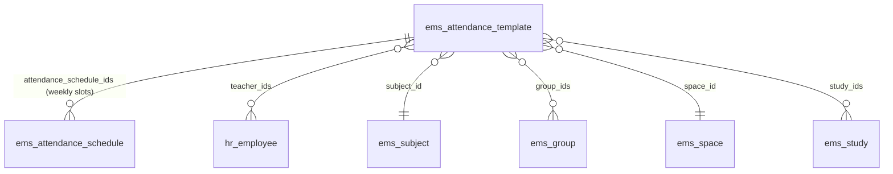
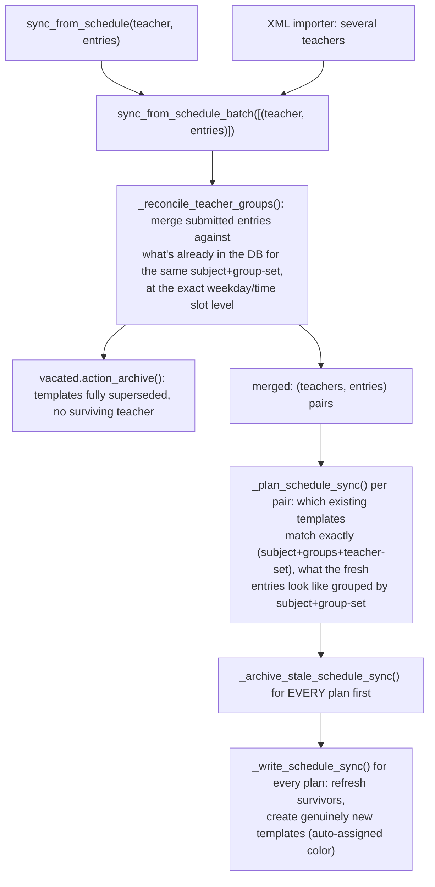

# Technical Reference: `ems.attendance_template`

## Overview

An `ems.attendance_template` answers "who teaches what, where and for whom": one record groups a teacher-set + subject + set of groups into a weekly schedule, its `attendance_schedule_ids` — the actual weekday/start_time/end_time slots, each carrying its **own** enrolled-student roster (`student_ids`, moved here from the template 2026-08-11 - see [`attendance_schedule.md`](attendance_schedule.md), and `plans/calendar_driven_attendance_templates.md`, point 1). Templates are the backbone that turns a raw weekly schedule (imported from an XML planner file, or edited live from a teacher's own "Schedule" tab) into what the attendance roll-call screens actually check students against.

**Templates are NOT creatable or archivable directly by anyone, admin included** (`plans/calendar_driven_attendance_templates.md`, point 3, 2026-08-11) — they only ever come into existence, or go away, as a consequence of `sync_from_schedule_batch()` reconciling a teacher's calendar (or a course transition archiving one). See "Access control" below for the actual enforcement mechanism. The form/list views exist purely for inspecting the result and correcting non-identity fields (color, etc.) - never for creating or archiving one by hand.

`ems.attendance_template` also carries `mail.thread`/`mail.activity.mixin` (chatter) — every archive/clone the sync pipeline performs, and any manual non-identity-field edit, is tracked there.

**Module files:** `models/attendance/attendance_template.py`, `views/attendance/attendance_template/`, `models/shared/hex_color_mixin.py` (color), `models/attendance/attendance_schedule.py` (the weekly slots, own fields/logic documented in [`attendance_schedule.md`](attendance_schedule.md)).

## Relations

`student_ids` (the enrolled-student roster) is **not** a direct relation of this model - it lives on
`ems_attendance_schedule` instead, see [`attendance_schedule.md`](attendance_schedule.md).

`study_ids` is **not required** — a template built from a *reinforcement* `ems.group` (`group_type == 'reinforcement'`) has no study of its own and leaves it empty (see `_write_schedule_sync`). There is no `level_id` on this model anymore (removed 2026-08-05, see "Identity fields and locking" below) — a level is always derivable from `group_ids`/`study_ids` when needed (e.g. `ems.attendance_session_header.level_id`, still on the session side, is computed straight from `group_ids[:1].level_id`).

## Data model

| Field | Type | Notes |
|-------|------|-------|
| `start_date` / `end_date` | `Date`, required | The template's active date range |
| `color` | `Char` (hex) | Free-pick display color, auto-assigned on creation — see [Free-pick color widget](../shared/color_widget.md) |
| `teacher_ids` | `Many2many → hr.employee` | Required. Domain restricted to `employee_type = 'teacher'`. More than one teacher means co-teaching. Locked (`readonly`) once `has_sessions` unless `user_is_admin` |
| `subject_id` | `Many2one → ems.subject` | Required. Domain restricted to `allowed_subject_ids`. Locked once `has_sessions` |
| `study_ids` | `Many2many → ems.study` | Optional (see above). Locked once `has_sessions` |
| `group_ids` | `Many2many → ems.group` | Required (`_check_group_ids`). Domain restricted to `study_id in study_ids`. Locked once `has_sessions` |
| `allowed_subject_ids` | `Many2many → ems.subject`, computed, non-stored | Subjects available in **every** one of `study_ids` (intersection, not union) — backs `subject_id`'s domain and `_check_subject_valid_for_all_studies` below. Empty `study_ids` means no restriction (all subjects allowed) |
| `space_id` | `Many2one → ems.space` | Required. Auto-filled from the first group's own space on `group_ids` change |
| `attendance_schedule_ids` | `One2many → ems.attendance_schedule` | The actual weekly weekday/start_time/end_time slots |
| `has_sessions` | `Boolean`, computed | `True` once any of this template's schedules has a real `attendance_session_ids` entry — see "Identity fields and locking" below |
| `read_only_user` | `Boolean`, non-stored | `True` unless: admin, one of `teacher_ids`, or the record's own creator |

### `_check_subject_valid_for_all_studies`

`@api.constrains('subject_id', 'study_ids')`: rejects a `subject_id` that isn't in `allowed_subject_ids` whenever `study_ids` is non-empty — i.e. the chosen subject must actually be taught in **every** selected study, not just one of them. A reinforcement template (no `study_ids`) is never subject to this.

## Identity fields and locking

Once a template has real attendance history (`has_sessions`), its **identity fields** —
`teacher_ids`, `subject_id`, `study_ids`, `group_ids` (template-level) and each schedule
line's `weekday`/`space_id`/`start_time`/`end_time` (line-level, see
[`attendance_schedule.md`](attendance_schedule.md)) — become readonly in the form. Editing
them in place after real sessions exist would retroactively misrepresent what those already-taken
sessions were actually about (every `ems.attendance_session_header` field mirroring them is
`related`+`store=True`, so an in-place edit would silently rewrite history — see
[`attendance_session.md`](attendance_session.md)).

**Until 2026-08-11, a per-record "Edit" button (`action_new_version()`) let an admin/teacher
unlock a locked template by hand** (archive the whole template + clone it fresh, no session
history). **Removed** as part of `plans/calendar_driven_attendance_templates.md`'s point 3
(developer's own call: *"Este mecanismo que hicimos para 'editar' templates o schedules ha
quedado obsoleto"*) - correcting a mistake or handling a mid-year teacher/subject/group change is
now done exclusively by editing the teacher's calendar and letting the sync pipeline reconcile
it (see "CRUD flow" below and "Access control" for why no other path exists any more).

**The underlying shared mechanism, `ems.attendance_mixin._write_or_new_version(vals)`
(`models/shared/attendance_mixin.py`, in both this model's and `ems.attendance_schedule`'s
`_inherit`), was NOT removed** - `_write_or_new_version(vals)` writes `vals` in place if
`not self.has_sessions`, or archives `self` and returns `self.copy({'active': True, **vals})`
otherwise. It's still used internally by:
- The **schedule-sync pipeline** (`_archive_stale_schedule_sync`/`_write_schedule_sync`, see "CRUD
  flow" below) for its own per-schedule-line decisions (though it can't call this method as a
  single atomic step there — see that section for why).
- `ems.course_transition_wizard._apply_calendar_archival()`, to drop a departing co-teacher from a
  still-shared template without touching the remaining teachers' own historical
  `template_teacher_ids`.
- The working-schedule import wizard's own room-reassignment conflict resolution
  (`working_schedule.py`).

Every one of these callers on `ems.attendance_template` runs the archive+copy branch with both
`sudo()` and an internal context flag (`ems_bypass_template_lock`, see "Access control" below) -
required now that create()/unlink() are revoked and archiving is separately blocked by this
model's own `write()` override; harmless no-ops for `ems.attendance_schedule`, which was never
locked that way.

Archiving happens **before** copying, not after — copying first would momentarily leave the
original and the identical fresh clone both active, sharing the same
teacher/room/time/subject, which `ems.attendance_schedule.check_overlap()` correctly rejects
as a double-booking. The already-taken sessions stay linked to the archived original,
permanently accurate; the clone starts with no session history (`attendance_session_ids` is
`copy=False`), so every identity field is freely editable again - the schedule-sync pipeline is
what actually applies the correction, from the calendar's own new data.

**Historical note (two real bugs found and fixed 2026-08-06, back when `action_new_version()`
still existed):** `attendance_schedule_ids` needed an explicit `copy=True` (Odoo's `One2many`
defaults to `copy=False`, so `copy()` silently produced a clone with **no lines at all** until
this was added — `attendance_session_ids`, line-level, stays `copy=False` regardless, since
session history must never be duplicated), and the freshly-copied lines needed
`with_context(active_test=False)` before `.action_unarchive()` to actually flip them back active
(they carried over their just-archived `active=False`, and a plain O2M read at that point already
excluded them). Both fixes are baked into `_write_or_new_version`'s own behavior today, not
specific to the now-removed button - still relevant to every remaining caller listed above.
`duplicate="0"` stays disabled on this model's views (`views/attendance/attendance_template/
{form,list}.xml`) for the same reason it was added then: a plain Duplicate never archives the
original first, so it would immediately self-collide via `check_overlap`.

## CRUD flow

The entry points are `sync_from_schedule()` (single teacher, e.g. the employee "Schedule" tab's live editor) and `sync_from_schedule_batch()` (several teachers at once, e.g. the XML planner importer) — both funnel through the same three-stage pipeline, so a solo live edit and a multi-teacher import share identical co-teaching/conflict logic:

Key behaviours, each covered by its own docstring in the code:

- **Co-teaching reconciliation** (`_reconcile_teacher_groups`) works at the exact (weekday, start_time, end_time) slot level, not at the whole-template level — a single teacher's live edit can retroactively **split** another teacher's existing template if they now land on the exact same slot, or leave it alone otherwise.
- **Archive-then-write, in two full passes across the whole batch** (`_archive_stale_schedule_sync` for every plan, then `_write_schedule_sync` for every plan) — never interleaved per-plan. Interleaving would let one plan's fresh line collide (via `ems.attendance_schedule.check_overlap()`) with another plan's still-active *stale* line that hasn't been re-synced yet, when two groups share a classroom.
- **Per-line, `has_sessions`-aware matching for a persisting template (added 2026-08-05, replacing a blunter "archive every line, recreate all fresh" behavior):** `_plan_schedule_sync` calls `_match_schedule_lines` once per persisting key, matching the survivor's current `attendance_schedule_ids` against the incoming entries by `(weekday, start_time, end_time)` - a line's own identity within a template. A line with no matching entry is archived outright (genuinely gone); a matched line whose room hasn't changed is left completely untouched; a matched line whose room *has* changed goes through the same decision as `ems.attendance_mixin._write_or_new_version` - updated in place if it has no real sessions yet, or archived-and-replaced-with-a-fresh-line if it does (split across the two passes above for the same cross-plan collision reason, not called as one atomic step - see the code's own comments on `_archive_stale_schedule_sync`/`_write_schedule_sync` for why). This is shared, unconditional model-level behavior - it applies identically whether the caller is the live Schedule tab's own edit or (once built) the working-schedule import wizard, not something either caller opts into separately.
- **Duplicate consolidation:** more than one active template can share the same (subject, group-set, teacher-set) key, a pre-existing data-quality artifact of repeated past imports. Only `templates[0]` (the "survivor") gets refreshed; every other duplicate sharing that key is archived outright.
- **History preservation:** stale data is always **archived**, never unlinked — `unlink()` itself refuses outright once any of a template's schedule lines has an actual `attendance_session_ids` entry (a real roll-call was taken against it).
- **`find_external_conflicts()`** is a read-only helper (used by the import wizard's preview and by the import itself) that finds active schedule lines belonging to teachers **outside** the current batch that would collide on room+time — a batch only cleans up its own teachers' stale data, so an external teacher's now-conflicting line needs separate handling.

## Access control

| Group | Access | Restriction |
|-------|--------|-------------|
| `ems.group_academic_admin` | Read + write, **no create/unlink** | None on read/write (`security/rules/attendance.xml`: `rule_attendance_template_admin`, domain `[]`) |
| `ems.group_teacher` | Read + write, **no create/unlink** | Own data only: `create_uid = user` **or** `teacher_ids.user_id = user` (`rule_attendance_template_teacher_own`) |
| `ems.group_secretary` | Read-only | None |

`read_only_user` (computed per-record, non-stored) additionally locks down the **form view** for a teacher looking at a template that passes the record rule via `create_uid` but isn't one of `teacher_ids` themselves (e.g. one co-teacher edited it, another can still see it under the OR domain above) — the ACL/rule layer decides *whether a row is visible/writable at the ORM level at all*, `read_only_user` decides whether *this specific viewer* should see editable widgets once it is.

### Creation/archival locked to the calendar-driven pipeline only (2026-08-11)

`security/ir.model.access.csv`: `create`/`unlink` are `0` for **every** group on this model,
admin included (`plans/calendar_driven_attendance_templates.md`, point 3 - developer's own
explicit call after confirming `ems.course_transition_wizard._templates_to_archive()`'s own
study-scoped search already archives a template correctly regardless of how it was created, so
there's no orphan risk either way: "Bloquear también al admin, solo aviso no es suficiente").
`views/attendance/attendance_template/{form,list}.xml` also set `create="0"`, hiding the "New"
button entirely rather than just failing on click.

**Archival can't be blocked by the CSV alone** - "Archive" is a plain `write()` of `active`, and
`write` access has to stay granted for legitimate direct edits (`color`, etc.). Blocking it
specifically needed a code-level guard: `ems.attendance_template.write()` raises `UserError` if
`active` is in `vals` and the call isn't carrying the internal context flag
`ems_bypass_template_lock` (`EMS_BYPASS_TEMPLATE_LOCK_KEY`, defined in
`models/shared/attendance_mixin.py` so both this model and the sync pipeline can import one
constant without a circular import between them). Every legitimate internal archival call site
(the sync pipeline's own vacate/consolidate steps, `course_transition_wizard`'s template
archival, `_write_or_new_version`'s own archive+copy branch) wraps itself with
`self.with_context(**{EMS_BYPASS_TEMPLATE_LOCK_KEY: True})` before calling `action_archive()`/
`write()`. **Known Odoo limitation, not fully solved:** the generic "Archive" menu item itself may
still be visible in the UI (Odoo shows it for any model with `active` + write access, and there's
no per-list-view declarative attribute to suppress just that one action the way kanban's
`archivable="false"` does) - clicking it always raises the explanatory error above, but it isn't
hidden from view the same clean way "New" is.

`ems.attendance_template.sync_from_schedule_batch*`'s own internal `create()` calls (and
`_write_or_new_version`'s `copy()`, which is a `create()` under the hood) additionally need
`.sudo()` - CSV `create=0` blocks the calling **user's** own permission regardless of group, so a
sync triggered by an admin saving the Schedule tab or running the import wizard would otherwise
fail too, not just a genuinely unauthorized direct create.

## Known limitations

- **No default start/end date configuration** (`_plan_schedule_sync`'s `# TODO`): a new template's start date defaults to September 1st of the current year and end date to July 1st of the next, hardcoded — not read from any settings/course record.
- **Auto-assigned color is cosmetic only** — it exists to visually tell templates apart in the list view, nothing else reads it (no calendar/kanban `highlight_color` currently wired to it). See [Free-pick color widget](../shared/color_widget.md) for the rotation logic and the "all red" issue it replaced.
- **`study_ids` desync risk (reduced, not eliminated):** `_write_schedule_sync` sets it once from every involved group's own `study_id` at creation/sync time; if a template's `group_ids` is later edited by hand (only possible before `has_sessions`, see above) to groups from different studies, `study_ids` is not automatically recomputed to match — it only reflects the state at the last sync/manual edit. `_check_subject_valid_for_all_studies` still guards `subject_id` against whatever `study_ids` currently holds, so this can't silently produce an invalid subject/study combination, only a stale-but-internally-consistent one.

## Changed in this pass (2026-08-05)

`level_id` removed entirely (never used in any report, always derivable from `group_ids`/
`study_ids`); `study_id` (`Many2one`) → `study_ids` (`Many2many`), since a template can
legitimately cover groups from more than one study (co-teaching/"desdoble" across studies —
`_write_schedule_sync` now unions every involved group's own study). Added the
`has_sessions`-gated identity-field lock and "Edit" archive-and-clone action (both
here and on `ems.attendance_schedule`, see that doc). Converted `ems.attendance_session_header`'s
`group_ids`/`subject_id`/`space_id`/`template_teacher_ids`/`study_ids` from `sudo()`-laden
compute methods to genuine `related=` fields (see [`attendance_session.md`](attendance_session.md)).
Migration: `migrations/18.0.0.22.0/{pre,post}-migrate.py` (column rename + relation-table
backfill for the `study_id`→`study_ids` schema change).

**Later the same day:** extracted the archive-or-write decision behind `action_new_version()`
into a new shared mixin, `ems.attendance_mixin` (`models/shared/attendance_mixin.py`,
`_write_or_new_version(vals)`) - reused by the schedule-sync pipeline for its own per-line
decisions (see "CRUD flow" above), and intended for the working-schedule import wizard's future
room-reassignment step too (see `plans/working_schedule_import_redesign.md`), per the developer's
explicit reuse requirement rather than each caller reimplementing the same `has_sessions` check.
`_archive_stale_schedule_sync`/`_write_schedule_sync` changed from unconditionally archiving and
recreating *every* schedule line of a persisting template to a per-line match (unchanged lines
untouched, changed-without-sessions lines updated in place, changed-with-sessions lines
archived+recreated) - this is model-level behavior, not wizard-specific, so it applies to the
live Schedule tab's own edits too, not only a not-yet-built import path.

## Search view: "Archived" filter added (2026-08-06, phase 8 of `plans/course_transition_teacher_schedule_archival.md`)

`views/attendance/attendance_template/search.xml` had no `<filter name="inactive">` at all — an
archived template (e.g. one the course transition wizard archives, or one corrected via
`action_new_version()` above) was simply unreachable from the list view's own search bar. Odoo
does **not** auto-add this filter for models with an `active` field just because the field
exists — it has to be declared explicitly, confirmed empirically by checking the web client's own
`search` JS (no reference to auto-injecting an "Archived" menu item anywhere in
`@web/search/*`) and by reproducing the gap live (the filter genuinely didn't appear until
added). Native Odoo models (e.g. `resource.calendar`, see `working_schedule.md`) ship this filter
in their own core search view for the same reason — it's a per-view opt-in, not a per-model one.
