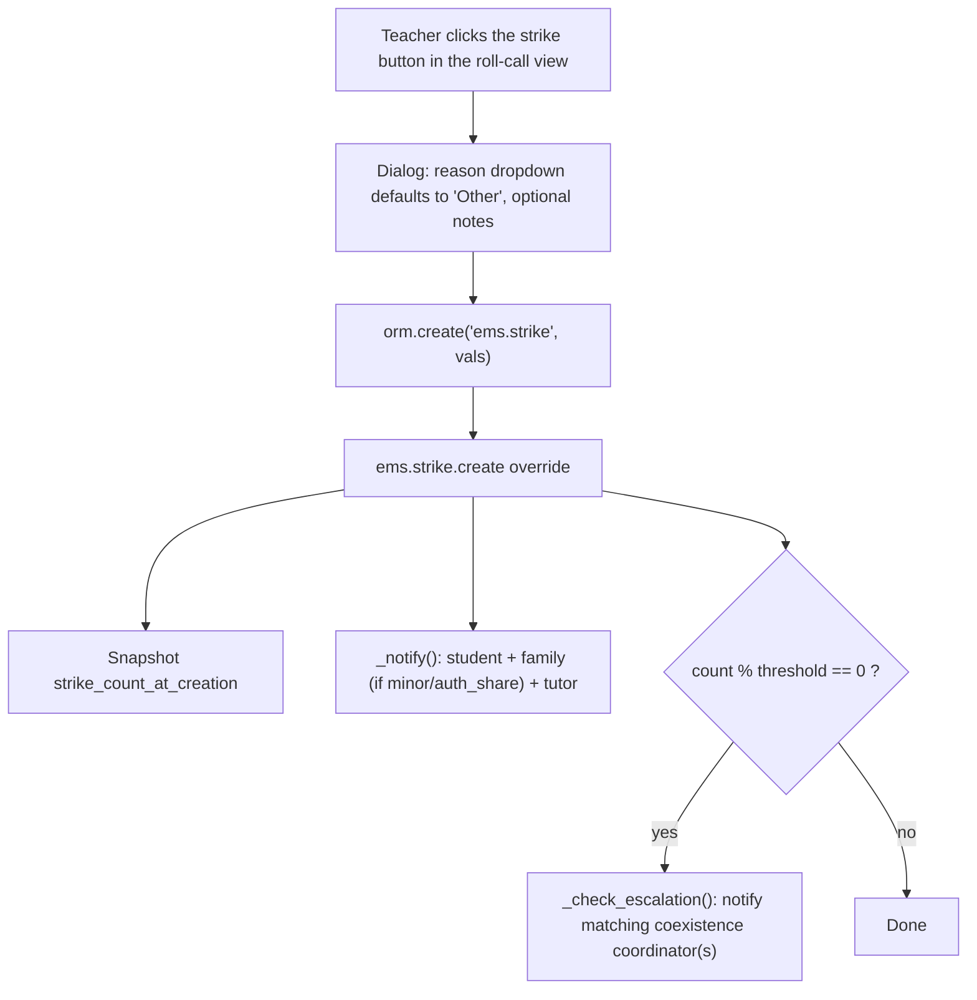

# Technical Reference: `ems.strike`

## Overview

`ems.strike` lets a teacher flag a disciplinary incident ("strike") against a student from the roll-call/attendance-taking view (a button to the left of the notes pencil). Each strike is independent of the attendance session — just student, issuing teacher, date, reason, optional notes.

Every strike notifies the student's own email always, the family (subject to the same minor/`auth_share` rule used for attendance-issue notifications), and the group tutor. Every time the student's cumulative strike count is a multiple of a configurable threshold (`ems.strike_escalation_threshold`, default 3), the coexistence coordinator(s) sharing the issuing teacher's ascendant Head of Studies / Deputy Head of Studies are also notified.

**Module files:** `models/coexistence/strike.py`, `models/coexistence/strike_reason.py`

---

## Data Model

### `ems.strike.reason`

| Field | Type | Description |
|-------|------|--------------|
| `name` | `Char` (translate) | Reason label shown in the roll-call dropdown |
| `sequence` | `Integer` | Ordering; `ems.strike_reason_other` (sequence 1) is the default, generic reason |
| `active` | `Boolean` | Archivable without deleting historical references |

### `ems.strike` (`_inherit = ['ems.base']` — gives `mail.thread`/chatter for free)

| Field | Type | Required | Description |
|-------|------|:--------:|--------------|
| `student_id` | `Many2one → res.partner` | Yes | Domain `contact_type = student`, `ondelete='cascade'` |
| `teacher_id` | `Many2one → hr.employee` | Yes | Issuer; defaults to the current user's employee |
| `reason_id` | `Many2one → ems.strike.reason` | Yes | Defaults to `ems.strike_reason_other` |
| `date` | `Date` | Yes | Defaults to today |
| `notes` | `Text` | No | Free-text details |
| `send_to` | `Char` (readonly) | — | Resolved recipient addresses, semicolon-separated (bookkeeping) |
| `strike_count_at_creation` | `Integer` (readonly) | — | Student's cumulative strike count snapshotted at creation time |

`display_name` is computed as `"{student} | {date} | {reason}"`.

---

## CRUD Flow

- **Create**: only entry point — the list view has `create="0"`, records are only created via `create()`, either from the roll-call button (`orm.create`) or the backend for admins.
- **Notification** (`_notify`): reuses the exact minor/`auth_share` authorization rule already used by `ems.attendance_issue_status`/`ems.notice` — student email always; family emails from `student.relation_all_ids` filtered to `contact_type == 'family'`, only if `not student.is_adult or student.auth_share`; plus `student.tutor_id.email` (the group tutor, via the existing `res.partner.tutor_id` related field). One `send_mail(force_send=True, email_values={'email_to': ...})` call per recipient address, in that recipient's own language — same pattern as `ems_attendance_issue_status.send_notification()`.
- **Escalation** (`_check_escalation`): fires every time `strike_count_at_creation % strike_escalation_threshold == 0` (repeating, not one-time — e.g. at 3, 6, 9... strikes with the default threshold). Matching coordinators are resolved by walking `ems.role_coexistence.employee_ids` (bridged from `hr.employee.public` to `hr.employee`) and comparing each coordinator's `find_head_of_studies()` result to the issuing teacher's — only coordinators in the same HoS/DHoS branch are notified.
- **Read**: see Access Control below.
- **Update/Delete**: only Administrators (`ems.group_academic_admin`).

---

## Access Control

| Role | Create | Read | Write | Delete | Group/Rule |
|------|:------:|:----:|:-----:|:------:|-------------|
| Administrator | ✓ | ✓ (all) | ✓ | ✓ | `ems.group_academic_admin` |
| Coexistence Manager/Administrator | — | ✓ (all, centre-wide) | — | — | `ems.group_coexistence` / `ems.group_coexistence_admin` |
| Tutor | ✓ | ✓ (own issued + tutees) | — | — | `ems.group_tutor` (implies `group_teacher`) |
| Teacher | ✓ | ✓ (own issued only) | — | — | `ems.group_teacher` |

Record rules: `security/rules/coexistence.xml`. `ems.group_coexistence` is a **new, independent security group family** (its own `ir.module.category`, `category_coexistence`), not nested under the teacher/tutor/HoS hierarchy — coexistence coordinators can read every strike centre-wide regardless of branch (the HoS/DHoS branch matching logic is only used to route the *escalation email*, not to gate read access). `ems.role_coexistence.group_id` is wired to `ems.group_coexistence`, and `ems.role_coexistence.unipersonal` is `false` — multiple coexistence coordinators (one per HoS/DHoS branch) are expected.

---

## Settings

`ems.strike_escalation_threshold` (`res.company`, default `3`) — "Strikes Settings" block in Settings, same pattern as `attendance_issue_status_delay`.

---

## Frontend

- `static/src/js/backend/attendance_session_view.js`: loads active `ems.strike.reason` records on `onWillStart`; `onStrikeClick`/`onStrikeCancel`/`onStrikeSend` mirror the existing notes-dialog handlers (`onNotesClick`/`onNotesCancel`/`onNotesSave`); `onStrikeSend` calls `orm.create("ems.strike", [...])`.
- `static/src/xml/backend/attendance_session_view.xml`: `<td class="ems-av-td-strike">` (button, `fa-exclamation-triangle`) placed immediately before the notes `<td>`; `<dialog t-ref="strikeDialog">` with a reason `<select>` + optional `<textarea>` + Send/Cancel, structurally identical to the notes dialog.
- `static/src/css/backend/attendance_session_view.css`: `.ems-av-strike-*` classes mirroring `.ems-av-notes-*`.

---

## Views

| View | File |
|------|------|
| List/Form (strikes) | `views/coexistence/strike/{list,form}.xml` |
| Menu (top-level "Convivencia") | `views/coexistence/strike/menu.xml` |
| List/Form (reasons, admin config) | `views/coexistence/strike_reason/{list,form}.xml` |
| Menu (Convivencia → Configuration) | `views/coexistence/strike_reason/menu.xml` |
| Student form smart button | `views/community/contact/form.xml` (`button_box`, `strike_count` → `action_view_strikes()`) |

---

## Mail Templates

| Template | File | Purpose |
|----------|------|---------|
| `ems.mail_strike_notification` | `mails/coexistence/strike_notification.xml` | Student/family/tutor notification, sent on every strike |
| `ems.mail_strike_escalation` | `mails/coexistence/strike_escalation.xml` | Coexistence coordinator escalation, sent every time the threshold multiple is reached |

---

## Data Files

| File | Purpose |
|------|---------|
| `data/main/ems.strike.reason.csv` | Seeds `ems.strike_reason_other` (default) plus a few sample reasons |

---

## Testing note

`ems.strike._notify()`/`_check_escalation()` send email synchronously (`force_send=True`) on every `create()`. Any test that creates a strike **must** patch `odoo.addons.base.models.ir_mail_server.IrMailServer.send_email` (see `tests/test_strike.py`/`tests/test_strike_tour.py`), since this environment's `ir.mail_server` records point to real, credentialed outgoing servers — Odoo's test runner does not suppress real SMTP delivery on its own.

## Follow-ups (out of scope for v1)

- No per-course-year scoping of the strike count (cumulative for the student's entire history).
- No configurable per-branch escalation recipient override beyond the HoS/DHoS-matching algorithm.
