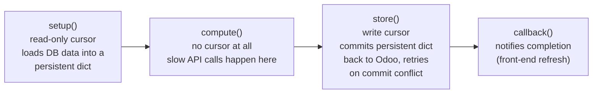
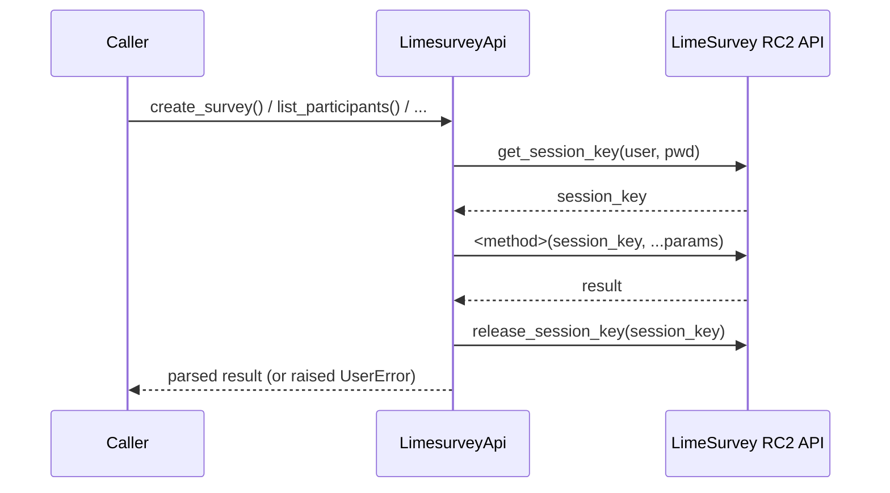

# Technical Reference: LimeSurvey integration (`models/communications/limesurvey.py`)

## Overview

Unlike [`ems.notice`](notice.md) (self-contained, sends through Odoo's own `ir.mail_server`),
this file talks to a real, external LimeSurvey instance over its RemoteControl 2 JSON-RPC
API. That makes it the module's actual external-API trust boundary: **no automated test in
this codebase may ever call the real, production-connected LimeSurvey API** — every test
against this file mocks the HTTP layer (`requests.post`). A separate local LimeSurvey
container exists for manual, non-automated verification only.

This doc is being filled in block by block, following the 5-block DTON split agreed for this
phase (`limesurvey_api` → module-level orchestration → `ems.limesurvey.header` →
`ems.limesurvey.recipient`/`.block`/`.enrollment`). Sections below are added as each block
lands.

---

## Architecture: why multithreading (`models/shared/multithreading.py`)

External API calls are slow, and Odoo times out long-running HTTP requests; the model group
solves this with `run_in_thread()`'s four-stage pattern:

`ems.limesurvey_header`'s `action_*` methods each build `setup`/`compute`/`store` closures
around this shared skeleton (`run_action()`, block 3) and hand them to `run_in_thread()`.
`ems.limesurvey_recipient` reuses the exact same skeleton for single-recipient actions.

---

## Block 2: `LimesurveyApi` — the raw RemoteControl 2 JSON-RPC client

`LimesurveyApi` (renamed from `limesurvey_api` in this pass, for PascalCase consistency with
every other class touched in this rollout) wraps LimeSurvey's RemoteControl 2 protocol:

**Every public method opens and releases its own session** — `_run_api_request()` calls
`_get_session_key()` before the request and `_release_session_key()` in a `finally` block
after, so a method that needs several RC2 calls (e.g. `create_survey`'s
`import_survey` → `set_survey_properties` → `activate_tokens`) does a full
handshake/release cycle per call, not once for the whole method. This matters for testing:
mocking `requests.post` for an N-call method requires 3×N queued responses (session key,
call, release — repeated per call), not N+2.

Credentials (`limesurvey_api`/`_usr`/`_pwd`/`_gid`) are read once in `__init__` from
`env.company`; `limesurvey_pwd` is itself a compute/inverse pair backed by Fernet-encrypted
storage (`models/settings/company.py`), same pattern as the Google Workspace service-account
JSON on the same model.

### Error handling

- `_parse_api_response()` centralizes the three ways an RC2 call can fail: non-200 HTTP
  status (raises with the response's own HTML error page scraped down to the `error-title`
  text via `_extract_limesurvey_html_error`), a non-JSON body, or a JSON body carrying an
  `error` key.
- `_run_api_request()` additionally raises if the call *succeeds* at the transport/JSON level
  but the RC2 `result` field is `None` — LimeSurvey uses this to signal permission/method
  errors that don't come back as an `error` key.
- Every public method (`create_survey`, `delete_survey`, `activate_survey`, ...) then applies
  its own success predicate on top of that (e.g. `delete_survey` treats `{"status": "No
  permission"}` as "already deleted" only if a follow-up `get_survey_properties` confirms the
  survey no longer exists).

### Fixed in this pass

- **`count_participants`**: local variable was named `list`, shadowing the Python builtin —
  harmless here (nothing else in the method needed `list()`) but a normalization fix per this
  rollout's convention. Renamed to `participants`.
- **`create_survey`**: bare `except:` → `except Exception:`.
- **`remind_participants`**: built a `data` list that conditionally included `part_ids`, but
  the actual `_run_api_request` call ignored it and always sent `[survey_id]` — meaning
  `part_ids` was silently dropped even when the caller passed it. Verified via grep that the
  only current caller (`do_send_reminders`, block 3) never passes `part_ids`, so this was
  latent/inert, not an active production bug — fixed anyway since the intent was clear and
  the fix is zero-risk (the params list is now actually threaded through to the RC2 call).
- **`get_group`**: compared `g['name'].lower()` against an un-lowercased `name` parameter —
  a case-sensitivity bug that would silently fail to match e.g. `"Students"` against a group
  literally named `"students"`. Verified via grep that `get_group` is never called anywhere
  in the current codebase (dead code) — fixed defensively (`name = name.lower()` added)
  since it's zero-risk and the bug would otherwise resurface the moment this method gets a
  caller.
- Class renamed `limesurvey_api` → `LimesurveyApi`; its two call sites
  (`run_action`'s `setup()` closure, and the survey-cleanup loop in `ems.limesurvey_header`)
  updated accordingly. Tabs → spaces throughout the class body.

No other bugs found in this class — the session handshake, error parsing, and each method's
own success/failure branches all matched their evident intent once traced against actual RC2
response shapes (a boolean/echo success flag per changed property, e.g. `{"expires": true}`
from `set_survey_properties`, not an echo of the submitted value — this shape is why
`deactivate_survey`/`reactivate_survey` can share the same `result.get("expires")` truthy
check despite setting the field to a date string vs. `None` respectively).

### Tests

`tests/test_limesurvey_api.py` (new, 33 tests) — every test mocks `requests.post` via
`unittest.mock.patch`, queuing one `(session_key, method_result, release_ack)` response
triplet per expected RC2 call. Covers the session handshake itself, `_parse_api_response`'s
three failure paths, `_extract_limesurvey_html_error`'s scraping, and each public method's
success/failure branches (including the `create_survey` cleanup-on-partial-failure path,
which mocks `delete_survey` directly to isolate it from the RC2 calls it would otherwise
trigger).

---

## Blocks 3-5 (pending)

Module-level orchestration (`do_*`, `run_action`, `load_persistent_data`),
`ems.limesurvey_header`, and `ems.limesurvey_recipient`/`.block`/`.enrollment` are DTON'd in
subsequent blocks of this same phase — see `project_dton_rollout_roadmap.md` for current
status.
