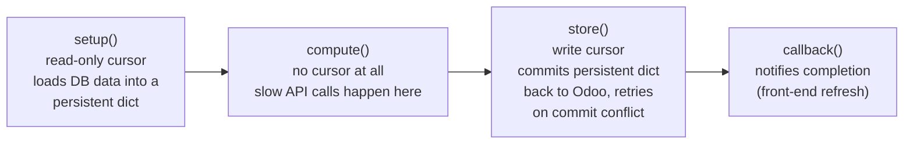
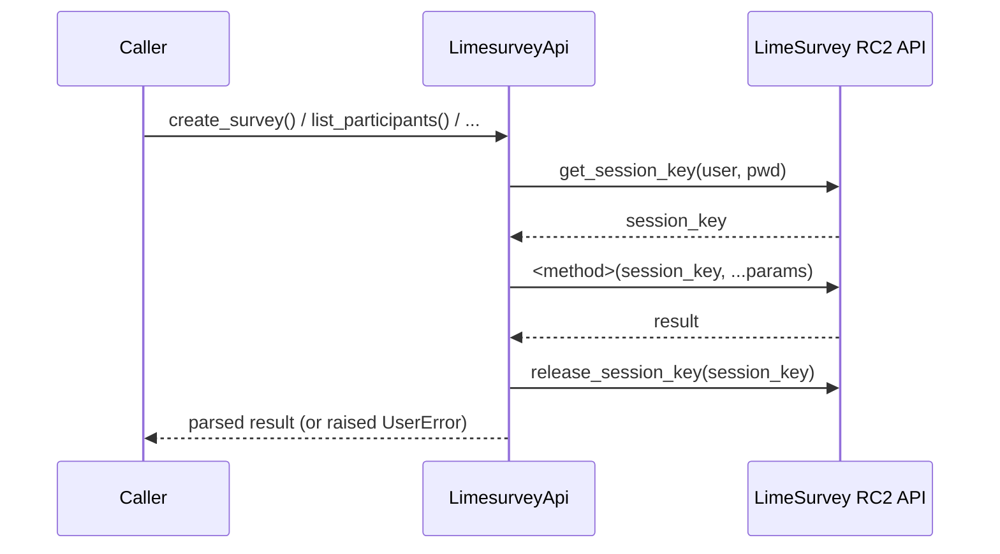
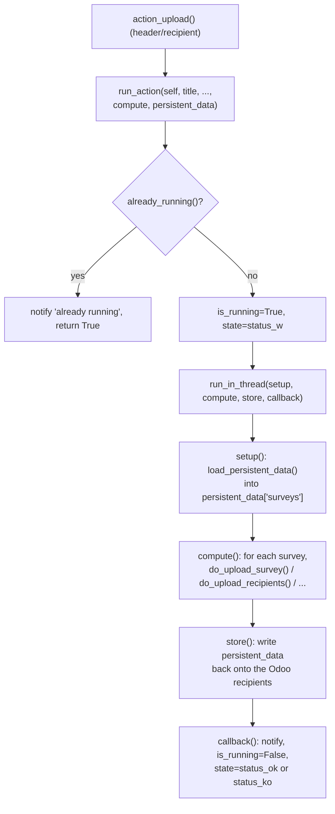

# Technical Reference: LimeSurvey integration (`models/communications/limesurvey.py`)

## Overview

Unlike [`ems.notice`](notice.md) (self-contained, sends through Odoo's own `ir.mail_server`),
this file talks to a real, external LimeSurvey instance over its RemoteControl 2 JSON-RPC
API. That makes it the module's actual external-API trust boundary: **no automated test in
this codebase may ever call the real, production-connected LimeSurvey API** — every test
against this file mocks the HTTP layer (`requests.post`). A separate local LimeSurvey
container exists for manual, non-automated verification only.

This doc is being filled in block by block, following the 5-block DTON split agreed for this
phase (`limesurvey_api` → module-level orchestration → `ems.limesurvey.header` →
`ems.limesurvey.recipient`/`.block`/`.enrollment`). Sections below are added as each block
lands.

---

## Architecture: why multithreading (`models/shared/multithreading.py`)

External API calls are slow, and Odoo times out long-running HTTP requests; the model group
solves this with `run_in_thread()`'s four-stage pattern:

`ems.limesurvey_header`'s `action_*` methods each build `setup`/`compute`/`store` closures
around this shared skeleton (`run_action()`, block 3) and hand them to `run_in_thread()`.
`ems.limesurvey_recipient` reuses the exact same skeleton for single-recipient actions.

---

## Block 2: `LimesurveyApi` — the raw RemoteControl 2 JSON-RPC client

`LimesurveyApi` (renamed from `limesurvey_api` in this pass, for PascalCase consistency with
every other class touched in this rollout) wraps LimeSurvey's RemoteControl 2 protocol:

**Every public method opens and releases its own session** — `_run_api_request()` calls
`_get_session_key()` before the request and `_release_session_key()` in a `finally` block
after, so a method that needs several RC2 calls (e.g. `create_survey`'s
`import_survey` → `set_survey_properties` → `activate_tokens`) does a full
handshake/release cycle per call, not once for the whole method. This matters for testing:
mocking `requests.post` for an N-call method requires 3×N queued responses (session key,
call, release — repeated per call), not N+2.

Credentials (`limesurvey_api`/`_usr`/`_pwd`/`_gid`) are read once in `__init__` from
`env.company`; `limesurvey_pwd` is itself a compute/inverse pair backed by Fernet-encrypted
storage (`models/settings/company.py`), same pattern as the Google Workspace service-account
JSON on the same model.

### Error handling

- `_parse_api_response()` centralizes the three ways an RC2 call can fail: non-200 HTTP
  status (raises with the response's own HTML error page scraped down to the `error-title`
  text via `_extract_limesurvey_html_error`), a non-JSON body, or a JSON body carrying an
  `error` key.
- `_run_api_request()` additionally raises if the call *succeeds* at the transport/JSON level
  but the RC2 `result` field is `None` — LimeSurvey uses this to signal permission/method
  errors that don't come back as an `error` key.
- Every public method (`create_survey`, `delete_survey`, `activate_survey`, ...) then applies
  its own success predicate on top of that (e.g. `delete_survey` treats `{"status": "No
  permission"}` as "already deleted" only if a follow-up `get_survey_properties` confirms the
  survey no longer exists).

### Fixed in this pass

- **`count_participants`**: local variable was named `list`, shadowing the Python builtin —
  harmless here (nothing else in the method needed `list()`) but a normalization fix per this
  rollout's convention. Renamed to `participants`.
- **`create_survey`**: bare `except:` → `except Exception:`.
- **`remind_participants`**: built a `data` list that conditionally included `part_ids`, but
  the actual `_run_api_request` call ignored it and always sent `[survey_id]` — meaning
  `part_ids` was silently dropped even when the caller passed it. Verified via grep that the
  only current caller (`do_send_reminders`, block 3) never passes `part_ids`, so this was
  latent/inert, not an active production bug — fixed anyway since the intent was clear and
  the fix is zero-risk (the params list is now actually threaded through to the RC2 call).
- **`get_group`**: compared `g['name'].lower()` against an un-lowercased `name` parameter —
  a case-sensitivity bug that would silently fail to match e.g. `"Students"` against a group
  literally named `"students"`. Verified via grep that `get_group` is never called anywhere
  in the current codebase (dead code) — fixed defensively (`name = name.lower()` added)
  since it's zero-risk and the bug would otherwise resurface the moment this method gets a
  caller.
- Class renamed `limesurvey_api` → `LimesurveyApi`; its two call sites
  (`run_action`'s `setup()` closure, and the survey-cleanup loop in `ems.limesurvey_header`)
  updated accordingly. Tabs → spaces throughout the class body.

No other bugs found in this class — the session handshake, error parsing, and each method's
own success/failure branches all matched their evident intent once traced against actual RC2
response shapes (a boolean/echo success flag per changed property, e.g. `{"expires": true}`
from `set_survey_properties`, not an echo of the submitted value — this shape is why
`deactivate_survey`/`reactivate_survey` can share the same `result.get("expires")` truthy
check despite setting the field to a date string vs. `None` respectively).

### Tests

`tests/test_limesurvey_api.py` (new, 33 tests) — every test mocks `requests.post` via
`unittest.mock.patch`, queuing one `(session_key, method_result, release_ack)` response
triplet per expected RC2 call. Covers the session handshake itself, `_parse_api_response`'s
three failure paths, `_extract_limesurvey_html_error`'s scraping, and each public method's
success/failure branches (including the `create_survey` cleanup-on-partial-failure path,
which mocks `delete_survey` directly to isolate it from the RC2 calls it would otherwise
trigger).

---

## Block 3: module-level orchestration (`do_*`, `run_action`, `load_persistent_data`)

Two regions of plain module-level functions (not methods — they take `ls_api`/`self` as
ordinary parameters, callable from either `ems.limesurvey_header` or
`ems.limesurvey_recipient`) sit between `LimesurveyApi` and the models that use it:

- **`do_*` functions** ("DETACHED PUBLIC METHODS" region): one function per user-facing
  action (`do_upload_survey`, `do_open_survey`, `do_remove_recipients`, ...). Each wraps its
  body in `_do()`, which normalizes the return contract (`True`/`False`) and, on any
  exception, stamps `traceback.format_exc()` onto every recipient dict in `survey["recipients"]`
  so the error surfaces per-row in the UI instead of only in the server log.
- **`run_action` / `load_persistent_data`** ("ATTACHED & SHARED METHODS" region): the glue
  between a model's `action_*` method and the `setup`/`compute`/`store`/`callback` skeleton
  described above. `run_action` builds the four closures and hands them to
  `self.run_in_thread(...)`; `load_persistent_data` walks either a header's
  `limesurvey_recipient_ids` or a single recipient and groups them by `internal_id` into the
  `surveys` dict that `compute()` and `do_*` operate on.

### Fixed in this pass

- **`run_action`'s synchronous-failure path was silently broken.** If `run_in_thread()` ever
  raised *before* spawning its thread (the only realistic case: the OS refuses to create a
  new thread), the `except Exception:` handler called `callback(self, traceback.format_exc())`
  — but `callback` only accepts `self`. That raised a `TypeError` inside the handler, which
  the immediately-following `finally: return True` then silently discarded (a `return` inside
  `finally` unconditionally swallows any exception in flight). Net effect: the caller saw
  `True` as if everything succeeded, `is_running` stayed `True` forever (blocking every future
  action on that record via `already_running()`), and the user got no failure notification at
  all. Fixed by threading the error through `persistent_data` — the same channel every other
  failure path in this function already uses — before calling `callback(self)` with its real
  signature. Covered by `test_run_action_recovers_when_run_in_thread_raises_synchronously`,
  which forces `run_in_thread` to raise and asserts `is_running` correctly resets to `False`
  and `state` correctly moves to `status_ko`.
- **`run_action` returned `None`, not `True`, when `already_running()` was true.** Every other
  path returns `True` (the `finally: return True` on the try/except covers both the success
  and the exception-recovery cases); the `if not self.already_running():` guard skipping that
  whole block left the function falling off the end with an implicit `None` instead. Harmless
  in practice (Odoo button-triggered methods treat `None`/`True` the same — no action /
  refresh), but inconsistent with the rest of the function's contract. Fixed with an explicit
  `return True` after the guarded block.
- **`load_persistent_data`'s guard clause raised the wrong thing.** `raise
  NotImplemented("...")` — `NotImplemented` is the singleton sentinel object used for
  `__eq__`-style protocol fallbacks, not an exception class, so calling it
  (`NotImplemented("...")`) itself raises `TypeError: 'NotImplementedType' object is not
  callable` before the intended message is ever seen. Verified this branch is otherwise
  unreachable in the current codebase (only ever called with `self` being
  `ems.limesurvey_header` or `ems.limesurvey_recipient`) — fixed to `raise
  NotImplementedError("...")` regardless, since the wrong exception type would otherwise
  confuse whoever eventually hits it.
- `_do`'s `except Exception as e:` — `e` was unused; narrowed to `except Exception:`.
- Tabs → spaces throughout both regions, matching this rollout's normalization convention.

### Found, not fixed — logged as a gap

`_build_csv()`'s `department` column is a hardcoded literal `"DEPARTMENT"`, not read from the
survey response like every other column. See
[`plans/limesurvey_csv_department_placeholder.md`](../../../../plans/limesurvey_csv_department_placeholder.md)
— fixing it needs input on where the real value should come from (a survey question key, or a
derived lookup), which is business knowledge, not a normalization call.

### Tests

`tests/test_limesurvey_orchestration.py` (new, 33 tests):
- `TestDetachedHelpers` — `_do`, `_email_not_empty`, `_clean_trainer`, `_build_csv`, no DB or
  API involved.
- `TestDoFunctions` — every `do_*` function against a `MagicMock()` standing in for
  `LimesurveyApi` (never the real class, let alone the real API), covering each function's
  success and failure branches, including `do_upload_recipient_changes`'s three-way branch
  (update in place / move to an existing survey / create a brand-new survey).
- `TestLoadPersistentData` — real `ems.limesurvey_header`/`ems.limesurvey_recipient` records
  (this shared infrastructure needs real Odoo recordsets, not mocks), covering both calling
  conventions (header walking its recipients; a single recipient loading its own survey), the
  grouping-by-`internal_id` behavior, and the `NotImplementedError` guard.
- `TestRunAction` — real header record with `run_in_thread` patched (`autospec=True`) to run
  the four closures synchronously, or to raise, isolating `run_action`'s own control flow from
  actual threading. Covers the success path, the synchronous-failure regression above, and the
  already-running guard.

---

## Blocks 4-5 (pending)

`ems.limesurvey_header` and `ems.limesurvey_recipient`/`.block`/`.enrollment` are DTON'd in
subsequent blocks of this same phase — see `project_dton_rollout_roadmap.md` for current
status.
