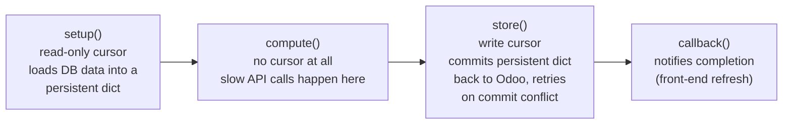
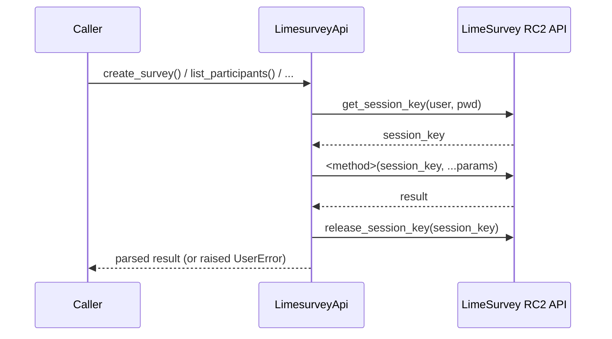
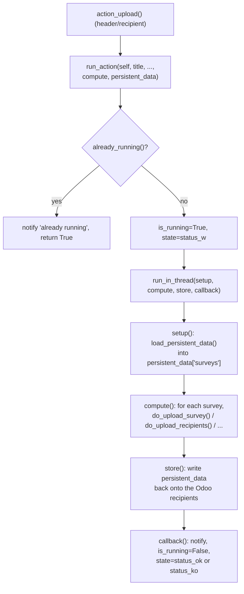
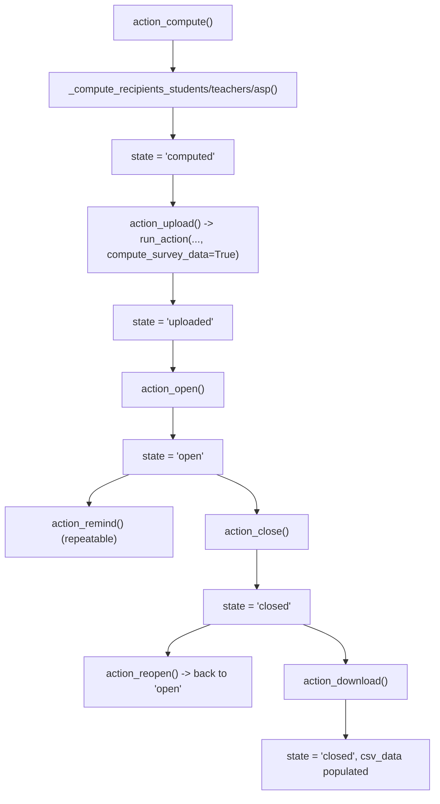

# Technical Reference: LimeSurvey integration (`models/communications/limesurvey.py`)

## Overview

Unlike [`ems.notice`](notice.md) (self-contained, sends through Odoo's own `ir.mail_server`),
this file talks to a real, external LimeSurvey instance over its RemoteControl 2 JSON-RPC
API. That makes it the module's actual external-API trust boundary: **no automated test in
this codebase may ever call the real, production-connected LimeSurvey API** — every test
against this file mocks the HTTP layer (`requests.post`). A separate local LimeSurvey
container exists for manual, non-automated verification only.

This doc is being filled in block by block, following the 5-block DTON split agreed for this
phase (`limesurvey_api` → module-level orchestration → `ems.limesurvey.header` →
`ems.limesurvey.recipient`/`.block`/`.enrollment`). Sections below are added as each block
lands.

---

## Architecture: why multithreading ([`ems.multithreading`](../shared/multithreading.md))

External API calls are slow, and Odoo times out long-running HTTP requests; the model group
solves this with `run_in_thread()`'s four-stage pattern:

`ems.limesurvey_header`'s `action_*` methods each build `setup`/`compute`/`store` closures
around this shared skeleton (`run_action()`, block 3) and hand them to `run_in_thread()`.
`ems.limesurvey_recipient` reuses the exact same skeleton for single-recipient actions.

---

## Block 2: `LimesurveyApi` — the raw RemoteControl 2 JSON-RPC client

`LimesurveyApi` (renamed from `limesurvey_api` in this pass, for PascalCase consistency with
every other class touched in this rollout) wraps LimeSurvey's RemoteControl 2 protocol:

**Every public method opens and releases its own session** — `_run_api_request()` calls
`_get_session_key()` before the request and `_release_session_key()` in a `finally` block
after, so a method that needs several RC2 calls (e.g. `create_survey`'s
`import_survey` → `set_survey_properties` → `activate_tokens`) does a full
handshake/release cycle per call, not once for the whole method. This matters for testing:
mocking `requests.post` for an N-call method requires 3×N queued responses (session key,
call, release — repeated per call), not N+2.

Credentials (`limesurvey_api`/`_usr`/`_pwd`/`_gid`) are read once in `__init__` from
`env.company`; `limesurvey_pwd` is itself a compute/inverse pair backed by Fernet-encrypted
storage (`models/settings/company.py`), same pattern as the Google Workspace service-account
JSON on the same model.

### Error handling

- `_parse_api_response()` centralizes the three ways an RC2 call can fail: non-200 HTTP
  status (raises with the response's own HTML error page scraped down to the `error-title`
  text via `_extract_limesurvey_html_error`), a non-JSON body, or a JSON body carrying an
  `error` key.
- `_run_api_request()` additionally raises if the call *succeeds* at the transport/JSON level
  but the RC2 `result` field is `None` — LimeSurvey uses this to signal permission/method
  errors that don't come back as an `error` key.
- Every public method (`create_survey`, `delete_survey`, `activate_survey`, ...) then applies
  its own success predicate on top of that (e.g. `delete_survey` treats `{"status": "No
  permission"}` as "already deleted" only if a follow-up `get_survey_properties` confirms the
  survey no longer exists).

### Fixed in this pass

- **`count_participants`**: local variable was named `list`, shadowing the Python builtin —
  harmless here (nothing else in the method needed `list()`) but a normalization fix per this
  rollout's convention. Renamed to `participants`.
- **`create_survey`**: bare `except:` → `except Exception:`.
- **`remind_participants`**: built a `data` list that conditionally included `part_ids`, but
  the actual `_run_api_request` call ignored it and always sent `[survey_id]` — meaning
  `part_ids` was silently dropped even when the caller passed it. Verified via grep that the
  only current caller (`do_send_reminders`, block 3) never passes `part_ids`, so this was
  latent/inert, not an active production bug — fixed anyway since the intent was clear and
  the fix is zero-risk (the params list is now actually threaded through to the RC2 call).
- **`get_group`**: compared `g['name'].lower()` against an un-lowercased `name` parameter —
  a case-sensitivity bug that would silently fail to match e.g. `"Students"` against a group
  literally named `"students"`. Verified via grep that `get_group` is never called anywhere
  in the current codebase (dead code) — fixed defensively (`name = name.lower()` added)
  since it's zero-risk and the bug would otherwise resurface the moment this method gets a
  caller.
- Class renamed `limesurvey_api` → `LimesurveyApi`; its two call sites
  (`run_action`'s `setup()` closure, and the survey-cleanup loop in `ems.limesurvey_header`)
  updated accordingly. Tabs → spaces throughout the class body.

No other bugs found in this class — the session handshake, error parsing, and each method's
own success/failure branches all matched their evident intent once traced against actual RC2
response shapes (a boolean/echo success flag per changed property, e.g. `{"expires": true}`
from `set_survey_properties`, not an echo of the submitted value — this shape is why
`deactivate_survey`/`reactivate_survey` can share the same `result.get("expires")` truthy
check despite setting the field to a date string vs. `None` respectively).

### Tests

`tests/test_limesurvey_api.py` (new, 33 tests) — every test mocks `requests.post` via
`unittest.mock.patch`, queuing one `(session_key, method_result, release_ack)` response
triplet per expected RC2 call. Covers the session handshake itself, `_parse_api_response`'s
three failure paths, `_extract_limesurvey_html_error`'s scraping, and each public method's
success/failure branches (including the `create_survey` cleanup-on-partial-failure path,
which mocks `delete_survey` directly to isolate it from the RC2 calls it would otherwise
trigger).

---

## Block 3: module-level orchestration (`do_*`, `run_action`, `load_persistent_data`)

Two regions of plain module-level functions (not methods — they take `ls_api`/`self` as
ordinary parameters, callable from either `ems.limesurvey_header` or
`ems.limesurvey_recipient`) sit between `LimesurveyApi` and the models that use it:

- **`do_*` functions** ("DETACHED PUBLIC METHODS" region): one function per user-facing
  action (`do_upload_survey`, `do_open_survey`, `do_remove_recipients`, ...). Each wraps its
  body in `_do()`, which normalizes the return contract (`True`/`False`) and, on any
  exception, stamps `traceback.format_exc()` onto every recipient dict in `survey["recipients"]`
  so the error surfaces per-row in the UI instead of only in the server log.
- **`run_action` / `load_persistent_data`** ("ATTACHED & SHARED METHODS" region): the glue
  between a model's `action_*` method and the `setup`/`compute`/`store`/`callback` skeleton
  described above. `run_action` builds the four closures and hands them to
  `self.run_in_thread(...)`; `load_persistent_data` walks either a header's
  `limesurvey_recipient_ids` or a single recipient and groups them by `internal_id` into the
  `surveys` dict that `compute()` and `do_*` operate on.

### Fixed in this pass

- **`run_action`'s synchronous-failure path was silently broken.** If `run_in_thread()` ever
  raised *before* spawning its thread (the only realistic case: the OS refuses to create a
  new thread), the `except Exception:` handler called `callback(self, traceback.format_exc())`
  — but `callback` only accepts `self`. That raised a `TypeError` inside the handler, which
  the immediately-following `finally: return True` then silently discarded (a `return` inside
  `finally` unconditionally swallows any exception in flight). Net effect: the caller saw
  `True` as if everything succeeded, `is_running` stayed `True` forever (blocking every future
  action on that record via `already_running()`), and the user got no failure notification at
  all. Fixed by threading the error through `persistent_data` — the same channel every other
  failure path in this function already uses — before calling `callback(self)` with its real
  signature. Covered by `test_run_action_recovers_when_run_in_thread_raises_synchronously`,
  which forces `run_in_thread` to raise and asserts `is_running` correctly resets to `False`
  and `state` correctly moves to `status_ko`.
- **`run_action` returned `None`, not `True`, when `already_running()` was true.** Every other
  path returns `True` (the `finally: return True` on the try/except covers both the success
  and the exception-recovery cases); the `if not self.already_running():` guard skipping that
  whole block left the function falling off the end with an implicit `None` instead. Harmless
  in practice (Odoo button-triggered methods treat `None`/`True` the same — no action /
  refresh), but inconsistent with the rest of the function's contract. Fixed with an explicit
  `return True` after the guarded block.
- **`load_persistent_data`'s guard clause raised the wrong thing.** `raise
  NotImplemented("...")` — `NotImplemented` is the singleton sentinel object used for
  `__eq__`-style protocol fallbacks, not an exception class, so calling it
  (`NotImplemented("...")`) itself raises `TypeError: 'NotImplementedType' object is not
  callable` before the intended message is ever seen. Verified this branch is otherwise
  unreachable in the current codebase (only ever called with `self` being
  `ems.limesurvey_header` or `ems.limesurvey_recipient`) — fixed to `raise
  NotImplementedError("...")` regardless, since the wrong exception type would otherwise
  confuse whoever eventually hits it.
- `_do`'s `except Exception as e:` — `e` was unused; narrowed to `except Exception:`.
- Tabs → spaces throughout both regions, matching this rollout's normalization convention.

### Found, not fixed — logged as a gap

`_build_csv()`'s `department` column is a hardcoded literal `"DEPARTMENT"`, not read from the
survey response like every other column. See
[`plans/limesurvey_csv_department_placeholder.md`](../../../../plans/limesurvey_csv_department_placeholder.md)
— fixing it needs input on where the real value should come from (a survey question key, or a
derived lookup), which is business knowledge, not a normalization call.

### Tests

`tests/test_limesurvey_orchestration.py` (new, 33 tests):
- `TestDetachedHelpers` — `_do`, `_email_not_empty`, `_clean_trainer`, `_build_csv`, no DB or
  API involved.
- `TestDoFunctions` — every `do_*` function against a `MagicMock()` standing in for
  `LimesurveyApi` (never the real class, let alone the real API), covering each function's
  success and failure branches, including `do_upload_recipient_changes`'s three-way branch
  (update in place / move to an existing survey / create a brand-new survey).
- `TestLoadPersistentData` — real `ems.limesurvey_header`/`ems.limesurvey_recipient` records
  (this shared infrastructure needs real Odoo recordsets, not mocks), covering both calling
  conventions (header walking its recipients; a single recipient loading its own survey), the
  grouping-by-`internal_id` behavior, and the `NotImplementedError` guard.
- `TestRunAction` — real header record with `run_in_thread` patched (`autospec=True`) to run
  the four closures synchronously, or to raise, isolating `run_action`'s own control flow from
  actual threading. Covers the success path, the synchronous-failure regression above, and the
  already-running guard.

---

## Block 4: `ems.limesurvey_header`

The survey definition and the entry point for every action (`action_compute`,
`action_upload`, `action_open`, `action_close`, `action_reopen`, `action_download`,
`action_remind`, `action_draft`, `action_remove`) — each `action_*` (other than `action_compute`
/`action_draft`, which are pure-DB and need no threading) builds a `compute()` closure that
iterates `persistent_data["surveys"]` and calls the matching `do_*` function from
[Block 3](#block-3-module-level-orchestration-do_-run_action-load_persistent_data), then hands
it to `run_action()`.

`compute_survey_data(recipient, only_key)` builds each recipient's survey key (a SHA-256 hash
of a `survey_name` string built from the header + its `limesurvey_block_ids`, so two
recipients whose blocks resolve identically end up sharing one survey) and, when `only_key` is
`False`, the actual TSV content sent to `create_survey`. Blocks can be **special** (filtered by
course/WPI-enrollment/per-subject-enrollment) or plain; a `special_subject_enrolled` block is
repeated once per non-tutorship subject enrollment on the recipient.

### Fixed in this pass

- **Significant bug in `compute_survey_data`'s per-subject-enrollment branch.** The line
  deciding whether to append teacher names to a subject block's title read `if
  len(teacher_name) > 0:` — but `teacher_name` (singular) is a *different* variable, only ever
  assigned later in the method's `if append:` branch, which a `special_subject_enrolled` block
  never reaches (`append` stays `False` for it). The correctly-computed value for *this*
  iteration was `teachers_names` (plural, built two lines above from `ems.teaching` records for
  the current enrollment's group+subject). Concretely, this meant: (a) if no earlier block in
  the same `limesurvey_block_ids` loop had happened to set `teacher_name` yet — e.g. a
  subject-enrolled block is the *first* block — the method raised `UnboundLocalError:
  local variable 'teacher_name' referenced before assignment`, crashing survey generation
  entirely; (b) otherwise, it silently used a **stale value left over from an unrelated
  earlier block** to decide whether to show *this* subject's actual teachers, either dropping
  real teacher names or (less likely) appending them based on the wrong condition. Fixed by
  using `teachers_names` (the freshly-computed, correct value) in the condition. Regression-
  covered by `TestComputeSurveyData.test_teacher_names_are_appended_to_subject_block_title`,
  which deliberately makes the subject-enrolled block the *only* block on the header (so the
  old code would have hit the `UnboundLocalError` path, not just the stale-value path).
- **`_compute_recipients_teachers`/`_compute_recipients_asp`** — same `raise
  NotImplemented("...")` mistake as Block 3's `load_persistent_data` (`NotImplemented` is the
  singleton comparison-protocol sentinel, not an exception class — calling it raises `TypeError:
  'NotImplementedType' object is not callable`). `action_compute`'s own `try/except Exception`
  already caught whichever `TypeError` resulted, so this wasn't a hard crash, just a confusing
  message ("...'NotImplementedType' object is not callable" instead of "...Coming soon...").
  Fixed to `raise NotImplementedError(_("Coming soon..."))` — newly-wrapped literal, `.po`
  entries added to `i18n/ca_ES.po`/`i18n/es_ES.po`.
- Class renamed `ems_limesurvey_header` → `EmsLimesurveyHeader`; added `_order = "create_date
  desc"` (matching `ems.notice`'s precedent — most-recent-first is the natural listing order
  for a wizard-like record with no other obvious sort key). Loop variables normalized to match
  their model (`rec` → `recipient`/`header`, `std`/`grp` → `study`/`group` in the two onchange
  methods) per this rollout's convention. Tabs → spaces throughout.

### Testing note: `unlink()` and `action_upload()` etc. can reach the real API directly

Unlike `run_action()`'s callers (which go through `run_in_thread`, itself easy to patch),
`unlink()` calls `LimesurveyApi(self.env).delete_survey(...)` **synchronously, inline**, for
any recipient that still has an `external_id`. A test that deletes an "uploaded" header
without mocking `LimesurveyApi` would silently attempt a real network call using whatever
`env.company.limesurvey_api/_usr/_pwd/_gid` happens to be configured on this box. Every test
that exercises this path patches `LimesurveyApi` at the module level
(`odoo.addons.ems.models.communications.limesurvey.LimesurveyApi`) to a `MagicMock` first.

### Tests

`tests/test_limesurvey_header.py` (new, 21 tests):
- `TestLimesurveyHeaderCore` — required fields, the two onchange cascades, `action_compute`'s
  recipient-building (group/level/study filters, email fallback `student_email` → `email`,
  enrollment sub-records, exclusion of students with no `main_group_id`), `action_draft`,
  `unlink()`'s three state-gated branches (blocked / redirect-warning / allowed) plus the
  API-touching branch (mocked), `action_get_csv`, `action_none`, and one representative
  `action_upload()` run with both `LimesurveyApi` and `run_in_thread` mocked end-to-end to
  prove the wiring works without ever touching the network.
- `TestComputeSurveyData` — the regression test for the `teacher_name`/`teachers_names` bug
  above, plus a smoke test of `only_key=True` mode.

---

## Block 5: `ems.limesurvey_recipient` / `.block` / `.enrollment`

Three smaller satellite models:

- **`ems.limesurvey_block`** — one content block within a header's TSV, with optional
  `special_*` filters (course, WPI-enrollment, per-subject-enrollment, tutorship) consumed by
  `compute_survey_data` (Block 4).
- **`ems.limesurvey_recipient`** — one row per person invited to a survey; can be
  auto-populated (`ems.limesurvey_header._compute_recipients_students`) or added manually
  (`state='manual'` at create time, restored from the linked `student_id` via
  `action_restore()`, then immediately flipped to `'pending'` — `'manual'` never survives as a
  persisted value, it only exists to trigger the restore-and-normalize dance inside `create()`).
  Its own `action_upload`/`action_remind`/`action_delete` mirror the header's actions
  ([Block 3](#block-3-module-level-orchestration-do_-run_action-load_persistent_data)/
  [Block 4](#block-4-emslimesurvey_header)) but operate on a single recipient.
- **`ems.limesurvey_enrollment`** — a recipient-scoped *copy* of the student's real
  `ems.enrollment` rows, editable independently so quality staff can tweak survey content
  without touching the real enrollment data (only secretarial staff should do that).

### Fixed in this pass

- **Two real bugs found and fixed in `action_remind`/`action_delete`.** Unlike every other
  `run_action`-based method in this file (`action_upload` here, and all six
  `ems.limesurvey_header` actions), these two skipped the `success = persistent_data["success"]`
  / `if success:` guard entirely and went straight to `for key in persistent_data["surveys"]:`.
  If `setup()` ever failed (i.e. `load_persistent_data`/`compute_survey_data` raised for this
  recipient — a realistic possibility given how much `compute_survey_data` does), `persistent_data["surveys"]`
  is never populated, and this unconditional access raises `KeyError: 'surveys'` inside
  `compute()`. In real (non-mocked) usage `compute()` runs inside `run_in_thread`'s background
  thread, **outside** any try/except of `run_action`'s own (that only wraps the call that
  *starts* the thread) — an uncaught exception there is silently swallowed by Python's default
  thread exception handling, so the failure would never reach the user: the record would just
  sit stuck in `is_running=True` forever with no notification, same class of symptom as the
  `run_action` bug fixed in Block 3, but reachable through a different gap. Fixed by adding the
  same `success = persistent_data["success"]` / `if success:` guard already used everywhere
  else in this file. Regression-covered (within the practical limits of a synchronous-mock
  test harness — see `test_action_remind_survives_failed_setup`/
  `test_action_delete_survives_failed_setup`) by forcing `load_persistent_data` to raise and
  confirming the call completes without raising.
- **`create()`'s manual-recipient path crashed with `KeyError: 'student_id'`** if a `'manual'`
  record was created without a `student_id` at all — `self.env["res.partner"].browse([v["student_id"]])`
  used direct dict-bracket access instead of `.get()`. `action_restore()` (called right after)
  already handles "no student" gracefully (`else: return False`), so the autofill block should
  too. Fixed to `browse(v.get("student_id"))` (Odoo's `browse()` treats `None`/falsy as an
  empty recordset, so `student.name`/`student.student_email` cleanly read as `False` when
  absent — no behavior change for the normal case where `student_id` is provided, which the
  UI's add-student popup always does).
- Classes renamed `ems_limesurvey_block`/`ems_limesurvey_recipient`/`ems_limesurvey_enrollment`
  → `EmsLimesurveyBlock`/`EmsLimesurveyRecipient`/`EmsLimesurveyEnrollment`. Loop variables
  normalized (`rec` → `block`/`recipient`/`enrollment` per model). Tabs → spaces.

### Found, not fixed — logged as a gap

`ems.limesurvey_block._onchange_special`'s mutual-exclusion between `special_wpi_enrolled` and
`special_subject_enrolled` only works in one direction (checking WPI clears Subject; checking
Subject while WPI is already on silently reverts Subject with no feedback) — the `elif`
branch can never fire with a `True` value to clear. Already flagged by a pre-existing TODO
comment on that line questioning whether checkboxes are even the right widget here; picking a
fix (symmetric onchange vs. converting to a radio-button `Selection` field) is a product
decision. See
[`plans/limesurvey_block_special_mutual_exclusion_asymmetry.md`](../../../../plans/limesurvey_block_special_mutual_exclusion_asymmetry.md).

### Testing note

Same rule as Block 4: `ems.limesurvey_recipient.create()`'s manual-add-to-an-already-uploaded-header
path calls both a real `self.env.cr.commit()` (stubbed via `patch.object(self.env.cr, 'commit')`
in tests — Odoo's `TransactionCase` forbids real commits) and `action_upload()` (which reaches
`run_in_thread`/`LimesurveyApi` exactly like every other action — both mocked, same as
elsewhere in this phase).

### Tests

`tests/test_limesurvey_recipient.py` (new, 19 tests): `TestLimesurveyBlock` (the onchange,
including a test documenting the known asymmetry above), `TestLimesurveyRecipient`
(`action_restore`, `create()`'s manual-state autofill and its two bugs above, `_compute_inuse_student_ids`
— tested via `write()` since `'manual'` never survives `create()`, `open_error_popup`, and
`action_remind`/`action_delete`'s happy path plus their failed-setup robustness), and
`TestLimesurveyEnrollment` (`_compute_inuse_subject_ids`, the `related` fields).

---

## Phase summary

All five blocks of this phase are complete. `limesurvey.py`'s full DTON pass: every class
renamed to PascalCase, all tabs converted to spaces, loop variables normalized to their model,
9 real bugs found and fixed (4 in `LimesurveyApi`, 2 in `run_action`, 1 in
`load_persistent_data`, 1 in `compute_survey_data`, 1 in `_compute_recipients_teachers`/`_asp`,
2 in `action_remind`/`action_delete` — see each block's section above for details), 2 gaps
found and left for a product decision (the CSV `department` placeholder, the block
special-fields mutual-exclusion asymmetry), and full test coverage added from zero
(`tests/test_limesurvey_api.py`, `test_limesurvey_orchestration.py`, `test_limesurvey_header.py`,
`test_limesurvey_recipient.py`) — every single test mocking the network/API layer, per the
standing rule that no automated test in this codebase may ever call the real,
production-connected LimeSurvey service.
