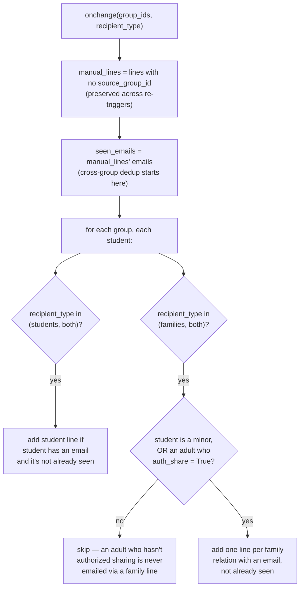
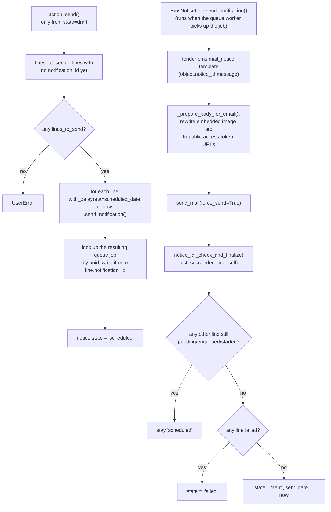

# Technical Reference: `ems.notice` / `ems.notice.line`

## Overview

`ems.notice` is a bulk email — one message sent to students and/or their families across one
or more groups. Entirely self-contained: sent through Odoo's own `ir.mail_server`, no
external service involved (unlike [`ems.limesurvey*`](limesurvey.md), the other model group
in this phase, which talks to a real LimeSurvey instance).

**Module file:** `models/communications/notice.py` (`EmsNotice`, `EmsNoticeLine`)

---

## Fields

| Field | Type | Notes |
|-------|------|-------|
| `state` | `Selection` (draft/scheduled/sent/failed) | `draft` → `action_send()` → `scheduled` → (async, via `_check_and_finalize`) → `sent`/`failed`. `action_cancel()` returns to `draft`. |
| `use_schedule`/`scheduled_date` | `Boolean`/`Datetime` | If set, `action_send()` passes `scheduled_date` as the queue job's `eta` — recipients get the email at that time, not immediately. |
| `recipient_type` | `Selection` (students/families/both) | Drives `_build_auto_lines`' filtering. |
| `notice_line_ids` | `One2many → ems.notice.line` | Mix of auto-populated (from `group_ids`, `source_group_id` set) and manually-added (no `source_group_id`) rows — see below. |
| `can_cancel` | computed | `True` only when `state == 'scheduled'` **and** `use_schedule` **and** no line's job has reached `started`/`done`/`failed` yet. An immediate send (`use_schedule=False`) can never be cancelled, even before the queue actually processes it — it's treated as already committed the moment it's sent. |

`ems.notice.line`: one row per recipient — `email`, `recipient_type` (student/family),
`source_group_id` (which auto-population group produced this row; `False` for a manually
added recipient), `notification_id` (the `queue.job` tracking this line's send).

---

## Recipient auto-population (`_build_auto_lines` / `_onchange_groups`)

Re-triggering the onchange (e.g. adding another group) never duplicates or drops a manually
added recipient — only the auto-populated set (`source_group_id` set) gets rebuilt from
scratch each time; anything without `source_group_id` is untouched.

---

## Sending: `action_send()` → queued jobs → `_check_and_finalize()`

`just_succeeded_line` exists because of a real timing gap: by the time `_check_and_finalize`
runs *inside* `send_notification()`, the job that's currently executing may still report its
own `queue.job.state` as `started` (the transition to `done` happens after the method
returns) — so the method explicitly treats the currently-running line as already-done rather
than reading its (momentarily stale) `display_status`.

**`send_notification()` registers a `postrollback` hook** (`self.env.cr.postrollback.add`)
so that if the job itself fails and its transaction rolls back, the notice's state still gets
finalized in a **separate, already-committed cursor** — `queue_job` marks a failed job's
state in its own committed transaction before the rollback happens, so by the time the hook
runs, reading that job's state from a fresh cursor is reliable.

---

## `_prepare_body_for_email`: images need public URLs, not editor-internal ones

The rich-text `message` field can contain images two ways — pasted as a base64 data URI, or
already uploaded as an `ir.attachment` referenced via `/web/image/<id>` (no access token,
since the *editor* is authenticated and doesn't need one). Neither works unmodified in an
outbound email to an external recipient:

- **`data:image/...;base64,...`** → decoded and saved as a real `ir.attachment` (owned by
  this `ems.notice.line`), then rewritten to `/web/image/<id>?access_token=<token>`.
- **`/web/image/<id>`** (no token) → the existing attachment gets an access token generated
  (if it doesn't have one yet) and the URL is rewritten to include it.

**Known inefficiency, not fixed in this pass:** a data-URI image is re-decoded and
re-uploaded as a **new** `ir.attachment` independently for every recipient line, since each
line renders and processes the shared `notice.message` HTML on its own. For a notice with an
embedded image sent to N recipients, this creates N duplicate attachments holding identical
image data. Not incorrect (each line's email still renders correctly), just wasteful storage
— left as-is since deduplicating across lines would be a real behavior change (e.g. caching
by content hash on the parent `ems.notice` instead), not a normalization fix.

---

## Access control

**Updated 2026-09-05** — Head of Studies/Deputy Head of Studies (`ems.group_head_of_studies`,
the same group covers both roles) and the Quality coordinator (`ems.group_quality_admin`) now
have their own `ir.model.access.csv` rows for `ems.notice`/`ems.notice.line`, alongside
`ems.group_academic_admin`'s pre-existing full access.

| Group | Sees | Creates/edits/deletes |
|-------|------|------------------------|
| `group_academic_admin`, `group_director` | Every notice | Every notice |
| `group_head_of_studies` (HOS/DHOS) | Only notices they created | Only notices they created |
| `group_quality_admin` (Quality coordinator) | Only notices they created | Only notices they created |

Enforced by `security/rules/communications.xml`: `rule_notice_admin`/`rule_notice_line_admin`
(`domain_force=[(1,'=',1)]`, groups `group_academic_admin` + `group_director`) and
`rule_notice_own`/`rule_notice_line_own` (`domain_force=[('create_uid','=',user.id)]` — the
line variant reads through `notice_id.create_uid` instead, since lines have no menu of their
own — groups `group_head_of_studies` + `group_quality_admin`).

**Bug fixed in this pass:** `rule_notice_own` previously had **no `groups` restriction at
all** (a "global" rule). Odoo combines a global rule with every other rule via **AND**, not as
an alternative OR — so `rule_notice_admin`'s `[(1,'=',1)]` was silently ANDed with
`rule_notice_own`'s `create_uid = user.id`, meaning **an academic admin only ever saw their
own notices too**, contradicting the rule's own name/comment ("Admins see all
communications"). Verified against `odoo/addons/base/models/ir_rule.py::_compute_domain`
(global rules → `global_domains`, always ANDed; group rules the user belongs to → ORed
together, then ANDed onto the global result) and with a real before/after test
(`TestNoticeAccessControl.test_admin_sees_all_notices`, `tests/test_notice.py`). The fix scopes
`rule_notice_own` to the two non-admin groups explicitly instead of leaving it global. Note
this is a *different* trap from `ems.enrollment`'s secretary rule in
`docs/en/developers/contacts/enrollment.md` (an unrestricted **group-scoped** rule made moot by
a `0`-everywhere model-access ceiling, not a global rule ANDing against another group's rule) —
that file's "inert, not a bug" conclusion still holds and wasn't affected by this fix.

`unlink()` is now also guarded in Python: a notice can only be hard-deleted while in `draft`
state (nothing sent yet); once scheduled/sent/failed, `UserError` tells the caller to
**archive** it instead (`ems.base`'s standard `action_archive()` / `active` field). This
applies to every group, including admins, since a sent notice has real delivery history
(`queue.job` records via `notice_line_id.notification_id`) worth preserving.

## Views

| View | File |
|------|------|
| List/Form | `views/communications/notice/{list,form}.xml` |
| Menu | `views/communications/menu.xml` ("Notices") |
| Mail template | `mails/communications/communication.xml` (`ems.mail_notice`) |

## Fixed in this pass (2026-07-28)

None — the file was already clean (PascalCase classes, no Spanish comments, consistent
`_()` usage, spaces indentation) before this pass; this was a pure T + D pass. New
`tests/test_notice.py` (24 tests across both classes) — zero coverage existed before. No
bugs found on a careful read of the send/finalize/cancel state machine or the image-rewrite
logic; the one real inefficiency found (duplicate attachment creation per recipient,
above) was judged not worth a behavior change in a normalization pass.
