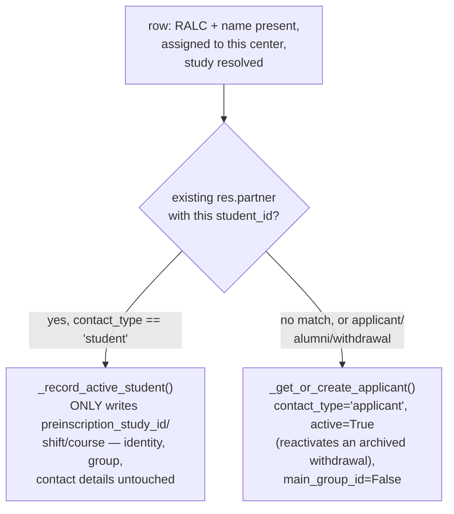

# Technical Reference: `ems.applicant_import_wizard`

## Overview

Imports **GEDAC preinscription** assignments (xlsx or csv) — applicants granted a place at this centre, plus already-enrolled internal students changing study. This is the third and last of the "bring in/update student data" family this rollout — see [`ems.student_import_wizard`](student_import_wizard.md) (Esfera/SAGA, different source system, different lifecycle stage) and [`ems.student_update_wizard`](student_update_wizard.md) (generic CSV, update-only) for the siblings, all sharing the same escaping-fix pattern applied in this pass.

**Module file:** `models/contacts/applicant_import_wizard.py` (`EmsApplicantImportWizard`)

**User-facing documentation is already complete and unrelated to this pass**: `docs/{en,ca,es}/secretary/manual-matriculacio-preinscripcio.md`, Step 1, documents the exact UI path (Students list → gear icon ⚙️ → "Import from GEDAC"), what gets created/updated/skipped, and even the literal output filename — no changes needed there.

---

## Two source formats, one column contract

`_load_table` dispatches on the uploaded file's extension: `_load_xlsx` (openpyxl, header found by scanning the first 20 rows for an `'Ident. RALC'` column) or `_load_csv` (GEDAC's own csv export: `cp1252`/Latin-1 encoded, `;`-delimited — sniffed via `csv.Sniffer`, falling back to `;`). Both converge on the same `(col_map, data_rows)` shape, so `_process_row` never needs to know which format the file came from.

## The central decision: applicant vs. internal continuer

This is the one piece of business logic worth internalizing before touching this file: an **already-enrolled student mid-study** (e.g. a CFGM student granted a CFGS place for next year, before the course transition has run) must **never** be touched as if it were a fresh applicant — no rewriting name/contact/group. Only the *destination* GEDAC grants it is recorded (`preinscription_study_id`/`shift`/`course`), read later by the enrollment proposal wizard's "With GEDAC assignment" filter. Everyone else (no match, an existing `applicant`, or a returning `alumni`/`withdrawal`) goes through the normal upsert path and becomes/stays `contact_type = 'applicant'`.

Internal continuers are additionally collected into `stats['student_rows']` and reported **separately** in both `result_html` (a distinct section, not mixed with the applicant created/updated counts) and a dedicated downloadable CSV (`students_file`, `gedac_alumnes_actius_<timestamp>.csv`) — a secretary working from "how many applicants did I get" should not have to mentally subtract the continuers from the headline numbers.

## `_find_study` — code-tail-token matching

GEDAC's assigned-study code arrives as `'CFPM    IC10'` (fixed-width preinscription notation, ignore the padding). Its **last whitespace-separated token** (`IC10`) is matched against the *tail* of `ems.study.code` (e.g. `CFGM_IC10`) via `ilike` + an explicit `endswith` filter (to reject a token that merely appears mid-string). Falls back to an exact (`=ilike`) match on the study's display name if the code token doesn't resolve — see `test_study_name_fallback`.

## `_norm_code`

Numeric xlsx cells round-trip through openpyxl as floats (`'8028047.0'`) — this strips a trailing `.0` for anything that's an integer-valued float, used for RALC, center codes, phone numbers and course numbers alike so the same value compares equal regardless of whether it arrived from xlsx or csv.

## Fixed in this pass (2026-07-28)

- **HTML-injection/escaping bug**, the same class already found and fixed in `student_import_wizard.py`/`student_update_wizard.py`: `_build_result_html` interpolated `stats['errors']` (raw exception text) and student/study names directly into HTML with **zero** escaping. Fixed with `markupsafe.Markup(...).format(...)` (auto-escapes plain-`str` args) + `Markup('').join(...)` for the multi-item lists (a plain `''.join()` on `Markup` fragments silently downgrades them back to `str`, causing the *outer* `.format()` call to double-escape — see the other two docs for the same gotcha spelled out in full).
- **`_build_applicant_notes` had the identical, previously-unflagged risk** — it writes raw, unescaped GEDAC-sourced values (origin center/study names) directly into `res.partner.comment`, an `Html` field. Not caught by the original DTON research pass for the sibling wizards (this file's `comment`-building method is unique to it — the other two don't have an equivalent), found and fixed here for consistency, same `Markup(...).format()` treatment.
- Class renamed `ems_applicant_import_wizard` → `EmsApplicantImportWizard` (zero external coupling).
- `%`-formatting converted to f-strings / named-placeholder `_()` calls. Two of this file's translated strings (`"The file is missing required columns:..."`, `"openpyxl is required..."`) already had `#:` references shared with `student_import_wizard.py`'s identical text — this file's own reference was added to those existing blocks rather than duplicated (the `"openpyxl is required..."` one was already correctly wrapped here, unlike `student_import_wizard.py`'s copy, which needed its own separate fix in the previous phase-5 pass).

---

## Access Control

`ir.model.access.csv`: `ems.group_academic_admin`/`ems.group_secretary` only.

## Views

| View | File | Notes |
|------|------|-------|
| Form | `views/academic_management/enrollment/applicant_import_wizard.xml` | Already documents its own cog-menu wiring inline (comment block) |
| Action | same file | `action_applicant_import_wizard` |
| Entry point | `static/src/js/backend/import_gedac_cog_menu.js` + matching `.xml` template | `cogMenu` registry item, scoped to `ems.menu_ems_applicants`'s own action — not a `<menuitem>`, same mechanism as the two sibling wizards |
