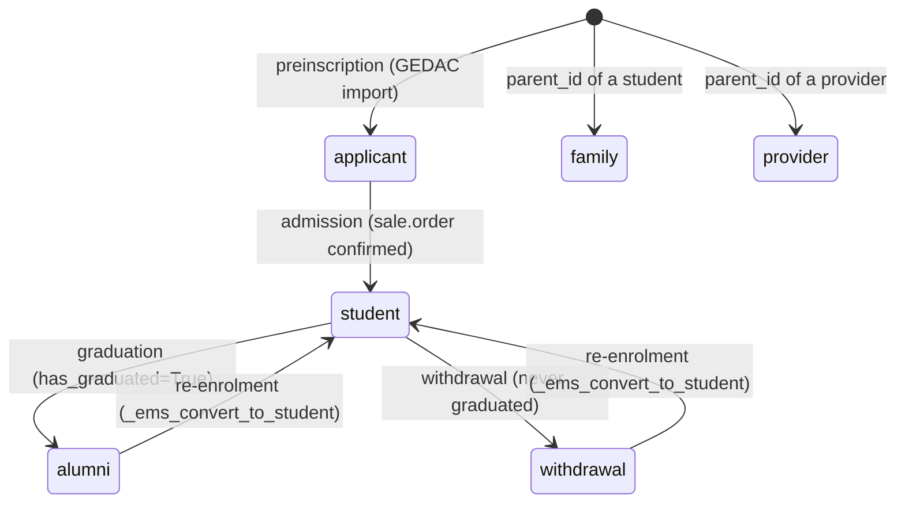
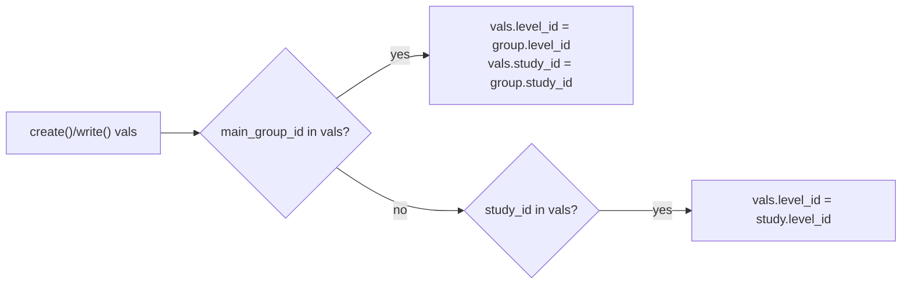
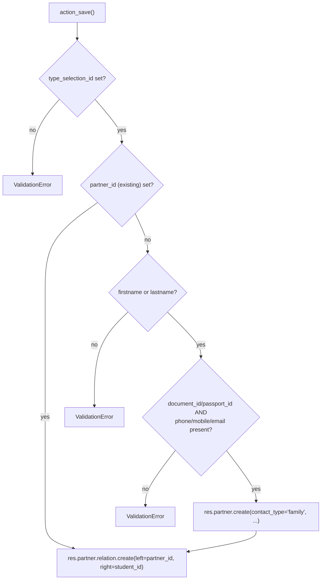

# Technical Reference: `res.partner` (EMS contact) / `ems.student.benefit` / `ems.contact.relation.wizard`

## Overview

EMS does not define its own "contact" model: every student, family member, applicant, alumnus, withdrawal and external provider is a `res.partner` record, distinguished by `contact_type`. `models/contacts/contact.py` extends `res.partner` (`_inherit`) with the whole EMS-specific surface: lifecycle, academic placement, benefits/exemptions, authorizations, portal-access side effects and Google Workspace triggers. The same file also defines `ems.student.benefit`, a satellite one2many owned by a student.

**Module files:**
- `models/contacts/contact.py` — `ResPartner` (`_inherit = 'res.partner'`), `EmsStudentBenefit`
- `models/contacts/contact_relation.py` — `EmsContactRelationWizard`, `ResPartnerRelationAll` (`_inherit = 'res.partner.relation.all'`, from the `partner_multi_relation` OCA module)
- `models/contacts/google_workspace_integration.py` — `ResPartnerGoogleWorkspace`, the corporate-account side of the lifecycle (not covered here — see the "Google Workspace" note below)

Related docs: [`ems.group`](group.md) (`main_group_id`), [Enrollment benefits](../enrollment/enrollment_benefits.md) (`ems.student.benefit` vs `sale.order`/invoice interaction), [Graduation & withdrawal wizards](exit_wizards.md) (deferred graduation mark vs immediate withdrawal cascade).

---

## Contact lifecycle

`contact_type` also has two lifecycle-independent values not shown above: `family` and `provider`, auto-assigned in `create()` from the parent contact's own `contact_type` whenever `parent_id` is set (a child contact of a student becomes `family`; of a provider, `provider` — see `create()`'s inline note on why this can't rely on the value arriving from the popup form).

`has_graduated` is a **permanent** mark, set once by the graduation wizard and never cleared — it is what `_ems_convert_to_ex_student()` uses to decide `alumni` vs `withdrawal` on exit, even after a later re-enrolment.

### `_sync_category()`

Every lifecycle transition re-tags `category_id` via a fixed map (`contact_type` → `res.partner.category` XML ID). `student`, `applicant`, `alumni` and `withdrawal` all additionally carry the shared `ems.partner_category_student` marker — this is what keeps family-relation domains (which pin the right-hand side to `partner_category_student`) valid across the whole lifecycle, not just while `contact_type == 'student'`. `_ems_resync_lifecycle_categories()` is a `@api.model` idempotent heal, invoked from a data `<function>` on upgrade, for partners created before this shared marker existed.

---

## `ems.student.benefit`

| Field | Type | Notes |
|-------|------|-------|
| `student_id` | `Many2one → res.partner` | required, `ondelete='cascade'` |
| `benefit_type` | `Selection` (7 values) | required |
| `category` | `Selection` (`bonification`/`exemption`), computed, stored | `@api.depends('benefit_type')` — see mapping in `_compute_category` |
| `document` | `Binary` | required (supporting document) |
| `renewal_date` | `Date` | defaulted by `_onchange_benefit_type` (9 months for `scholarship`, 2 years otherwise) — a one-time UI convenience, not a stored compute, so it stays user-editable afterwards |

`res.partner.benefit_status` aggregates a student's `benefit_ids` into `none`/`bonification`/`exemption` (exemption wins if both are present). **The interaction between a benefit and an already-confirmed enrollment's invoice — draft orders react live, confirmed orders freeze — is documented in full in [Enrollment benefits](../enrollment/enrollment_benefits.md); `tests/test_enrollment_benefit.py` is the authoritative test coverage for that interaction**, not `tests/test_contact.py`.

---

## Key computed/derived fields on `res.partner`

| Field | Depends on | Notes |
|-------|-----------|-------|
| `is_adult` | `birth_date` | `>= 18` years via `relativedelta`; `False` if no birth date |
| `strike_count` | `strike_ids` | `len()` of `ems.strike` records |
| `transition_status` | `contact_type`, `exit_type`, next-course `sale_order_ids` | `enrolled` / `unplaced` / `graduated` / `former` / `missing`; searchable via `_search_transition_status` (evaluates in Python then converts to an `id in/not in` domain — not SQL-pushable). Full branch coverage in `tests/test_exit_management.py`. |
| `auth_image` / `auth_trip` / `auth_healt` / `auth_share` | current-course `sale_order_ids.ems_authorization_ids` | One `ems.authorization` per template per order; `True` only if `status == 'yes'` for that `auth_type` in the **current** course |
| `ems_authorization_ids` | (not stored) | Current-course authorizations across the student's `sale.order`s — feeds the badges above |
| `ems_current_enrollment_id` | (not stored) | The student's `sale.order` for the enrollment-default (or else current) course, in `draft/sent/sale` state |
| `benefit_status` | `benefit_ids`, `benefit_ids.category` | See `ems.student.benefit` above |

> `ems_authorization_ids`/`ems_current_enrollment_id`/`auth_*` sit at the boundary with `ems.authorization*` (`models/enrollment/authorization.py`) — that model group has no dedicated DTON pass yet (Phase 6 of the rollout), so these fields' *own* consumers aren't further covered by new tests in this pass beyond what already existed.

### `_compute_group_data(values)`

Not a `@api.depends` compute — a **vals-mutation helper** called from both `create()` and `write()` before the actual `super()` call: if `main_group_id` is present in the incoming vals, it derives and injects `level_id`/`study_id` from that group; if only `study_id` is present, it derives `level_id`. Keeps the three fields from ever disagreeing regardless of which one the caller set. The client-side `_onchange_level_id`/`_onchange_study_id` mirror this in the form (clearing the now-stale child field the moment a parent field changes) but are pure UI convenience — `_compute_group_data` is what makes the guarantee hold for any programmatic write (RPC, import, wizard).

### `_check_nuss` (`@api.constrains('nuss')`)

The Spanish Social Security number (NUSS) must be exactly 12 numeric digits (`re.fullmatch(r'\d{12}', nuss)`) when set.

---

## Portal email change

`write()` detects, **before** calling `super()`, any student/family partner whose `email` is about to change while holding active portal access (`_has_active_portal_user`), then **after** the write calls `_apply_portal_email_change()` for each: revokes portal access at the old email and re-grants it at the new one via `ems.portal.access.wizard` (sudo — tutors lack `res.users` rights), and posts a portal-visible message on the related student(s) explaining what happened. `_onchange_email_portal_warning` gives the same heads-up client-side, before Save, via a non-blocking `warning`.

---

## `toggle_active()` — archiving is the withdrawal flow

Archiving one or more **active students** does not flip `active` directly: it opens the withdrawal wizard instead (mirroring `hr.employee`'s departure-reason flow), because withdrawal changes more state atomically (`contact_type`, operational-record cleanup, portal) than a bare `active` flip — none of it may run before a reason is captured, and nothing should happen if the wizard is cancelled. Non-student contacts in the same recordset are archived directly; reactivating never opens the wizard. See [Graduation & withdrawal wizards](exit_wizards.md) for the full withdrawal cascade this triggers. Full coverage (including the generic Archive action from list/form, mixed recordsets, and the "still shows under Former students" edge case the tour catches) lives in `tests/test_exit_management.py` and `tests/test_withdrawal_tour.py`.

---

## `ems.contact.relation.wizard` — adding a family contact

`res.partner.relation.all` (from the third-party `partner_multi_relation` module) is extended (`ResPartnerRelationAll`) with read-only related columns (`other_partner_phone/mobile/email`, relation labels) purely for display in the student/family form's relation list — no new logic.

`ems.contact.relation.wizard` (`action_open_relation_wizard`, opened from the student's "Contacts & Addresses" tab) either links an **existing** `family`-typed partner or creates a **new** one, then always creates one `res.partner.relation` between it and the student:

`_onchange_student_id` pre-fills the address fields from the student (client-side convenience only — `action_open_relation_wizard` already seeds them server-side when the wizard is created, since it's opened with `target: 'new'` on an already-saved record, not a blank `new()` form).

---

## Google Workspace (out of scope for this pass)

`models/contacts/google_workspace_integration.py` (`ResPartnerGoogleWorkspace`, 461 lines) manages the student corporate-account lifecycle (creation eligibility, OU relocation on adult/minor transition, suspend/reactivate) via `with_delay()`-queued jobs, invoked from `ResPartner.create()`/`write()`/`_ems_convert_to_ex_student()`. It has **no dedicated tests or developer doc yet** — this is tracked separately as "Google Workspace on `res.partner`" later in Phase 5 of the DTON rollout, not folded into this pass (its `hr.employee` counterpart, `HrEmployeeGoogleWorkspace`, already has both — see [Google Workspace staff](../employees/google_workspace_staff.md) for the equivalent pattern on the employee side).

---

## Access Control

### `ir.model.access.csv`

| Model | Role | Create | Read | Write | Delete |
|-------|------|:------:|:----:|:-----:|:------:|
| `res.partner` | Academic admin | ✓ | ✓ | ✓ | ✓ |
| `res.partner` | Secretary | ✓ | ✓ | ✓ | ✓ |
| `res.partner` | Teacher | — | ✓ | — | — |
| `ems.student.benefit` | Academic admin | ✓ | ✓ | ✓ | ✓ |
| `ems.student.benefit` | Secretary | ✓ | ✓ | ✓ | ✓ |
| `ems.student.benefit` | Teacher | ✓ | — | — | — |
| `ems.contact.relation.wizard` | Academic admin | ✓ | ✓ | ✓ | ✓ |
| `ems.contact.relation.wizard` | Teacher | ✓ | ✓ | ✓ | ✓ |

### `security/rules/contacts.xml` (record rules, `res.partner`)

| Rule | Groups | Domain | Write |
|------|--------|--------|:-----:|
| `rule_contact_admin` | Academic admin | `[]` (unrestricted) | ✓ |
| `rule_contact_secretary` | Secretary | `[]` (unrestricted) | ✓ |
| `rule_contact_teacher` | Teacher | `[]` (read-only, no write/create/unlink) | — |
| `rule_contact_tutor` | Teacher (tutor subset) | Own tutorands **or** their family (`relation_all_ids.other_partner_id.tutor_id`) | ✓ (no create/unlink) |

The **field-level** editing surface for tutors is narrower than the record rule allows: `read_only_user`/`is_tutor_readonly` (computed on load, not stored) drive `readonly=`/`invisible=` attributes across the view, so a tutor's ORM write access to their own tutorands is real but the form only exposes a subset of fields as actually editable (`_get_read_only_user`/`_get_is_tutor_readonly`, `_user_is_tutor_of_record`).

---

## Views

| View | File | Notes |
|------|------|-------|
| List | `views/community/contact/list.xml` | `js_class="student_list"`; columns conditional on `default_contact_type` context |
| Kanban | `views/community/contact/kanban.xml` | Default view for the Students menu |
| Form | `views/community/contact/form.xml` | Inherits `base.view_partner_form`; `js_class="studentpopup_expand_button"`; conditional pages per `contact_type` (`student`, `applicant`, `former_student`, `academic_history`, base `contact_addresses`) |
| Search | `views/community/contact/search.xml` | — |
| Relation wizard | `views/community/contact/relation_wizard.xml` | `action_contact_relation_wizard` |
| Menu | `views/community/contact/menu.xml` + `views/community/menu.xml` | `action_student_kanban` (top-level "Educational Community" entry), `action_family_list`, `action_provider_kanban` |

Other student-related popups — [portal access](portal_access_wizard.md), [documents](student_document.md), [graduation/withdrawal](exit_wizards.md) — live in the same `views/community/contact/` folder but are documented separately. The import wizards (`student_import`, `student_update`, `applicant_import`) are not yet DTON'd (see the roadmap).
