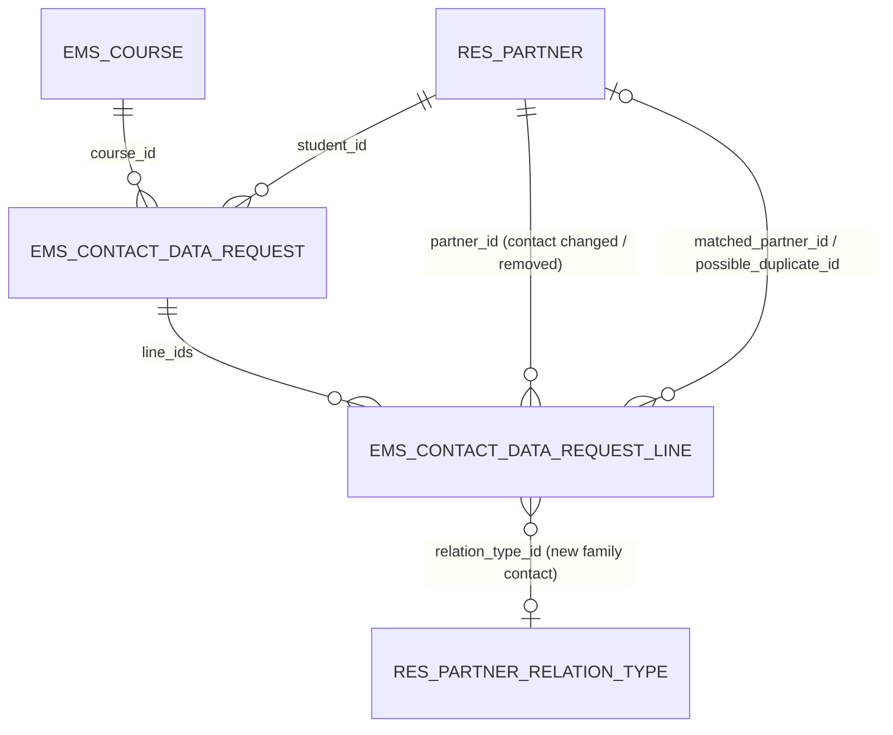
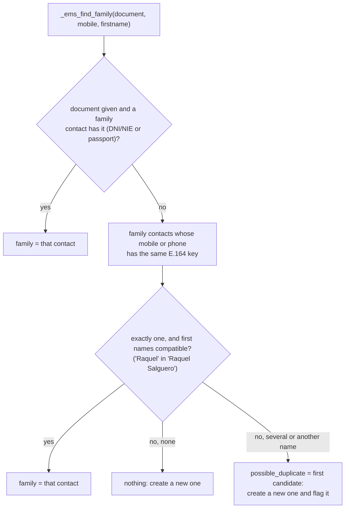
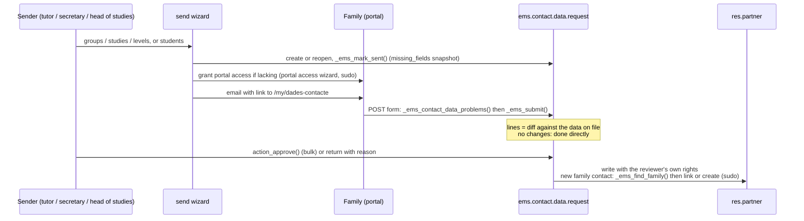

# Contact data update requests (`ems.contact.data.request`)

Issue #507. Students and families review and complete their own contact details from the portal,
on request, so that family communications and portal access work: a minor's notices go to their
family contacts (`res.partner._ems_notification_recipients()`), and the portal login is the
recipient's `email`. The request is sent from the backend (individually, or to groups, studies or
levels), answered on `/my/dades-contacte`, and applied only once a reviewer approves it.

## Files

| File | Content |
|---|---|
| `models/contacts/contact_data_request.py` | `ems.contact.data.request`, `ems.contact.data.request.line`, `ems.contact.data.request.reject.wizard`, and the `res.partner` side (`_ems_contact_data()`, `_ems_contact_data_missing()`, smart button, bulk action) |
| `models/contacts/contact_data_request_send_wizard.py` | `ems.contact.data.request.send.wizard` (+ preview line) |
| `static/src/js/backend/contact_data_request_send_form.js` | The wizard form's `js_class` (`ems_contact_data_request_send_form`): blocks the screen with a "Processing the requests…" overlay while **Send** runs (`blocking_action_form.js`) |
| `models/shared/student_scope_mixin.py` | `ems.student.scope.mixin`, the student picking shared with the authorization send wizard |
| `models/contacts/family_contact.py` | Recognising, creating and linking family contacts (`_ems_find_family()`, `_ems_create_family_contact()`, `_ems_link_family()`) |
| `controllers/portal_contact_data.py` | `/my/dades-contacte` (GET shows, POST validates and stages); a view-only account is sent home (`ems_portal_manage_required`) |
| `views/portal/portal_contact_data.xml` | The portal page (`portal_contact_data_new_family_extras`: the repeated-contact question and the other-children checkboxes); the home banner (only while a request is pending) is in `portal_main.xml`, the **Update contact details** button of the Profile tab in `portal_account_readonly.xml` |
| `views/community/contact_data_request/` | Send wizard, bindings (students list/form, groups list/form), request list/form/search, return wizard, menu |
| `mails/contacts/contact_data_request.xml` | `ems.email_template_contact_data_request` (first request, reminder, returned) |

The menu is **Educational Community > Students > Student Data** (`menu_contact_data_requests`,
groups: academic admin, secretary, head of studies, tutor). *Students* is a section
(`menu_students_root`, no action) holding the Students list (`menu_students`, which keeps its action:
the cog-menu scripts read it by xmlid) and this menu, so clicking Educational Community still opens the
Students list.

## Model

- One request per student and academic year (`unique(student_id, course_id)`). Sending again to a
  `done` request reopens it; a `pending` or `submitted` one is left alone.
- `state`: `pending` (sent, waiting for the answer) → `submitted` (answered, to review) → `done`
  (approved, or confirmed without changes). Returning it to the family sets `pending` again with a
  `rejection_reason`.
- A line is one staged change: `action` `update` (a field of the student or of a family contact on
  file), `create` (a field of a new family contact; lines sharing `person_key` are one person) or
  `remove` (a family contact that is no longer one). `old_value`/`new_value` are the diff the
  reviewer sees.
- `matched_partner_id`: the new family contact is already on file (see below) and approval will
  link it. `possible_duplicate_id`: someone else holds the same mobile under a different name;
  approval creates a new contact, and `has_possible_duplicate` (stored) flags the request.

## Mandatory fields

Checked by one method, `ems.contact.data.request._ems_contact_data_problems(data, is_adult, formats, current)`,
on the shape returned by `res.partner._ems_contact_data()`. The portal form uses it with format checks
(so each problem lands under its input); `res.partner._ems_contact_data_missing()` uses it without
them, for the send wizard's "only incomplete" filter, the preview and the email.

| Who | Required | Optional |
|---|---|---|
| Student | Street, ZIP, city; DNI/NIE **or** passport; personal email **if adult** (portal login) | Mobile, phone, TIS, NUSS, email of a minor |
| Family (minor: at least one legal tutor; adult: optional) | First name, last name, mobile, relation (new contacts); at least one family contact with email (minor); no two family contacts sharing an email (one portal login each) | DNI/NIE, passport, address (defaults to the student's) |

Formats: `email_normalize`, `phonenumbers.is_possible_number` (region ES), DNI/NIE check letter
(`_ems_valid_dni_nie`), NUSS 12 digits (same rule as `res.partner._check_nuss`). Name and birth date
are official data: read-only on the portal, corrected through the secretariat.

**Personal emails are never corporate (issue #514).** With the format checks,
`_ems_personal_email_problems(data, current)` refuses every email the answer changes to an address of
the centre's own domain, before anything is staged, by asking `res.company._ems_check_personal_email()`
(the same check, and message, as the `res.partner` constraint) for each person: the student, every
family contact on file and every new one (not the ones marked as removed). An address already on
file is left alone, as the constraint only fires when the email is written: that is what `current`
(the data on file) is for. The constraint stays the last word, since approval writes the emails
through the ORM. Like the constraint, the check is off on a `dev` database or without a configured
domain.

## Recognising a family contact

`res.partner._ems_find_family(document, mobile, firstname)` returns `(family, possible_duplicate)`,
both with sudo:

- Only `contact_type = 'family'` contacts are searched: a student often gives the family's phone.
- Candidates are narrowed in SQL by the number's last 9 digits, whatever format it was stored with,
  then compared on the full E.164 key (`_ems_phone_key`).
- The first-name safeguard is what keeps two parents sharing one phone apart. Measured on the
  2026-09-22 production dump: 93% of active family contacts have a mobile, 20 mobiles are shared by
  more than one of them (9 under the same first name, i.e. duplicates, 11 under different names).

The same lookup is used by the approval of a request, the relation wizard
(`ems.contact.relation.wizard`, which now links an existing contact instead of creating a duplicate)
and the Esfera import (`ems.student_import_wizard._get_or_create_family`, which reports possible
duplicates in its warnings).

## Several children and repeated contacts

A family answers for one child at a time (`get_portal_student()`), but a family contact it adds often
belongs to its other children too, and is often already on file as a contact of one of them.

- **Which children.** `res.partner._ems_portal_siblings(student)`: the other children the portal
  partner *acts for* (`get_portal_students()` minus `student`, filtered by `_ems_portal_can_act_for()`;
  a view-only child is never one). Each new contact card offers them as **Also a contact of**
  (`n<k>_also_<child id>` checkboxes, ticked by default). The controller reads the ticks by iterating
  those children, never ids from the form, so a crafted post cannot reach anyone else's child. The
  choice is staged on every line of the person as `also_student_ids` (**Also linked to** in the review).
- **Repeated contact.** `res.partner._ems_sibling_contact_match(student, siblings, entry)` looks, among
  the family contacts of the siblings that are not `student`'s yet, for the same identity document
  (`document_id`/`passport_id`, spaces and hyphens ignored) or the same phone (`_ems_phone_key()`, either
  the mobile or the landline of the contact). It returns the contact, the reason and the children it is
  linked to, or `False`. **Only these contacts are ever pointed out**: they are people the family can
  already read on the sibling's own page, so the portal cannot be used to probe for documents or phones
  of other families. Their match is still found at approval by `_ems_find_family()` and flagged for the
  reviewer as before.
- **The question.** The controller (`_ems_annotate_matches()`) stops the first post, shows the contact and
  asks *is it the same person?* (`n<k>_confirm` yes/no, with the candidate's id in `n<k>_match` so an
  answer about another contact than the one shown is not taken). Yes stages the line with
  `matched_partner_id` = that contact (`entry['confirmed_match_id']`); no creates a new contact as
  before. A document identifies one person, so *no* on a document match asks to correct the document.
  Nothing is staged while a question is unanswered.
- **Approval.** `_ems_apply()` links the contact stored in `matched_partner_id` (else the one
  `_ems_find_family()` finds now) to the reviewed student and to each `also_student_ids` child, through
  `_ems_link_family()` (idempotent, sudo). Updating an existing contact already reaches every child, as
  it is one record; **No longer a contact** unlinks the reviewed student only.
- An answer shown again while it waits for review (`_ems_proposal()`) carries the choices back
  (`confirmed_match_id`, `also_for`), so the question is not asked twice.

## Flow

- `_ems_submit()` rebuilds the lines on every submission, so the family can correct a pending
  answer. While `submitted`, the portal page shows the staged values (`_ems_proposal()`).
- `action_approve()` writes through the ORM, so the usual hooks run: an `email` change of a contact
  with portal access moves the login (`_apply_portal_email_change`). Removing a family contact
  unlinks the relation with `ems_remove_orphan_family`, which archives or deletes the contact only
  if no other student is left.
- `action_send_reminder()` emails the `pending` ones again and counts it; there is no cron.
- Emails use `res.partner._ems_notification_recipients()` (adult: the student; minor: the family),
  `force_send=False`, and list what is missing in the recipient's language. Students with nobody
  reachable by email are listed in the wizard preview and in the result notification, to be called.
  Those are exactly the accounts that may answer (see "Who may answer on the portal"): a minor's own
  portal account only consults, so it is never emailed, listed as a recipient or invited.
- The reminder prefix of the subject is passed in the context (`subject_prefix`, translated in the
  recipient's language by `_ems_send_request_email()`), not written inside the template's `{{ }}`:
  a translator must not touch its expressions (`tests/test_mail_template_translations.py`).

## Who may answer on the portal

`res.partner._ems_portal_contact_data_student()` returns the student or applicant whose data a portal
partner may review and send: the one it is looking at (`get_portal_student()`) when it acts for them
(`_ems_portal_can_act_for()`), otherwise nobody. A **view-only** account (a minor on their own
account, a family looking at an adult child who shares with it, a family with no child left to see)
therefore has:

- no banner on the portal home and no **Update contact details** button on the Profile tab;
- `/my/dades-contacte` refused server side, GET and POST alike: `ems_portal_manage_required` sends it
  back to `/my/home`, like every other managing page (`controllers/portal_view_only.py`).

The single entry point of the review is that Profile button; the home only shows the banner while a
request is pending (`_ems_contact_data_requested()`), and the email links to the page directly.

## Access

| Group | Requests / lines | Send wizard | Rule |
|---|---|---|---|
| `group_academic_admin`, `group_secretary` | CRUD | yes | all |
| `group_head_of_studies` | read, write, create (lines also unlink) | yes | all |
| `group_tutor` | read, write, create (lines also unlink) | yes, own groups only | `student_id.tutor_id.tutor_scope_user_ids = user` (the tutor and the chiefs above them, issue #483) |
| `group_teacher` (not tutor) | none | no | - |
| portal | none: everything through the controller, with sudo | - | only the student returned by `get_portal_student()`, and only the family contacts already related to it |

- Approval runs with the reviewer's rights: a tutor already edits their students and those
  students' family contacts (`rule_contact_tutor`, `rule_partner_relation_tutor`). Creating or
  linking a family contact goes through sudo, as in the relation wizard.
- The `res.partner` fields `contact_data_request_ids`/`contact_data_request_state` carry `groups=`:
  without it, a plain teacher reading a student would prefetch them and hit the missing access (the
  issue #492 trap).

## Tests

- `tests/test_contact_data_request.py`: missing/mandatory rules and formats, `_ems_find_family`,
  submit/approve/return/remind (reminder subject in the recipient's language), portal login move on
  email change, tutor scope, teacher access; `TestContactDataRequestCorporateEmail`: the corporate
  domain refused for the student and every family contact, left alone when already on file.
- `tests/test_contact_data_request_send_wizard.py`: scope, "only incomplete", reopen, unreachable,
  portal grant, preview, tutor limits, and that a minor's own account is never asked.
- `tests/test_portal_contact_data.py`: the portal page, validation, staging, foreign family contacts
  ignored, home banner, Profile button;
  `TestPortalContactDataRules`: a minor's own account and a family looking at an adult child cannot
  review nor send, a corporate email is refused before it is staged; `TestPortalContactDataSiblings`:
  a family with two children - the other child is offered, a contact of that child with the same
  document or phone is asked about (yes links it, no creates another, a document cannot be another
  person), nothing is said about another family's contacts, and only the account's own children can
  be chosen.
- `tests/test_contact_data_request_tour.py`: family answers from the portal, entering through the
  Profile button; a family with two children is pointed to a repeated contact and confirms it; the
  group's tutor sends to their group and approves (list and form).
