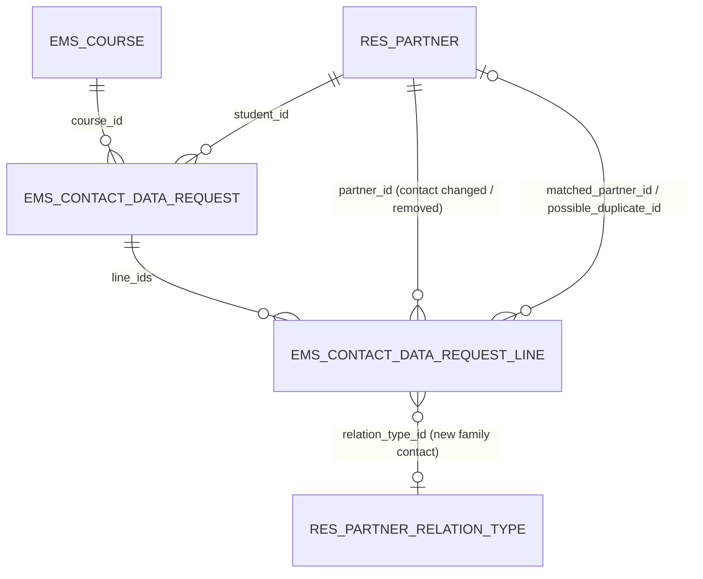
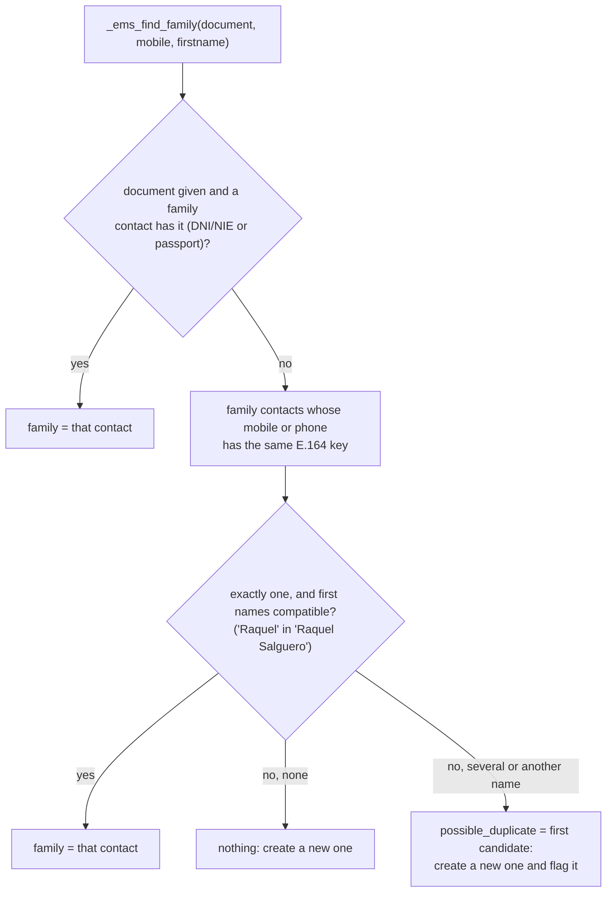
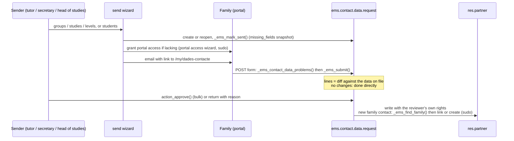

# Contact data update requests (`ems.contact.data.request`)

Issue #507. Students and families review and complete their own contact details from the portal,
on request, so that family communications and portal access work: a minor's notices go to their
family contacts (`res.partner._ems_notification_recipients()`), and the portal login is the
recipient's `email`. The request is sent from the backend (individually, or to groups, studies or
levels), answered on `/my/dades-contacte`, and applied only once a reviewer approves it.

## Files

| File | Content |
|---|---|
| `models/contacts/contact_data_request.py` | `ems.contact.data.request`, `ems.contact.data.request.line`, `ems.contact.data.request.reject.wizard`, and the `res.partner` side (`_ems_contact_data()`, `_ems_contact_data_missing()`, smart button, bulk action) |
| `models/contacts/contact_data_request_send_wizard.py` | `ems.contact.data.request.send.wizard` (+ preview line) |
| `models/shared/student_scope_mixin.py` | `ems.student.scope.mixin`, the student picking shared with the authorization send wizard |
| `models/contacts/family_contact.py` | Recognising, creating and linking family contacts (`_ems_find_family()`, `_ems_create_family_contact()`, `_ems_link_family()`) |
| `controllers/portal_contact_data.py` | `/my/dades-contacte` (GET shows, POST validates and stages) |
| `views/portal/portal_contact_data.xml` | The portal page; the home banner and card are in `portal_main.xml`, the profile link in `portal_account_readonly.xml` |
| `views/community/contact_data_request/` | Send wizard, bindings (students list/form, groups list/form), request list/form/search, return wizard, menu |
| `mails/contacts/contact_data_request.xml` | `ems.email_template_contact_data_request` (first request, reminder, returned) |

## Model

- One request per student and academic year (`unique(student_id, course_id)`). Sending again to a
  `done` request reopens it; a `pending` or `submitted` one is left alone.
- `state`: `pending` (sent, waiting for the answer) → `submitted` (answered, to review) → `done`
  (approved, or confirmed without changes). Returning it to the family sets `pending` again with a
  `rejection_reason`.
- A line is one staged change: `action` `update` (a field of the student or of a family contact on
  file), `create` (a field of a new family contact; lines sharing `person_key` are one person) or
  `remove` (a family contact that is no longer one). `old_value`/`new_value` are the diff the
  reviewer sees.
- `matched_partner_id`: the new family contact is already on file (see below) and approval will
  link it. `possible_duplicate_id`: someone else holds the same mobile under a different name;
  approval creates a new contact, and `has_possible_duplicate` (stored) flags the request.

## Mandatory fields

Checked by one method, `ems.contact.data.request._ems_contact_data_problems(data, is_adult)`, on
the shape returned by `res.partner._ems_contact_data()`. The portal form uses it with format checks
(so each problem lands under its input); `res.partner._ems_contact_data_missing()` uses it without
them, for the send wizard's "only incomplete" filter, the preview and the email.

| Who | Required | Optional |
|---|---|---|
| Student | Street, ZIP, city; DNI/NIE **or** passport; personal email **if adult** (portal login) | Mobile, phone, TIS, NUSS, email of a minor |
| Family (minor: at least one legal tutor; adult: optional) | First name, last name, mobile, relation (new contacts); at least one family contact with email (minor); no two family contacts sharing an email (one portal login each) | DNI/NIE, passport, address (defaults to the student's) |

Formats: `email_normalize`, `phonenumbers.is_possible_number` (region ES), DNI/NIE check letter
(`_ems_valid_dni_nie`), NUSS 12 digits (same rule as `res.partner._check_nuss`). Name and birth date
are official data: read-only on the portal, corrected through the secretariat.

## Recognising a family contact

`res.partner._ems_find_family(document, mobile, firstname)` returns `(family, possible_duplicate)`,
both with sudo:

- Only `contact_type = 'family'` contacts are searched: a student often gives the family's phone.
- Candidates are narrowed in SQL by the number's last 9 digits, whatever format it was stored with,
  then compared on the full E.164 key (`_ems_phone_key`).
- The first-name safeguard is what keeps two parents sharing one phone apart. Measured on the
  2026-09-22 production dump: 93% of active family contacts have a mobile, 20 mobiles are shared by
  more than one of them (9 under the same first name, i.e. duplicates, 11 under different names).

The same lookup is used by the approval of a request, the relation wizard
(`ems.contact.relation.wizard`, which now links an existing contact instead of creating a duplicate)
and the Esfera import (`ems.student_import_wizard._get_or_create_family`, which reports possible
duplicates in its warnings).

## Flow

- `_ems_submit()` rebuilds the lines on every submission, so the family can correct a pending
  answer. While `submitted`, the portal page shows the staged values (`_ems_proposal()`).
- `action_approve()` writes through the ORM, so the usual hooks run: an `email` change of a contact
  with portal access moves the login (`_apply_portal_email_change`). Removing a family contact
  unlinks the relation with `ems_remove_orphan_family`, which archives or deletes the contact only
  if no other student is left.
- `action_send_reminder()` emails the `pending` ones again and counts it; there is no cron.
- Emails use `res.partner._ems_notification_recipients()` (adult: the student; minor: the family),
  `force_send=False`, and list what is missing in the recipient's language. Students with nobody
  reachable by email are listed in the wizard preview and in the result notification, to be called.

## Access

| Group | Requests / lines | Send wizard | Rule |
|---|---|---|---|
| `group_academic_admin`, `group_secretary` | CRUD | yes | all |
| `group_head_of_studies` | read, write, create (lines also unlink) | yes | all |
| `group_tutor` | read, write, create (lines also unlink) | yes, own groups only | `student_id.tutor_id.tutor_scope_user_ids = user` (the tutor and the chiefs above them, issue #483) |
| `group_teacher` (not tutor) | none | no | - |
| portal | none: everything through the controller, with sudo | - | only the student returned by `get_portal_student()`, and only the family contacts already related to it |

- Approval runs with the reviewer's rights: a tutor already edits their students and those
  students' family contacts (`rule_contact_tutor`, `rule_partner_relation_tutor`). Creating or
  linking a family contact goes through sudo, as in the relation wizard.
- The `res.partner` fields `contact_data_request_ids`/`contact_data_request_state` carry `groups=`:
  without it, a plain teacher reading a student would prefetch them and hit the missing access (the
  issue #492 trap).

## Tests

- `tests/test_contact_data_request.py`: missing/mandatory rules and formats, `_ems_find_family`,
  submit/approve/return/remind, portal login move on email change, tutor scope, teacher access.
- `tests/test_contact_data_request_send_wizard.py`: scope, "only incomplete", reopen, unreachable,
  portal grant, preview, tutor limits.
- `tests/test_portal_contact_data.py`: the portal page, validation, staging, foreign family contacts
  ignored, home banner.
- `tests/test_contact_data_request_tour.py`: family answers from the portal; the group's tutor sends
  to their group and approves (list and form).
