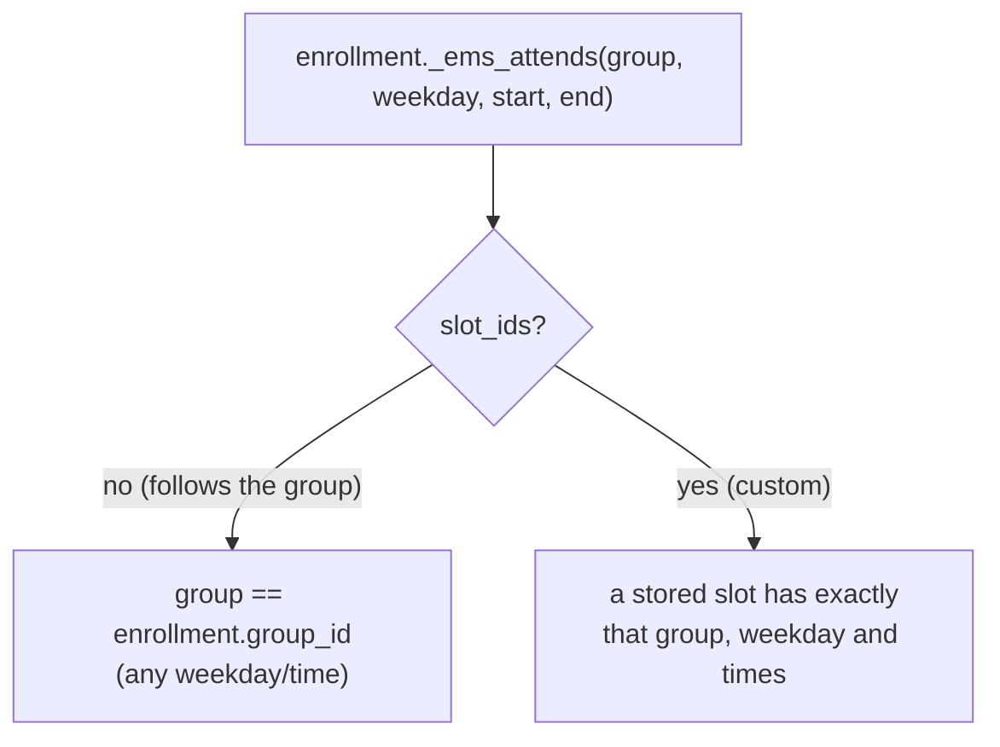

# Technical Reference: `ems.enrollment.slot` (custom schedule)

## Overview

A student can attend one subject split across several groups, e.g. 2 h with SMX1C and 2 h with SMX1D (repeating part of a subject, or a work schedule that overlaps some hours), or with a group of a different study of the same level. `ems.enrollment` alone can't say that: it has a single `group_id` per subject, and every schedule line of that group's subject templates gets the student.

`ems.enrollment.slot` stores, for one enrollment, the exact weekly slots the student attends. Issue #534.

**Module file:** `models/contacts/enrollment_slot.py`

### Following the group or custom: one rule

Only **custom** enrollments store slots. An enrollment with no slot rows **follows its group**, exactly as before this feature. One predicate, `ems.enrollment._ems_attends(group, weekday, start_time, end_time)`, answers "does this enrollment make its student attend that class?" for both cases, and every consumer goes through it:

`_ems_attends_line(line)` applies it to a schedule line (its template must teach the enrollment's subject, to a group the enrollment attends at the line's time), and `_ems_attended_lines()` returns every active line an enrollment set makes its student attend.

A slot is identified by a **key**, `(subject, group, weekday, start_time, end_time)`, not by a foreign key to `ems.attendance_schedule`: the sync pipeline archives and clones schedule lines all the time (`_write_or_new_version`, room changes, regeneration from the calendars), while the key stays the same as long as the class itself is still taught at that time. A schedule line matches a key when its template is active, its `subject_id` is the slot's subject, its `group_ids` contains the slot's group and its weekday/times are the slot's.

Deliberately not stored for the enrollments that follow their group (decided with the developer, 2026-10-02): it would be one extra row per roster entry (about 9,500 rows in the development database, data up to August 2026: exactly the row count of `ems_attendance_schedule_res_partner_rel`). The volume itself is negligible, but those rows would be a second derived copy of the calendar that every calendar change has to regenerate, so any missed path would silently drop the student from new sessions. Computing them leaves nothing to drift.

`group_id` on the enrollment stays the **grading group**: grade sessions keep reading `ems.enrollment`, never the slots, so a student split across two groups is graded once, in the enrollment's group.

## Data Model

| Field | Type | Notes |
|-------|------|-------|
| `enrollment_id` | `Many2one → ems.enrollment` | Required, `ondelete='cascade'`; its `display_name` is the subject's |
| `student_id`, `subject_id` | `Many2one`, related to the enrollment, stored | For record rules, search and grouping |
| `group_id` | `Many2one → ems.group` | Required. The enrollment's group or any other group **of the same level** (any study) whose active templates teach the subject |
| `weekday`, `start_time`, `end_time` | Selection, Float, Float | The key. Copied from the schedule line picked in the UI |
| `attendance_schedule_id` | `Many2one → ems.attendance_schedule`, computed (not stored), editable | The active line currently matching the key (read under `sudo()`). Picking one in the UI copies its key: an onchange fills the key fields, and `create()`/`write()` turn an `attendance_schedule_id` value into the key too, for programmatic callers |
| `space_id` | `Many2one → ems.space`, computed (not stored) | The room of that line |
| `state` | Selection `ok`/`broken` ("Not taught"), computed (not stored) | `broken` when no active line matches the key any more |
| `allowed_group_ids` | `Many2many → ems.group`, computed | Domain helper for `group_id` |

`_sql_constraints`: unique `(enrollment_id, group_id, weekday, start_time)`. Python constraints: `group_id` is the enrollment's group or a group of its level (the student's main group's level when the enrollment's group has none, e.g. a reinforcement group); and the key must match an active line **when it is written** - a slot that stops matching later, because a teacher's schedule changed, turns `broken` instead of blocking that change.

On `ems.enrollment`: `slot_ids` (One2many), `is_custom_schedule` (computed: has slots), `action_customize_slots()` (stores one slot per line the enrollment currently attends, so customizing starts from what the student has now and changes no roster), `action_follow_group()` (deletes the slots).

On `res.partner` (`models/contacts/student_schedule.py`): `custom_schedule` (Boolean, "Custom schedule": only shows the custom-schedule tools; writing it to `False` deletes every slot of the student. On the form it is read-only while slots exist, and `action_drop_custom_schedule()` - a button with a confirmation - is the way to switch it off), `enrollment_slot_ids` (One2many on `student_id`), `enrollment_slot_broken_count` (banner).

## Consumers

| Consumer | Before | Now |
|---|---|---|
| Schedule line roster, `ems.attendance_schedule.fill_students()` | enrollments of `(subject, template groups)` | `_ems_expected_students()`: students with an enrollment for which `_ems_attends_line(line)` |
| Incremental roster changes | `_ems_sync_attendance_template_add/remove` (removed) | `ems.enrollment._ems_resync_student_lines(previous_lines)`, called by enrollment create/unlink and by slot create/write/unlink |
| Student's schedule tab, `res.partner._ems_teaching_attendances()` | calendar blocks of `(subject, group)` | the same blocks, filtered through `_ems_attends` (plus the slot groups' blocks) - a block whose group has no schedule line yet, e.g. a group with no classroom, still shows for an enrollment that follows its group |
| Grade sessions | enrollment group | unchanged |
| Attendance reports / percentage | session lines | unchanged: they already read the real session lines |
| Consecutive roll-calls, `ems.attendance_session_header._auto_populate_lines()` | copied the whole previous period's lines | copies the previous period's lines only for this line's own roster, and starts the rest of the roster fresh |

Because the calendar resync fills new lines through `fill_students()`, custom slots are honoured there with no hook in the sync pipeline. An enrollment whose `group_id` changes is resynced too (`ems.enrollment.write()`), which plain enrollments never were before. A custom slot whose class moves to another time simply matches no line any more: the new line doesn't get the student, and the slot turns `broken`.

`_ems_resync_student_lines(student, subject, previous_lines)` adds the student to every active line their enrollments in that subject make them attend (`_ems_attended_lines`), and removes them from the lines in `previous_lines` that no longer match. It only ever touches that student (`(4, id)`/`(3, id)`), so a teacher's own manual edits of a line's roster for other students survive, and it runs under `sudo()` for the same reason as the old cascade (issue #435, see [`enrollment.md`](enrollment.md#both-cascades-run-under-sudo-issue-435)).

`ems.enrollment._ems_move_group()` (main group change) moves a custom enrollment's slots to the new enrollment before deleting the old one, so the customization survives. Moving or deleting slots inside such a cascade uses the `ems_skip_slot_resync` context key (`EMS_SKIP_SLOT_RESYNC`), so the caller resyncs once with its own snapshot. Enrollment `unlink()` deletes its slots through the ORM first (the database cascade alone would skip the roster resync).

### Consecutive roll-calls

Taking attendance for the second of two consecutive periods of the same template copies the first period's statuses (a student marked absent at 9:00 stays absent at 10:00). That copy used to take every student of the previous period. With a custom schedule, a student can attend only one of the two periods, so the copy is now limited to the students of this line's own roster, and roster students who weren't in the previous period start with a fresh line. Covered by `test_continuation_session_only_carries_this_slot_roster`.

## Tests

`tests/test_enrollment_slot.py`: `TestEnrollmentSlot` (rule, consumers, cascades), `TestEnrollmentSlotAccess` (secretary vs plain teacher), `TestEnrollmentSlotCalendar` (the real calendar pipeline: student schedule tab, a teacher moving or adding a class). `tests/test_enrollment_slot_tour.py` (secretary splits a subject between two groups from the student's form). Their fixture, `create_enrollment_slot_fixture()`, is shared.

## Access Control

Same ACL and record rules as `ems.enrollment` (`security/ir.model.access.csv`, `security/rules/contacts.xml`): academic admin, secretary and Head of Studies have full access; a teacher reads every slot and edits only those of their tutored students (`student_id.tutor_id.tutor_scope_user_ids`); the student data reader reads everything. The session picker (`attendance_schedule_id`) lists the schedule lines the user can read: every line for secretary, Head of Studies and admin, only their own teaching for a plain tutor - the existing slots still display for everybody, since the web client reads a Many2one's name under `sudo()`.

## Views

| View | File | Notes |
|------|------|-------|
| "Custom schedule" toggle | `views/community/contact/form.xml`, Studies tab, next to "WPI enrolled" | Same `readonly` conditions as `enrollment_ids`, plus read-only while slots exist |
| Per-subject "Custom" column and icon buttons (customize / follow the group again) | Same file, `enrollment_ids` list | Columns shown only with `custom_schedule` |
| Slot list and "Every subject follows its group" button | Same file, "Custom schedule" section below the enrollment list | Shown only with `custom_schedule`; a `broken` row is red. Its subject column only offers enrollments already customized (`slot_ids != False`) |
| Broken-slot banner | `views/community/contact/form.xml`, above the sheet | Same pattern as `pending_classroom_conflict_count` on the group and employee forms |
