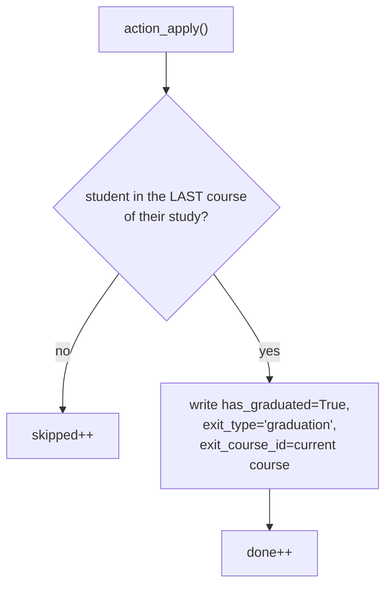
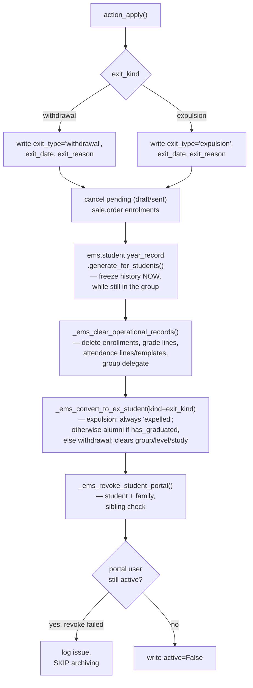

# Technical Reference: `ems.graduation_wizard` / `ems.withdrawal_wizard`

## Overview

Two independent bulk actions cover how a student leaves `contact_type == 'student'` — see the [contact lifecycle diagram](contact.md#contact-lifecycle). **Graduation** is a *deferred mark*, set well before the course actually ends and with no other side effect; **withdrawal** is *immediate*, with a full cascade of side effects (cancels enrolments, freezes academic history, clears operational records, revokes portal access, archives the contact). They are separate models, separate entry points, and — critically — separate timing: graduating a student does **not** convert them to alumni, only marks that they will.

**Module file:** `models/contacts/graduation_wizard.py` (`EmsGraduationWizard`, `EmsGraduationWizardLine`, `EmsWithdrawalWizard`, `EmsWithdrawalWizardLine`)

**Testing note:** both wizards already have thorough `TransactionCase` coverage in `tests/test_exit_management.py` (29 tests — marking/unmarking, last-course gating, conversion, cleanup, portal revoke, Google Workspace suspend, migration backfills) plus tour coverage of the archive-action entry point in `tests/test_withdrawal_tour.py`. This doc is the D(+N) half of this pass — see the roadmap memory for why T was already essentially complete before this pass started.

---

## `ems.graduation_wizard` — deferred mark

- **Only students in the last course of their study** can be marked (`_is_last_course`: the highest `ems.group.course` value across all groups of that `study_id`, e.g. 2nd of CFGM/CFGS/Batxillerat, 4th of ESO) — a preview `warning` explains why a line is `blocked` before the user even clicks Apply (`_line_vals`), and `action_apply` re-checks the same condition server-side rather than trusting the preview.
- **`has_graduated` is permanent** — `action_unmark` reverses `exit_type`/`exit_course_id` (e.g. a marking mistake) but never resets `has_graduated`, since that flag alone decides alumni-vs-withdrawal at actual exit time (see [`contact.md`](contact.md)).
- Marking does **not** touch the portal, the group, or any operational record — those only change at the transition wizard (end of course) or at an immediate withdrawal (below). A graduation-marked student keeps attending classes normally until then.
- Access: `_user_can_manage` — admin/secretary manage any student; a tutor only their own tutorands (same helper shape as [`ems.portal.access.wizard`](portal_access_wizard.md)).

---

## `ems.withdrawal_wizard` — immediate exit

### `exit_kind` — Withdrawal vs. Expulsion (added 2026-08-01)

The wizard's form now asks the admin to pick between two mutually-exclusive outcomes via a
`Selection` field, `exit_kind` (`[('withdrawal', 'Withdrawal'), ('expulsion', 'Expulsion')]`,
default `'withdrawal'`, `widget="radio"`). **Voluntary vs. administrative ("de oficio")
withdrawal is deliberately *not* a separate field or state** — both are the same `exit_kind`,
distinguished only in the free-text `exit_reason`, per an explicit developer decision (adding a
fourth combination there would be over-modelling a distinction nobody needs to query on).

`_ems_convert_to_ex_student()` (`contact.py`) gained an optional `kind` parameter for this:
called with no `kind` (every pre-existing caller, e.g. the not-yet-built transition wizard),
behaviour is **unchanged** — alumni if `has_graduated` else withdrawal. Called with
`kind='expulsion'` (only this wizard, when `exit_kind == 'expulsion'`), the result is always
`contact_type = 'expelled'`, regardless of `has_graduated` — an expelled student is never
"alumni" even if they'd already graduated once before.

**The confirm button's label can't be a dynamically-bound string** — Odoo's `<button
string="...">` is a static attribute, there's no per-record expression for it (same limitation
already documented for `web_ribbon`'s `title` — see [`group.md`](group.md)). The view
(`exit_wizards.xml`) instead declares **two buttons**, both `name="action_apply"`, each
`invisible` on the opposite `exit_kind` value ("Withdraw" / "Expel") — the same pattern already
used elsewhere in this codebase for state-dependent button labels (e.g.
`ems.attendance_correction`'s Accept/Reject).

`contact_type`'s `expelled` value and `exit_type`'s `expulsion` value (mirrored on
`ems.student.year_record.exit_type` — see [`year_record.md`](../grades/year_record.md) if it
exists, or `models/grades/year_record.py`) needed a full audit of every place `contact_type`/
`exit_type` was filtered or branched on before adding them (menu domains, search filters,
`transition_status`, Google Workspace suspend gating, `_academic_result()`'s withdrawal-specific
branch, `res.partner.category` sync) — see the model docstrings and `_ARCHIVED_REASON_COLORS`/
`category_map` in `contact.py` for the resulting list. `_academic_result()` treats `expulsion`
identically to `withdrawal` (`'withdrawn'`, no title) — leaving school by force is not a "full"
or "partial" pass either way, same reasoning as a voluntary withdrawal.

**Order matters and is deliberate** — each step depends on state the previous one has not yet destroyed:
1. **History freeze before cleanup**: the transition wizard captures history by `main_group_id`, so freezing must happen while the student is still attached to their group — a mid-course withdrawal that skipped this step would never get a year record at all.
2. **Cleanup before conversion**: `_ems_clear_operational_records()` (documented in [`contact.md`](contact.md)) needs the student still linked to their group/subjects to know what to delete; `_ems_convert_to_ex_student()` immediately after detaches them.
3. **Portal revoke before archive**: `res.partner.write()` (Odoo core) refuses to archive a contact still linked to an *active* portal user. If the revoke logged an issue instead of succeeding (see below), the archive step is skipped entirely for that student rather than letting the write raise and roll back every student already processed earlier in the same batch.

Only secretary/admin can open or apply this wizard (`_is_secretary_or_admin`, checked in both `default_get` and `action_apply` — no tutor access, unlike the graduation wizard).

### `_ems_revoke_student_portal()` (`models/contacts/portal.py:31-73`)

Not part of this file, but exclusively used by it (plus a `18.0.0.22.0` migration backfill). Revokes the student's own portal user (if any — typically only adult students have one directly) and every related family contact's, **except** a family member who still has another actively-enrolled child (`other_students` sibling check) — a parent of two children at the school keeps portal access as long as at least one of them is still enrolled. Reuses `ems.portal.access.wizard.sudo()._apply_one()` per partner rather than duplicating the grant/revoke logic; failures are collected into an `issues` list instead of raised, so one family's revoke problem doesn't abort the whole withdrawal batch.

### Result notification

Both wizards return a `display_notification` client action (matching the pattern in [`portal_access_wizard.md`](portal_access_wizard.md#action_apply--the-wizards-main-entry)): counts of what happened, `type: 'warning'`/`sticky: True` only if `issues` is non-empty. `_("%(done)s student(s) withdrawn", done=done)`-style **named placeholders** are the project convention for these — plain `%s` positional formatting was fixed to this style during this DTON pass (2026-07-28), since a translator reordering words in `ca_ES`/`es_ES` can't reorder a bare `%s`. The withdrawal wizard's summary and title now also adapt to `exit_kind`: `_("%(done)s student(s) %(summary_label)s", summary_label=_("expelled") if expulsion else _("withdrawn"))` and a `title` of `_("Expulsion")`/`_("Withdrawal")`.

---

## Access Control

Both models: `ems.model_ems_graduation_wizard(.line)` / `ems.model_ems_withdrawal_wizard(.line)` in `ir.model.access.csv` — grant to `ems.group_academic_admin`/`ems.group_secretary`/`ems.group_teacher` (the graduation wizard's own `_user_can_manage` narrows the teacher grant to tutors-of-record only; the withdrawal wizard's `_is_secretary_or_admin` blocks teachers entirely regardless of the model-level grant — same "ACL is the ceiling, code/rule narrows further" pattern documented in [`enrollment.md`](enrollment.md#access-control)).

---

## Views & entry points

| View | File | Notes |
|------|------|-------|
| Graduation form | `views/community/contact/exit_wizards.xml` (`view_graduation_wizard_form`) | Info alert, `line_ids` list with `blocked`/`warning` row decorations, Apply/Unmark/Cancel |
| Withdrawal form | same file (`view_withdrawal_wizard_form`) | Warning alert, `exit_date`/`exit_reason`, `line_ids` list, Apply with a `confirm=` prompt |

Neither has a standalone `ir.actions.act_window` record or menu entry — both are opened exclusively from `res.partner.action_graduation_wizard()` / `action_withdrawal_wizard()` (`contact.py:317-338`), which build the `act_window` dict inline with `target: 'new'` and the selected `active_ids` in context. The withdrawal wizard has a second, indirect entry point: `res.partner.toggle_active()` redirects any *active* student being archived (single record or list multi-selection, via Odoo's generic Archive action) straight to `action_withdrawal_wizard()` instead of a bare archive — see [`contact.md`](contact.md#toggle_active--archiving-is-the-withdrawal-flow) and `tests/test_withdrawal_tour.py`.
