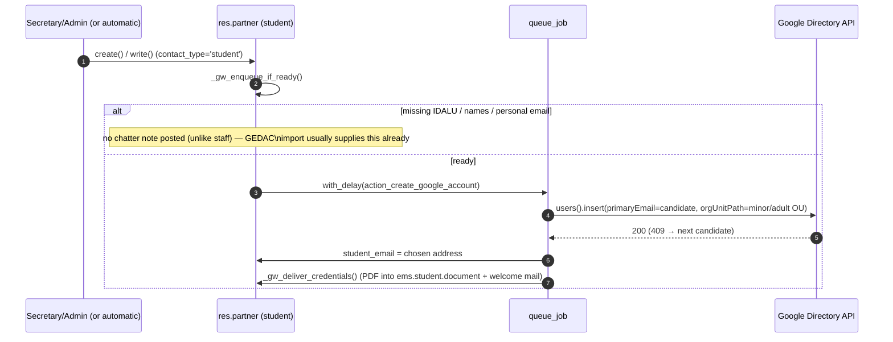
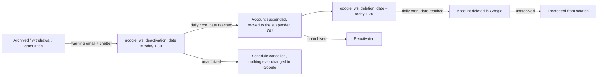
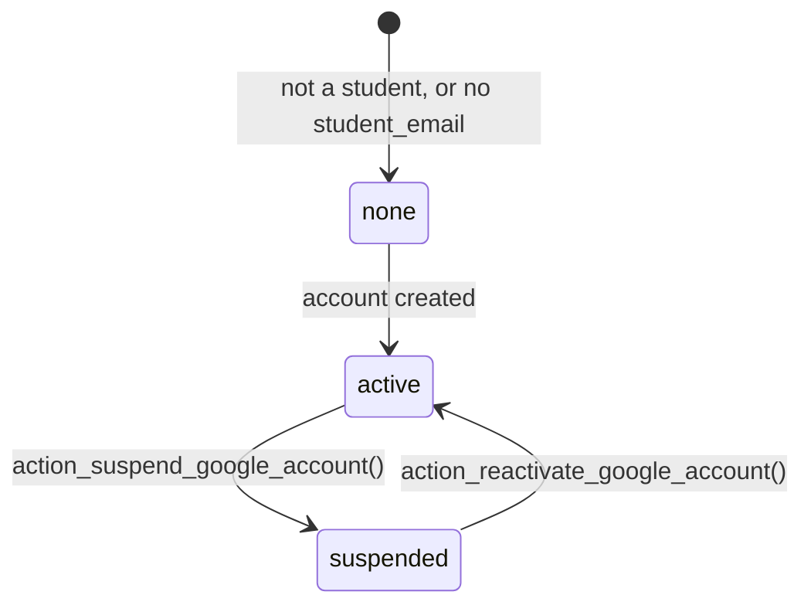
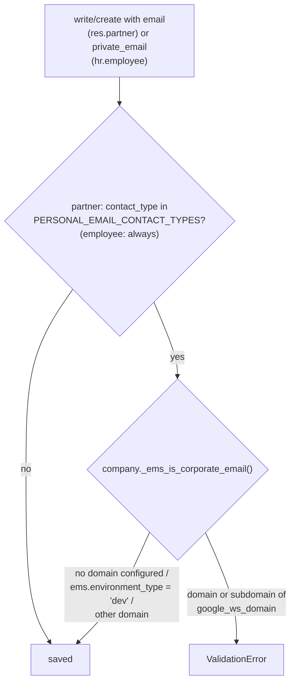

# Google Workspace student integration

Automates the corporate Google Workspace account every student needs, created through
the Admin SDK Directory API; the resulting address is stored in `student_email`. Unlike
the staff sibling (below), students never get a separate `res.users` — there is no EMS
login/OAuth-linking step here, so this file is noticeably smaller.

Lives in `models/contacts/google_workspace_integration.py` (`ResPartnerGoogleWorkspace`,
`_inherit = 'res.partner'`), with shared helpers in
[`google.workspace.mixin`](../shared/google_workspace_mixin.md).
See [Google Workspace staff integration](../employees/google_workspace_staff.md) for the
teacher/ASP sibling — same shared mixin, same overall shape, different account population
and no EMS-user step.

## Flow



### Email candidate strategy — `_gw_email_candidates`

Ordered, IDALU/birth-year-based (no separate "suggested login" field like staff's
`google_ws_login` — students have no equivalent field to seed one):

```
Juan Morote Puente, born 2006, IDALU 123456789
1. jmorote         initial(firstname) + surname1
2. jmorotep        + initial(surname2)
3. jmorotep06      base + last 2 digits of birth year
4. jmorotep89      base + last 2 digits of IDALU
5. jmorotep6789    base + last 4 digits of IDALU
```

Existence in Google is resolved by trying `users().insert()` and reacting to a `409`
conflict (try the next candidate) rather than a pre-check `users().get()` — a role scoped
to the students OU gets `403`, not `404`, for a non-existent user, so `get()` cannot
reliably tell "free" from "not authorized." `_gw_email_used_in_ems` additionally excludes
any candidate already claimed by another student record in EMS itself.

## Minor / adult OU placement

The one piece of logic with **no staff equivalent** (staff branches on `employee_type`
instead): every account-touching action re-derives the target OU from `is_adult`
(`res.partner`'s own compute, from `birth_date`) at the moment it runs:

```python
ou = company.google_ws_ou_adult if self.is_adult else company.google_ws_ou_minor
```

`birth_date` is **deliberately not** in `_gw_missing_fields()` — the account must be
created as soon as the student is admitted (matriculation), even from GEDAC data that has
no birth date yet. Without it, `is_adult` is `False` and the student starts in the minors
OU. **`action_relocate_google_account`** is the catch-up step: triggered by
`contact.py`'s `write()` whenever `birth_date` changes (`_gw_enqueue_relocate`), it
re-derives the OU and `users().patch()`es it — a no-op on Google's side if the OU turns
out unchanged. Skips suspended accounts (they live in the suspended OU; reactivation
re-derives the correct one instead). There is no manual button for this — it is
queue-job-only, same as the staff doc notes for its own internal-only steps.

**Bug found and fixed in this pass (2026-07-28):** `action_relocate_google_account` called
`self._gw_get_service()` directly — a method that does not exist on this model (it lives
on the `google.workspace.mixin`, reached everywhere else via `self._gw()._gw_get_service()`).
This raised `AttributeError` on every real (non-dry-run) relocation, i.e. whenever a
student's birth date arrived after account creation and actually needed to move them out
of the minors OU. Masked in practice because dry-run mode returns before reaching that
line, and no test previously exercised the non-dry-run path. Fixed, with a regression test
(`test_relocate_uses_shared_gw_helper`) that forces `google_ws_dry_run = False` and mocks
`GoogleWorkspaceMixin._gw_get_service` directly — the dry-run-only testing habit inherited
from the staff suite cannot catch this class of bug, worth remembering for any future
method added to either integration.

## Lifecycle

Archiving a student does **not** touch the Google account straight away. It opens a
two-stage grace period (issue #388) driven by two date fields on the partner and a daily
cron, so a student who leaves and comes back within the month never loses anything, and
nobody is deactivated without having been told first:



| Student event | Google account |
|---|---|
| Admitted / data completed (ready) | created (queued), OU by current `is_adult` |
| `birth_date` arrives/changes | relocated to the OU matching the new `is_adult` (queued) |
| Archived / withdrawal / graduation conversion | **nothing yet**: `google_ws_deactivation_date` set to today + `GW_DEACTIVATION_DELAY_DAYS`, warning email sent, chatter note posted |
| Deactivation date reached (daily cron) | suspended, moved to the suspended OU (queued); `google_ws_deletion_date` set to today + `GW_DELETION_DELAY_DAYS` |
| Deletion date reached (daily cron) | **deleted** in Google (queued); `google_ws_deleted = True`, `student_email` kept for traceability |
| Unarchived before the deactivation date | schedule cancelled, chatter note; the account was never touched |
| Unarchived while suspended | reactivated (queued), deletion schedule cancelled |
| Unarchived after deletion | recreated from scratch (new credentials; the same address again if it is still free, the next candidate if Google still holds it) |
| Deleted (`unlink`) | suspended **synchronously**, before the record disappears |

The delays are fixed constants in `models/shared/google_workspace_mixin.py`
(`GW_DEACTIVATION_DELAY_DAYS`, `GW_DELETION_DELAY_DAYS`, both 30) rather than company
settings: the centre's policy is the one written in the issue, and a per-centre knob would
only add a way to get it wrong.

### The daily cron

`ems.ir_cron_gw_student_lifecycle` (`data/main/ir_cron_google_workspace.csv`) runs
`res.partner._gw_cron_process_lifecycle()` once a day. It does no Google API call itself:
it only finds the partners whose scheduled date has arrived and enqueues the existing
`action_suspend_google_account` / `action_delete_google_account` jobs, so a slow or failing
Directory API call never blocks the cron.

```python
# suspension due: archived students whose deactivation date has arrived
[('active', '=', False), ('google_ws_deactivation_date', '<=', today),
 ('google_ws_suspended', '=', False), ('student_email', '!=', False)]
# deletion due: already suspended, deletion date arrived, not deleted yet
[('active', '=', False), ('google_ws_deletion_date', '<=', today),
 ('google_ws_suspended', '=', True), ('google_ws_deleted', '=', False)]
```

Both searches use `active_test=False` — every record they look for is archived by
definition.

### Deletion is irreversible, and only for new departures

`action_delete_google_account()` calls `users().delete()` on the Directory API: the mailbox
and Drive content are gone. Three guards keep it narrow:

- It only ever runs from a `google_ws_deletion_date` that `action_suspend_google_account()`
  itself set — i.e. an account that went through the full warned-and-suspended path.
- Students already suspended before this feature existed have no
  `google_ws_deletion_date`, and the migration deliberately does **not** backfill one: they
  stay suspended forever, exactly as they are today. Only departures from now on get a
  deletion date.
- `google_ws_deleted` makes it idempotent, and `student_email` is deliberately **kept** on
  the record after deletion, so the address is still seen as taken by
  `_gw_email_used_in_ems()` and never handed to a different student.

### `unlink()` keeps suspending synchronously

The `unlink()` override still suspends immediately instead of scheduling, and deliberately
so: a hard delete leaves no record to hold `google_ws_deactivation_date`, so there would be
nothing for the cron to find. A hard delete is also not the archive/withdrawal path the
grace period is about — it is an administrative removal of the record itself. Runs
`action_suspend_google_account()` synchronously (not queued) since the partner — and its
`student_email` — will not exist once `unlink()` returns; a failure is logged, not raised,
so it never blocks the actual deletion.

### The warning email

`ems.mail_template_google_deactivation_student`
(`data/main/mail.template-google_lifecycle.csv`) is sent once, when the schedule is
created, to **both** the personal address (`email`) and the corporate one
(`student_email`): the corporate mailbox is still alive during the grace period, and it is
the one the student actually reads day to day. It states both dates — deactivation and
deletion — as the issue requires. A student with neither address gets the chatter note
only.

## `google_ws_state`

Same single-source-of-truth pattern as the staff side, but only **3** states (no
`manual_pending`/`pending_user` — those exist only because staff has a separate EMS-user
step):



| `google_ws_state` | Header button shown (`views/community/contact/form.xml`) | Meaning |
|---|---|---|
| `none` | Create Google account | Not a student, or no corporate email yet |
| `active` | Suspend Google account, Reset Google password (the latter also needs `can_reset_google_password`) | Fully set up |
| `suspended` | Reactivate Google account | `google_ws_suspended = True` |

The same one-off migration as the staff side (`migrations/18.0.0.22.0/post-migrate.py`,
`_backfill_google_ws_suspended`) backfills `google_ws_suspended = True` for students
already archived/withdrawn before the field existed.

## Password reset

`action_reset_google_password()` (header button **Reset Google password**, only while
`google_ws_state == 'active'`, behind a `confirm`) gives an existing account a new password:

```mermaid
sequenceDiagram
    participant U as Academic admin / TAC / the student's tutor scope
    participant P as res.partner
    participant G as Directory API
    U->>P: action_reset_google_password()
    P->>P: permission check, active account, integration enabled
    P->>G: users().patch(password, changePasswordAtNextLogin=True)
    Note over P,G: skipped in dry-run; an HttpError becomes a UserError<br/>naming the "Reset password" admin-role privilege
    P->>P: sudo: previous google_credentials documents -> cancelled
    P->>P: _gw_deliver_credentials() (new PDF + welcome email)
    P->>P: sudo: chatter note, authored by the user
```

The Google call happens first, so a refusal leaves the previous PDF untouched. The service
account's custom admin role needs Google's **Reset password** privilege on the student OUs,
which is separate from **Update**. The chatter note shares its PDF/email wording with the
creation note through `_gw_delivery_note()`.

A tutor resets the password of their own students (issue #490): they already hand those
students their credentials, so making them go through TAC for a forgotten password added a
detour and no protection. The right is per record, not per role: `action_reset_google_password()`
accepts the acting user when `ems.base.user_acts_as_tutor(partner.tutor_id)` is true, which is
where the hierarchy escalation comes from for free — `hr.employee.tutor_scope_user_ids` (issue
#483) already resolves a tutor to themselves, every chief above them along `parent_id` holding
`ems.group_department_chief` (Department/Seminar Chief, and Head of Studies/Deputy, which imply
it) and the Director of their company. A chief of a *different* branch gets nothing, which is the
whole point: the button must not follow flat group membership. A student whose group has no tutor
(`tutor_id` empty) stays with academic admin and TAC only.

Since `rule_contact_teacher` lets any teacher read every student, the button's `groups=` alone
would show it on students the user cannot actually reset. `res.partner.can_reset_google_password`
(computed, `compute_sudo=True`, not stored) answers the same question the method enforces, and the
button's `invisible` reads it; the method still repeats the check, since a view attribute only
hides.

The secretary is deliberately left out: it takes part in account *creation* only as a step
of enrolling a student. The TAC team reads students only (`rule_contact_teacher`), which is
why every write in the flow goes through `sudo()`. The same applies to the create and suspend
buttons, which the TAC team also has: their chatter notes are posted with `sudo()` (posting on a
partner needs write access), still authored by the real user.

## Access control

`rule_contact_teacher` (`security/rules/contacts.xml`) gives `ems.group_teacher` **read
access to every `res.partner`, unrestricted** (`domain_force = []`). Anything about the
Google account that appears on the student form is therefore visible to any teacher unless
it carries its own `groups`, which is why the grace-period banners, the optional list
columns and the search filters all repeat the same groups as the buttons they belong to:
whoever cannot act on the account has no business reading its schedule either. Regression
tests: `test_schedule_is_hidden_from_teachers` / `test_schedule_is_visible_to_the_secretary`
/ `test_search_filters_are_hidden_from_teachers`, which assert on the arch actually
returned by `get_view()` per user.

This is a view-level restriction, not a field-level one: the fields themselves carry no
`groups=`, so they stay readable over RPC by anyone who can read the partner. That was a
deliberate call (the data is an administrative date, not personal data about the student);
tightening it would mean putting `groups=` on the field definitions and re-checking every
write path.

| Action | Who |
|---|---|
| Header buttons create/suspend | `ems.group_secretary`, `ems.group_academic_admin`, `ems.group_tac` |
| Header buttons reactivate/delete/cancel | `ems.group_secretary`, `ems.group_academic_admin` |
| Reset Google password (button, plus the same check inside the method) | `ems.group_academic_admin`, `ems.group_tac`, and the student's own tutor scope (`can_reset_google_password` / `user_acts_as_tutor`, issue #490) |
| Reading the credentials PDFs (Documentation tab, bulk download) | see [student_document.md](student_document.md#access-control): tutors their own students' (every chief above a tutor, that tutor's students), TAC everyone's |
| Grace-period banners, optional list columns, search filters | same as above |
| `_gw_deliver_credentials`'s document/email creation | `sudo()` inside the flow (queue jobs run as the job's own user, not necessarily one with `ems.student.document`/mail rights) |

## Required fields

| Step | Required data |
|---|---|
| Google account creation | `firstname`, `lastname`, `student_id` (IDALU), `email` (personal, used for recovery + credential delivery) — `birth_date` deliberately **not** required, see above |

## Personal email can never be a corporate one (#514)

The personal email is where credentials are delivered and the account's recovery address, so
a corporate address there is useless (the student can't read it before the account exists, and
loses it when the account is suspended). Enforced by the ORM, not the view, so every write path
is covered (form, portal wizard, merge, imports):



| Piece | Where | Notes |
|---|---|---|
| `_ems_is_corporate_email(email)` | `res.company` (`models/settings/company.py`) | Normalizes the address; matches `google_ws_domain` itself or any subdomain, case-insensitively. Always `False` without a domain, and on a **development** database (`ems.environment_type = 'dev'`): `devel.sh` rewrites every stored address onto that same domain. A database with no value declared (e.g. CI) **is** checked. |
| `_ems_check_personal_email(email)` | `res.company` | Raises the `ValidationError`; shared by both constraints below. |
| `_check_email_not_corporate` | `res.partner` (`models/contacts/contact.py`) | `@api.constrains('email')` only, for `PERSONAL_EMAIL_CONTACT_TYPES` (`student`, `family`, `applicant`, `alumni`, `withdrawal`, `expelled`). Staff work contacts (no `contact_type`) are excluded: their email *is* the corporate account. Deliberately not triggered by `contact_type`, so a legacy corporate value never blocks a type change (enrollment, graduation...). |
| `_check_private_email_not_corporate` | `hr.employee` (`models/employees/employee.py`) | `@api.constrains('private_email')`, also reached from "My Profile" (`private_email` is self-writeable on `res.users`). `work_email` is untouched. |
| `_ems_drop_corporate_email(email, name, warnings)` | `res.company` | Import helper: returns `False` and appends a warning instead of letting the constraint fail the whole row. Used by the Esfera import (student and tutor/family emails), the CSV update wizard (the `email` key is dropped, the current value kept) and the GEDAC applicant import, each rendering a "Warnings" block in its result. |

Existing records aren't migrated: the check only runs when the field is written again.

## Tests

`tests/test_personal_email_not_corporate.py` covers the rule above (helper, both constraints,
dev/undeclared environment, legacy value vs. type change, "My Profile"); the three import
wizards' own test files cover the drop-with-warning path, and
`TestContactTour.test_student_personal_email_not_corporate_tour` the validation dialog on the
student form (secretary). Tests call `enforce_corporate_email_policy()` (`tests/common.py`),
since this dev box is declared `'dev'`.

`tests/test_student_google_workspace.py` (`TestStudentGoogleWorkspace`) — readiness,
email-candidate strategy, creation (dry-run, both OUs, idempotence, missing-data
`UserError`), suspend/reactivate (dry-run, idempotence), relocate (dry-run, the
suspended-account skip, and the non-dry-run regression test for the bug above), and
`unlink()`. `google_ws_state` for all 3 states and the `google_ws_suspended` migration
backfill are already covered by `tests/test_exit_management.py` (not duplicated here — see
that file's `test_gw_*`/`test_migration_backfills_suspended_for_alumni_and_withdrawal`).
`tests/test_student_google_workspace.py` also carries
`TestStudentGoogleWorkspaceLifecycle` for the grace period (#388): scheduling on archive,
the warning email, cancelling, the deletion schedule set by the suspension and cancelled
by the reactivation, `action_delete_google_account` (dry-run, the real `users().delete()`
call, idempotence, the not-suspended guard, the address staying reserved), recreation
after deletion, and both cron stages - including the check that a student suspended
before this feature existed, with no `google_ws_deletion_date`, is never deleted.

`tests/test_student_google_workspace_tour.py` (`TestStudentGoogleWorkspaceTour`) renders
the two banners and their buttons in a real browser: they are driven by the date fields
rather than by `google_ws_state`, so no state test covers them. It relies on
`ems.action_student_kanban` running with `active_test` disabled, which is what keeps
archived students reachable from their own menu.
