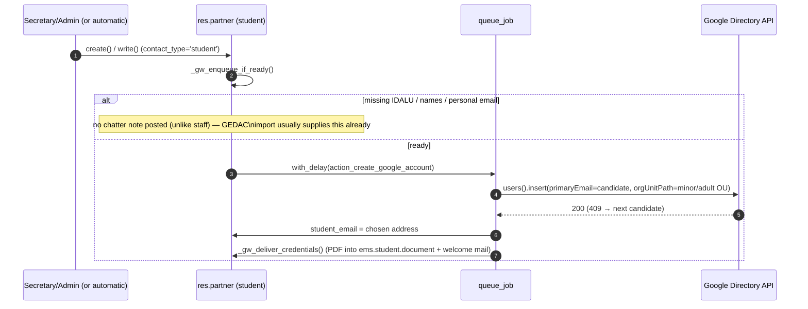
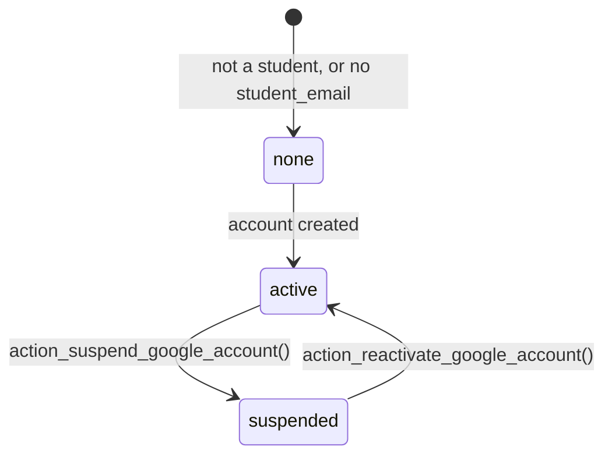

# Google Workspace student integration

Automates the corporate Google Workspace account every student needs, created through
the Admin SDK Directory API; the resulting address is stored in `student_email`. Unlike
the staff sibling (below), students never get a separate `res.users` — there is no EMS
login/OAuth-linking step here, so this file is noticeably smaller.

Lives in `models/contacts/google_workspace_integration.py` (`ResPartnerGoogleWorkspace`,
`_inherit = 'res.partner'`), with shared helpers in
[`google.workspace.mixin`](../shared/google_workspace_mixin.md).
See [Google Workspace staff integration](../employees/google_workspace_staff.md) for the
teacher/ASP sibling — same shared mixin, same overall shape, different account population
and no EMS-user step.

## Flow



### Email candidate strategy — `_gw_email_candidates`

Ordered, IDALU/birth-year-based (no separate "suggested login" field like staff's
`google_ws_login` — students have no equivalent field to seed one):

```
Juan Morote Puente, born 2006, IDALU 123456789
1. jmorote         initial(firstname) + surname1
2. jmorotep        + initial(surname2)
3. jmorotep06      base + last 2 digits of birth year
4. jmorotep89      base + last 2 digits of IDALU
5. jmorotep6789    base + last 4 digits of IDALU
```

Existence in Google is resolved by trying `users().insert()` and reacting to a `409`
conflict (try the next candidate) rather than a pre-check `users().get()` — a role scoped
to the students OU gets `403`, not `404`, for a non-existent user, so `get()` cannot
reliably tell "free" from "not authorized." `_gw_email_used_in_ems` additionally excludes
any candidate already claimed by another student record in EMS itself.

## Minor / adult OU placement

The one piece of logic with **no staff equivalent** (staff branches on `employee_type`
instead): every account-touching action re-derives the target OU from `is_adult`
(`res.partner`'s own compute, from `birth_date`) at the moment it runs:

```python
ou = company.google_ws_ou_adult if self.is_adult else company.google_ws_ou_minor
```

`birth_date` is **deliberately not** in `_gw_missing_fields()` — the account must be
created as soon as the student is admitted (matriculation), even from GEDAC data that has
no birth date yet. Without it, `is_adult` is `False` and the student starts in the minors
OU. **`action_relocate_google_account`** is the catch-up step: triggered by
`contact.py`'s `write()` whenever `birth_date` changes (`_gw_enqueue_relocate`), it
re-derives the OU and `users().patch()`es it — a no-op on Google's side if the OU turns
out unchanged. Skips suspended accounts (they live in the suspended OU; reactivation
re-derives the correct one instead). There is no manual button for this — it is
queue-job-only, same as the staff doc notes for its own internal-only steps.

**Bug found and fixed in this pass (2026-07-28):** `action_relocate_google_account` called
`self._gw_get_service()` directly — a method that does not exist on this model (it lives
on the `google.workspace.mixin`, reached everywhere else via `self._gw()._gw_get_service()`).
This raised `AttributeError` on every real (non-dry-run) relocation, i.e. whenever a
student's birth date arrived after account creation and actually needed to move them out
of the minors OU. Masked in practice because dry-run mode returns before reaching that
line, and no test previously exercised the non-dry-run path. Fixed, with a regression test
(`test_relocate_uses_shared_gw_helper`) that forces `google_ws_dry_run = False` and mocks
`GoogleWorkspaceMixin._gw_get_service` directly — the dry-run-only testing habit inherited
from the staff suite cannot catch this class of bug, worth remembering for any future
method added to either integration.

## Lifecycle

| Student event | Google account |
|---|---|
| Admitted / data completed (ready) | created (queued), OU by current `is_adult` |
| `birth_date` arrives/changes | relocated to the OU matching the new `is_adult` (queued) |
| Archived / withdrawal / graduation conversion | suspended, moved to the suspended OU (queued) |
| Unarchived | reactivated (queued); recreated from scratch if it was deleted in Admin (404/403) |
| Deleted (`unlink`) | suspended **synchronously**, before the record disappears |

The `unlink()` override (added in this pass, mirroring `HrEmployeeGoogleWorkspace.unlink()`
exactly — the student side had none before) exists because a hard delete bypasses
`write()`'s `active` flip entirely: without it, hard-deleting a student record with a live
Google account would leave that account active forever, with no EMS record left to act on
it. Runs `action_suspend_google_account()` synchronously (not queued) since the partner —
and its `student_email` — will not exist once `unlink()` returns; a failure is logged, not
raised, so it never blocks the actual deletion.

## `google_ws_state`

Same single-source-of-truth pattern as the staff side, but only **3** states (no
`manual_pending`/`pending_user` — those exist only because staff has a separate EMS-user
step):



| `google_ws_state` | Header button shown (`views/community/contact/form.xml`) | Meaning |
|---|---|---|
| `none` | Create Google account | Not a student, or no corporate email yet |
| `active` | Suspend Google account | Fully set up |
| `suspended` | Reactivate Google account | `google_ws_suspended = True` |

The same one-off migration as the staff side (`migrations/18.0.0.22.0/post-migrate.py`,
`_backfill_google_ws_suspended`) backfills `google_ws_suspended = True` for students
already archived/withdrawn before the field existed.

## Access control

| Action | Who |
|---|---|
| Header buttons (create/suspend/reactivate) | `ems.group_secretary`, `ems.group_academic_admin` |
| `_gw_deliver_credentials`'s document/email creation | `sudo()` inside the flow (queue jobs run as the job's own user, not necessarily one with `ems.student.document`/mail rights) |

## Required fields

| Step | Required data |
|---|---|
| Google account creation | `firstname`, `lastname`, `student_id` (IDALU), `email` (personal, used for recovery + credential delivery) — `birth_date` deliberately **not** required, see above |

## Tests

`tests/test_student_google_workspace.py` (`TestStudentGoogleWorkspace`) — readiness,
email-candidate strategy, creation (dry-run, both OUs, idempotence, missing-data
`UserError`), suspend/reactivate (dry-run, idempotence), relocate (dry-run, the
suspended-account skip, and the non-dry-run regression test for the bug above), and
`unlink()`. `google_ws_state` for all 3 states and the `google_ws_suspended` migration
backfill are already covered by `tests/test_exit_management.py` (not duplicated here — see
that file's `test_gw_*`/`test_migration_backfills_suspended_for_alumni_and_withdrawal`).
No browser tour: the header buttons/state logic is identical in shape to the staff side,
already covered end-to-end by `tests/test_employee_google_workspace_tour.py` for that
sibling — not worth a second near-identical tour for the student form.
