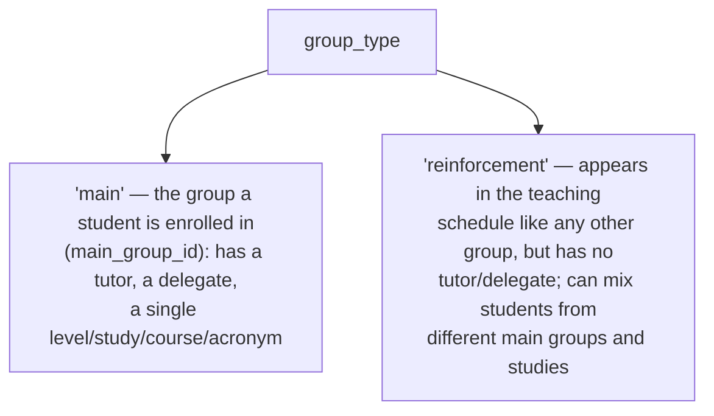
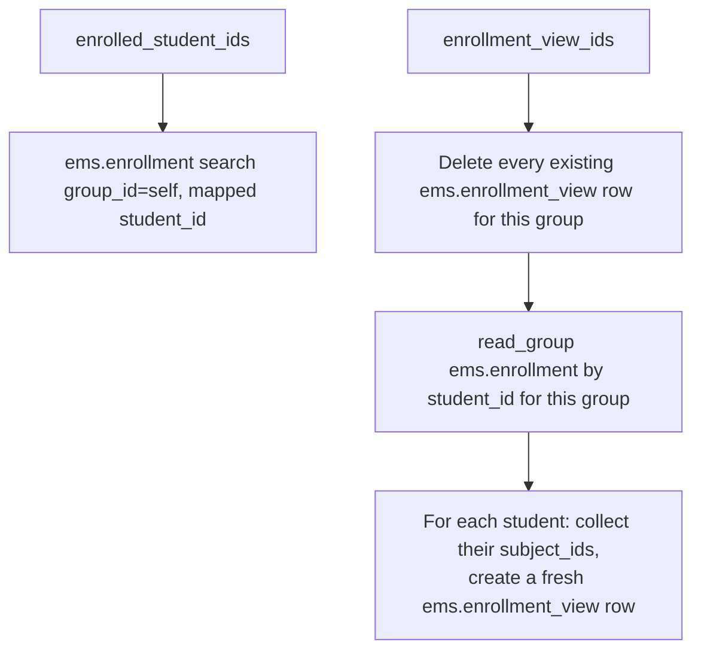

# Technical Reference: `ems.group`

## Overview

`ems.group` is the class group students are assigned to — one of the most widely-referenced models in EMS (attendance, teaching, grading, notices, working schedules, enrollment all key off `group_id`/`group_ids`). This doc covers the core model; the **Schedule tab specifically** (aggregating teachers' calendars into a read-only weekly timetable) has its own dedicated doc: [Group schedule (read-only aggregation)](group_schedule.md), implemented in the separate `models/contacts/group_schedule.py` file (`_inherit = ['ems.group', 'ems.schedule_report_mixin']`).

**Module file:** `models/contacts/group.py`

---

## Data Model

### Two group types, one model



### Fields

| Field | Type | Required | Stored | Description |
|-------|------|----------|--------|-------------|
| `group_type` | `Selection` (`main`/`reinforcement`), default `main` | Yes | Yes | See above |
| `course` | `Integer` | `main` only | Yes | e.g. `1` = first year |
| `acronym` | `Char` | `main` only | Yes | e.g. `A` |
| `external_id` | `Char` | No | Yes | Esfera (SAGA) group code, e.g. `ESO LOEM101` |
| `name` | `Char` (computed, `store=True`, `readonly=False`) | — | Yes | See `_compute_name` below — should not be edited manually for `main` groups |
| `level_id` | `Many2one → ems.level` | `main` only | Yes | — |
| `study_id` | `Many2one → ems.study` | `main` only | Yes | — |
| `tutor_id` | `Many2one → hr.employee` | No (`main` only, never on `reinforcement`) | Yes | Domain restricted to `employee_type = 'teacher'`; see the create/write sync below |
| `delegate_id` | `Many2one → res.partner` | No (`main` only) | Yes | Domain restricted to students of this same group |
| `space_id` | `Many2one → ems.space` | No | Yes | Usual classroom |
| `shift` | `Selection` (`morning`/`afternoon`) | No | Yes | Feeds `group_schedule.md`'s `SHIFT_HOURS` window |
| `main_student_ids` | `One2many → res.partner` | — | No | Inverse of `contact.main_group_id`, filtered to students |
| `reinforcement_student_ids` | `Many2many → res.partner` | — | Yes | Filtered to students |
| `enrolled_student_ids` | `Many2many → res.partner` (computed) | — | No | See below |
| `enrollment_view_ids` | `One2many → ems.enrollment_view` (computed) | — | No | See below |
| `notes` | `Text` | No | Yes | — |

### `_compute_name`

For `main` groups: `f"{study_id.acronym}{course}{acronym}"` (e.g. `DAM1A`) — but only once all three source fields are actually filled in; left blank rather than rendering the literal `"False0False"` during the transient state right after switching a `reinforcement` group back to `main` (see `_compute_name`'s own comment and `test_compute_name_leaves_blank_for_incomplete_main_group`). For `reinforcement` groups: `acronym` or `external_id` or a translated `"New Reinforcement Group"` fallback — but only if `name` isn't already set (a reinforcement group's name is typically hand-entered, e.g. `REF-MATHS`).

### `_compute_enrolled_student_ids` / `_compute_enrollment_ids`



`enrollment_view_ids` is unusual: its compute has **side effects** (delete + recreate `ems.enrollment_view` rows) rather than being a pure read — the only way found to expose "this group's enrollments, one row per student with their subjects aggregated" as a browsable One2many, since Odoo can't filter a computed relation server-side the way a stored inverse can (see the field's own inline comment). `ems.enrollment_view` is a `TransientModel` (auto-vacuumed), so the churn is cheap, but every read of a stale/unset `enrollment_view_ids` re-runs a delete+insert, not just a `SELECT` — worth knowing if this model's read patterns ever become a hot path.

### `group_type` switching

- **`_onchange_group_type`** (form-only): clears the group's own now-irrelevant fields the moment the radio is toggled, purely so the user sees them clear before Save.
- **`_sanitize_group_type_vals`** (called from both `create()` and `write()`): the actual guarantee — the onchange never runs for a `write()` that doesn't go through this exact form (RPC, batch action, an import), so this re-does the same clearing at the ORM level, right before `_check_group_type_fields` would otherwise reject the switch.
- **`_check_group_type_fields`** (`@api.constrains`): the hard validation — `main` requires level+study+course+acronym; `reinforcement` must have none of level/study/tutor/delegate, and blocks the switch entirely if the group still has `main_student_ids` enrolled (they'd otherwise be silently orphaned).

### Tutor role sync — `create()`/`write()` share `_sync_tutor_role()`

**Fixed bug (2026-07-27, ahead of this model's own DTON turn, at the user's explicit request once the gap was found while DTON-ing `hr.employee`):** `write()` already called `update_tutor_role()`/`_sync_security_groups()` on `hr.employee` whenever `tutor_id` changed; `create()` didn't — a group created with `tutor_id` already set in the creation vals left the employee's `tutorship_ids` relation correct (it's just `tutor_id`'s inverse) but never granted `ems.role_tutor` or synced their security groups, until someone happened to re-save the field later. Both paths now share one `_sync_tutor_role(employees)` helper. Regression test: `test_group.py::test_create_with_tutor_already_set_syncs_role`.

```mermaid
flowchart TD
    A["create() with tutor_id in vals"] --> B[super().create]
    B --> C["_sync_tutor_role(created.mapped('tutor_id'))"]
    D["write() with tutor_id in vals"] --> E[snapshot old_tutor before super().write]
    E --> F[super().write]
    F --> G["_sync_tutor_role(old_tutor | new_tutor)"]
```

---

## Access Control

Defined in `security/ir.model.access.csv` (lines 42–44).

| Role | Create | Read | Write | Delete | Group XML ID |
|------|:------:|:----:|:-----:|:------:|--------------|
| Department Chief | ✓ | ✓ | ✓ | ✓ | `ems.group_department_chief` |
| Teacher | — | ✓ | — | — | `ems.group_teacher` |
| Secretary | — | ✓ | — | — | `ems.group_secretary` |

Note: the admin-equivalent group here is `group_department_chief`, not `group_academic_admin` like most other configuration models — Head of Studies and above already have write access via role escalation (see [Academic role hierarchy](../employees/role_hierarchy.md)), so department chiefs are the practical floor for managing groups directly.

---

## Integration Map

`ems.group` is referenced (as `group_id`/`group_ids`) by well over a dozen models across the app — selected consumers:

| Area | Model(s) |
|------|----------|
| Attendance | `ems.attendance_template`, `ems.attendance_session_header/_line`, `ems.attendance_report_wizard` |
| Teaching/schedule | `ems.teaching`, `resource.calendar.attendance` (working schedule) |
| Grades | `ems.grade_session`, `ems.student.year_record`, `ems.em_grading_wizard` |
| Enrollment | `ems.enrollment`, `ems.contact` (`main_group_id`) |
| Communications | `ems.notice`, `ems.limesurvey_header`, `ems.limesurvey_recipient` |
| Employees | `hr.employee.tutorship_ids` (inverse of `tutor_id`) |

---

## Views

| View | File | Notes |
|------|------|-------|
| List | `views/community/group/list.xml` | — |
| Form | `views/community/group/form.xml` | Main data (radio `group_type`) + Students (main or reinforcement, shown conditionally) / Enrolled / Schedule / Notes tabs |
| Action + Menu | `views/community/group/menu.xml` | `action_group_tree`, "Groups (for students)" |

The Schedule tab is documented separately — see [Group schedule](group_schedule.md).
