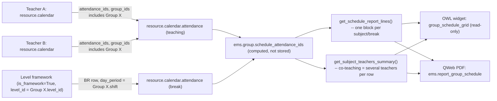

# Technical Reference: Group Schedule (read-only aggregation)

## Overview

`ems.group` has no schedule of its own — every timetable slot lives on a *teacher's*
personal `resource.calendar` (see [Teacher working schedules & schedule frameworks](../employees/working_schedule.md)),
tagged with `group_ids` (Many2many `ems.group`). The **Schedule** tab on the group form is
a read-only "photo" of that data, built by aggregating every `resource.calendar.attendance`
row across every teacher's calendar whose `group_ids` includes this group — plus, when
derivable, the group's break/patio period — with a PDF export. There is no editing here:
changes are made from the teacher's own Schedule tab, exactly as today.

## Model changes

**`resource.calendar.attendance`** (`ems_working_schedule_assignation`, `models/employees/working_schedule.py`):
- `employee_id` (Many2one `hr.employee`, computed, stored, `compute_sudo=True`, depends on
  `calendar_id`) — the teacher who owns the slot's calendar, resolved via the new
  `resource.calendar.get_employee()` helper (the same reverse `resource_calendar_id` search
  `apply_schedule_changes()` already did inline). Stored because it is read in bulk across
  many different teachers' calendars whenever a group's schedule is aggregated.

**`ems.group`** (new file `models/contacts/group_schedule.py`, `_inherit = ['ems.group', 'ems.schedule_report_mixin']`):
- `schedule_attendance_ids` (Many2many `resource.calendar.attendance`, computed, not
  stored) — same pattern as the pre-existing `enrolled_student_ids` computed Many2many, just
  built from the union of two searches instead of one: teaching rows (`group_ids` includes
  this group) and, if derivable, the group's break row(s) (see below).
- `_get_break_entries()` — derives the group's patio/break period from its **level's
  schedule framework** (`resource.calendar` with `is_framework=True` and matching
  `level_id`), filtering that framework's own non-teaching rows for `non_teaching.is_break`
  and `day_period == group.shift`. Returns an empty recordset (no error) when the group has
  no `level_id` (e.g. a reinforcement group), no `shift`, or no framework exists for its
  level — the break simply doesn't appear on that group's schedule.
- `get_schedule_report_lines()` — one row per distinct `(hour_from, hour_to)`, one cell per
  weekday. Within a cell, teaching entries are grouped by `subject_id` (several teachers
  co-teaching the same subject at the same time collapse into **one** visual block, never
  one per teacher); a break entry (no `subject_id`) renders as its own, differently-styled
  block.
- `get_subject_teachers_summary()` — one row per distinct subject taught to this group, with
  the sorted, de-duplicated list of `employee_id.display_name` teaching it. This is where
  co-teaching becomes visible (more than one name in the row), instead of in the grid.

**`models/shared/schedule_report_mixin.py`** (new, `AbstractModel`) — the only pieces
genuinely identical between the teacher-side and group-side reports: `REPORT_COLOR_PALETTE`,
`_report_color_key()`, `_format_report_time()`. Both `ems_working_schedule` (`resource.calendar`)
and the new group class inherit it. The row/cell-building loop itself is **not** shared —
the teacher version yields one entry per cell, the group version yields a *list* (subject
dedup, optional break) — forcing one generic method to branch on that shape would be less
readable than two short, independently-clear methods.

## OWL widget

`static/src/js/backend/group_schedule_grid_field.js` (`GroupScheduleGridField`, field
widget `group_schedule_grid`, `supportedTypes: ["one2many"]`) + matching `.xml` template.
Purely display: no edit buffer, no Edit/Import/New. It does **not** call
`get_schedule_report_lines()`/`get_subject_teachers_summary()` over RPC (those return real
recordsets in a `'entries'`/`'blocks'` shape that isn't JSON-serializable — they're used
server-side only, by the PDF template below) — instead it builds the grid and the
"Subject → Teacher(s)" table entirely client-side from the record's own prefetched
`schedule_attendance_ids` sub-records (the sub-fields declared on the view's embedded
`<list>`: `dayofweek`, `hour_from`, `hour_to`, `subject_id`, `non_teaching`, `employee_id`,
`space_id`), mirroring how the teacher's own `schedule_grid_field.js` never calls
`get_schedule_report_lines()` either. It reuses the teacher grid's existing CSS classes
as-is (`static/src/css/backend/schedule_grid.css`) — including
`.o_schedule_grid_entry_nonteaching` for the break block — no new CSS was needed.

Shares only pure geometry helpers (`PX_PER_HOUR`, day labels, bounds/hours computation,
time formatting) with the teacher's `schedule_grid_field.js`, via a new plain module
`static/src/js/backend/schedule_grid_geometry.js` that both widgets import from — not a
shared component, since the two widgets' interactive surface (edit buffer vs. none) is
different enough that forcing one component to cover both would leave a lot of dead code
active in the read-only case.

**Overlap handling:** unlike a single teacher's own calendar (which can't have two genuinely
simultaneous entries), a group's aggregated schedule can — e.g. several elective subjects or
co-teaching entries scheduled at the same time as the derived break. A break block is always
rendered at its true, exact duration (never stretched to a minimum height like a short teaching
block is) and always painted *behind* teaching blocks (`z-index: 1` vs `2` in
`schedule_grid.css`), so it can visually sit underneath an overlapping subject without ever
hiding it — real timetable data (e.g. a CFGS group with several evening electives right around
its break) can and does produce this overlap.

**Break-only compact rendering:** a break is also rendered as a single compact line (time +
label together, `.o_schedule_grid_entry_compact`) instead of the normal time/label/room stack,
since a short patio slot doesn't have room for three lines. This must key off
`resource.calendar.attendance.non_teaching_is_break` (a `related="non_teaching.is_break"`,
stored field added for exactly this) — **not** a plain `non_teaching` truthiness check, which
would also catch a full-length (e.g. 1h) guard duty or coordination meeting and needlessly
cram it into the compact layout too. The teacher's own tab needs this distinction (it has real
non-break `non_teaching` entries); the group tab's own `schedule_attendance_ids` structurally
never contains anything but breaks in its non-teaching slice (`_get_break_entries()` already
filters on `is_break`), but reads the same field for consistency and to not rely on that
invariant holding forever.

Below the grid, a read-only "Subject → Teacher(s)" table, built the same client-side way.
A single toolbar action, **PDF**, calling
`actionService.doAction("ems.action_report_group_schedule", { additionalContext: { active_ids: [...] } })`
— not gated by any permission check, since read access to a group's schedule is already
universal (see Access control below). The PDF itself is where
`get_schedule_report_lines()`/`get_subject_teachers_summary()` actually run, server-side.

## PDF report (`ems.report_group_schedule`)

`reports/contacts/report_group_schedule.xml` — a `qweb-pdf` `ir.actions.report` on
`ems.group`, bound (`binding_type="report"`) so it also appears in the group form's native
Print menu. Mirrors `reports/employees/report_working_schedule.xml`'s structure (grid table
+ a summary table below), swapping the hours-summary for the "Subject → Teacher(s)" table
described above.

## Access control

| Action | `base.group_user` (teacher, secretary, tutor, ...) | `ems.group_department_chief` and above |
|--------|------------------------------|------------------------------|
| Read a group's aggregated schedule (`schedule_attendance_ids`, `get_schedule_report_lines()`, `get_subject_teachers_summary()`) | Yes | Yes |
| Export a group's schedule to PDF | Yes | Yes |
| Edit a group's schedule | No (not possible from this tab at all — edit from the teacher's own Schedule tab) | No (same) |

No new ACL rows are needed: every internal user already has read access to
`resource.calendar`/`resource.calendar.attendance` (base Odoo ACL) and, via
`ems.access_ems_group_teacher`/`ems.access_ems_group_secretary`, to `ems.group` itself.
Portal users (families/students, `base.group_portal`) have **no** access to `ems.group` or
`resource.calendar*` today — out of scope for this feature.
