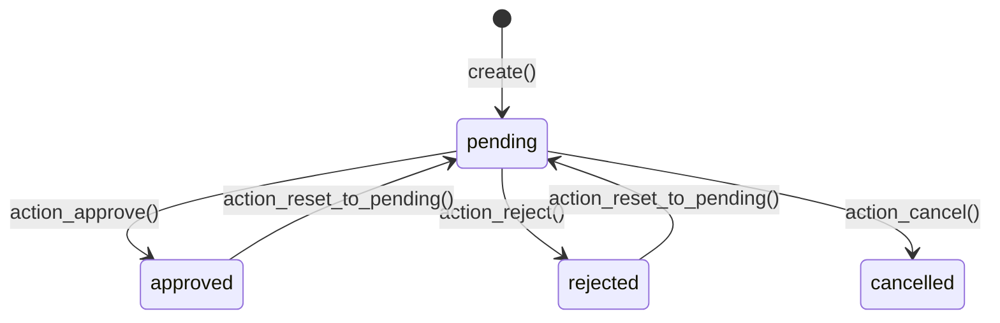
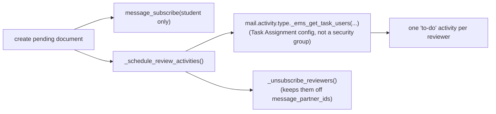
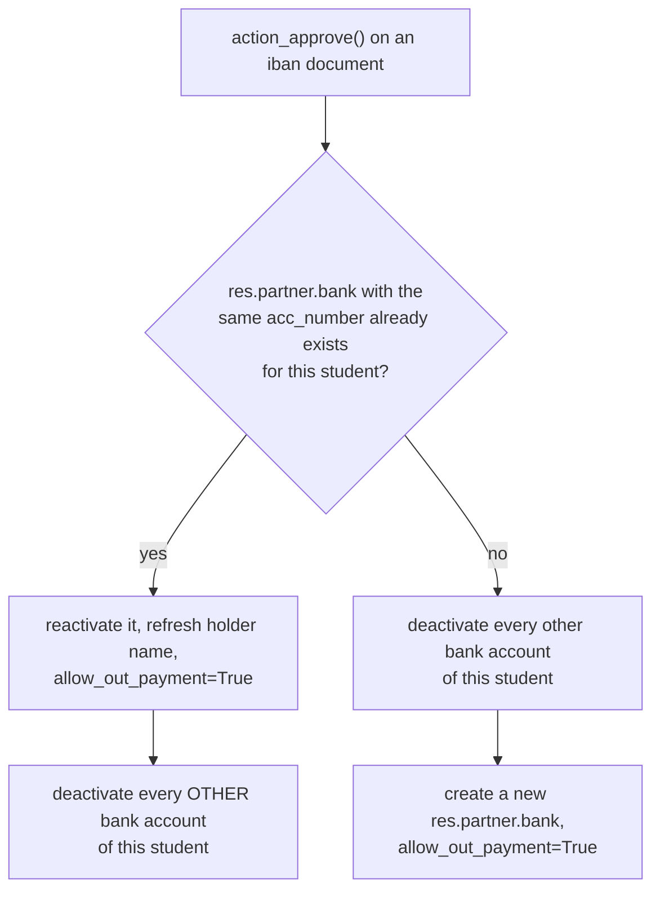

# Technical Reference: `ems.student.document`

## Overview

`ems.student.document` is the reviewable-submission model behind the "Document management" workflow: a student or family uploads (or the secretary/admin registers) a document — an ID card, a medical card, an IBAN, proof of a benefit/exemption — which then goes through a pending → approved/rejected/cancelled review cycle. Approving certain document types has real side effects elsewhere in the app: an approved IBAN updates the student's bank account (`res.partner.bank`), an approved benefit document creates/refreshes an [`ems.student.benefit`](contact.md#emsstudentbenefit) line.

**Module file:** `models/contacts/student_document.py` (`EmsStudentDocument`)

---

## Status lifecycle

Every transition drops any pending review `activity_ids` first (approve/reject/cancel all clear them; reset schedules a fresh one) and posts a chatter message. Creation and reset post an **internal note** (`mail.mt_note` — does not email followers, since the reviewer is already notified via their activity, see below); approve/reject post a **comment** (`mail.mt_comment` — does email the student, the only follower, see `create()` below).

### Who is notified, and how

Two deliberately separate notification channels, to avoid double-emailing anyone:
- **The student** is the only chatter follower — they get emailed on `action_approve`/`action_reject` (a `mail.mt_comment` post), which is the outcome they actually need to hear about.
- **Reviewers** (secretary/admin configured in *Academic Management > Configuration > Task Assignment*, keyed off the `ems.mail_activity_student_document_review` activity type — see `docs/en/developers/shared/task_assignment.md`) get a **to-do activity** instead of a chatter subscription; `mail_activity_quick_update` suppresses Odoo's own "X assigned you an activity" email (would otherwise read as if the submitting family were assigning work to the office), and `_unsubscribe_reviewers` keeps them off `message_partner_ids` so the later approve/reject comment doesn't double-notify them either.

---

## Approval side effects

### `_apply_bank_account()` — `doc_type == 'iban'`

Only one bank account stays `active` per student at a time — approving a new IBAN always deactivates any other. `allow_out_payment=True` is set explicitly: the secretary has just validated the IBAN by approving it, and without this flag a direct-debit invoice referencing the account would be blocked (or silently drop the bank reference). `_check_single_pending_iban` (`@api.constrains`) additionally blocks a **second pending** IBAN submission for the same student — one at a time in the queue, though any number can be `approved`/`rejected`/`cancelled` historically.

### `_apply_benefit()` — `doc_type == 'benefit'`

Removes any existing `ems.student.benefit` of the **same** `benefit_type` for this student (not all benefits — a student can hold several different benefit types at once, see [`contact.md`](contact.md#emsstudentbenefit)), computes `renewal_date` by replaying `ems.student.benefit`'s own `_onchange_benefit_type` on a virtual (`.new()`) record rather than duplicating that date logic here, then creates the new benefit line carrying over the uploaded file as its supporting document.

### `action_approve()`'s own document-level dedup

Independently of the two side effects above, approving a document also deletes any **other already-approved** `ems.student.document` of the same `doc_type` (+ `benefit_type` too, for benefit documents) for this student — e.g. approving a new DNI scan removes the previously-approved one, so the review queue/history doesn't accumulate stale approved duplicates.

---

## `_compute_doc_file_link`

A non-stored `Html` field building a download link (`/web/content/<attachment_id>?download=false`) from the `doc_file` attachment, used in the read-only embed on the student's own form (list columns can't render a `Binary` field as a clickable link directly). Looks up the `ir.attachment` by `(res_model, res_field, res_id)` rather than reading `doc_file`'s own implicit attachment id, since the field itself only exposes the base64 content, not the attachment record.

---

## `_doc_label()`

Small shared helper (`dict(self._fields['doc_type'].selection).get(self.doc_type, ...)`) — the human-readable, current-language label for a document's type. Used by `_compute_name`, every chatter message, and `_schedule_review_activities`'s task summary, so the six near-identical message bodies across `create()`/`action_approve()`/`action_reject()`/`action_cancel()`/`action_reset_to_pending()` don't each re-derive it.

---

## Access Control

### `ir.model.access.csv`

| Role | Create | Read | Write | Delete |
|------|:------:|:----:|:-----:|:------:|
| Academic admin | ✓ | ✓ | ✓ | ✓ |
| Secretary | ✓ | ✓ | ✓ | ✓ |
| Portal (`base.group_portal`) | — | ✓ | — | — |

### `security/rules/portal.xml` — `rule_ems_student_document_portal`

Domain: `partner_id in [self, parent, children]` — a portal user can only ever *read* their own, or their family's, document submissions.

**Fixed during this DTON pass (2026-07-28):** the portal `ir.model.access.csv` row previously granted `perm_write=1` with **no** matching `ir.rule` restriction on write (the rule explicitly had `perm_write=False`, meaning its domain never applied to write at all) — so, in principle, any authenticated portal user could have written to **any** student's document record via a direct RPC call, not just their own. Not exploitable through the normal app (every real mutation for the portal flow goes through `sudo()` in `controllers/portal_enrollment.py`, which never relies on the portal user's own ORM permissions), but a live, unused permission gap regardless — closed by setting `perm_write=0` on the access row (create was already `0`, matching the fact that the portal flow only ever creates via `sudo()`). The `ir.model.access.csv` fix propagates on a normal upgrade (not a `noupdate` file); the companion `ir.rule` cleanup (aligning its `perm_create` flag, itself already inert since ACL blocked create either way) lives in a `noupdate="1"` data file and therefore only takes effect on fresh installs — harmless, since the ACL row alone is what enforces the restriction on any already-upgraded environment.

---

## A known, deliberately-not-fixed gap

`controllers/portal_enrollment.py`'s `/my/documentacion/renew-iban` route can create an **already-`approved`** `ems.student.document` directly (for a student whose IBAN was originally imported via CSV, not submitted through this review flow) without going through `_apply_bank_account()`. In that specific case the existing `res.partner.bank` row is left as-is — including its `allow_out_payment` flag, which a first-time IBAN *approval* always sets to `True` but this renewal path does not touch. Whether an IBAN imported via CSV should already carry `allow_out_payment=True` is a data/business decision outside a documentation-and-testing DTON pass — flagged here rather than silently changed.

---

## Views

| View | File | Notes |
|------|------|-------|
| List/Form/Search | `views/community/contact/student_document.xml` | `view_student_document_list/_form/_search` — the **only** place Approve/Reject/Reset are reachable; header statusbar + buttons |
| Action | same file | `action_student_document`, `context: {'search_default_pending': 1}` |
| Menu | `views/academic_management/enrollment_configuration/menu.xml` | `menu_student_documents`, under *Academic Management* (not under the Educational Community / Students menu tree — easy to miss when looking for it there) |
| Read-only embed | `views/community/contact/form.xml`, "Documentation" page | `document_ids` one2many, `create="0" delete="0"`, no action buttons — review only happens from the standalone screen above |
