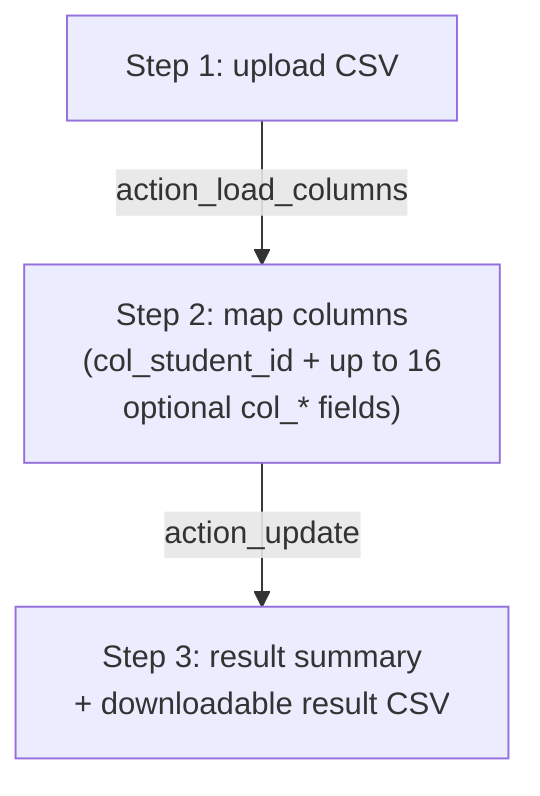

# Technical Reference: `ems.student_update_wizard`

## Overview

A generic, mappable-columns **CSV bulk-UPDATE** tool for fields on already-enrolled students — distinct from both [`ems.student_import_wizard`](student_import_wizard.md) (xlsx, Esfera/SAGA format only, can also **create** students) and the GEDAC preinscription import (applicants only). This wizard never creates a student: a row whose ID doesn't match an existing one is simply logged as "not found." Its column set isn't fixed to any external system's format — the secretary maps arbitrary CSV headers to a small set of `res.partner`/`res.partner.bank` fields on a per-run basis, so it works with whatever export a family/administration happens to hand over.

**Module file:** `models/contacts/student_update_wizard.py` (`EmsCSVColumn`, `EmsStudentUpdateWizard`)

**Entry point:** a `cogMenu` item ("Update students from CSV") on the Students list/kanban — same mechanism as `student_import_wizard.md`'s "Import from Esfera" (`static/src/js/backend/update_student_cog_menu.js`, `groupNumber: 20`, `sequence: 11`, right after the import one at `sequence: 10`). Not a `<menuitem>` — don't look for one in `views/`.

---

## Three-step flow

- **`action_load_columns`**: reads only the CSV's **header row** (`csv.reader`, first row), creates one `ems.csv_column` per header (a lightweight `Many2one`-target helper model so the form can offer them as dropdown choices for each `col_*` mapping field), and stores the header list in `csv_columns_json` — a field whose only purpose is driving the form's step-visibility (`invisible="not csv_columns_json"`), never read back as actual JSON.
- **Step 2 (client-side, no method call)**: the secretary picks, per `col_*` field, which CSV column (if any) maps to it. `fields_get()` is overridden so each `col_*` field's on-screen label is **borrowed from the real target field's own translated label** (`_COL_LABEL_SOURCE`, e.g. `col_street`'s label is whatever `res.partner.street`'s `string` currently is) — so the mapping screen's wording never drifts out of sync with the target model's own field labels.
- **`action_update`**: re-reads the **entire file** a second time (`csv.DictReader`, all rows) and writes immediately, row by row — there is **no dry-run/preview of the actual data values**, only the column-mapping screen from step 2. Matching is by `student_id` (IDALU/RALC) + `contact_type = 'student'`.

### Per-row outcome

| Case | Result |
|------|--------|
| Blank ID cell | Row skipped entirely — not counted anywhere |
| ID doesn't match any student | `not_found` += 1, logged in the result CSV as `IDALU not found` |
| `student.write(vals)` raises | `errors` += 1, logged as `error: <message>`, **row rolled back** (see below), loop continues |
| A birth-date value doesn't parse | Logged as an error, but **only that field is skipped** — the rest of the row's mapped fields still get written |
| Write succeeds | `updated` += 1; if an IBAN column is mapped and has a value, the bank-account branch runs next |

One row's failure never aborts the batch — same isolation pattern as `student_import_wizard.py`.

### Fixed in this pass (2026-07-28): row writes now use a savepoint

`student.write(vals)` (and the bank-account write/create block) is now wrapped in `with self.env.cr.savepoint():`. **Why this was a real bug, not just style**: Odoo's `@api.constrains` checks (e.g. `res.partner._check_nuss`) run *after* the underlying SQL `UPDATE` has already flushed — so a row that fails validation had **already had its other, non-offending fields written to the database** before the exception was raised and caught. The row was reported as `error: ...` in the result, but its side effects had silently stuck. The savepoint makes a caught exception actually mean "this row's changes were not applied," matching what the result summary claims. Regression test: `test_action_update_write_error_is_captured_and_continues`.

### Bank account handling

Same pattern as `_apply_bank_account` in [`ems.student.document`](student_document.md): if the mapped IBAN already exists for that student, it's reactivated (and every *other* account for that student archived); otherwise all existing accounts are archived and a new one created. **Difference from `student_document.py`'s version**: this wizard does **not** set `allow_out_payment=True` — an IBAN updated through this generic CSV tool is not automatically flagged as trusted for direct-debit collection the way an *approved document review* is. Whether that's the right call (this path skips the human-review step a document submission goes through) is a product question, not something this DTON pass changes.

A malformed/rejected IBAN is meant to be caught by the same `except Exception` (reported as `(bank)` in the errors list) without blocking the row's other student-field changes — real code path, but **no test found a reliable way to force `res.partner.bank.create()` to reject a garbage IBAN** (the `base_iban` module's validation turned out more lenient in practice against ad-hoc invalid checksums than expected). Flagged as an untested-but-real branch rather than forcing a brittle test.

---

## Access Control

`ir.model.access.csv`: `ems.group_academic_admin`/`ems.group_secretary` only — same as the action's own `groups_id`. The cog-menu item itself has no group check (same caveat as `student_import_wizard.md`'s entry point — the ACL is the real enforcement layer, the cog menu just doesn't hide itself for other roles).

---

## Fixed in this pass (2026-07-28), besides the savepoint bug

- Unused `api` import removed (no `@api.*` decorators anywhere in the file).
- `_reload_action`'s `'name': _(_ACTION_NAME)` — `_()` applied to a **module-level variable**, not a string literal, which Odoo's translation-extraction tooling cannot pick up (it only extracts literal string arguments). It happened to still *display* translated at runtime only by coincidence, because the exact same text already existed as a translated string elsewhere (the XML action's own `name` field) and Odoo's runtime translation cache is keyed by exact string match regardless of source. Fixed by inlining the literal directly; the existing `ca_ES`/`es_ES` translations needed only a new `#:` reference, not new text.
- `%`-formatting converted to f-strings / the project's named-placeholder `_()` convention throughout.
- `result_html` now built with `markupsafe.Markup(...).format(...)` instead of raw `%`-interpolation — it used to embed error message text (which can echo raw CSV values, e.g. an unparseable date) directly into HTML with no escaping.

---

## Views

| View | File | Notes |
|------|------|-------|
| Form | `views/community/contact/update_wizard.xml` (`view_student_update_wizard_form`) | 3-step form gated by `csv_columns_json`/`result_html` visibility conditions, described above |
| Action | same file | `action_student_update_wizard` — see the cog-menu entry point, not a menu, above |
