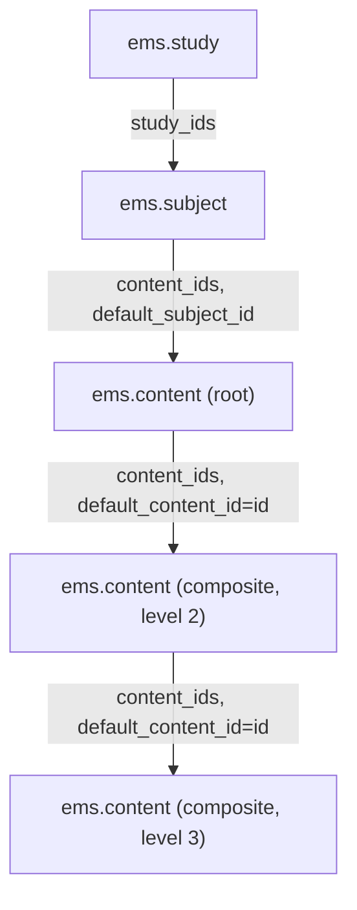
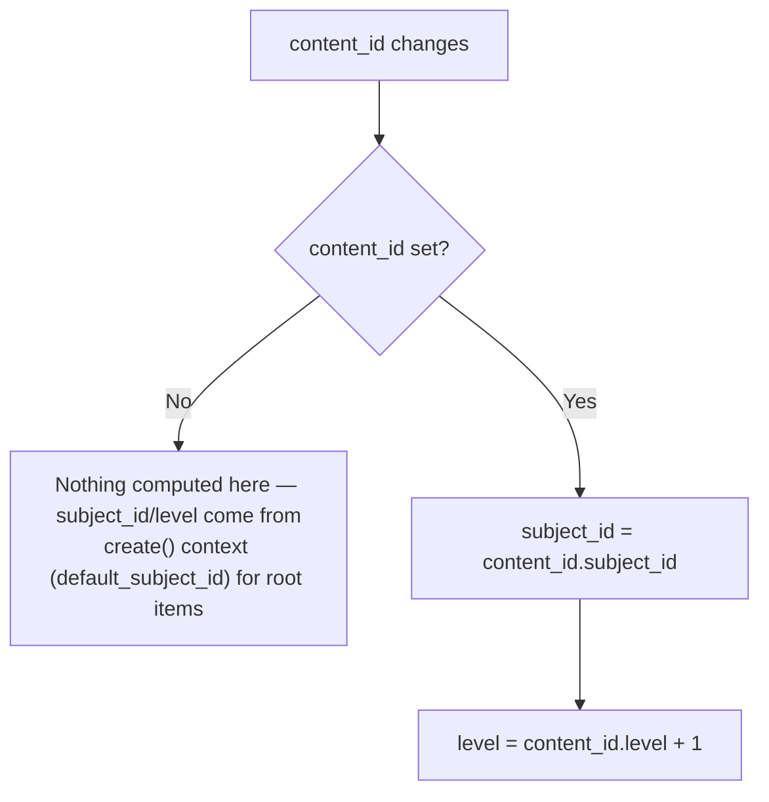
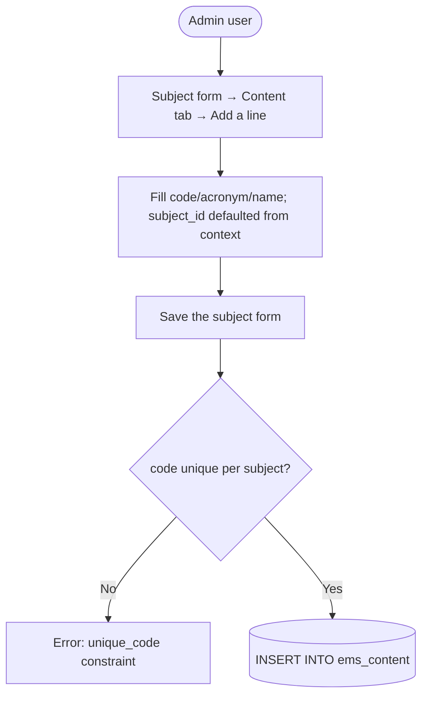

# Technical Reference: `ems.content`

## Overview

`ems.content` represents a content item ("Continguts") within a subject — what the student should work on. Unlike `ems.outcome`/`ems.criteria`, it genuinely keeps a self-referencing hierarchy (`content_ids`/`content_id`): a content item can have nested "Composite" child items, recursively. It has no menu or action of its own: root content items are created from `ems.subject`'s "Content" tab, and nested composites from a content item's own popup form (`open_form()`), which also holds a "Composite" tab for its own children.

**Module file:** `models/curriculum/content.py`

---

## Data Model

### Fields

| Field | Type | Required | Stored | Description |
|-------|------|----------|--------|-------------|
| `code` | `Char` | Yes | Yes | Code; nested items must start with their parent's code (enforced by `_check_code`) — root items have no such check against the subject |
| `acronym` | `Char` | Yes | Yes | Short code |
| `name` | `Char` | Yes | Yes | Full descriptive name |
| `content_id` | `Many2one → ems.content` | No | Yes | Parent content item; empty for root items |
| `content_ids` | `One2many → ems.content` | No | No | Child ("Composite") items (inverse of `content_id`) |
| `subject_id` | `Many2one → ems.subject` (computed, `store=True`) | No | Yes | For root items, supplied directly via `default_subject_id` context (not computed); for nested items, derived from the parent via `_compute_subject` |
| `level` | `Integer` (`default=1, store=True`) | No | Yes | Nesting depth, incremented alongside `subject_id` in `_compute_subject`; drives the treeview's bold/muted/italic decoration by depth |
| `notes` | `Text` | No | Yes | Free-form administrative notes |
| `display_name` | `Char` (computed) | — | No | Format: `Acronym: Name` |

**Fixed bug 1 (this DTON pass) — view context, not the model:** `views/community/content/form.xml`'s "Composite" tab context was `{'default_content_id': content_id, ...}` — it defaulted a new child's parent to the *current record's own parent* (`content_id`, i.e. its grandparent) instead of the current record itself (`id`). For a root item (`content_id` empty), this meant "Add a line" under Composite silently created **another root item**, not a real child, with no error. Fixed to `{'default_content_id': id, ...}`, matching the equivalent context on every sibling curriculum model (`ems.subject`'s `default_subject_id: id`, `ems.outcome`'s `default_outcome_id: id`). 63 of the 72 existing `ems.content` rows already have `content_id` set, so nested composites are a real, actively-used feature — this bug silently broke adding new ones from the most common entry point (a content item's own popup) without ever raising an error, which is why it went unnoticed.

**Fixed bug 2 (this DTON pass) — self-referential compute:** `level` was a plain stored field (no `compute=`) that `_compute_subject` merely wrote to as a side effect. Since Odoo only knows to run a compute method when the field(s) it officially *declares* are read, reading a freshly-created nested item's `level` alone (without first touching `subject_id`) returned the stale `default=1` — this exact scenario surfaced as a failing test for a 3-level-deep chain (`grandchild.level` came back `1`, not `3`). Fixed by declaring `level` with `compute='_compute_subject'` too. That surfaced a second issue: with two records of the same recursive chain needing computation in one batch (`child` then `grandchild`, both new in the same transaction), Odoo doesn't know to compute the parent before the child unless the dependency on the *referenced record's own fields* is spelled out — `@api.depends("content_id")` only reacts to the relation changing, not to `content_id.level`/`content_id.subject_id` themselves changing (or needing computing first). Fixed by depending on `content_id.subject_id` and `content_id.level` explicitly and marking both fields `recursive=True` (Odoo's own suggested fix, surfaced as a `UserWarning` once the extended `@api.depends` was in place) so the ORM computes parents before children.

### Curriculum Hierarchy (full chain, with content's own recursion)



### `_compute_subject` (also drives `level`)



---

## CRUD Operations

### Create (root item, from a subject)



### Create (nested composite, from a content item's own popup)

```mermaid
flowchart TD
    A([Admin user]) --> B[Open a content row's popup (pencil icon)]
    B --> C[Composite tab → Add a line]
    C --> D[Fill code/acronym/name; content_id defaulted to the current record's id]
    D --> E[Save the popup]
    E --> F{code starts with parent's code?}
    F -- No --> G[ValidationError]
    F -- Yes --> H[(INSERT INTO ems_content, subject_id/level derived from parent)]
```

### Delete

Deleting a content item with children is blocked at the DB level (no `ondelete` on `content_id`, defaults to `restrict` since the field isn't required) — children must be removed first.

---

## Access Control

Defined in `security/ir.model.access.csv` (lines 119–121).

| Role | Create | Read | Write | Delete | Group XML ID |
|------|:------:|:----:|:-----:|:------:|--------------|
| Administrator | ✓ | ✓ | ✓ | ✓ | `ems.group_academic_admin` |
| Teacher | — | ✓ | — | — | `ems.group_teacher` |
| Secretary | — | ✓ | — | — | `ems.group_secretary` |

No record-level rules exist for this model.

---

## Integration Map

| Model | Field | Relation | Description |
|-------|-------|----------|--------------|
| `ems.subject` | `content_ids` | One2many | Root content items (inverse of `content.subject_id`, filtered to `content_id = False` by the subject form) |
| `ems.content` | `content_ids` / `content_id` | One2many / Many2one | Self-referencing composite hierarchy |

Unlike `ems.outcome`, content is a leaf as far as grading/planning is concerned — nothing outside the curriculum hierarchy references it.

---

## Views

| View | File | Notes |
|------|------|-------|
| Form (popup only) | `views/community/content/form.xml` | `view_content_form`; opened via `open_form()`, `target: 'new'` — no stored `ir.actions.act_window`, no menu. Shows the read-only parent when `content_id` is set. |
| Embedded list (root) | `views/community/subject/form.xml` (Content tab) | Editable inline list, `default_subject_id: id` |
| Embedded list (nested) | `views/community/content/form.xml` (Composite tab) | Editable inline list, `default_content_id: id` (bug-fixed, see above) |

---

## Data Files

| File | Purpose |
|------|---------|
| `data/cat/ems.content.csv` | Production catalog: content items, including the nested composites. This CSV import — not the "Add a line" UI flow — is how the existing 63 nested rows were actually created, which is exactly why the `default_content_id` context bug above went unnoticed: the buggy path was never exercised in production before this DTON pass. |
