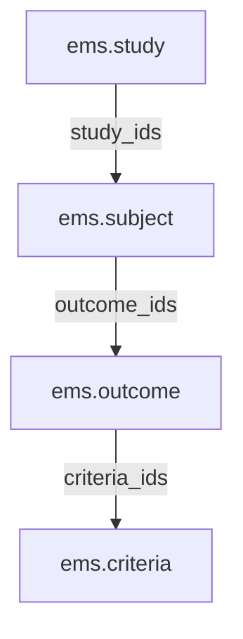
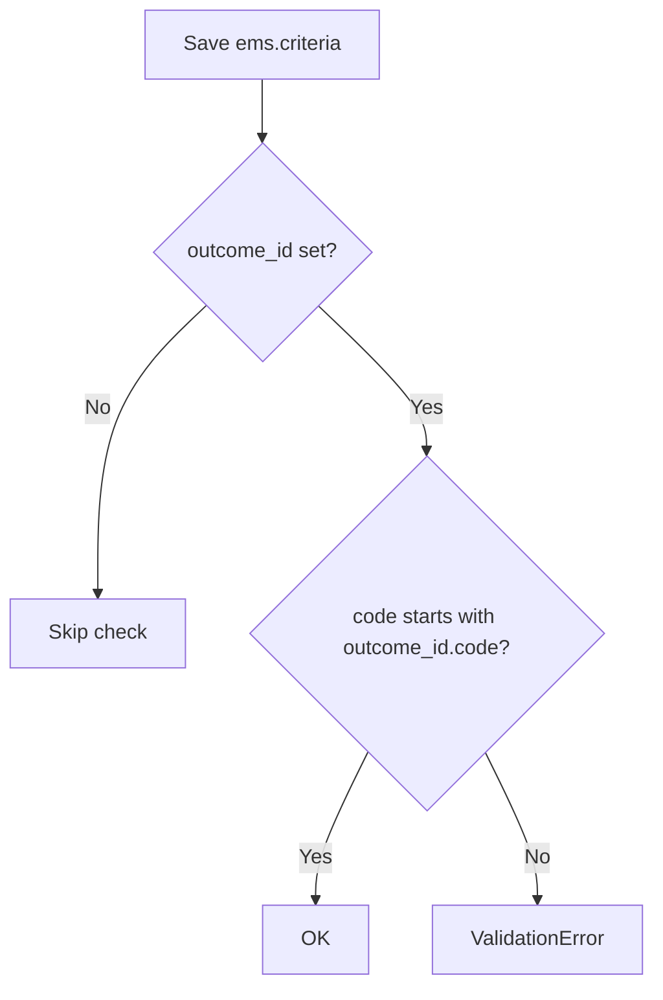

# Technical Reference: `ems.criteria`

## Overview

`ems.criteria` represents an evaluation criterion ("Criteri d'Avaluació") used to assess a learning outcome. Like `ems.outcome` one level up, it has no menu or action of its own: it only exists nested inside `ems.outcome`'s popup form, in its "Evaluation criteria" tab (an editable inline list), and from there has its own popup form opened via `open_form()`.

**Module file:** `models/curriculum/criteria.py`

---

## Data Model

### Fields

| Field | Type | Required | Stored | Description |
|-------|------|----------|--------|-------------|
| `code` | `Char` | Yes | Yes | Code; by convention must start with the parent outcome's code (enforced by `_check_code`) |
| `acronym` | `Char` | Yes | Yes | Short code |
| `name` | `Char` | Yes | Yes | Full descriptive name |
| `outcome_id` | `Many2one → ems.outcome` | Yes | Yes | The outcome this criterion evaluates |
| `level` | `Integer` | No | Yes (`default=1`) | Indentation hint for the treeview |
| `notes` | `Text` | No | Yes | Free-form administrative notes |
| `display_name` | `Char` (computed) | — | No | Format: `Acronym: Name` |

**Fixed bug (this DTON pass):** identical to `ems.outcome`'s `subject_id` — `outcome_id` was declared with `compute='_compute_outcome', store=True`, but no such method existed; leftover from an abandoned recursive-criteria design (`criteria_ids`/`criteria_id` self-hierarchy, dropped and commented out). Never broke anything in practice because `outcome_id` is always supplied via the `default_outcome_id` context when a row is added from the outcome form's inline list. Converted to a plain, required `Many2one` (`SELECT count(*) FROM ems_criteria WHERE outcome_id IS NULL` was already `0`).

### Curriculum Hierarchy (full chain)



### `_check_code` Constraint



---

## CRUD Operations

Criteria are always created/edited/deleted from within an outcome's popup form — there is no standalone menu, and reaching that popup itself requires going through a subject's form first.

```mermaid
flowchart TD
    A([Admin user]) --> B[Subject form → Learning Outcome tab → open an outcome's popup]
    B --> C[Popup → Evaluation criteria tab]
    C --> D[Add a line inline: code, acronym, name]
    D --> E[Save the outcome popup]
    E --> F{code prefix / required fields valid?}
    F -- No --> G[Error shown inline]
    F -- Yes --> H[(INSERT/UPDATE INTO ems_criteria)]
    H --> I[Click the pencil 'Edit' button → open_form()]
    I --> J[Criteria's own popup form: edit acronym/name/notes]
    J --> K[Save popup]
    K --> L[Change reflected back in the outcome's embedded list]
```

---

## Access Control

Defined in `security/ir.model.access.csv` (lines 123–125).

| Role | Create | Read | Write | Delete | Group XML ID |
|------|:------:|:----:|:-----:|:------:|--------------|
| Administrator | ✓ | ✓ | ✓ | ✓ | `ems.group_academic_admin` |
| Teacher | — | ✓ | — | — | `ems.group_teacher` |
| Secretary | — | ✓ | — | — | `ems.group_secretary` |

No record-level rules exist for this model.

---

## Integration Map

| Model | Field | Relation | Description |
|-------|-------|----------|--------------|
| `ems.outcome` | `criteria_ids` | One2many | Inverse of `criteria.outcome_id` |

`ems.criteria` is a leaf node — nothing outside the curriculum hierarchy references it directly (grading/planning work at the `ems.outcome` level, not down to individual criteria).

---

## Views

| View | File | Notes |
|------|------|-------|
| Form (popup only) | `views/community/criteria/form.xml` | `view_criteria_form`; opened via `open_form()`, `target: 'new'` — no stored `ir.actions.act_window`, no menu |
| Embedded list | `views/community/outcome/form.xml` (Evaluation criteria tab) | Editable inline list on `ems.outcome`'s own popup form |

---

## Data Files

| File | Purpose |
|------|---------|
| `data/cat/ems.content.csv` and related outcome files | Note: criteria are seeded together with outcomes; there is no dedicated `ems.criteria.csv` in the current catalog — criteria are added ad hoc via the UI where the curriculum requires them |
