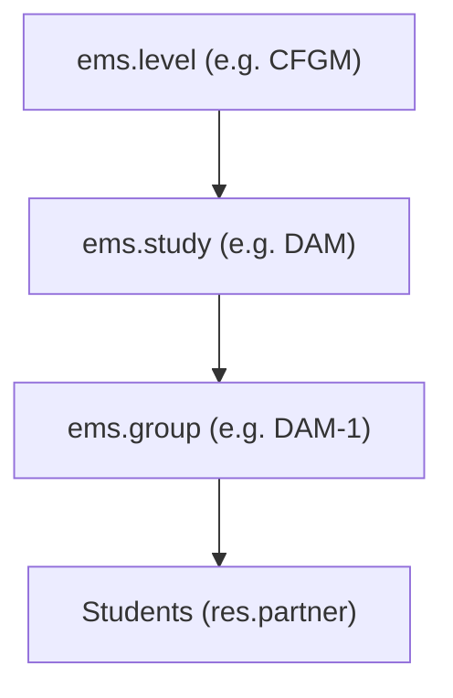
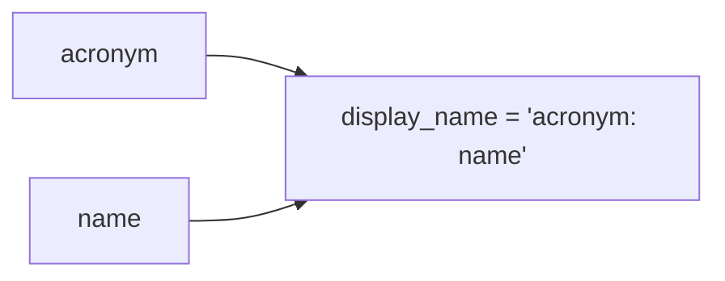
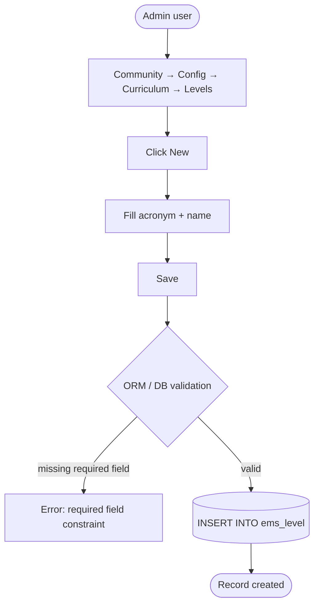
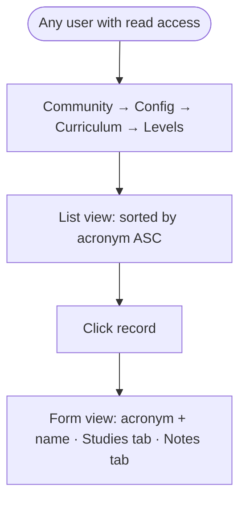
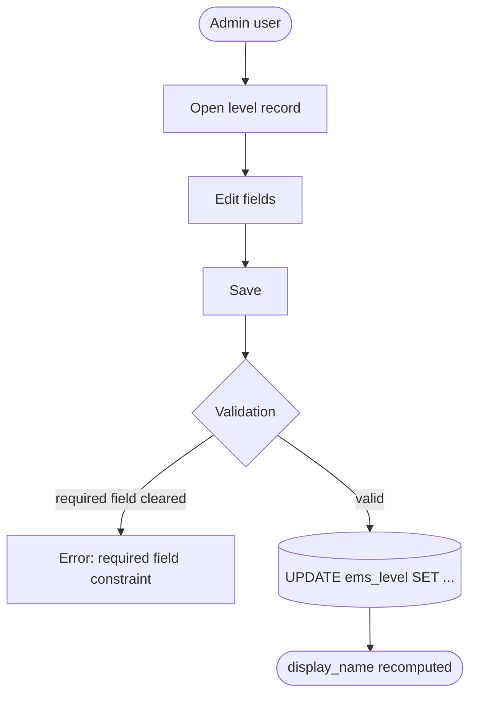
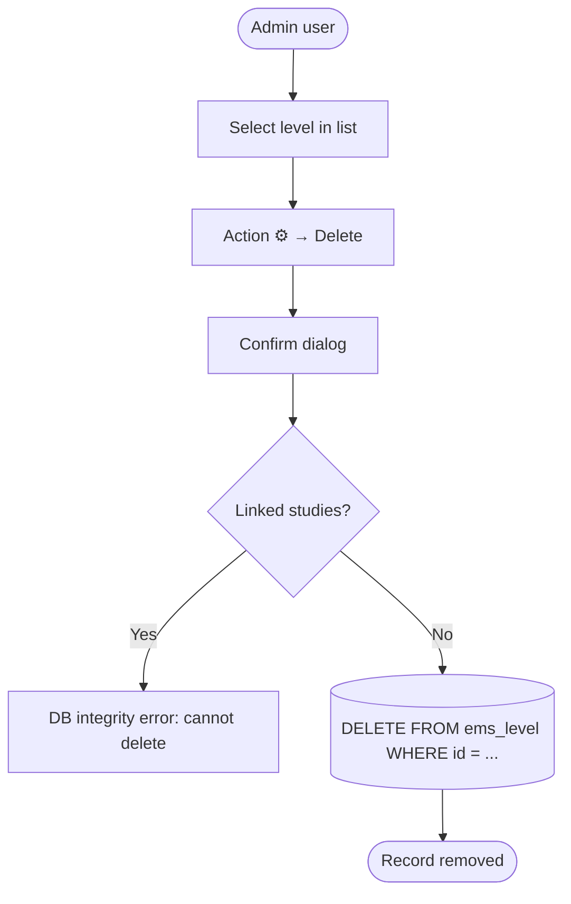

# Technical Reference: `ems.level`

## Overview

`ems.level` is a configuration model at the top of the EMS curriculum hierarchy. It represents a study level (e.g., Secondary Education, VET, Baccalaureate) and groups related studies under a common classification. It has no custom business logic beyond a computed `display_name`.

**Module file:** `models/curriculum/level.py`

---

## Data Model

### Fields

| Field | Type | Required | Stored | Description |
|-------|------|----------|--------|-------------|
| `acronym` | `Char` | Yes | Yes | Short code (e.g., `BTX`, `CFGM`) |
| `name` | `Char` | Yes | Yes | Full descriptive name |
| `study_ids` | `One2many → ems.study` | No | No | Studies at this level (inverse of `study.level_id`) |
| `notes` | `Text` | No | Yes | Free-form administrative notes |
| `display_name` | `Char` (computed) | — | No | Format: `ACRONYM: Name` |

### Curriculum Hierarchy

### `display_name` Computation

Triggered by `@api.depends('acronym', 'name')`.

---

## CRUD Operations

### Create

### Read

### Update

### Delete

---

## Access Control

Defined in `security/ir.model.access.csv` (lines 34–36, 205).

| Role | Create | Read | Write | Delete | Group XML ID |
|------|:------:|:----:|:-----:|:------:|--------------|
| Administrator | ✓ | ✓ | ✓ | ✓ | `ems.group_admin` |
| Teacher | — | ✓ | — | — | `ems.group_teacher` |
| Secretary | — | ✓ | — | — | `ems.group_secretary` |
| Portal | — | ✓ | — | — | `base.group_portal` |

No record-level rules exist for this model.

---

## Integration Map

`ems.level` is referenced by the following models:

| Model | Field | Relation | Description |
|-------|-------|----------|-------------|
| `ems.study` | `level_id` | Many2one | Each study belongs to one level |
| `ems.group` | `level_id` | Many2one (required) | Each group belongs to one level |
| `res.partner` (`ems.contact`) | `level_id` | Many2one (view field) | Cascades to filter available studies |
| `ems.attendance_template` | `level_id` | Many2one (required) | Attendance scheduling requires a level |
| `ems.attendance_session_header` | `level_id` | Computed from template | Inherited from the attendance template |
| `ems.limesurvey_recipient` | `level_id` | Many2one | Survey targeting by level |
| `ems.limesurvey_header` | `ems_level_ids` | Many2many | Surveys can target multiple levels |
| `ems.authorization.template` | `ems_level_ids` | Many2many | Authorizations apply to specific levels |
| `ems.enrollment_product_extension` | (via product.template) | Many2many | Products restricted to certain levels |
| `sale.order` / `ems.enrollment` | `ems_level_id` | Related from `study.level_id` | Enrollment level derived from study |
| Report wizards (3 models) | `level_id` | Many2one | Filter field in attendance report wizards |

---

## Views

| View | File | Notes |
|------|------|-------|
| List | `views/community/level/list.xml` | Columns: acronym (25%), name; sorted by acronym |
| Form | `views/community/level/form.xml` | Main group + notebook (Studies tab, Notes tab) |
| Action + Menu | `views/community/level/menu.xml` | Under Community → Configuration → Curriculum (sequence 1) |

---

## Data Files

| File | Purpose |
|------|---------|
| `data/cat/ems.level.csv` | Production catalog: 7 Catalan educational levels (ESO, BTX, CFGM, CFGS, EFPS, CFGB, PFI) |
| `demo/curriculum/level.xml` | Demo data: 4 generic levels for development environments |

---

## Key Migrations

| Version | Change | File |
|---------|--------|------|
| 18.0.0.6.2 | Renamed CFPB → CFGB; updated external ID and `acronym` value in DB | `migrations/18.0.0.6.2/pre-migrate.py` |
