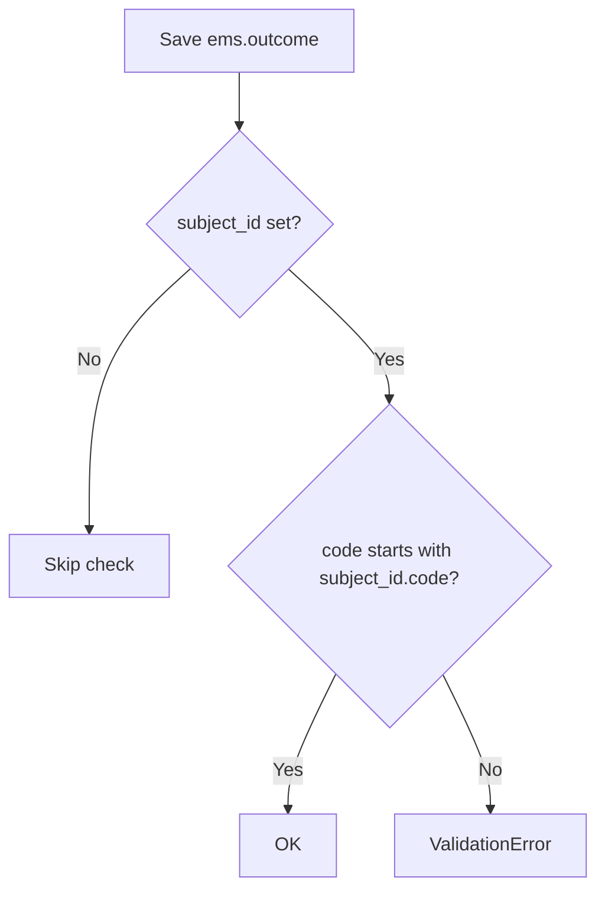

# Technical Reference: `ems.outcome`

## Overview

`ems.outcome` represents a learning outcome ("Resultat d'Aprenentatge") belonging to a subject — what a student should learn. It has no menu or action of its own: it only exists nested inside `ems.subject`'s "Learning Outcome" tab (an editable inline list) and, from there, its own popup form opened via the `open_form()` "Edit" button. Each outcome groups the evaluation criteria (`ems.criteria`) used to assess it.

**Module file:** `models/curriculum/outcome.py`

---

## Data Model

### Fields

| Field | Type | Required | Stored | Description |
|-------|------|----------|--------|-------------|
| `code` | `Char` | Yes | Yes | Code; by convention must start with the parent subject's code (enforced by `_check_code`) |
| `acronym` | `Char` | Yes | Yes | Short code |
| `name` | `Char` | Yes | Yes | Full descriptive name |
| `subject_id` | `Many2one → ems.subject` | Yes | Yes | The subject this outcome belongs to |
| `criteria_ids` | `One2many → ems.criteria` | No | No | Evaluation criteria (inverse of `criteria.outcome_id`) |
| `level` | `Integer` | No | Yes (`default=1`) | Indentation hint for the treeview |
| `notes` | `Text` | No | Yes | Free-form administrative notes |
| `display_name` | `Char` (computed) | — | No | Format: `Acronym: Name` |

**Fixed bug (this DTON pass):** `subject_id` was declared with `compute='_compute_subject', store=True`, but no `_compute_subject` method existed in the class — it was left over from an abandoned recursive-outcome design (`outcome_ids`/`outcome_id` self-hierarchy, dropped and commented out). In practice this never broke anything because `subject_id` is always supplied directly via the `default_subject_id` context when a row is added from the subject form's inline list — a value passed explicitly at create time is never recomputed. It has now been converted to a plain, required `Many2one`, matching how it is actually used; no data or behaviour change (`SELECT count(*) FROM ems_outcome WHERE subject_id IS NULL` was already `0`). `ems.criteria.outcome_id` has the identical dangling-compute pattern — see its own technical doc.

### `_check_code` Constraint



---

## CRUD Operations

Outcomes are always created/edited/deleted from within a subject's form — there is no standalone menu.

### Create / Read / Update

```mermaid
flowchart TD
    A([Admin user]) --> B[Open a Subject → Learning Outcome tab]
    B --> C[Add a line inline: code, acronym, name]
    C --> D[Save the Subject form]
    D --> E{code prefix / required fields valid?}
    E -- No --> F[Error shown inline]
    E -- Yes --> G[(INSERT/UPDATE INTO ems_outcome)]
    G --> H[Click the pencil 'Edit' button → open_form()]
    H --> I[Popup form: edit acronym/name/notes, manage Evaluation criteria tab]
    I --> J[Save popup]
    J --> K[Change reflected back in the subject's embedded list]
```

### Delete

Removed via the inline list's row-delete action, then confirmed by saving the parent subject form. Deleting the row cascades to its `criteria_ids` only if a user explicitly clears them first — there is no `ondelete='cascade'` from criteria's side (see `ems.criteria` doc); an outcome with linked criteria would keep them orphaned of an outcome until the criteria are removed too.

---

## Access Control

Defined in `security/ir.model.access.csv` (lines 127–129).

| Role | Create | Read | Write | Delete | Group XML ID |
|------|:------:|:----:|:-----:|:------:|--------------|
| Administrator | ✓ | ✓ | ✓ | ✓ | `ems.group_academic_admin` |
| Teacher | — | ✓ | — | — | `ems.group_teacher` |
| Secretary | — | ✓ | — | — | `ems.group_secretary` |

No record-level rules exist for this model.

---

## Integration Map

| Model | Field | Relation | Description |
|-------|-------|----------|--------------|
| `ems.subject` | `outcome_ids` | One2many | Inverse of `outcome.subject_id` |
| `ems.criteria` | `outcome_id` | Many2one | Evaluation criteria scoped to an outcome |
| `ems.planning_outcome` | `outcome_id` | Many2one (required) | Planning targets specific outcomes |
| `ems.grade_outcome_line` | `outcome_id` | Many2one (required) | Grading is recorded per outcome |
| `ems.student.year_record.outcome` | `outcome_id` | Many2one | Historical academic record |

---

## Views

| View | File | Notes |
|------|------|-------|
| Form (popup only) | `views/community/outcome/form.xml` | `view_outcome_form`; opened via `open_form()`, `target: 'new'` — no stored `ir.actions.act_window`, no menu |
| Embedded list | `views/community/subject/form.xml` (Learning Outcome tab) | Editable inline list on `ems.subject` |

---

## Data Files

| File | Purpose |
|------|---------|
| `data/cat/ems.outcome.csv` | Production catalog: outcomes for the Catalan VET/Baccalaureate curriculum |
| `data/custom/ccff/ems.outcome.csv` | Centre-specific outcomes |
